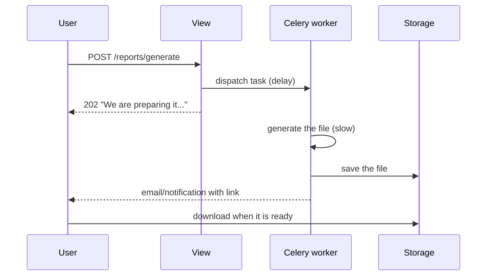

# Generating files: PDF and CSV

!!! quote "Think like a child 🧒"
    You draw on a sheet of paper and hand it to the teacher. A **view that
    generates a file** does the same thing: instead of returning a web page for the
    browser to _display_, it returns a **finished sheet to keep** — a spreadsheet
    (CSV) or a nice document (PDF) that the browser **downloads** instead of
    showing.

## Use case

The user clicks "Export posts" and gets a `posts.csv` file that opens in Excel. No
HTML page: the browser understands it is a **download**.

```python
import csv

from django.http import HttpResponse

from blog.models import Post


def export_posts_csv(request) -> HttpResponse:
    """Return every blog post as a downloadable CSV file.

    Args:
        request: The incoming HTTP request.

    Returns:
        An HttpResponse whose body is CSV text and whose headers tell the
        browser to download it as ``posts.csv``.
    """
    response = HttpResponse(content_type="text/csv")
    response["Content-Disposition"] = 'attachment; filename="posts.csv"'

    writer = csv.writer(response)
    writer.writerow(["id", "title", "author", "created_at"])
    for post in Post.objects.select_related("author").all():
        writer.writerow([post.id, post.title, post.author.name, post.created_at.isoformat()])

    return response
```

Two details do all the magic:

- **`content_type="text/csv"`** → the browser knows it is not HTML.
- **`Content-Disposition: attachment; filename=...`** → the browser **downloads**
  it instead of showing it, with the file name you choose.

## Possibilities

### The right response object for each case

| You want... | Use | Why |
| --- | --- | --- |
| A small file, built all at once | `HttpResponse` | Simple; everything becomes a string in memory |
| A huge file (thousands of rows) | `StreamingHttpResponse` | Sends in chunks, without blowing up memory |
| A file already on disk/storage | `FileResponse` | Optimized to serve existing files |

!!! info "`HttpResponse` behaves like a file"
    The standard-library `csv` module writes to any object with a `.write()`.
    Since `HttpResponse` has `.write()`, you hand the `response` itself to
    `csv.writer` and it fills the response body. No temporary file needed.

### CSV: headers, accents and delimiters

```python
import csv

from django.http import HttpResponse


def export_utf8_csv(request) -> HttpResponse:
    """Return a UTF-8 CSV that opens correctly in Excel.

    Args:
        request: The incoming HTTP request.

    Returns:
        An HttpResponse carrying a BOM-prefixed UTF-8 CSV download.
    """
    response = HttpResponse(content_type="text/csv; charset=utf-8")
    response["Content-Disposition"] = 'attachment; filename="report.csv"'
    response.write("")

    writer = csv.writer(response, delimiter=";")
    writer.writerow(["Title", "Author"])
    writer.writerow(["Hello, world", "John"])

    return response
```

!!! tip "Localized Excel and the semicolon"
    On machines with certain locales (e.g. pt-BR), Excel expects `;` as the
    separator, not `,`. Pass `delimiter=";"` to `csv.writer`. And write a **BOM**
    (`""`) at the start so Excel recognizes UTF-8 and does not mangle
    accented characters.

!!! note "`csv.writer` handles quoting for you"
    If a value contains a comma, quotes, or a line break, the `csv` module already
    escapes it correctly. Never build CSV rows by concatenating strings by hand.

### Huge CSV: `StreamingHttpResponse`

When the file has hundreds of thousands of rows, building it all in memory freezes
the server. `StreamingHttpResponse` sends it **row by row**, as it is generated:

```python
import csv

from django.http import StreamingHttpResponse

from blog.models import Post


class Echo:
    """A file-like object that returns whatever is written to it.

    ``csv.writer`` calls ``write`` for each row; instead of buffering, we hand
    the row straight back so it can be yielded by the streaming response.
    """

    def write(self, value: str) -> str:
        """Return the written value unchanged.

        Args:
            value: The CSV row rendered by ``csv.writer``.

        Returns:
            The same value, so the generator can yield it.
        """
        return value


def stream_posts_csv(request) -> StreamingHttpResponse:
    """Stream all posts as CSV without holding the file in memory.

    Args:
        request: The incoming HTTP request.

    Returns:
        A StreamingHttpResponse that yields one CSV row at a time.
    """
    writer = csv.writer(Echo())
    posts = Post.objects.select_related("author").iterator()

    def rows():
        yield writer.writerow(["id", "title", "author"])
        for post in posts:
            yield writer.writerow([post.id, post.title, post.author.name])

    response = StreamingHttpResponse(rows(), content_type="text/csv")
    response["Content-Disposition"] = 'attachment; filename="posts.csv"'
    return response
```

!!! warning "Use `.iterator()` with large querysets"
    Without `.iterator()`, the queryset loads **all** rows into memory at once —
    which defeats the point of streaming. `.iterator()` fetches from the database
    in batches, keeping consumption low from start to finish.

### PDF with WeasyPrint (HTML + CSS → PDF)

The most comfortable way to generate PDF in Django is to **reuse your HTML
template**. You already know how to write HTML and CSS; [WeasyPrint](https://weasyprint.org/)
turns that into PDF, with support for modern CSS (grid, flexbox, `@page`).

```bash
uv add weasyprint
```

```html
<!-- templates/blog/post_pdf.html -->
<!DOCTYPE html>
<html lang="en">
<head>
    <meta charset="utf-8">
    <style>
        @page { size: A4; margin: 2cm; }
        body { font-family: sans-serif; color: #222; }
        h1 { color: #6633cc; }
        .meta { color: #888; font-size: 0.9em; }
    </style>
</head>
<body>
    <h1>{{ post.title }}</h1>
    <p class="meta">By {{ post.author.name }} on {{ post.created_at|date:"m/d/Y" }}</p>
    <div>{{ post.body|linebreaks }}</div>
</body>
</html>
```

```python
from django.http import HttpResponse
from django.shortcuts import get_object_or_404
from django.template.loader import render_to_string
from weasyprint import HTML

from blog.models import Post


def post_pdf(request, pk: int) -> HttpResponse:
    """Render a single post as a downloadable PDF.

    Args:
        request: The incoming HTTP request.
        pk: Primary key of the post to render.

    Returns:
        An HttpResponse whose body is the generated PDF.
    """
    post = get_object_or_404(Post, pk=pk)
    html = render_to_string("blog/post_pdf.html", {"post": post}, request=request)
    pdf_bytes = HTML(string=html, base_url=request.build_absolute_uri("/")).write_pdf()

    response = HttpResponse(pdf_bytes, content_type="application/pdf")
    response["Content-Disposition"] = 'attachment; filename="post.pdf"'
    return response
```

!!! tip "`base_url` makes images and CSS show up"
    The `base_url=request.build_absolute_uri("/")` tells WeasyPrint how to resolve
    relative paths (`/static/logo.png`, `/media/...`). Without it, images and
    external stylesheets disappear from the PDF.

!!! note "View in the browser instead of downloading"
    Swap `attachment` for `inline` in `Content-Disposition` to open the PDF in the
    tab instead of downloading it: `'inline; filename="post.pdf"'`.

You use exactly the same tags as the [template system](templates.md) —
`{{ post.title }}`, filters, `` — except the final result is a PDF.

### Other PDF libraries

| Library | Style | When to pick it |
| --- | --- | --- |
| [WeasyPrint](https://weasyprint.org/) | HTML + CSS → PDF | Recommended default; you already know HTML/CSS |
| [xhtml2pdf](https://xhtml2pdf.readthedocs.io/) | HTML + CSS → PDF | Simpler HTML/CSS; no system dependencies |
| [ReportLab](https://www.reportlab.com/) | Programmatic drawing (`canvas`) | Pixel-perfect control: layouts, charts, absolute positions |

!!! info "WeasyPrint needs system libraries"
    On Linux, WeasyPrint uses Pango/Cairo (`libpango`, `libcairo`). In Docker,
    install them in the image (`apt-get install libpango-1.0-0 libpangoft2-1.0-0`).
    If that is a problem, `xhtml2pdf` is 100% Python. `ReportLab`, in turn, is the
    choice when you draw the layout coordinate by coordinate, without HTML.

### Heavy generation → send it to a task

Generating a large PDF or exporting 500k rows can take seconds or minutes. If that
happens **inside the view**, the user stares at a frozen browser and the server
blocks a worker. The way out is to generate it in the background:



```python
from celery import shared_task
from django.core.files.base import ContentFile
from django.core.files.storage import storages
from weasyprint import HTML
from django.template.loader import render_to_string

from blog.models import Post


@shared_task
def build_post_pdf(pk: int) -> str:
    """Generate a post PDF in the background and store it.

    Args:
        pk: Primary key of the post to render.

    Returns:
        The stored file name, usable to build a download URL later.
    """
    post = Post.objects.select_related("author").get(pk=pk)
    html = render_to_string("blog/post_pdf.html", {"post": post})
    pdf_bytes = HTML(string=html).write_pdf()

    storage = storages["default"]
    return storage.save(f"exports/post-{pk}.pdf", ContentFile(pdf_bytes))
```

The view only **dispatches** the task and responds immediately; when the file is
ready, you notify the user (email, notification) with the download link.

!!! warning "Never generate heavy files inside the request"
    An HTTP request has limited time (the proxy/Nginx may cut it off at 30-60s) and
    each synchronous generation holds a server worker hostage. Slow work goes to
    [Celery](../libs/celery.md) or to [Django's native tasks](tasks.md).

!!! quote "📖 In the official docs"
    - [Outputting CSV with Django](https://docs.djangoproject.com/en/6.0/howto/outputting-csv/)
    - [WeasyPrint](https://weasyprint.org/)

## Recap

- A view returns a file by setting the **`content_type`** and the
  **`Content-Disposition: attachment; filename=...`** header to force the download.
- **CSV**: use the standard-library `csv` module writing straight into the
  `HttpResponse`; use `delimiter=";"` + BOM for localized Excel to open accents.
- **Huge CSV**: `StreamingHttpResponse` + `.iterator()` generates row by row
  without blowing up memory.
- **PDF**: **WeasyPrint** turns your HTML+CSS template into PDF —
  `render_to_string` → `HTML(...).write_pdf()`. Alternatives: `xhtml2pdf`
  (pure Python) and `ReportLab` (programmatic drawing).
- **Heavy generation** goes to a background task ([Celery](../libs/celery.md) /
  [tasks](tasks.md)); the view just dispatches and responds immediately.

Go back to the [reference map](index.md) or see the [template system](templates.md).
