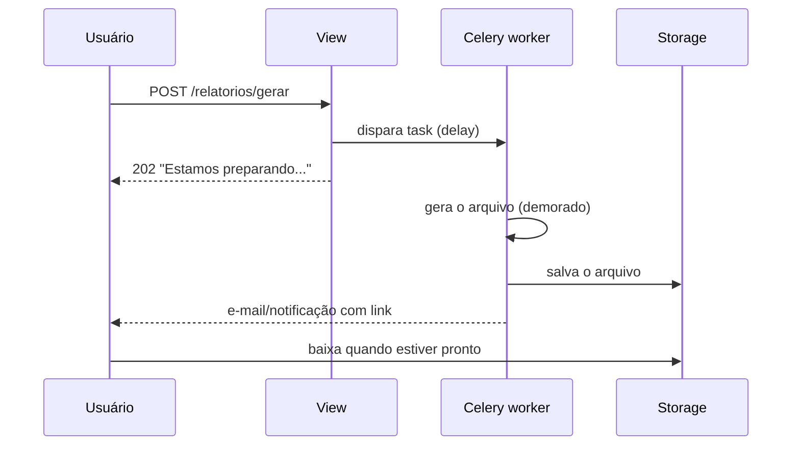

# Gerando arquivos: PDF e CSV

!!! quote "Pensa como criança 🧒"
    Você desenha num papel e entrega para a professora. Uma **view que gera
    arquivo** faz a mesma coisa: em vez de devolver uma página web para o navegador
    _mostrar_, ela devolve um **papel pronto para guardar** — uma planilha (CSV) ou
    um documento bonito (PDF) que o navegador **baixa** em vez de exibir.

## Caso de uso

O usuário clica em "Exportar posts" e recebe um arquivo `posts.csv` que abre no
Excel. Nada de página HTML: o navegador entende que é um **download**.

```python
import csv

from django.http import HttpResponse

from blog.models import Post


def export_posts_csv(request) -> HttpResponse:
    """Return every blog post as a downloadable CSV file.

    Args:
        request: The incoming HTTP request.

    Returns:
        An HttpResponse whose body is CSV text and whose headers tell the
        browser to download it as ``posts.csv``.
    """
    response = HttpResponse(content_type="text/csv")
    response["Content-Disposition"] = 'attachment; filename="posts.csv"'

    writer = csv.writer(response)
    writer.writerow(["id", "title", "author", "created_at"])
    for post in Post.objects.select_related("author").all():
        writer.writerow([post.id, post.title, post.author.name, post.created_at.isoformat()])

    return response
```

Dois detalhes fazem toda a mágica:

- **`content_type="text/csv"`** → o navegador sabe que não é HTML.
- **`Content-Disposition: attachment; filename=...`** → o navegador **baixa** em
  vez de mostrar, com o nome de arquivo que você escolher.

## Possibilidades

### O objeto de resposta certo para cada caso

| Você quer... | Use | Por quê |
| --- | --- | --- |
| Um arquivo pequeno, montado de uma vez | `HttpResponse` | Simples; tudo vira uma string na memória |
| Um arquivo enorme (milhares de linhas) | `StreamingHttpResponse` | Envia em pedaços, sem estourar a memória |
| Um arquivo já pronto no disco/storage | `FileResponse` | Otimizado para servir arquivos existentes |

!!! info "`HttpResponse` funciona como um arquivo"
    O módulo `csv` da biblioteca padrão escreve em qualquer objeto com `.write()`.
    Como `HttpResponse` tem `.write()`, você entrega o próprio `response` para o
    `csv.writer` e ele preenche o corpo da resposta. Sem arquivo temporário.

### CSV: cabeçalhos, acentos e delimitadores

```python
import csv

from django.http import HttpResponse


def export_utf8_csv(request) -> HttpResponse:
    """Return a UTF-8 CSV that opens correctly in Excel.

    Args:
        request: The incoming HTTP request.

    Returns:
        An HttpResponse carrying a BOM-prefixed UTF-8 CSV download.
    """
    response = HttpResponse(content_type="text/csv; charset=utf-8")
    response["Content-Disposition"] = 'attachment; filename="relatorio.csv"'
    response.write("")

    writer = csv.writer(response, delimiter=";")
    writer.writerow(["Título", "Autor"])
    writer.writerow(["Olá, mundo", "João"])

    return response
```

!!! tip "O Excel brasileiro e o ponto e vírgula"
    Em máquinas com locale pt-BR, o Excel espera `;` como separador, não `,`. Passe
    `delimiter=";"` ao `csv.writer`. E escreva um **BOM** (`""`) no começo
    para o Excel reconhecer o UTF-8 e não quebrar os acentos.

!!! note "`csv.writer` cuida das aspas para você"
    Se um valor tem vírgula, aspas ou quebra de linha, o módulo `csv` já faz o
    _escaping_ correto. Nunca monte linhas CSV concatenando strings à mão.

### CSV gigante: `StreamingHttpResponse`

Quando o arquivo tem centenas de milhares de linhas, montar tudo na memória trava
o servidor. A `StreamingHttpResponse` envia **linha a linha**, conforme gera:

```python
import csv

from django.http import StreamingHttpResponse

from blog.models import Post


class Echo:
    """A file-like object that returns whatever is written to it.

    ``csv.writer`` calls ``write`` for each row; instead of buffering, we hand
    the row straight back so it can be yielded by the streaming response.
    """

    def write(self, value: str) -> str:
        """Return the written value unchanged.

        Args:
            value: The CSV row rendered by ``csv.writer``.

        Returns:
            The same value, so the generator can yield it.
        """
        return value


def stream_posts_csv(request) -> StreamingHttpResponse:
    """Stream all posts as CSV without holding the file in memory.

    Args:
        request: The incoming HTTP request.

    Returns:
        A StreamingHttpResponse that yields one CSV row at a time.
    """
    writer = csv.writer(Echo())
    posts = Post.objects.select_related("author").iterator()

    def rows():
        yield writer.writerow(["id", "title", "author"])
        for post in posts:
            yield writer.writerow([post.id, post.title, post.author.name])

    response = StreamingHttpResponse(rows(), content_type="text/csv")
    response["Content-Disposition"] = 'attachment; filename="posts.csv"'
    return response
```

!!! warning "Use `.iterator()` com querysets grandes"
    Sem `.iterator()`, o queryset carrega **todas** as linhas na memória de uma
    vez — o que anula a economia do streaming. O `.iterator()` busca do banco em
    lotes, mantendo o consumo baixo do começo ao fim.

### PDF com WeasyPrint (HTML + CSS → PDF)

A forma mais confortável de gerar PDF no Django é **reaproveitar seu template
HTML**. Você já sabe escrever HTML e CSS; o [WeasyPrint](https://weasyprint.org/)
transforma isso em PDF, com suporte a CSS moderno (grid, flexbox, `@page`).

```bash
uv add weasyprint
```

```html
<!-- templates/blog/post_pdf.html -->
<!DOCTYPE html>
<html lang="pt-br">
<head>
    <meta charset="utf-8">
    <style>
        @page { size: A4; margin: 2cm; }
        body { font-family: sans-serif; color: #222; }
        h1 { color: #6633cc; }
        .meta { color: #888; font-size: 0.9em; }
    </style>
</head>
<body>
    <h1>{{ post.title }}</h1>
    <p class="meta">Por {{ post.author.name }} em {{ post.created_at|date:"d/m/Y" }}</p>
    <div>{{ post.body|linebreaks }}</div>
</body>
</html>
```

```python
from django.http import HttpResponse
from django.shortcuts import get_object_or_404
from django.template.loader import render_to_string
from weasyprint import HTML

from blog.models import Post


def post_pdf(request, pk: int) -> HttpResponse:
    """Render a single post as a downloadable PDF.

    Args:
        request: The incoming HTTP request.
        pk: Primary key of the post to render.

    Returns:
        An HttpResponse whose body is the generated PDF.
    """
    post = get_object_or_404(Post, pk=pk)
    html = render_to_string("blog/post_pdf.html", {"post": post}, request=request)
    pdf_bytes = HTML(string=html, base_url=request.build_absolute_uri("/")).write_pdf()

    response = HttpResponse(pdf_bytes, content_type="application/pdf")
    response["Content-Disposition"] = 'attachment; filename="post.pdf"'
    return response
```

!!! tip "`base_url` faz as imagens e o CSS aparecerem"
    O `base_url=request.build_absolute_uri("/")` diz ao WeasyPrint como resolver
    caminhos relativos (`/static/logo.png`, `/media/...`). Sem ele, imagens e
    folhas de estilo externas somem do PDF.

!!! note "Ver no navegador em vez de baixar"
    Troque `attachment` por `inline` no `Content-Disposition` para abrir o PDF na
    aba em vez de baixar: `'inline; filename="post.pdf"'`.

Você usa exatamente as mesmas tags do [sistema de templates](templates.md) —
`{{ post.title }}`, filtros, `` —, só que o resultado final é um PDF.

### Outras bibliotecas de PDF

| Biblioteca | Estilo | Quando escolher |
| --- | --- | --- |
| [WeasyPrint](https://weasyprint.org/) | HTML + CSS → PDF | Padrão recomendado; você já sabe HTML/CSS |
| [xhtml2pdf](https://xhtml2pdf.readthedocs.io/) | HTML + CSS → PDF | HTML/CSS mais simples; sem dependências de sistema |
| [ReportLab](https://www.reportlab.com/) | Desenho programático (`canvas`) | Controle milimétrico: layouts, gráficos, posições absolutas |

!!! info "WeasyPrint precisa de bibliotecas do sistema"
    Em Linux, o WeasyPrint usa Pango/Cairo (`libpango`, `libcairo`). No Docker,
    instale-as na imagem (`apt-get install libpango-1.0-0 libpangoft2-1.0-0`). Se
    isso for um problema, o `xhtml2pdf` é 100% Python. Já o `ReportLab` é a escolha
    quando você desenha o layout coordenada por coordenada, sem HTML.

### Geração pesada → mande para uma task

Gerar um PDF grande ou exportar 500 mil linhas pode levar segundos ou minutos. Se
isso acontecer **dentro da view**, o usuário fica olhando o navegador travado e o
servidor bloqueia um worker. A saída é gerar em segundo plano:



```python
from celery import shared_task
from django.core.files.base import ContentFile
from django.core.files.storage import storages
from weasyprint import HTML
from django.template.loader import render_to_string

from blog.models import Post


@shared_task
def build_post_pdf(pk: int) -> str:
    """Generate a post PDF in the background and store it.

    Args:
        pk: Primary key of the post to render.

    Returns:
        The stored file name, usable to build a download URL later.
    """
    post = Post.objects.select_related("author").get(pk=pk)
    html = render_to_string("blog/post_pdf.html", {"post": post})
    pdf_bytes = HTML(string=html).write_pdf()

    storage = storages["default"]
    return storage.save(f"exports/post-{pk}.pdf", ContentFile(pdf_bytes))
```

A view só **dispara** a task e responde na hora; quando o arquivo fica pronto,
você avisa o usuário (e-mail, notificação) com o link de download.

!!! warning "Nunca gere arquivos pesados dentro da requisição"
    Uma requisição HTTP tem tempo limitado (o proxy/Nginx pode cortar em 30-60s) e
    cada geração síncrona prende um worker do servidor. Trabalho demorado vai para
    o [Celery](../libs/celery.md) ou para as [tasks nativas do Django](tasks.md).

!!! quote "📖 Na documentação oficial"
    - [Outputting CSV with Django](https://docs.djangoproject.com/en/6.0/howto/outputting-csv/)
    - [WeasyPrint](https://weasyprint.org/)

## Recap

- Uma view devolve arquivo definindo o **`content_type`** e o cabeçalho
  **`Content-Disposition: attachment; filename=...`** para forçar o download.
- **CSV**: use o módulo `csv` da biblioteca padrão escrevendo direto no
  `HttpResponse`; use `delimiter=";"` + BOM para o Excel pt-BR abrir os acentos.
- **CSV gigante**: `StreamingHttpResponse` + `.iterator()` gera linha a linha sem
  estourar a memória.
- **PDF**: o **WeasyPrint** transforma seu template HTML+CSS em PDF —
  `render_to_string` → `HTML(...).write_pdf()`. Alternativas: `xhtml2pdf`
  (só Python) e `ReportLab` (desenho programático).
- **Geração pesada** vai para uma task em segundo plano ([Celery](../libs/celery.md)
  / [tasks](tasks.md)); a view só dispara e responde na hora.

Volte ao [mapa da referência](index.md) ou veja o [sistema de templates](templates.md).
