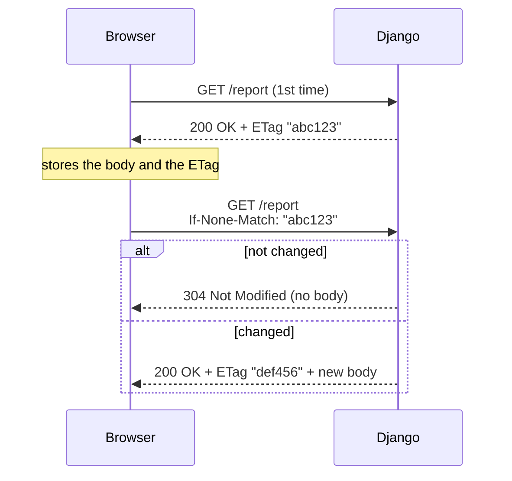

# File uploads and conditional responses (ETag)

!!! quote "Think like a child 🧒"
    When you hand a drawing to the teacher, she first **receives** the paper (the
    upload) and files it in a folder. Later, if a friend asks to see it, she
    doesn't photocopy the whole thing again if the drawing hasn't changed — she
    says "it's the same as yesterday, look at what you already have". Uploading is
    receiving and storing; **ETag/Last-Modified** is that "same as yesterday" that
    avoids resending what hasn't changed.

## Use case

A user uploads their avatar in a form. You want to: **receive** the file,
**validate** its size and type, and **save** it to storage. Later, when someone
downloads that avatar, you want the browser to **use its cache** if the file
hasn't changed.

```python
# forms.py
from django import forms


class AvatarForm(forms.Form):
    """Form that receives a single uploaded avatar image."""

    avatar = forms.ImageField()
```

```python
# views.py
from django.core.files.uploadedfile import UploadedFile
from django.http import HttpRequest, HttpResponse
from django.shortcuts import redirect, render

from .forms import AvatarForm


def upload_avatar(request: HttpRequest) -> HttpResponse:
    """Receive an avatar upload, validate it, and store it.

    Args:
        request: The incoming HTTP request.

    Returns:
        A redirect on success, or the form page with errors otherwise.
    """
    if request.method == "POST":
        form = AvatarForm(request.POST, request.FILES)
        if form.is_valid():
            uploaded: UploadedFile = form.cleaned_data["avatar"]
            with open(f"/data/media/avatars/{uploaded.name}", "wb") as dest:
                for chunk in uploaded.chunks():
                    dest.write(chunk)
            return redirect("profile")
    else:
        form = AvatarForm()
    return render(request, "upload.html", {"form": form})
```

The form's secret: without `enctype="multipart/form-data"` the file never
arrives.

```html
<form method="post" enctype="multipart/form-data">
  
  {{ form.as_p }}
  <button type="submit">Upload</button>
</form>
```

## What's possible

### Where the file arrives: `request.FILES`

Uploaded files do **not** live in `request.POST` — they live in `request.FILES`,
a dict mapping `field_name -> UploadedFile`.

```python
uploaded = request.FILES["avatar"]
```

Each `UploadedFile` exposes:

| Attribute/method | What it is |
| --- | --- |
| `.name` | The uploaded file's name (don't trust it raw) |
| `.size` | Size in bytes |
| `.content_type` | MIME type reported by the browser (not trustworthy alone) |
| `.read()` | Reads it all at once (careful with large files) |
| `.chunks()` | Iterates in pieces — the safe way for large files |
| `.multiple_chunks()` | `True` if the file is large enough to hit disk |

!!! warning "`request.FILES` is only populated on POST with `multipart/form-data`"
    If you forget the `enctype`, `request.FILES` comes back empty and form
    validation fails silently with "This field is required." Uploads only happen
    on `POST` (and `PUT`) requests.

### `FileField` and `ImageField` in the form

Let the form do the heavy lifting. Pass **both** dicts to the constructor:
`request.POST` and `request.FILES`.

```python
from django import forms


class DocumentForm(forms.Form):
    """Form accepting any file plus an image with sensible limits."""

    file = forms.FileField()
    picture = forms.ImageField(required=False)
```

| Field | Validates |
| --- | --- |
| `forms.FileField` | That something was uploaded (unless `required=False`) |
| `forms.ImageField` | That the content is a valid image (uses Pillow) |

!!! info "`ImageField` needs Pillow"
    Image validation (width, height, real format) uses the Pillow library.
    Install it with `uv add pillow`, otherwise the field raises an error asking
    for it.

### Saving to storage (the recommended way)

Writing with `open()` works, but the idiomatic path is to let a model with a
`FileField`/`ImageField` write through the configured **storage** — that way
disk and cloud behave identically (see [storages](storages.md)).

```python
# models.py
from django.db import models


class Document(models.Model):
    """A user-uploaded document stored via the default storage."""

    file = models.FileField(upload_to="docs/%Y/%m/")
```

```python
# views.py
from django.http import HttpRequest, HttpResponse
from django.shortcuts import redirect, render

from .forms import DocumentForm
from .models import Document


def upload_document(request: HttpRequest) -> HttpResponse:
    """Persist an uploaded document through the model's storage.

    Args:
        request: The incoming HTTP request.

    Returns:
        A redirect on success, or the form page otherwise.
    """
    form = DocumentForm(request.POST or None, request.FILES or None)
    if request.method == "POST" and form.is_valid():
        Document.objects.create(file=form.cleaned_data["file"])
        return redirect("docs")
    return render(request, "upload.html", {"form": form})
```

The storage sanitizes the name, resolves collisions with a random suffix, and
applies `upload_to`. You never build the path by hand.

### Validating size and content

Never trust the browser's `.content_type` or the declared size. Validate for
real — the right place is a `clean_<field>` method on the form.

```python
from django import forms
from django.core.files.uploadedfile import UploadedFile

MAX_UPLOAD_BYTES: int = 5 * 1024 * 1024
ALLOWED_TYPES: set[str] = {"image/jpeg", "image/png", "image/webp"}


class SafeImageForm(forms.Form):
    """Form that enforces a size cap and an allow-list of image types."""

    image = forms.ImageField()

    def clean_image(self) -> UploadedFile:
        """Validate the uploaded image's size and content type.

        Returns:
            The validated uploaded file.

        Raises:
            forms.ValidationError: If the file is too large or of a
                disallowed type.
        """
        uploaded: UploadedFile = self.cleaned_data["image"]
        if uploaded.size > MAX_UPLOAD_BYTES:
            raise forms.ValidationError("The file is over 5 MB.")
        if uploaded.content_type not in ALLOWED_TYPES:
            raise forms.ValidationError("Image type not allowed.")
        return uploaded
```

!!! danger "Extension and MIME lie — for real security, inspect the content"
    An attacker renames `virus.exe` to `photo.png` and tweaks the header. For
    sensitive uploads, check the *magic bytes* (the `python-magic` library) or
    reprocess the image with Pillow (`Image.open(...).verify()`). The
    `.content_type` is just a hint from the browser.

### Upload handlers and `FILE_UPLOAD_MAX_MEMORY_SIZE`

Think like a child: a small file fits in your pocket (memory); a big file goes
in the cart (a temporary file on disk). The **upload handlers** decide which.

| Setting | Default | What it does |
| --- | --- | --- |
| `FILE_UPLOAD_MAX_MEMORY_SIZE` | `2621440` (2.5 MB) | Above this, the upload goes to disk instead of memory |
| `FILE_UPLOAD_TEMP_DIR` | `None` (system temp) | Where large temporaries live |
| `DATA_UPLOAD_MAX_MEMORY_SIZE` | `2621440` (2.5 MB) | Cap on the (non-file) request body |
| `FILE_UPLOAD_PERMISSIONS` | `0o644` | Permissions of the saved file |
| `FILE_UPLOAD_HANDLERS` | Memory + Temp | The list of handlers, in order |

```python
# settings.py
FILE_UPLOAD_MAX_MEMORY_SIZE = 5 * 1024 * 1024
FILE_UPLOAD_HANDLERS = [
    "django.core.files.uploadhandler.MemoryFileUploadHandler",
    "django.core.files.uploadhandler.TemporaryFileUploadHandler",
]
```

!!! note "This is why `chunks()` exists"
    Since a large file may sit in a temporary file on disk, you read it in
    pieces with `.chunks()` instead of `.read()` — that way you never load
    gigabytes into memory at once.

### Serving large files with `FileResponse`

To **return** a file (a download), don't read it all into a string. Use
`FileResponse`, which *streams* it in chunks.

```python
from django.http import FileResponse, HttpRequest


def download_report(request: HttpRequest) -> FileResponse:
    """Stream a large report file to the client.

    Args:
        request: The incoming HTTP request.

    Returns:
        A streaming file response with a download disposition.
    """
    handle = open("/data/media/reports/big.pdf", "rb")
    return FileResponse(handle, as_attachment=True, filename="report.pdf")
```

| Argument | Effect |
| --- | --- |
| `as_attachment=True` | Browser downloads instead of opening |
| `filename="..."` | Suggested name for the download |

!!! tip "In production, delegate to the web server"
    `FileResponse` is great in dev, but serving large files through the Python
    process is expensive. In production, let Nginx/S3 serve the files (see
    [static-media](static-media.md)); Django just decides **who's allowed** to
    download.

### Conditional GET: ETag and Last-Modified

Now the "same as yesterday". When the client already has a version, it sends a
header saying which one; if nothing changed, you answer **304 Not Modified** —
zero body, bandwidth saved.



The idiomatic way is the `condition` decorator, passing functions that compute
the ETag and/or the modification date **without** building the whole response.

```python
from django.http import HttpRequest, HttpResponse
from django.utils.http import http_date
from django.views.decorators.http import condition

from .models import Document


def report_etag(request: HttpRequest, pk: int) -> str:
    """Compute a cache tag for a document.

    Args:
        request: The incoming HTTP request.
        pk: The document primary key.

    Returns:
        A string used as the ETag.
    """
    doc = Document.objects.get(pk=pk)
    return f"{doc.pk}-{doc.updated_at.timestamp()}"


def report_last_modified(request: HttpRequest, pk: int):
    """Return the last-modified datetime of a document.

    Args:
        request: The incoming HTTP request.
        pk: The document primary key.

    Returns:
        The document's last update datetime.
    """
    return Document.objects.get(pk=pk).updated_at


@condition(etag_func=report_etag, last_modified_func=report_last_modified)
def report_detail(request: HttpRequest, pk: int) -> HttpResponse:
    """Return the document body only when the client's cache is stale.

    Args:
        request: The incoming HTTP request.
        pk: The document primary key.

    Returns:
        The full response; Django turns it into a 304 when unchanged.
    """
    doc = Document.objects.get(pk=pk)
    return HttpResponse(doc.file.read(), content_type="application/pdf")
```

| Header sent by the client | Compared with | Result if it matches |
| --- | --- | --- |
| `If-None-Match` | Your `ETag` | `304 Not Modified` |
| `If-Modified-Since` | Your `Last-Modified` | `304 Not Modified` |

!!! tip "Use just one of the two if you want"
    The decorator accepts only `etag_func` **or** only `last_modified_func`. If
    you have an `updated_at` on the model, `last_modified_func` already does the
    job. ETag is better when "changed" isn't a matter of time (e.g. a hash of the
    content).

!!! note "The functions run BEFORE the view"
    The whole point is to save work: the ETag/Last-Modified functions should be
    **cheap** (a light query), because they run on every request. If the response
    is a 304, the view doesn't even execute.

!!! info "You can also set the ETag by hand"
    Without the decorator, you can do `response.headers['ETag'] = '\"abc123\"'`
    and the `ConditionalGetMiddleware` (if enabled) turns a matching
    `If-None-Match` into a 304 automatically. The decorator is just the more
    explicit path.

!!! quote "📖 In the official docs"
    - [File Uploads](https://docs.djangoproject.com/en/6.0/topics/http/file-uploads/)
    - [Conditional view processing](https://docs.djangoproject.com/en/6.0/topics/conditional-view/)

## Recap

- Files arrive in `request.FILES` (not `POST`); the form needs
  `enctype="multipart/form-data"` and you pass `request.POST, request.FILES`.
- `forms.FileField`/`ImageField` validate the basics; `ImageField` uses Pillow.
  Validate **size and content** in a `clean_<field>` — don't trust `.content_type`.
- Save through the model/`FileField` so the [storage](storages.md) sanitizes the
  name and path. Read large files with `.chunks()`, never `.read()`.
- `FILE_UPLOAD_MAX_MEMORY_SIZE` decides memory vs. disk; upload handlers control
  the process.
- Return large files with `FileResponse` (streaming); in production Nginx/S3
  serve them (see [static-media](static-media.md)).
- Conditional GET: the `condition` decorator with `etag_func`/`last_modified_func`
  answers **304** when nothing changed, saving bandwidth.
