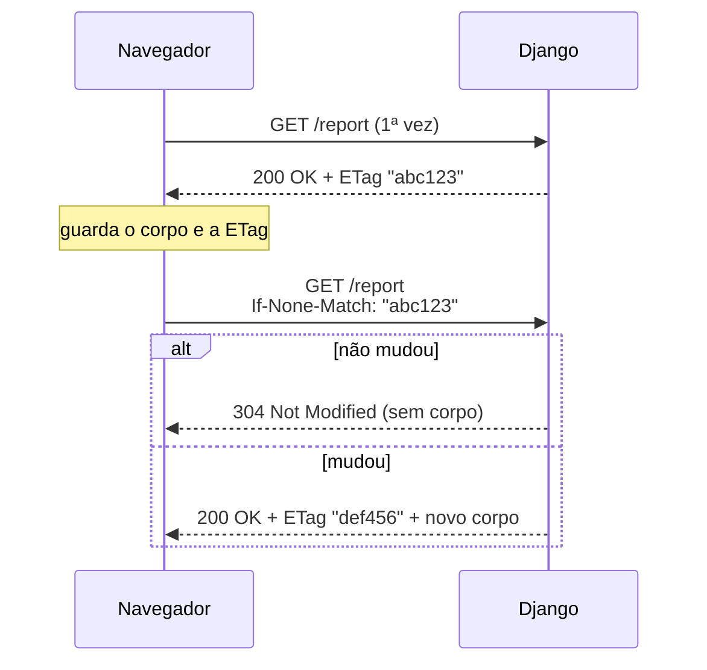

# Upload de arquivos e respostas condicionais (ETag)

!!! quote "Pensa como criança 🧒"
    Quando você entrega um desenho pra professora, ela primeiro **recebe** o papel
    (o upload) e guarda numa pasta. Depois, se um amigo pede pra ver, ela não
    fotocopia tudo de novo se o desenho não mudou — ela diz "é o mesmo de ontem,
    olha o que você já tem". Upload é receber e guardar; **ETag/Last-Modified** é
    esse "é o mesmo de ontem" que evita mandar de novo o que não mudou.

## Caso de uso

Um usuário envia o avatar num formulário. Você quer: **receber** o arquivo,
**validar** tamanho e tipo, e **salvar** no storage. Depois, quando alguém baixa
esse avatar, você quer que o navegador **use o cache** se o arquivo não mudou.

```python
# forms.py
from django import forms


class AvatarForm(forms.Form):
    """Form that receives a single uploaded avatar image."""

    avatar = forms.ImageField()
```

```python
# views.py
from django.core.files.uploadedfile import UploadedFile
from django.http import HttpRequest, HttpResponse
from django.shortcuts import redirect, render

from .forms import AvatarForm


def upload_avatar(request: HttpRequest) -> HttpResponse:
    """Receive an avatar upload, validate it, and store it.

    Args:
        request: The incoming HTTP request.

    Returns:
        A redirect on success, or the form page with errors otherwise.
    """
    if request.method == "POST":
        form = AvatarForm(request.POST, request.FILES)
        if form.is_valid():
            uploaded: UploadedFile = form.cleaned_data["avatar"]
            with open(f"/data/media/avatars/{uploaded.name}", "wb") as dest:
                for chunk in uploaded.chunks():
                    dest.write(chunk)
            return redirect("profile")
    else:
        form = AvatarForm()
    return render(request, "upload.html", {"form": form})
```

O segredo do formulário HTML: sem `enctype="multipart/form-data"` o arquivo não
chega.

```html
<form method="post" enctype="multipart/form-data">
  
  {{ form.as_p }}
  <button type="submit">Enviar</button>
</form>
```

## Possibilidades

### Onde o arquivo chega: `request.FILES`

Arquivos enviados **não** ficam em `request.POST` — ficam em `request.FILES`,
um dicionário `nome_do_campo -> UploadedFile`.

```python
uploaded = request.FILES["avatar"]
```

Cada `UploadedFile` expõe:

| Atributo/método | O que é |
| --- | --- |
| `.name` | Nome do arquivo enviado (não confie nele cru) |
| `.size` | Tamanho em bytes |
| `.content_type` | Tipo MIME informado pelo navegador (não confiável sozinho) |
| `.read()` | Lê tudo de uma vez (cuidado com arquivos grandes) |
| `.chunks()` | Itera em pedaços — a forma segura para arquivos grandes |
| `.multiple_chunks()` | `True` se o arquivo é grande o bastante pra ir ao disco |

!!! warning "`request.FILES` só é populado no POST com `multipart/form-data`"
    Se você esquecer o `enctype`, `request.FILES` vem vazio e a validação do
    formulário falha silenciosamente com "This field is required." O upload só
    acontece em requisições `POST` (e `PUT`).

### `FileField` e `ImageField` no formulário

Deixe o formulário fazer o trabalho pesado. Passe **os dois** dicionários no
construtor: `request.POST` e `request.FILES`.

```python
from django import forms


class DocumentForm(forms.Form):
    """Form accepting any file plus an image with sensible limits."""

    file = forms.FileField()
    picture = forms.ImageField(required=False)
```

| Campo | Valida |
| --- | --- |
| `forms.FileField` | Que algo foi enviado (a menos de `required=False`) |
| `forms.ImageField` | Que o conteúdo é uma imagem válida (usa Pillow) |

!!! info "`ImageField` precisa do Pillow"
    A validação de imagem (largura, altura, formato real) usa a biblioteca
    Pillow. Instale com `uv add pillow`, senão o campo levanta erro pedindo ela.

### Salvando no storage (o jeito recomendado)

Escrever com `open()` funciona, mas o caminho idiomático é deixar um modelo com
`FileField`/`ImageField` gravar pelo **storage** configurado — assim disco e
nuvem funcionam igual (veja [storages](storages.md)).

```python
# models.py
from django.db import models


class Document(models.Model):
    """A user-uploaded document stored via the default storage."""

    file = models.FileField(upload_to="docs/%Y/%m/")
```

```python
# views.py
from django.http import HttpRequest, HttpResponse
from django.shortcuts import redirect, render

from .forms import DocumentForm
from .models import Document


def upload_document(request: HttpRequest) -> HttpResponse:
    """Persist an uploaded document through the model's storage.

    Args:
        request: The incoming HTTP request.

    Returns:
        A redirect on success, or the form page otherwise.
    """
    form = DocumentForm(request.POST or None, request.FILES or None)
    if request.method == "POST" and form.is_valid():
        Document.objects.create(file=form.cleaned_data["file"])
        return redirect("docs")
    return render(request, "upload.html", {"form": form})
```

O storage sanitiza o nome, resolve colisões com um sufixo aleatório e aplica o
`upload_to`. Você nunca monta o caminho na mão.

### Validando tamanho e conteúdo

Nunca confie no `.content_type` do navegador nem no tamanho declarado. Valide de
verdade — o lugar certo é um método `clean_<campo>` do formulário.

```python
from django import forms
from django.core.files.uploadedfile import UploadedFile

MAX_UPLOAD_BYTES: int = 5 * 1024 * 1024
ALLOWED_TYPES: set[str] = {"image/jpeg", "image/png", "image/webp"}


class SafeImageForm(forms.Form):
    """Form that enforces a size cap and an allow-list of image types."""

    image = forms.ImageField()

    def clean_image(self) -> UploadedFile:
        """Validate the uploaded image's size and content type.

        Returns:
            The validated uploaded file.

        Raises:
            forms.ValidationError: If the file is too large or of a
                disallowed type.
        """
        uploaded: UploadedFile = self.cleaned_data["image"]
        if uploaded.size > MAX_UPLOAD_BYTES:
            raise forms.ValidationError("O arquivo passa de 5 MB.")
        if uploaded.content_type not in ALLOWED_TYPES:
            raise forms.ValidationError("Tipo de imagem não permitido.")
        return uploaded
```

!!! danger "Extensão e MIME mentem — para segurança de verdade, inspecione o conteúdo"
    Um atacante renomeia `virus.exe` para `foto.png` e ajusta o header. Para
    uploads sensíveis, verifique os *magic bytes* (biblioteca `python-magic`) ou
    reprocesse a imagem com Pillow (`Image.open(...).verify()`). O
    `.content_type` é só uma dica do navegador.

### Upload handlers e `FILE_UPLOAD_MAX_MEMORY_SIZE`

Pensa como criança: arquivo pequeno cabe no bolso (memória); arquivo grande vai
pro carrinho (um arquivo temporário no disco). Quem decide são os **upload
handlers**.

| Setting | Padrão | O que faz |
| --- | --- | --- |
| `FILE_UPLOAD_MAX_MEMORY_SIZE` | `2621440` (2,5 MB) | Acima disso, o upload vai pro disco em vez da memória |
| `FILE_UPLOAD_TEMP_DIR` | `None` (temp do sistema) | Onde os temporários grandes ficam |
| `DATA_UPLOAD_MAX_MEMORY_SIZE` | `2621440` (2,5 MB) | Teto do corpo (não-arquivo) da requisição |
| `FILE_UPLOAD_PERMISSIONS` | `0o644` | Permissões do arquivo salvo |
| `FILE_UPLOAD_HANDLERS` | Memória + Temp | A lista de handlers, em ordem |

```python
# settings.py
FILE_UPLOAD_MAX_MEMORY_SIZE = 5 * 1024 * 1024
FILE_UPLOAD_HANDLERS = [
    "django.core.files.uploadhandler.MemoryFileUploadHandler",
    "django.core.files.uploadhandler.TemporaryFileUploadHandler",
]
```

!!! note "Por isso `chunks()` existe"
    Como um arquivo grande pode estar num temporário no disco, você o lê em
    pedaços com `.chunks()` em vez de `.read()` — assim nunca carrega gigabytes
    de uma vez na memória.

### Servindo arquivos grandes com `FileResponse`

Para **devolver** um arquivo (download), não leia tudo pra uma string. Use
`FileResponse`, que faz *streaming* em pedaços.

```python
from django.http import FileResponse, HttpRequest


def download_report(request: HttpRequest) -> FileResponse:
    """Stream a large report file to the client.

    Args:
        request: The incoming HTTP request.

    Returns:
        A streaming file response with a download disposition.
    """
    handle = open("/data/media/reports/big.pdf", "rb")
    return FileResponse(handle, as_attachment=True, filename="relatorio.pdf")
```

| Argumento | Efeito |
| --- | --- |
| `as_attachment=True` | Navegador baixa em vez de abrir |
| `filename="..."` | Nome sugerido no download |

!!! tip "Em produção, delegue ao servidor web"
    `FileResponse` é ótimo em dev, mas servir arquivos grandes pelo processo
    Python é caro. Em produção, deixe Nginx/S3 servirem os arquivos (veja
    [static-media](static-media.md)); o Django só decide **quem pode** baixar.

### GET condicional: ETag e Last-Modified

Agora o "é o mesmo de ontem". Quando o cliente já tem uma versão, ele manda um
header dizendo qual; se nada mudou, você responde **304 Not Modified** — corpo
zero, banda economizada.



O jeito idiomático é o decorator `condition`, passando funções que calculam a
ETag e/ou a data de modificação **sem** montar a resposta inteira.

```python
from django.http import HttpRequest, HttpResponse
from django.utils.http import http_date
from django.views.decorators.http import condition

from .models import Document


def report_etag(request: HttpRequest, pk: int) -> str:
    """Compute a cache tag for a document.

    Args:
        request: The incoming HTTP request.
        pk: The document primary key.

    Returns:
        A string used as the ETag.
    """
    doc = Document.objects.get(pk=pk)
    return f"{doc.pk}-{doc.updated_at.timestamp()}"


def report_last_modified(request: HttpRequest, pk: int):
    """Return the last-modified datetime of a document.

    Args:
        request: The incoming HTTP request.
        pk: The document primary key.

    Returns:
        The document's last update datetime.
    """
    return Document.objects.get(pk=pk).updated_at


@condition(etag_func=report_etag, last_modified_func=report_last_modified)
def report_detail(request: HttpRequest, pk: int) -> HttpResponse:
    """Return the document body only when the client's cache is stale.

    Args:
        request: The incoming HTTP request.
        pk: The document primary key.

    Returns:
        The full response; Django turns it into a 304 when unchanged.
    """
    doc = Document.objects.get(pk=pk)
    return HttpResponse(doc.file.read(), content_type="application/pdf")
```

| Header enviado pelo cliente | Comparado com | Resultado se bate |
| --- | --- | --- |
| `If-None-Match` | Sua `ETag` | `304 Not Modified` |
| `If-Modified-Since` | Seu `Last-Modified` | `304 Not Modified` |

!!! tip "Use só um dos dois se quiser"
    O decorator aceita apenas `etag_func` **ou** apenas `last_modified_func`. Se
    você tem um `updated_at` no modelo, `last_modified_func` já resolve. ETag é
    melhor quando "mudou" não é uma questão de tempo (ex.: um hash do conteúdo).

!!! note "As funções rodam ANTES da view"
    A graça é economizar trabalho: as funções de ETag/Last-Modified devem ser
    **baratas** (uma consulta leve), porque rodam a cada requisição. Se a
    resposta for 304, a view nem executa.

!!! info "Você também pode setar a ETag na mão"
    Sem o decorator, dá pra fazer `response.headers['ETag'] = '\"abc123\"'` e o
    middleware `ConditionalGetMiddleware` (se ativo) converte um `If-None-Match`
    que bate em 304 automaticamente. O decorator é só o caminho mais explícito.

!!! quote "📖 Na documentação oficial"
    - [File Uploads](https://docs.djangoproject.com/en/6.0/topics/http/file-uploads/)
    - [Conditional view processing](https://docs.djangoproject.com/en/6.0/topics/conditional-view/)

## Recap

- Arquivos chegam em `request.FILES` (não em `POST`); o form precisa de
  `enctype="multipart/form-data"` e você passa `request.POST, request.FILES`.
- `forms.FileField`/`ImageField` validam o básico; `ImageField` usa Pillow.
  Valide **tamanho e conteúdo** num `clean_<campo>` — não confie em `.content_type`.
- Salve pelo modelo/`FileField` para o [storage](storages.md) sanitizar nome e
  caminho. Leia arquivos grandes com `.chunks()`, nunca `.read()`.
- `FILE_UPLOAD_MAX_MEMORY_SIZE` decide memória vs. disco; upload handlers
  controlam o processo.
- Devolva arquivos grandes com `FileResponse` (streaming); em produção quem serve
  é Nginx/S3 (veja [static-media](static-media.md)).
- GET condicional: o decorator `condition` com `etag_func`/`last_modified_func`
  responde **304** quando nada mudou, economizando banda.
