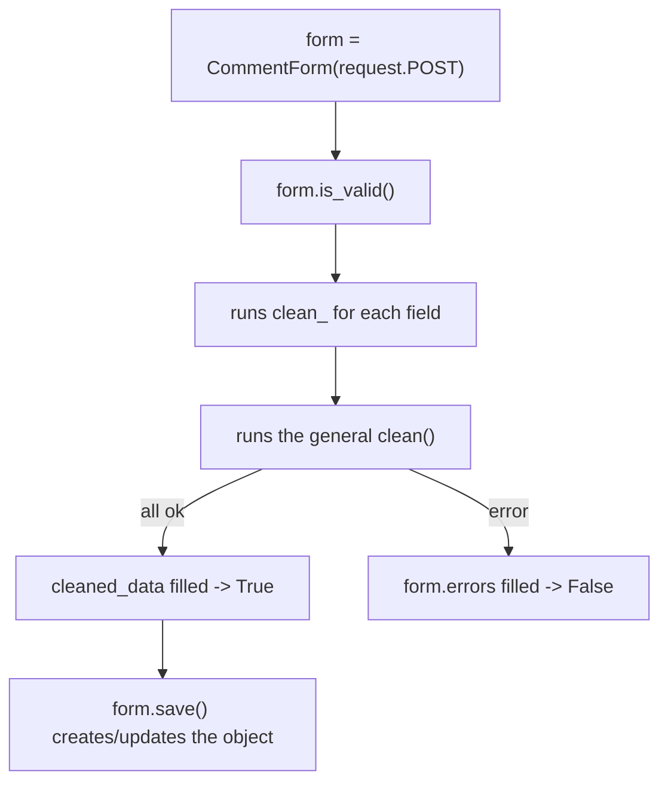

# Reference: forms and `ModelForm`

!!! quote "Think like a child 🧒"
    A **form** is the bouncer at the party. Everyone who wants to get in (data
    coming from the browser) has to go through it. The bouncer checks: "does your
    name fit in the field? is that email real? where's your invite?". Only those
    who pass the check get in. Whoever doesn't comes back with a little note
    saying what was missing.

## Use case

Readers submit comments. You **cannot trust** what arrives from the browser —
you need to validate it. A `ModelForm` generates the fields from the model,
validates and converts everything, and you just decide what to do with the valid
result:

```python
# apps/blog/forms.py
from django import forms

from apps.blog.models import Comment


class CommentForm(forms.ModelForm):
    """Public form for readers to submit a comment."""

    class Meta:
        model = Comment
        fields = ["author_name", "email", "body"]
        widgets = {
            "body": forms.Textarea(attrs={"rows": 4}),
        }
```

In the template:

```django
<form method="post">
  
  {{ form.as_p }}
  <button type="submit">Submit</button>
</form>
```

There you go: fields rendered, validated, and with error messages. Let's look at
**all the knobs** of this bouncer.

## Possibilities

### `Form` × `ModelForm`

| Type | When to use | Where the fields come from |
| --- | --- | --- |
| `forms.Form` | Form **without** a model (search, contact, filter) | You declare each field |
| `forms.ModelForm` | Form **bound** to a model | Derived from the model via `Meta` |

```python
# Plain Form — you declare the fields
class ContactForm(forms.Form):
    name = forms.CharField(max_length=80)
    email = forms.EmailField()
    message = forms.CharField(widget=forms.Textarea)
```

### The `ModelForm`'s `Meta`

The bulletin board that ties the form to the model:

| Option | What it does |
| --- | --- |
| `model` | Which model the form represents |
| `fields` | List of fields to include (or `"__all__"`) |
| `exclude` | Fields to **remove** (the opposite of `fields`) |
| `widgets` | Swaps the HTML widget of a field |
| `labels` | Custom labels per field |
| `help_texts` | Help texts per field |
| `error_messages` | Error messages per field |
| `field_classes` | Swaps the field class per field |

```python
class PostForm(forms.ModelForm):
    class Meta:
        model = Post
        fields = ["title", "body", "tags", "status"]
        widgets = {
            "body": forms.Textarea(attrs={"rows": 12, "class": "editor"}),
        }
        labels = {"body": "Post content"}
        help_texts = {"tags": "Choose one or more tags."}
        error_messages = {
            "title": {"required": "The title is required."},
        }
```

!!! danger "Never use `fields = \"__all__\"` in public forms"
    `"__all__"` includes **all** the fields — including the ones the user
    shouldn't touch (author, status, internal flags). A malicious user could
    forge them. List **explicitly** only what is safe to edit. Think like a
    child: don't leave the back door open.

!!! tip "`fields` × `exclude`: prefer `fields`"
    With `exclude`, if you add a new field to the model tomorrow, it slips into
    the form **by accident**. With `fields`, the form only has what you listed —
    safe by default.

### Widgets: the HTML "body" of the field

The **field** validates; the **widget** draws. Think like a child: the field is
the rule ("only a date fits"), the widget is the toy you hand over (a calendar, a
text box, a menu).

| Widget | Becomes in HTML |
| --- | --- |
| `TextInput` | `<input type="text">` |
| `Textarea` | `<textarea>` |
| `Select` | `<select>` (dropdown) |
| `CheckboxInput` | `<input type="checkbox">` |
| `RadioSelect` | radio buttons |
| `DateInput` | `<input type="date">` (with `attrs`) |
| `PasswordInput` | `<input type="password">` |
| `CheckboxSelectMultiple` | several checkboxes |

```python
widgets = {
    "birth_date": forms.DateInput(attrs={"type": "date"}),
    "bio": forms.Textarea(attrs={"rows": 6, "placeholder": "Tell us about yourself"}),
    "newsletter": forms.CheckboxInput(),
}
```

### Validation: `clean_<field>` and `clean`

Three levels, from most specific to most general:

```python
class SignupForm(forms.ModelForm):
    password = forms.CharField(widget=forms.PasswordInput)
    password_confirm = forms.CharField(widget=forms.PasswordInput)

    class Meta:
        model = User
        fields = ["username", "email"]

    def clean_email(self) -> str:
        """Validate a single field: email must be unique."""
        email: str = self.cleaned_data["email"]
        if User.objects.filter(email=email).exists():
            raise forms.ValidationError("This email is already registered.")
        return email                                    # (1)!

    def clean(self) -> dict:
        """Validate across fields: the two passwords must match."""
        cleaned = super().clean()                        # (2)!
        if cleaned.get("password") != cleaned.get("password_confirm"):
            raise forms.ValidationError("The passwords do not match.")
        return cleaned
```

1. A `clean_<field>` **must return** the (cleaned) value. If you forget the
   `return`, the field becomes `None`.
2. In the general `clean()`, call `super().clean()` to get the field-by-field
   validated data.

| Where to validate | Use | For... |
| --- | --- | --- |
| One field, on the field | `validators=[...]` on the field | reusable rules |
| One field, on the form | `clean_<field>()` | a rule that depends only on that field |
| Several fields together | `clean()` | a rule that crosses fields (password × confirmation) |

!!! info "`cleaned_data`: the already-checked data"
    After `is_valid()` runs, the converted and validated values live in
    `form.cleaned_data` (a dict). That's where you read from — never from the raw
    `request.POST`.

### The lifecycle (the form's assembly line)



With the generic views (`CreateView`/`UpdateView`), this cycle is already done —
you just step in at `form_valid(form)`.

### Rendering in the template

| Form | Result |
| --- | --- |
| `{{ form.as_p }}` | Each field in a `<p>` |
| `{{ form.as_ul }}` | Each field in a `<li>` |
| `{{ form.as_table }}` | In `<table>` rows |
| `{{ form.as_div }}` | Each field in a `<div>` (recommended today) |
| Field by field | `{{ form.title.label_tag }} {{ form.title }} {{ form.title.errors }}` |

!!! danger "`` in EVERY POST form"
    Forgot it? The submission returns **403 Forbidden**. It's the protection
    against request forgery. Always put it inside the `<form method="post">`.

!!! quote "📖 In the official docs"
    - [Working with forms](https://docs.djangoproject.com/en/stable/topics/forms/)
    - [Form and field reference](https://docs.djangoproject.com/en/stable/ref/forms/)

## Recap

- The form is the bouncer: it validates and converts the input before it gets
  in.
- `Form` (no model) × `ModelForm` (bound to a model, fields via `Meta`).
- In `Meta`: list `fields` **explicitly** (never `"__all__"` in public), adjust
  `widgets`, `labels`, `help_texts`, `error_messages`.
- **Field** validates, **widget** draws.
- Validation: `validators` (field) → `clean_<field>` (one field) → `clean`
  (several). `clean_<field>` must `return`.
- `` in every POST, otherwise 403.

Forms are the web version. In the API, their role belongs to the **serializer**
— see it in **[DRF: serializers and viewsets](drf.md)**.
