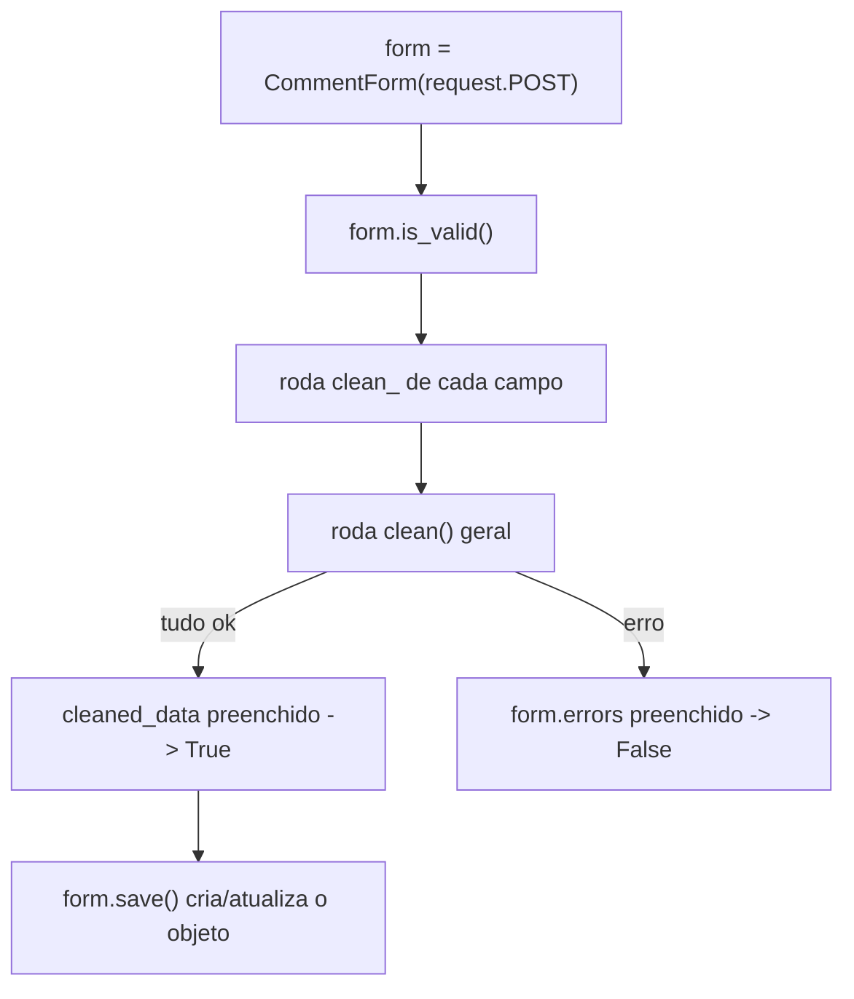

# Referência: formulários e `ModelForm`

!!! quote "Pensa como criança 🧒"
    Um **formulário** é o segurança da festa. Todo mundo que quer entrar (dados
    vindos do navegador) passa por ele. O segurança confere: "seu nome cabe no
    campo? esse e-mail é de verdade? cadê o convite?". Só quem passa na
    conferência entra. Quem não passa, volta com um bilhetinho dizendo o que
    faltou.

## Caso de uso

Leitores enviam comentários. Você **não pode confiar** no que chega do
navegador — precisa validar. Um `ModelForm` gera os campos a partir do modelo,
valida e converte tudo, e você só decide o que fazer com o resultado válido:

```python
# apps/blog/forms.py
from django import forms

from apps.blog.models import Comment


class CommentForm(forms.ModelForm):
    """Public form for readers to submit a comment."""

    class Meta:
        model = Comment
        fields = ["author_name", "email", "body"]
        widgets = {
            "body": forms.Textarea(attrs={"rows": 4}),
        }
```

No template:

```django
<form method="post">
  
  {{ form.as_p }}
  <button type="submit">Enviar</button>
</form>
```

Pronto: campos renderizados, validados e com mensagens de erro. Vamos ver
**todos os botões** desse segurança.

## Possibilidades

### `Form` × `ModelForm`

| Tipo | Quando usar | De onde vêm os campos |
| --- | --- | --- |
| `forms.Form` | Formulário **sem** modelo (busca, contato, filtro) | Você declara cada field |
| `forms.ModelForm` | Formulário **ligado** a um modelo | Derivados do modelo via `Meta` |

```python
# Form puro — você declara os campos
class ContactForm(forms.Form):
    name = forms.CharField(max_length=80)
    email = forms.EmailField()
    message = forms.CharField(widget=forms.Textarea)
```

### A `Meta` do `ModelForm`

O quadro de recados que liga o form ao modelo:

| Opção | O que faz |
| --- | --- |
| `model` | Qual modelo o form representa |
| `fields` | Lista de campos a incluir (ou `"__all__"`) |
| `exclude` | Campos a **remover** (o oposto de `fields`) |
| `widgets` | Troca o widget HTML de um campo |
| `labels` | Rótulos customizados por campo |
| `help_texts` | Textos de ajuda por campo |
| `error_messages` | Mensagens de erro por campo |
| `field_classes` | Troca a classe do field por campo |

```python
class PostForm(forms.ModelForm):
    class Meta:
        model = Post
        fields = ["title", "body", "tags", "status"]
        widgets = {
            "body": forms.Textarea(attrs={"rows": 12, "class": "editor"}),
        }
        labels = {"body": "Conteúdo do post"}
        help_texts = {"tags": "Escolha uma ou mais tags."}
        error_messages = {
            "title": {"required": "O título é obrigatório."},
        }
```

!!! danger "Nunca use `fields = \"__all__\"` em formulários públicos"
    `"__all__"` inclui **todos** os campos — inclusive os que o usuário não
    deveria mexer (autor, status, flags internas). Um usuário malicioso poderia
    forjá-los. Liste **explicitamente** só o que é seguro editar. Pensa como
    criança: não deixe a porta dos fundos aberta.

!!! tip "`fields` × `exclude`: prefira `fields`"
    Com `exclude`, se você adicionar um campo novo ao modelo amanhã, ele entra
    no form **sem querer**. Com `fields`, o form só tem o que você listou —
    seguro por padrão.

### Widgets: o "corpo" HTML do campo

O **field** valida; o **widget** desenha. Pensa como criança: o field é a regra
("só cabe data"), o widget é o brinquedo que você entrega (um calendário, uma
caixa de texto, um menu).

| Widget | Vira no HTML |
| --- | --- |
| `TextInput` | `<input type="text">` |
| `Textarea` | `<textarea>` |
| `Select` | `<select>` (dropdown) |
| `CheckboxInput` | `<input type="checkbox">` |
| `RadioSelect` | botões de rádio |
| `DateInput` | `<input type="date">` (com `attrs`) |
| `PasswordInput` | `<input type="password">` |
| `CheckboxSelectMultiple` | vários checkboxes |

```python
widgets = {
    "birth_date": forms.DateInput(attrs={"type": "date"}),
    "bio": forms.Textarea(attrs={"rows": 6, "placeholder": "Fale de você"}),
    "newsletter": forms.CheckboxInput(),
}
```

### Validação: `clean_<campo>` e `clean`

Três níveis, do mais específico ao mais geral:

```python
class SignupForm(forms.ModelForm):
    password = forms.CharField(widget=forms.PasswordInput)
    password_confirm = forms.CharField(widget=forms.PasswordInput)

    class Meta:
        model = User
        fields = ["username", "email"]

    def clean_email(self) -> str:
        """Validate a single field: email must be unique."""
        email: str = self.cleaned_data["email"]
        if User.objects.filter(email=email).exists():
            raise forms.ValidationError("Esse e-mail já está cadastrado.")
        return email                                    # (1)!

    def clean(self) -> dict:
        """Validate across fields: the two passwords must match."""
        cleaned = super().clean()                        # (2)!
        if cleaned.get("password") != cleaned.get("password_confirm"):
            raise forms.ValidationError("As senhas não conferem.")
        return cleaned
```

1. Um `clean_<campo>` **precisa retornar** o valor (limpo). Se esquecer o
   `return`, o campo vira `None`.
2. No `clean()` geral, chame `super().clean()` para pegar os dados já validados
   campo a campo.

| Onde validar | Use | Para... |
| --- | --- | --- |
| Um campo, no field | `validators=[...]` no field | regras reutilizáveis |
| Um campo, no form | `clean_<campo>()` | regra que depende só daquele campo |
| Vários campos juntos | `clean()` | regra que cruza campos (senha × confirmação) |

!!! info "`cleaned_data`: os dados já conferidos"
    Depois que `is_valid()` roda, os valores convertidos e validados ficam em
    `form.cleaned_data` (um dict). É de lá que você lê — nunca do
    `request.POST` cru.

### O ciclo de vida (a linha de montagem do form)



Com as generic views (`CreateView`/`UpdateView`), esse ciclo já está pronto —
você só entra no `form_valid(form)`.

### Renderização no template

| Forma | Resultado |
| --- | --- |
| `{{ form.as_p }}` | Cada campo num `<p>` |
| `{{ form.as_ul }}` | Cada campo num `<li>` |
| `{{ form.as_table }}` | Em linhas de `<table>` |
| `{{ form.as_div }}` | Cada campo num `<div>` (recomendado hoje) |
| Campo a campo | `{{ form.title.label_tag }} {{ form.title }} {{ form.title.errors }}` |

!!! danger "`` em TODO formulário POST"
    Esqueceu? O envio retorna **403 Forbidden**. É a proteção contra
    falsificação de requisição. Ponha sempre dentro do `<form method="post">`.

## Recap

- O form é o segurança: valida e converte a entrada antes de ela entrar.
- `Form` (sem modelo) × `ModelForm` (ligado a modelo, campos via `Meta`).
- Na `Meta`: liste `fields` **explicitamente** (nunca `"__all__"` em público),
  ajuste `widgets`, `labels`, `help_texts`, `error_messages`.
- **Field** valida, **widget** desenha.
- Validação: `validators` (field) → `clean_<campo>` (um campo) → `clean` (vários).
  `clean_<campo>` precisa dar `return`.
- `` em todo POST, senão 403.

Formulários são a versão web. Na API, o papel deles é do **serializer** — veja
em **[DRF: serializers e viewsets](drf.md)**.
