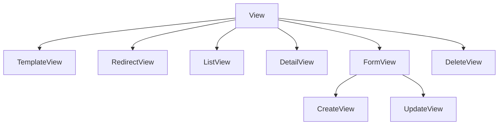

# Reference: generic views & mixins

!!! quote "Think like a child 🧒"
    The [Class-based views](views-cbv.md) page showed the waiters who serve the
    common dishes (list, detail, create). This page is the **rest of the menu**:
    simpler waiters (show a page, redirect) and the "standalone skills" (mixins)
    that you stick onto any waiter to give it an extra power.

## Use case

You want a static "About" page, a shortcut that redirects `/blog/` to the home
page, and a contact form that isn't saved to any model. Each one has a
ready-made generic view:

```python
from django.urls import reverse_lazy
from django.views.generic import RedirectView, TemplateView
from django.views.generic.edit import FormView


class AboutView(TemplateView):
    template_name = "pages/about.html"


class BlogRedirectView(RedirectView):
    pattern_name = "blog:post-list"     # redirect to the blog home
    permanent = False


class ContactView(FormView):
    template_name = "pages/contact.html"
    form_class = ContactForm
    success_url = reverse_lazy("blog:post-list")

    def form_valid(self, form: ContactForm) -> HttpResponse:
        form.send_email()
        return super().form_valid(form)
```

## Possibilities

### The complete hierarchy



They all descend from `View`, the base.

### `View`: the base of everything

When no generic view fits, inherit from `View` and write the HTTP methods:

```python
from django.http import JsonResponse
from django.views import View


class PingView(View):
    """Bare-bones view: implement the HTTP verbs you need."""

    def get(self, request, *args, **kwargs) -> JsonResponse:
        return JsonResponse({"pong": True})

    def post(self, request, *args, **kwargs) -> JsonResponse:
        return JsonResponse({"received": True})
```

| Method | Handles |
| --- | --- |
| `get` / `post` / `put` / `patch` / `delete` | The corresponding HTTP verb |
| `dispatch` | Routes to the right method (rarely overridden) |
| `http_method_names` | List of accepted verbs |

### `TemplateView`: a page with context

```python
class HomeView(TemplateView):
    template_name = "home.html"

    def get_context_data(self, **kwargs):
        context = super().get_context_data(**kwargs)
        context["featured"] = Post.objects.published()[:3]
        return context
```

Use it for pages that **show** something but aren't a list/detail of a model.

### `RedirectView`: sending somewhere else

| Attribute | What it does |
| --- | --- |
| `url` | Fixed destination URL |
| `pattern_name` | Route name for `reverse` (preferred) |
| `permanent` | `True` = HTTP 301; `False` = 302 |
| `query_string` | Passes the query string along |

### `FormView`: a form without a model

For forms that **don't** save a model (contact, search, standalone upload):

```python
class ContactView(FormView):
    template_name = "contact.html"
    form_class = ContactForm
    success_url = reverse_lazy("thanks")

    def form_valid(self, form):
        form.send_email()          # your logic
        return super().form_valid(form)
```

!!! tip "`FormView` × `CreateView`"
    `CreateView` **saves** an object (it has a `model`). `FormView` only processes
    the form — you decide what to do in `form_valid`. Contact/search/actions →
    `FormView`; creating a record → `CreateView`.

### Mixin catalog

Think like a child: power stickers. Stick them on the left of the inheritance.

#### Access (auth)

| Mixin | Power |
| --- | --- |
| `LoginRequiredMixin` | Requires login |
| `PermissionRequiredMixin` | Requires `permission_required` |
| `UserPassesTestMixin` | Requires `test_func()` to return `True` |

#### Data (the "bricks" of the generic views)

These are the blocks the generic views combine under the hood:

| Mixin | Provides |
| --- | --- |
| `ContextMixin` | `get_context_data()` |
| `SingleObjectMixin` | `get_object()`, `get_queryset()` (one object) |
| `MultipleObjectMixin` | List + pagination |
| `FormMixin` | `get_form()`, `form_valid/invalid`, `get_success_url()` |
| `ModelFormMixin` | `FormMixin` + saving the object |

#### Convenience

| Mixin | Power |
| --- | --- |
| `SuccessMessageMixin` | Success message after saving |

!!! danger "Order: mixins BEFORE the base view"
    Always `class V(LoginRequiredMixin, DetailView)`. Python resolves inheritance
    from left to right (MRO); the mixin must come first to intercept. See
    [class-based views](views-cbv.md) for the MRO detail.

### Composing your own mixins

Extract repeated behavior into a mixin and reuse it:

```python
class AuthorRequiredMixin(UserPassesTestMixin):
    """Allow only the object's author to proceed."""

    def test_func(self) -> bool:
        return self.get_object().author.user == self.request.user


class PostUpdateView(AuthorRequiredMixin, UpdateView):
    model = Post
    fields = ["title", "body"]


class PostDeleteView(AuthorRequiredMixin, DeleteView):
    model = Post
    success_url = reverse_lazy("blog:post-list")
```

One mixin, two uses — the "author only" rule lives in a single place.

!!! quote "📖 In the official docs"
    - [Built-in class-based views API](https://docs.djangoproject.com/en/stable/ref/class-based-views/)

## Recap

- Everything descends from `View`; inherit from it when no generic view fits.
- `TemplateView` (a page with context), `RedirectView` (301/302),
  `FormView` (a form without a model, you act in `form_valid`).
- Access mixins (`LoginRequired`/`PermissionRequired`/`UserPassesTest`), data
  mixins (the bricks: `ContextMixin`, `SingleObjectMixin`, `FormMixin`...) and
  convenience mixins (`SuccessMessageMixin`).
- Mixins **before** the base view (MRO); compose your own to reuse rules.

You've walked through the entire reference. 🎉 Head back to the
[Tutorial](../tutorial/project-setup.md) or to the [reference map](index.md).
