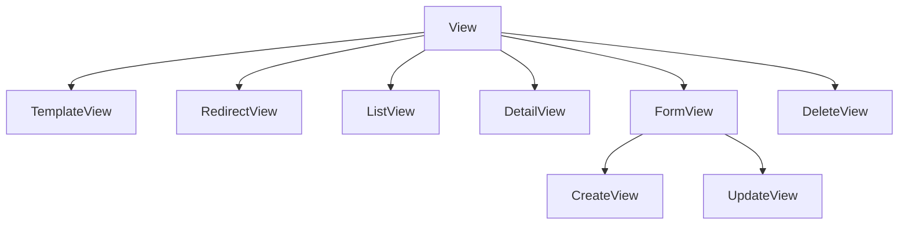

# Referência: generic views e mixins

!!! quote "Pensa como criança 🧒"
    A página [Views baseadas em classe](views-cbv.md) mostrou os garçons que
    servem os pratos comuns (listar, detalhar, criar). Esta página é o **resto do
    cardápio**: garçons mais simples (mostrar uma página, redirecionar) e as
    "habilidades avulsas" (mixins) que você cola em qualquer garçom para dar um
    poder extra.

## Caso de uso

Você quer uma página "Sobre" estática, um atalho que redireciona `/blog/` para a
home, e um formulário de contato que não salva em modelo nenhum. Cada um tem uma
generic view pronta:

```python
from django.urls import reverse_lazy
from django.views.generic import RedirectView, TemplateView
from django.views.generic.edit import FormView


class AboutView(TemplateView):
    template_name = "pages/about.html"


class BlogRedirectView(RedirectView):
    pattern_name = "blog:post-list"     # redireciona para a home do blog
    permanent = False


class ContactView(FormView):
    template_name = "pages/contact.html"
    form_class = ContactForm
    success_url = reverse_lazy("blog:post-list")

    def form_valid(self, form: ContactForm) -> HttpResponse:
        form.send_email()
        return super().form_valid(form)
```

## Possibilidades

### A hierarquia completa



Todas descendem de `View`, a base.

### `View`: a base de tudo

Quando nenhuma generic serve, herde de `View` e escreva os métodos HTTP:

```python
from django.http import JsonResponse
from django.views import View


class PingView(View):
    """Bare-bones view: implement the HTTP verbs you need."""

    def get(self, request, *args, **kwargs) -> JsonResponse:
        return JsonResponse({"pong": True})

    def post(self, request, *args, **kwargs) -> JsonResponse:
        return JsonResponse({"received": True})
```

| Método | Trata |
| --- | --- |
| `get` / `post` / `put` / `patch` / `delete` | O verbo HTTP correspondente |
| `dispatch` | Roteia para o método certo (raramente sobrescrito) |
| `http_method_names` | Lista de verbos aceitos |

### `TemplateView`: página com contexto

```python
class HomeView(TemplateView):
    template_name = "home.html"

    def get_context_data(self, **kwargs):
        context = super().get_context_data(**kwargs)
        context["featured"] = Post.objects.published()[:3]
        return context
```

Use para páginas que **mostram** algo mas não são list/detail de um modelo.

### `RedirectView`: mandar para outro lugar

| Atributo | O que faz |
| --- | --- |
| `url` | URL fixa de destino |
| `pattern_name` | Nome de rota para `reverse` (preferível) |
| `permanent` | `True` = HTTP 301; `False` = 302 |
| `query_string` | Repassa a query string |

### `FormView`: formulário sem modelo

Para formulários que **não** salvam um modelo (contato, busca, upload avulso):

```python
class ContactView(FormView):
    template_name = "contact.html"
    form_class = ContactForm
    success_url = reverse_lazy("thanks")

    def form_valid(self, form):
        form.send_email()          # sua lógica
        return super().form_valid(form)
```

!!! tip "`FormView` × `CreateView`"
    `CreateView` **salva** um objeto (tem `model`). `FormView` só processa o
    formulário — você decide o que fazer no `form_valid`. Contato/busca/ações →
    `FormView`; criar registro → `CreateView`.

### Catálogo de mixins

Pensa como criança: adesivos de poder. Cole na esquerda da herança.

#### De acesso (auth)

| Mixin | Poder |
| --- | --- |
| `LoginRequiredMixin` | Exige login |
| `PermissionRequiredMixin` | Exige `permission_required` |
| `UserPassesTestMixin` | Exige `test_func()` retornar `True` |

#### De dados (os "tijolos" das generic views)

Estes são os blocos que as generic views combinam por baixo:

| Mixin | Fornece |
| --- | --- |
| `ContextMixin` | `get_context_data()` |
| `SingleObjectMixin` | `get_object()`, `get_queryset()` (um objeto) |
| `MultipleObjectMixin` | Lista + paginação |
| `FormMixin` | `get_form()`, `form_valid/invalid`, `get_success_url()` |
| `ModelFormMixin` | `FormMixin` + salvar o objeto |

#### De conveniência

| Mixin | Poder |
| --- | --- |
| `SuccessMessageMixin` | Mensagem de sucesso após salvar |

!!! danger "Ordem: mixins ANTES da view base"
    Sempre `class V(LoginRequiredMixin, DetailView)`. O Python resolve a herança
    da esquerda para a direita (MRO); o mixin precisa vir antes para interceptar.
    Ver [views CBV](views-cbv.md) para o detalhe do MRO.

### Compondo seus próprios mixins

Extraia comportamento repetido num mixin e reutilize:

```python
class AuthorRequiredMixin(UserPassesTestMixin):
    """Allow only the object's author to proceed."""

    def test_func(self) -> bool:
        return self.get_object().author.user == self.request.user


class PostUpdateView(AuthorRequiredMixin, UpdateView):
    model = Post
    fields = ["title", "body"]


class PostDeleteView(AuthorRequiredMixin, DeleteView):
    model = Post
    success_url = reverse_lazy("blog:post-list")
```

Um mixin, dois usos — a regra "só o autor" mora num lugar só.

## Recap

- Tudo descende de `View`; herde dela quando nenhuma generic serve.
- `TemplateView` (página com contexto), `RedirectView` (301/302),
  `FormView` (formulário sem modelo, você age no `form_valid`).
- Mixins de acesso (`LoginRequired`/`PermissionRequired`/`UserPassesTest`), de
  dados (os tijolos: `ContextMixin`, `SingleObjectMixin`, `FormMixin`...) e de
  conveniência (`SuccessMessageMixin`).
- Mixins **antes** da view base (MRO); componha os seus para reusar regras.

Você percorreu a referência completa. 🎉 Volte ao
[Tutorial](../tutorial/project-setup.md) ou ao [mapa da referência](index.md).
