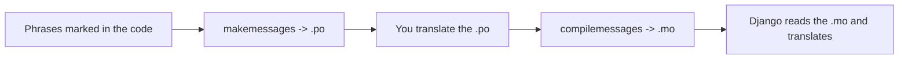

# Reference: i18n and translations

!!! quote "Think like a child 🧒"
    Your site speaks just one language. **i18n** (internationalization) is
    teaching it to speak several. Instead of hardcoding "Bem-vindo" in the code,
    you write "this phrase is translatable" and build a **dictionary**: in
    Portuguese it becomes "Bem-vindo", in English "Welcome". Django picks the right
    page based on each visitor's language.

!!! info "i18n vs. l10n"
    - **i18n** (internationalization): preparing the code so it *can* be
      translated.
    - **l10n** (localization): the concrete translation/adaptation for a
      language/region (date, number, currency formats).

## Use case

You have some text in a template and you want it to appear in PT or EN depending
on the user. Mark the phrase as translatable, generate the dictionary and
translate it:

```django

<h1></h1>
<p>Read the latest posts below.</p>
```

```bash
# 1. Extract the marked phrases into a .po file
python manage.py makemessages -l pt

# 2. (you edit the .po, translating each phrase)

# 3. Compile the .po into .mo (the binary Django reads)
python manage.py compilemessages
```

## Possibilities

### Turning on i18n in the settings

```python
USE_I18N = True
LANGUAGE_CODE = "pt-br"           # default language
LANGUAGES = [                      # languages offered
    ("pt-br", "Português"),
    ("en", "English"),
]
LOCALE_PATHS = [BASE_DIR / "locale"]   # where the .po/.mo live
```

And add the `LocaleMiddleware` (after Session, before Common):

```python
MIDDLEWARE = [
    "django.contrib.sessions.middleware.SessionMiddleware",
    "django.middleware.locale.LocaleMiddleware",       # <- here
    "django.middleware.common.CommonMiddleware",
    # ...
]
```

!!! warning "The order of `LocaleMiddleware` matters"
    It must come **after** `SessionMiddleware` (the language may be in the session)
    and **before** `CommonMiddleware`. The wrong position makes language detection
    fail silently.

### Marking translatable phrases

=== "In templates"

    ```django
    

                              {# simple phrase #}

    
      Hello {{ name }}, you have {{ count }} messages.
                              {# with variables #}

    
      {{ n }} item
    
      {{ n }} items
                              {# plural #}
    ```

=== "In Python (code)"

    ```python
    from django.utils.translation import gettext_lazy as _

    class Post(models.Model):
        title = models.CharField(_("title"), max_length=200)

        class Meta:
            verbose_name = _("post")
            verbose_name_plural = _("posts")
    ```

!!! danger "`gettext` vs. `gettext_lazy`"
    - **`gettext` (`_`)**: translates **right when** the line runs. Use it inside
      views/functions.
    - **`gettext_lazy`**: defers the translation until the text is **used**. Use it
      in places evaluated at import time — model attributes, `verbose_name`,
      choices, function arguments. If you use `gettext` there, the translation
      freezes in the language active during import (wrong).

    Think like a child: `lazy` means "only translate when someone is about to read
    it", not now.

### The file flow



```text
locale/
├── pt/LC_MESSAGES/django.po      # editable (you translate here)
└── pt/LC_MESSAGES/django.mo      # compiled (generated, don't edit)
```

| Command | What it does |
| --- | --- |
| `makemessages -l pt` | Creates/updates the `.po` for the `pt` language |
| `makemessages -a` | All languages in `LANGUAGES` |
| `compilemessages` | Converts `.po` → `.mo` |

### How Django picks the language

In priority order:

1. Prefix in the URL (`/en/posts/`) — if you use `i18n_patterns`.
2. Language in the user's session.
3. Language cookie.
4. The browser's `Accept-Language` header.
5. `LANGUAGE_CODE` (the default).

### URLs per language: `i18n_patterns`

```python
from django.conf.urls.i18n import i18n_patterns

urlpatterns = [
    path("admin/", admin.site.urls),      # no language prefix
]
urlpatterns += i18n_patterns(
    path("", include("apps.blog.urls", namespace="blog")),   # /pt/... , /en/...
)
```

### Switching language at runtime

```python
from django.utils import translation

translation.activate("en")
# ... code that generates text in English ...
translation.deactivate()
```

## Recap

- i18n prepares the code; l10n is the concrete translation. Turn it on with
  `USE_I18N`, `LANGUAGES`, `LOCALE_PATHS` + `LocaleMiddleware` (position matters).
- Mark phrases: ``/`` (templates), `_()` /
  `gettext_lazy` (code).
- **`gettext` on the spot vs. `gettext_lazy` deferred** — use `lazy` in models and
  everything evaluated at import time.
- Flow: `makemessages` (.po) → translate → `compilemessages` (.mo).
- Language chosen by URL/session/cookie/`Accept-Language`/default;
  `i18n_patterns` creates URLs with a per-language prefix.

One form for many objects at once? **[Formsets](formsets.md)**.
