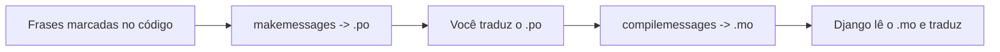

# Referência: i18n e traduções

!!! quote "Pensa como criança 🧒"
    Seu site fala uma língua só. **i18n** (internacionalização) é ensinar ele a
    falar várias. Em vez de escrever "Bem-vindo" fixo no código, você escreve
    "essa frase é traduzível" e monta um **dicionário**: em português vira
    "Bem-vindo", em inglês "Welcome". O Django escolhe a página certa conforme o
    idioma de cada visitante.

!!! info "i18n × l10n"
    - **i18n** (internationalization): preparar o código para *poder* traduzir.
    - **l10n** (localization): a tradução/adaptação concreta para um idioma/região
      (formatos de data, número, moeda).

## Caso de uso

Você tem um texto no template e quer que ele apareça em PT ou EN conforme o
usuário. Marque a frase como traduzível, gere o dicionário e traduza:

```django

<h1></h1>
<p>Read the latest posts below.</p>
```

```bash
# 1. Extrai as frases marcadas para um arquivo .po
python manage.py makemessages -l pt

# 2. (você edita o .po traduzindo cada frase)

# 3. Compila o .po em .mo (binário que o Django lê)
python manage.py compilemessages
```

## Possibilidades

### Ligar o i18n nos settings

```python
USE_I18N = True
LANGUAGE_CODE = "pt-br"           # idioma padrão
LANGUAGES = [                      # idiomas oferecidos
    ("pt-br", "Português"),
    ("en", "English"),
]
LOCALE_PATHS = [BASE_DIR / "locale"]   # onde ficam os .po/.mo
```

E adicione o `LocaleMiddleware` (depois de Session, antes de Common):

```python
MIDDLEWARE = [
    "django.contrib.sessions.middleware.SessionMiddleware",
    "django.middleware.locale.LocaleMiddleware",       # <- aqui
    "django.middleware.common.CommonMiddleware",
    # ...
]
```

!!! warning "A ordem do `LocaleMiddleware` importa"
    Ele precisa vir **depois** de `SessionMiddleware` (o idioma pode estar na
    sessão) e **antes** de `CommonMiddleware`. A posição errada faz a detecção de
    idioma falhar silenciosamente.

### Marcando frases traduzíveis

=== "Em templates"

    ```django
    

                              {# frase simples #}

    
      Hello {{ name }}, you have {{ count }} messages.
                              {# com variáveis #}

    
      {{ n }} item
    
      {{ n }} items
                              {# plural #}
    ```

=== "Em Python (código)"

    ```python
    from django.utils.translation import gettext_lazy as _

    class Post(models.Model):
        title = models.CharField(_("title"), max_length=200)

        class Meta:
            verbose_name = _("post")
            verbose_name_plural = _("posts")
    ```

!!! danger "`gettext` × `gettext_lazy`"
    - **`gettext` (`_`)**: traduz **na hora** que a linha roda. Use dentro de
      views/funções.
    - **`gettext_lazy`**: adia a tradução até o texto ser **usado**. Use em
      lugares avaliados na importação — atributos de modelo, `verbose_name`,
      choices, argumentos de função. Se usar `gettext` ali, a tradução congela no
      idioma ativo durante a importação (errado).

    Pensa como criança: `lazy` é "só traduz quando alguém for ler", não agora.

### O fluxo dos arquivos



```text
locale/
├── pt/LC_MESSAGES/django.po      # editável (você traduz aqui)
└── pt/LC_MESSAGES/django.mo      # compilado (gerado, não edite)
```

| Comando | O que faz |
| --- | --- |
| `makemessages -l pt` | Cria/atualiza o `.po` do idioma `pt` |
| `makemessages -a` | Todos os idiomas de `LANGUAGES` |
| `compilemessages` | Converte `.po` → `.mo` |

### Como o Django escolhe o idioma

Em ordem de prioridade:

1. Prefixo na URL (`/en/posts/`) — se você usar `i18n_patterns`.
2. Idioma na sessão do usuário.
3. Cookie de idioma.
4. Cabeçalho `Accept-Language` do navegador.
5. `LANGUAGE_CODE` (o padrão).

### URLs por idioma: `i18n_patterns`

```python
from django.conf.urls.i18n import i18n_patterns

urlpatterns = [
    path("admin/", admin.site.urls),      # sem prefixo de idioma
]
urlpatterns += i18n_patterns(
    path("", include("apps.blog.urls", namespace="blog")),   # /pt/... , /en/...
)
```

### Trocar de idioma em runtime

```python
from django.utils import translation

translation.activate("en")
# ... código que gera texto em inglês ...
translation.deactivate()
```

!!! quote "📖 Na documentação oficial"
    - [Internationalization and localization](https://docs.djangoproject.com/en/stable/topics/i18n/)

## Recap

- i18n prepara o código; l10n é a tradução concreta. Ligue com `USE_I18N`,
  `LANGUAGES`, `LOCALE_PATHS` + `LocaleMiddleware` (posição importa).
- Marque frases: ``/`` (templates), `_()` /
  `gettext_lazy` (código).
- **`gettext` na hora × `gettext_lazy` adiado** — use `lazy` em modelos e tudo
  avaliado na importação.
- Fluxo: `makemessages` (.po) → traduzir → `compilemessages` (.mo).
- Idioma escolhido por URL/sessão/cookie/`Accept-Language`/padrão;
  `i18n_patterns` cria URLs com prefixo por idioma.

Um formulário para muitos objetos de uma vez? Os **[formsets](formsets.md)**.
