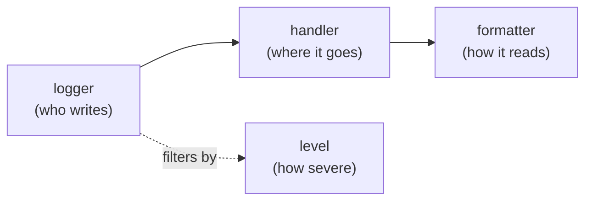

# Logging and error reporting

!!! quote "Think like a child 🧒"
    Imagine you have a little notebook where you jot down what happens in your
    day: "woke up", "drank milk", "fell at the playground". When something goes
    wrong, mom reads the notebook to figure out what happened. **Logging** is your
    program's little notebook: it writes down everything that happens so you can
    understand it later — and, if the fall is bad, it even **rushes a note** to a
    grown-up.

## Use case

Your create-post view sometimes fails and you don't know why. Instead of
scattering `print()` around your code (which vanishes when it runs on the
server), you use Python's **logging**: write one line in the notebook when
something interesting happens.

```python
import logging

from django.http import HttpRequest, HttpResponse
from django.shortcuts import redirect

from blog.models import Post

logger = logging.getLogger(__name__)


def create_post(request: HttpRequest) -> HttpResponse:
    """Create a post and log the outcome."""
    title = request.POST.get("title", "")
    if not title:
        logger.warning("Attempt to create post without title by %s", request.user)
        return redirect("blog:post_list")

    post = Post.objects.create(title=title, author=request.user)
    logger.info("Post %s created by %s", post.pk, request.user)
    return redirect("blog:post_detail", pk=post.pk)
```

`logging.getLogger(__name__)` gives you a **logger** named after the module
(e.g. `"blog.views"`). You never configure `print` or files here — you just ask
for the logger and write. **Where** the line ends up (console, file, email) is
decided by the `LOGGING` configuration in `settings.py`.

!!! tip "Use `%s`, not an f-string, in the message"
    Write `logger.info("Post %s created", post.pk)` and pass the arguments
    afterwards. That way Python only formats the string **if** that level is
    enabled — cheaper, and the community standard.

## Possibilities

### The 4 pieces of logging

Think like a child: a notebook line runs through a conveyor belt with four
stations before it becomes text on the screen.



| Piece | What it is | Example |
| --- | --- | --- |
| **Logger** | The object you call to write | `logging.getLogger("blog")` |
| **Handler** | Where the message goes | console, file, email |
| **Formatter** | How the line reads | `"{levelname} {asctime} {message}"` |
| **Filter** | Extra "let it through or not" rule | only when `DEBUG=False` |

### The levels (least to most severe)

Every message has a **level**. The logger and the handler have a minimum level:
only messages equal to or more severe than it get through.

| Level | When to use |
| --- | --- |
| `DEBUG` | Fine-grained detail, development only |
| `INFO` | Something normal happened ("post created") |
| `WARNING` | Odd, but it kept working |
| `ERROR` | An operation failed |
| `CRITICAL` | The program may be crashing |

```python
logger.debug("computed value: %s", x)
logger.info("user %s logged in", user)
logger.warning("cache unavailable, using fallback")
logger.error("failed to send email", exc_info=True)
logger.critical("database unreachable")
```

!!! tip "`exc_info=True` inside an `except`"
    Pass `exc_info=True` (or use `logger.exception("...")`, which already assumes
    it) inside an `except` block to record the **full traceback** alongside the
    message. `logger.exception` should only be called from within an `except`.

### Configuring `LOGGING` in `settings.py`

Django uses Python's `dictConfig`. You declare formatters, handlers and loggers
in a dictionary. **Always** keep `"disable_existing_loggers": False` so you
don't silence Django's internal loggers.

```python
from pathlib import Path

BASE_DIR = Path(__file__).resolve().parent.parent

LOGGING = {
    "version": 1,
    "disable_existing_loggers": False,
    "formatters": {
        "verbose": {
            "format": "{levelname} {asctime} {name} {message}",
            "style": "{",
        },
        "simple": {
            "format": "{levelname} {message}",
            "style": "{",
        },
    },
    "handlers": {
        "console": {
            "class": "logging.StreamHandler",
            "formatter": "simple",
        },
        "file": {
            "class": "logging.FileHandler",
            "filename": BASE_DIR / "logs" / "app.log",
            "formatter": "verbose",
        },
    },
    "root": {
        "handlers": ["console"],
        "level": "WARNING",
    },
    "loggers": {
        "django": {
            "handlers": ["console"],
            "level": "INFO",
            "propagate": False,
        },
        "blog": {
            "handlers": ["console", "file"],
            "level": "DEBUG",
            "propagate": False,
        },
    },
}
```

!!! warning "The formatter `style`"
    Python's default is `style="%"` (uses `%(levelname)s`). Django, by
    convention, uses `style="{"` with `{levelname}` placeholders. Pick one and be
    consistent — mixing them breaks formatting silently.

!!! note "`propagate=False` avoids duplicate lines"
    Without it, a message from the `"blog"` logger also bubbles up to `root` and
    gets written **twice**. `propagate=False` stops that bubbling.

### The `django` logger and its children

Django already emits logs on well-defined logger names. You don't need to create
them, just **configure** them.

| Logger | What it records |
| --- | --- |
| `django` | Parent logger of all the ones below |
| `django.request` | 5xx responses (ERROR) and 4xx (WARNING) |
| `django.server` | `runserver` requests (dev only) |
| `django.db.backends` | **Every SQL statement run** (DEBUG level) |
| `django.security.*` | Security errors (invalid host, CSRF...) |

```python
LOGGING = {
    "version": 1,
    "disable_existing_loggers": False,
    "handlers": {
        "console": {"class": "logging.StreamHandler"},
    },
    "loggers": {
        "django.db.backends": {
            "handlers": ["console"],
            "level": "DEBUG",
            "propagate": False,
        },
    },
}
```

!!! danger "`django.db.backends` in production, NO"
    Turning SQL on at `DEBUG` level shows every query in the console — great for
    learning, terrible in production (slow and it leaks data). Keep `DEBUG` in
    development only.

### `AdminEmailHandler`: errors become email

In production you want to know the moment an `ERROR` happens. The
`AdminEmailHandler` sends an email to everyone listed in `ADMINS`.

```python
ADMINS = [("You", "you@example.com")]
SERVER_EMAIL = "errors@example.com"

LOGGING = {
    "version": 1,
    "disable_existing_loggers": False,
    "filters": {
        "require_debug_false": {
            "()": "django.utils.log.RequireDebugFalse",
        },
    },
    "handlers": {
        "mail_admins": {
            "class": "django.utils.log.AdminEmailHandler",
            "level": "ERROR",
            "filters": ["require_debug_false"],
        },
    },
    "loggers": {
        "django.request": {
            "handlers": ["mail_admins"],
            "level": "ERROR",
            "propagate": False,
        },
    },
}
```

- The `RequireDebugFalse` filter ensures the email **only** goes out when
  `DEBUG=False` — you don't want to flood your inbox during development.
- By default the email arrives with the error report (traceback + request). If
  `EMAIL_SUBJECT_PREFIX` is set, it prefixes the subject.

!!! info "This is Django's default configuration"
    A fresh project already ships, under the hood, with `mail_admins` wired to
    `django.request`. Filling in `ADMINS` is enough to start receiving the emails.

### Error reporting: `ADMINS` and `MANAGERS`

Two contact lists in `settings.py`, for two kinds of problem:

| Setting | Receives | Controlled by |
| --- | --- | --- |
| `ADMINS` | 500 exceptions (server errors) | `AdminEmailHandler` |
| `MANAGERS` | 404 errors (broken links) | `BrokenLinkEmailsMiddleware` |

```python
ADMINS = [("On-call dev", "dev@example.com")]
MANAGERS = ADMINS

MIDDLEWARE = [
    "django.middleware.common.BrokenLinkEmailsMiddleware",
]
IGNORABLE_404_URLS = []
```

`BrokenLinkEmailsMiddleware` only emails a 404 when there's a `Referer` (i.e.
someone clicked a broken link), avoiding bot noise.

### Hiding sensitive data in reports

When a 500 error pops, Django builds a report with the **local variables** and
the request **POST**. Passwords, tokens and cards must not show up there. Use the
sanitizing decorators.

```python
from django.http import HttpRequest, HttpResponse
from django.views.decorators.debug import (
    sensitive_post_parameters,
    sensitive_variables,
)


@sensitive_variables("password", "token")
def authenticate(username: str, password: str, token: str) -> bool:
    """Authenticate a user, hiding secret locals in error reports."""
    secret = f"{password}:{token}"
    return check(username, secret)


@sensitive_post_parameters("password", "credit_card")
def payment_view(request: HttpRequest) -> HttpResponse:
    """Handle a payment, hiding secret POST fields in error reports."""
    charge(request.POST["credit_card"])
    return HttpResponse("ok")
```

- `@sensitive_variables(...)` hides the function's **local variables** in the report.
- `@sensitive_post_parameters(...)` hides **fields from `request.POST`**.
- With no arguments, both hide **everything** in that scope.

!!! danger "Decorator order matters"
    `@sensitive_post_parameters` must sit **above** any decorator that consumes
    the request (like the auth ones). And the fields only disappear from the error
    report — code that logs the POST manually still has to filter on its own.

### Custom exception reporter

You can change how the error report is built — for example, to strip extra
headers — by subclassing `SafeExceptionReporterFilter` or `ExceptionReporter`.

```python
from django.views.debug import SafeExceptionReporterFilter


class CustomReporterFilter(SafeExceptionReporterFilter):
    """Also scrub the ``Authorization`` header from error reports."""

    def get_safe_request_meta(self, request: object) -> dict[str, object]:
        """Return request META with the auth header removed."""
        meta = super().get_safe_request_meta(request)
        meta.pop("HTTP_AUTHORIZATION", None)
        return meta
```

```python
DEFAULT_EXCEPTION_REPORTER_FILTER = "blog.reporting.CustomReporterFilter"
```

- `DEFAULT_EXCEPTION_REPORTER_FILTER` swaps the **filter** (what gets hidden).
- `DEFAULT_EXCEPTION_REPORTER` swaps the **whole report** (the HTML/text).

### Next step: structlog and Sentry

The built-in logging covers the basics, but in production you'll want more:

- **[structlog](https://www.structlog.org/)** — **structured** logs (each line
  becomes JSON with fields), easy to search and filter in observability tools. It
  integrates with Python's `logging`, so your `LOGGING` still applies.
- **[Sentry](https://sentry.io/)** — captures exceptions automatically, groups
  identical errors, shows the traceback with context and alerts you. Installs in
  one line (`sentry_sdk.init(...)`) and effectively replaces `AdminEmailHandler`.

!!! tip "Structured logs early"
    If you already know you'll scale, start with `structlog` and a JSON formatter.
    Plugging in Sentry, Grafana Loki or Datadog on top is much cheaper afterwards.

That, plus metrics, tracing and healthchecks, is covered in
**[observability](observability.md)**.

!!! quote "📖 In the official docs"
    - [Logging](https://docs.djangoproject.com/en/6.0/topics/logging/)
    - [Error reporting](https://docs.djangoproject.com/en/6.0/howto/error-reporting/)

## Recap

- You **ask** for a logger (`logging.getLogger(__name__)`) and **write**;
  `settings.LOGGING` decides where the line goes.
- Four pieces: **logger** (writes) → **handler** (destination) → **formatter**
  (format), filtering by **level** (`DEBUG`→`CRITICAL`).
- Configure with `dictConfig` and `disable_existing_loggers: False`; use
  `propagate=False` to avoid duplicate lines.
- Django already logs on `django.request`, `django.db.backends` etc. — don't turn
  SQL on in production.
- `AdminEmailHandler` + `ADMINS` email 500 errors;
  `BrokenLinkEmailsMiddleware` + `MANAGERS` warn about 404s.
- Protect secrets with `@sensitive_variables` and `@sensitive_post_parameters`;
  decorator order matters.
- Need more? **structlog** (structured logs) and **Sentry** (error capture) are
  the next step — see [observability](observability.md).
