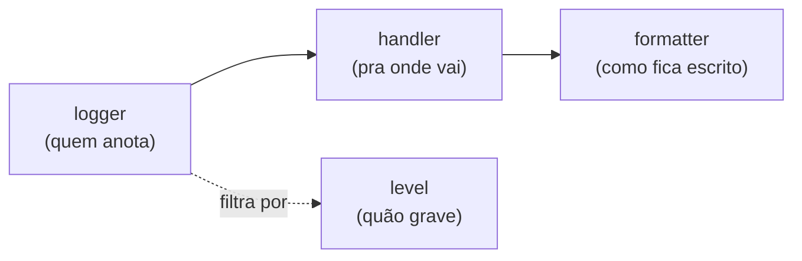

# Logging e report de erros

!!! quote "Pensa como criança 🧒"
    Imagina que você tem um caderninho onde anota o que acontece no seu dia:
    "acordei", "tomei leite", "caí no parquinho". Quando algo dá errado, a mamãe
    lê o caderninho pra descobrir o que houve. **Logging** é o caderninho do seu
    programa: ele anota tudo o que acontece pra que você entenda depois — e, se a
    queda for feia, ele ainda **manda um recadinho** correndo pra um adulto.

## Caso de uso

Sua view de criação de post às vezes falha e você não sabe por quê. Em vez de
espalhar `print()` pelo código (que some quando roda no servidor), você usa o
**logging** do Python: escreve uma linha no caderninho quando algo interessante
acontece.

```python
import logging

from django.http import HttpRequest, HttpResponse
from django.shortcuts import redirect

from blog.models import Post

logger = logging.getLogger(__name__)


def create_post(request: HttpRequest) -> HttpResponse:
    """Create a post and log the outcome."""
    title = request.POST.get("title", "")
    if not title:
        logger.warning("Tentativa de criar post sem título por %s", request.user)
        return redirect("blog:post_list")

    post = Post.objects.create(title=title, author=request.user)
    logger.info("Post %s criado por %s", post.pk, request.user)
    return redirect("blog:post_detail", pk=post.pk)
```

`logging.getLogger(__name__)` te dá um **logger** com o nome do módulo (ex.:
`"blog.views"`). Você nunca configura `print` nem arquivos aqui — só pede o
logger e escreve. **Quem** decide onde a linha vai parar (console, arquivo,
e-mail) é a configuração `LOGGING` no `settings.py`.

!!! tip "Use `%s`, não f-string, na mensagem"
    Escreva `logger.info("Post %s criado", post.pk)` e passe os argumentos
    depois. Assim o Python só formata a string **se** aquele nível estiver
    ligado — mais barato e o padrão da comunidade.

## Possibilidades

### As 4 peças do logging

Pensa como criança: uma linha do caderninho passa por uma esteira com quatro
estações antes de virar texto na tela.



| Peça | O que é | Exemplo |
| --- | --- | --- |
| **Logger** | O objeto que você chama pra anotar | `logging.getLogger("blog")` |
| **Handler** | Pra onde a mensagem vai | console, arquivo, e-mail |
| **Formatter** | Como a linha fica escrita | `"{levelname} {asctime} {message}"` |
| **Filter** | Regra extra de "deixa passar ou não" | só quando `DEBUG=False` |

### Os níveis (do menos ao mais grave)

Cada mensagem tem um **nível**. O logger e o handler têm um nível mínimo: só
passa quem é igual ou mais grave.

| Nível | Quando usar |
| --- | --- |
| `DEBUG` | Detalhe fino, só em desenvolvimento |
| `INFO` | Algo normal aconteceu ("post criado") |
| `WARNING` | Estranho, mas seguiu funcionando |
| `ERROR` | Uma operação falhou |
| `CRITICAL` | O programa pode estar caindo |

```python
logger.debug("valor calculado: %s", x)
logger.info("usuário %s logou", user)
logger.warning("cache indisponível, usando fallback")
logger.error("falha ao enviar e-mail", exc_info=True)
logger.critical("banco de dados inacessível")
```

!!! tip "`exc_info=True` dentro de um `except`"
    Passe `exc_info=True` (ou use `logger.exception("...")`, que já assume isso)
    dentro de um bloco `except` pra gravar o **traceback completo** junto da
    mensagem. `logger.exception` só deve ser chamado de dentro de um `except`.

### Configurando o `LOGGING` no `settings.py`

O Django usa o `dictConfig` do Python. Você declara formatters, handlers e
loggers num dicionário. Deixe **sempre** `"disable_existing_loggers": False`
para não silenciar os loggers internos do Django.

```python
from pathlib import Path

BASE_DIR = Path(__file__).resolve().parent.parent

LOGGING = {
    "version": 1,
    "disable_existing_loggers": False,
    "formatters": {
        "verbose": {
            "format": "{levelname} {asctime} {name} {message}",
            "style": "{",
        },
        "simple": {
            "format": "{levelname} {message}",
            "style": "{",
        },
    },
    "handlers": {
        "console": {
            "class": "logging.StreamHandler",
            "formatter": "simple",
        },
        "file": {
            "class": "logging.FileHandler",
            "filename": BASE_DIR / "logs" / "app.log",
            "formatter": "verbose",
        },
    },
    "root": {
        "handlers": ["console"],
        "level": "WARNING",
    },
    "loggers": {
        "django": {
            "handlers": ["console"],
            "level": "INFO",
            "propagate": False,
        },
        "blog": {
            "handlers": ["console", "file"],
            "level": "DEBUG",
            "propagate": False,
        },
    },
}
```

!!! warning "`style` do formatter"
    O padrão do Python é `style="%"` (usa `%(levelname)s`). O Django, por
    convenção, usa `style="{"` com placeholders `{levelname}`. Escolha um e seja
    consistente — misturar quebra a formatação silenciosamente.

!!! note "`propagate=False` evita linha duplicada"
    Sem isso, uma mensagem do logger `"blog"` também sobe para o `root` e é
    escrita **duas vezes**. `propagate=False` corta essa subida.

### O logger `django` e seus filhos

O Django já emite logs em loggers com nomes bem definidos. Você não precisa
criá-los, só **configurá-los**.

| Logger | O que registra |
| --- | --- |
| `django` | Logger-pai de todos os abaixo |
| `django.request` | Respostas 5xx (ERROR) e 4xx (WARNING) |
| `django.server` | Requisições do `runserver` (só dev) |
| `django.db.backends` | **Todo SQL executado** (nível DEBUG) |
| `django.security.*` | Erros de segurança (host inválido, CSRF...) |

```python
LOGGING = {
    "version": 1,
    "disable_existing_loggers": False,
    "handlers": {
        "console": {"class": "logging.StreamHandler"},
    },
    "loggers": {
        "django.db.backends": {
            "handlers": ["console"],
            "level": "DEBUG",
            "propagate": False,
        },
    },
}
```

!!! danger "`django.db.backends` em produção NÃO"
    Ligar o SQL em nível `DEBUG` mostra toda query no console — ótimo pra
    aprender, péssimo em produção (lento e vaza dados). Deixe `DEBUG` só em
    desenvolvimento.

### `AdminEmailHandler`: erro vira e-mail

Em produção você quer saber na hora quando um `ERROR` acontece. O
`AdminEmailHandler` manda um e-mail pra todo mundo listado em `ADMINS`.

```python
ADMINS = [("Você", "voce@exemplo.com")]
SERVER_EMAIL = "erros@exemplo.com"

LOGGING = {
    "version": 1,
    "disable_existing_loggers": False,
    "filters": {
        "require_debug_false": {
            "()": "django.utils.log.RequireDebugFalse",
        },
    },
    "handlers": {
        "mail_admins": {
            "class": "django.utils.log.AdminEmailHandler",
            "level": "ERROR",
            "filters": ["require_debug_false"],
        },
    },
    "loggers": {
        "django.request": {
            "handlers": ["mail_admins"],
            "level": "ERROR",
            "propagate": False,
        },
    },
}
```

- O filtro `RequireDebugFalse` garante que o e-mail **só** sai quando
  `DEBUG=False` — você não quer inundar sua caixa em desenvolvimento.
- Por padrão o e-mail vem com o relatório de erro (traceback + request). Se
  `EMAIL_SUBJECT_PREFIX` estiver setado, ele prefixa o assunto.

!!! info "Essa é a configuração padrão do Django"
    Um projeto novo já vem, por baixo dos panos, com o `mail_admins` ligado no
    `django.request`. Preencher `ADMINS` é o suficiente pra receber os e-mails.

### Report de erros: `ADMINS` e `MANAGERS`

Duas listas de contato no `settings.py`, para dois tipos de problema:

| Setting | Recebe | Controlado por |
| --- | --- | --- |
| `ADMINS` | Exceções 500 (erros do servidor) | `AdminEmailHandler` |
| `MANAGERS` | Erros 404 (links quebrados) | `BrokenLinkEmailsMiddleware` |

```python
ADMINS = [("Dev de plantão", "dev@exemplo.com")]
MANAGERS = ADMINS

MIDDLEWARE = [
    "django.middleware.common.BrokenLinkEmailsMiddleware",
]
IGNORABLE_404_URLS = []
```

O `BrokenLinkEmailsMiddleware` só manda e-mail de 404 quando existe um
`Referer` (ou seja, alguém clicou num link quebrado), evitando ruído de bots.

### Escondendo dados sensíveis nos relatórios

Quando um erro 500 estala, o Django monta um relatório com as **variáveis
locais** e o **POST** da requisição. Senha, token e cartão não podem aparecer
aí. Use os decorators de sanitização.

```python
from django.http import HttpRequest, HttpResponse
from django.views.decorators.debug import (
    sensitive_post_parameters,
    sensitive_variables,
)


@sensitive_variables("password", "token")
def authenticate(username: str, password: str, token: str) -> bool:
    """Authenticate a user, hiding secret locals in error reports."""
    secret = f"{password}:{token}"
    return check(username, secret)


@sensitive_post_parameters("password", "credit_card")
def payment_view(request: HttpRequest) -> HttpResponse:
    """Handle a payment, hiding secret POST fields in error reports."""
    charge(request.POST["credit_card"])
    return HttpResponse("ok")
```

- `@sensitive_variables(...)` esconde **variáveis locais** da função no relatório.
- `@sensitive_post_parameters(...)` esconde **campos do `request.POST`**.
- Sem argumentos, ambos escondem **tudo** daquele escopo.

!!! danger "Ordem dos decorators importa"
    `@sensitive_post_parameters` precisa ficar **por cima** de qualquer decorator
    que consuma o request (como os de auth). E os campos só somem do relatório de
    erro — quem loga o POST manualmente ainda precisa filtrar por conta própria.

### Custom exception reporter

Você pode trocar como o relatório de erro é montado — por exemplo, para remover
cabeçalhos extras — herdando de `SafeExceptionReporterFilter` ou
`ExceptionReporter`.

```python
from django.views.debug import SafeExceptionReporterFilter


class CustomReporterFilter(SafeExceptionReporterFilter):
    """Also scrub the ``Authorization`` header from error reports."""

    def get_safe_request_meta(self, request: object) -> dict[str, object]:
        """Return request META with the auth header removed."""
        meta = super().get_safe_request_meta(request)
        meta.pop("HTTP_AUTHORIZATION", None)
        return meta
```

```python
DEFAULT_EXCEPTION_REPORTER_FILTER = "blog.reporting.CustomReporterFilter"
```

- `DEFAULT_EXCEPTION_REPORTER_FILTER` troca o **filtro** (o que é escondido).
- `DEFAULT_EXCEPTION_REPORTER` troca o **relatório inteiro** (o HTML/texto).

### Próximo passo: structlog e Sentry

O logging embutido resolve o básico, mas em produção você vai querer mais:

- **[structlog](https://www.structlog.org/)** — logs **estruturados** (cada
  linha vira JSON com campos), fáceis de buscar e filtrar em ferramentas de
  observabilidade. Integra com o `logging` do Python, então seu `LOGGING`
  continua valendo.
- **[Sentry](https://sentry.io/)** — captura exceções automaticamente, agrupa
  erros iguais, mostra o traceback com contexto e te avisa. Instala em uma
  linha (`sentry_sdk.init(...)`) e substitui o `AdminEmailHandler` na prática.

!!! tip "Log estruturado desde cedo"
    Se você já sabe que vai escalar, comece com `structlog` e um formatter JSON.
    Depois é muito mais barato plugar Sentry, Grafana Loki ou Datadog por cima.

Isso e mais métricas, tracing e healthchecks entram em
**[observabilidade](observability.md)**.

!!! quote "📖 Na documentação oficial"
    - [Logging](https://docs.djangoproject.com/en/6.0/topics/logging/)
    - [Error reporting](https://docs.djangoproject.com/en/6.0/howto/error-reporting/)

## Recap

- Você **pede** um logger (`logging.getLogger(__name__)`) e **escreve**; o
  `settings.LOGGING` decide pra onde a linha vai.
- Quatro peças: **logger** (anota) → **handler** (destino) → **formatter**
  (formato), filtrando por **level** (`DEBUG`→`CRITICAL`).
- Configure com `dictConfig` e `disable_existing_loggers: False`; use
  `propagate=False` pra não duplicar linhas.
- O Django já loga em `django.request`, `django.db.backends` etc. — não ligue o
  SQL em produção.
- `AdminEmailHandler` + `ADMINS` mandam erros 500 por e-mail;
  `BrokenLinkEmailsMiddleware` + `MANAGERS` avisam de 404.
- Proteja segredos com `@sensitive_variables` e `@sensitive_post_parameters`; a
  ordem dos decorators importa.
- Precisa de mais? **structlog** (logs estruturados) e **Sentry** (captura de
  erros) são o próximo passo — veja [observabilidade](observability.md).
