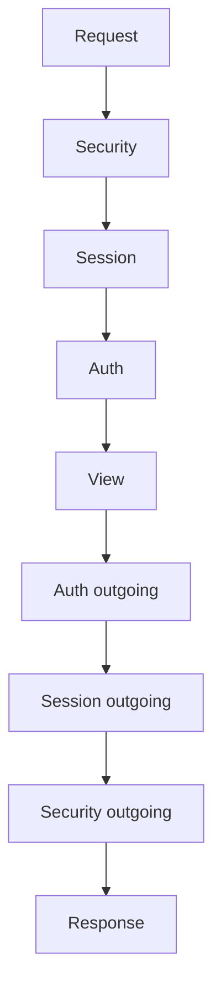

# Reference: middleware

!!! quote "Think like a child 🧒"
    Picture your letter (the request) traveling all the way to grandma (the view).
    Before it gets there, it passes through several people in a line: one checks
    the stamp, another postmarks it, another notes the date. On the way back (the
    response), it passes through the same people, in reverse order. Each of those
    people is a **middleware** — a layer that wraps *every* request, on the way in
    and on the way out.

## Use case

You want to measure how long each request takes and put that in a response
header — without touching a single view. A middleware does exactly this: it acts
before and after **every** view:

```python
# apps/core/middleware.py
import time
from collections.abc import Callable

from django.http import HttpRequest, HttpResponse


class TimingMiddleware:
    """Add an X-Response-Time header to every response."""

    def __init__(self, get_response: Callable[[HttpRequest], HttpResponse]) -> None:
        """Store the next callable in the chain (runs once at startup)."""
        self.get_response = get_response

    def __call__(self, request: HttpRequest) -> HttpResponse:
        """Run on every request: time the view and tag the response."""
        start = time.perf_counter()
        response = self.get_response(request)          # (1)!
        elapsed = time.perf_counter() - start
        response["X-Response-Time"] = f"{elapsed:.3f}s"
        return response
```

1. `self.get_response(request)` calls the **next** layer (or the view). Everything
    before this line runs on the way **in**; everything after, on the way **out**.

Register it in `settings.py`:

```python
MIDDLEWARE = [
    # ...
    "apps.core.middleware.TimingMiddleware",
]
```

## Possibilities

### The shape of a middleware

Think like a child: it's a person in the line with two lines to say — one when
the letter **reaches** them, another when it **comes back**.

```python
class MyMiddleware:
    def __init__(self, get_response):
        self.get_response = get_response
        # runs ONCE, when the server starts up

    def __call__(self, request):
        # === incoming: before the view ===
        response = self.get_response(request)
        # === outgoing: after the view ===
        return response
```

### Optional hooks

Beyond `__call__`, a middleware can define methods that Django calls at specific
moments:

| Method | When it runs |
| --- | --- |
| `process_view(request, view_func, args, kwargs)` | Right before calling the chosen view |
| `process_exception(request, exception)` | If the view raises an exception |
| `process_template_response(request, response)` | If the response has a pending `.render()` |

```python
class AuditMiddleware:
    def __init__(self, get_response):
        self.get_response = get_response

    def __call__(self, request):
        return self.get_response(request)

    def process_exception(self, request, exception) -> None:
        """Log any unhandled exception, then let Django handle it."""
        import logging
        logging.getLogger("audit").error("Error in %s: %s", request.path, exception)
        return None       # (1)!
```

1. Returning `None` says "I didn't handle it, carry on with the normal error
    flow". Returning an `HttpResponse` **interrupts** and uses your response.

### The order is an onion 🧅



- **Incoming**: top to bottom in the `MIDDLEWARE` list.
- **Outgoing**: bottom to top (reverse order).

!!! danger "Wrong order = silent bug"
    `AuthenticationMiddleware` needs to come **after** `SessionMiddleware`
    (it reads the session to find the user). The default list from `startproject`
    is already correct — only reorder it with a clear reason.

### The most important built-in middlewares

| Middleware | What it does |
| --- | --- |
| `SecurityMiddleware` | Security headers, HTTPS redirect |
| `SessionMiddleware` | Loads/saves the session |
| `CommonMiddleware` | Normalizes URLs, `APPEND_SLASH` |
| `CsrfViewMiddleware` | Protects POSTs with a CSRF token |
| `AuthenticationMiddleware` | Sets `request.user` |
| `MessageMiddleware` | Enables the messages framework |
| `XFrameOptionsMiddleware` | Anti-clickjacking |

!!! tip "A middleware can short-circuit the line"
    If a middleware returns an `HttpResponse` **without** calling
    `self.get_response(request)`, the line stops right there and the view never
    runs. That's how a maintenance gate ("site under construction") works.

!!! quote "📖 In the official docs"
    - [Middleware](https://docs.djangoproject.com/en/stable/topics/http/middleware/)

## Recap

- Middleware is an onion layer around **every** request:
  code before `get_response` runs on the way in, code after runs on the way out.
- A class with `__init__(get_response)` + `__call__(request)`; extra hooks:
  `process_view`, `process_exception`, `process_template_response`.
- Incoming follows the list order; outgoing, the reverse. **Order matters.**
- Short-circuit by returning an `HttpResponse` without calling the next layer.

Middleware acts on every request. **[Signals](signals.md)**, on the other hand,
fire on model events.
