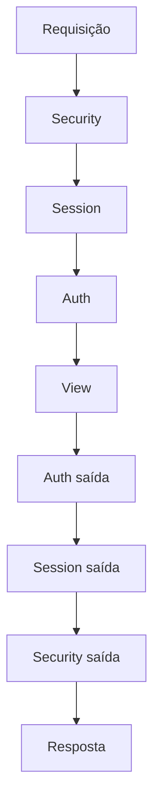

# Referência: middleware

!!! quote "Pensa como criança 🧒"
    Imagine sua carta (a requisição) indo até a vovó (a view). Antes de chegar,
    ela passa por várias pessoas na fila: uma confere o selo, outra carimba,
    outra anota a data. Na volta (a resposta), passa pelas mesmas pessoas, na
    ordem inversa. Cada pessoa dessas é um **middleware** — uma camada que
    envolve *toda* requisição, entrando e saindo.

## Caso de uso

Você quer medir quanto tempo cada requisição demora e colocar isso num cabeçalho
da resposta — sem tocar em nenhuma view. Um middleware faz exatamente isso: age
antes e depois de **todas** as views:

```python
# apps/core/middleware.py
import time
from collections.abc import Callable

from django.http import HttpRequest, HttpResponse


class TimingMiddleware:
    """Add an X-Response-Time header to every response."""

    def __init__(self, get_response: Callable[[HttpRequest], HttpResponse]) -> None:
        """Store the next callable in the chain (runs once at startup)."""
        self.get_response = get_response

    def __call__(self, request: HttpRequest) -> HttpResponse:
        """Run on every request: time the view and tag the response."""
        start = time.perf_counter()
        response = self.get_response(request)          # (1)!
        elapsed = time.perf_counter() - start
        response["X-Response-Time"] = f"{elapsed:.3f}s"
        return response
```

1. `self.get_response(request)` chama a **próxima** camada (ou a view). Tudo
    antes dessa linha roda na **entrada**; tudo depois, na **saída**.

Registre em `settings.py`:

```python
MIDDLEWARE = [
    # ...
    "apps.core.middleware.TimingMiddleware",
]
```

## Possibilidades

### O formato de um middleware

Pensa como criança: é uma pessoa da fila com duas falas — uma quando a carta
**chega** nela, outra quando **volta**.

```python
class MyMiddleware:
    def __init__(self, get_response):
        self.get_response = get_response
        # roda UMA vez, quando o servidor sobe

    def __call__(self, request):
        # === entrada: antes da view ===
        response = self.get_response(request)
        # === saída: depois da view ===
        return response
```

### Ganchos opcionais

Além do `__call__`, um middleware pode definir métodos que o Django chama em
momentos específicos:

| Método | Quando roda |
| --- | --- |
| `process_view(request, view_func, args, kwargs)` | Logo antes de chamar a view escolhida |
| `process_exception(request, exception)` | Se a view levantar uma exceção |
| `process_template_response(request, response)` | Se a resposta tiver `.render()` pendente |

```python
class AuditMiddleware:
    def __init__(self, get_response):
        self.get_response = get_response

    def __call__(self, request):
        return self.get_response(request)

    def process_exception(self, request, exception) -> None:
        """Log any unhandled exception, then let Django handle it."""
        import logging
        logging.getLogger("audit").error("Erro em %s: %s", request.path, exception)
        return None       # (1)!
```

1. Retornar `None` diz "não tratei, siga o fluxo normal de erro". Retornar um
    `HttpResponse` **interrompe** e usa a sua resposta.

### A ordem é uma cebola 🧅



- **Entrada**: de cima para baixo na lista `MIDDLEWARE`.
- **Saída**: de baixo para cima (ordem inversa).

!!! danger "Ordem errada = bug silencioso"
    `AuthenticationMiddleware` precisa vir **depois** de `SessionMiddleware`
    (lê a sessão para achar o usuário). A lista padrão do `startproject` já está
    certa — só reordene com um motivo claro.

### Middlewares embutidos mais importantes

| Middleware | O que faz |
| --- | --- |
| `SecurityMiddleware` | Cabeçalhos de segurança, redirect HTTPS |
| `SessionMiddleware` | Carrega/salva a sessão |
| `CommonMiddleware` | Normaliza URLs, `APPEND_SLASH` |
| `CsrfViewMiddleware` | Protege POSTs com token CSRF |
| `AuthenticationMiddleware` | Coloca `request.user` |
| `MessageMiddleware` | Habilita o framework de mensagens |
| `XFrameOptionsMiddleware` | Anti-clickjacking |

!!! tip "Middleware curto-circuita a fila"
    Se um middleware retornar um `HttpResponse` **sem** chamar
    `self.get_response(request)`, a fila para ali e a view nem roda. É assim que
    um gate de manutenção ("site em obras") funciona.

## Recap

- Middleware é uma camada-cebola em volta de **todas** as requisições:
  código antes de `get_response` roda na entrada, depois roda na saída.
- Classe com `__init__(get_response)` + `__call__(request)`; ganchos extras:
  `process_view`, `process_exception`, `process_template_response`.
- Entrada segue a ordem da lista; saída, a inversa. **Ordem importa.**
- Curto-circuite retornando um `HttpResponse` sem chamar a próxima camada.

Middleware age em toda requisição. Já os **[signals](signals.md)** disparam em
eventos do modelo.
