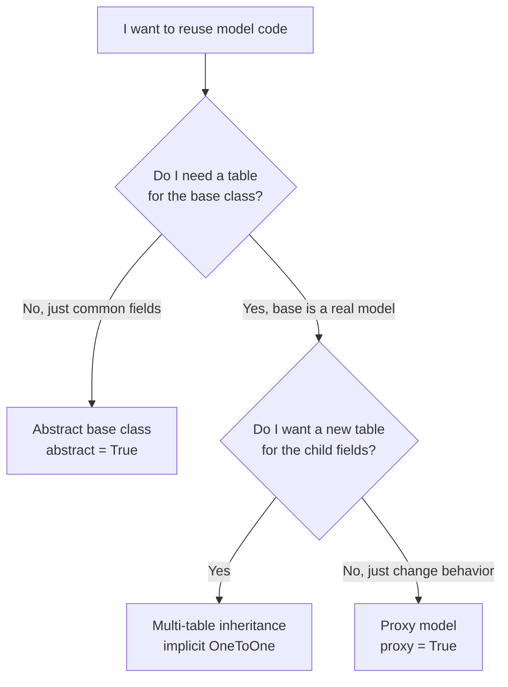

# Model inheritance and managers

!!! quote "Think like a child 🧒"
    Imagine you have a stamp that writes "created at" and "updated at". Instead
    of drawing those two lines by hand on every sheet, you keep the **stamp**
    and just press it onto each new sheet. **Model inheritance** is that stamp:
    you write the common fields once and "stamp" them onto many models. And the
    **manager** is the doorkeeper of the box of sheets: it decides which sheets
    you see when you ask for `Post.objects.all()`.

## Use case

Almost every model needs `created_at` and `updated_at`. Writing that in `Post`,
`Author`, `Comment`... is pure repetition. Create an **abstract base class** and
reuse it:

```python
from django.db import models


class TimeStampedModel(models.Model):
    """Reusable base that stamps creation and update times.

    Any concrete model inheriting from this gains ``created_at`` and
    ``updated_at`` columns without redeclaring them.
    """

    created_at = models.DateTimeField(auto_now_add=True)
    updated_at = models.DateTimeField(auto_now=True)

    class Meta:
        abstract = True


class Post(TimeStampedModel):
    """A blog post with reusable timestamps."""

    title = models.CharField(max_length=200)
    body = models.TextField()

    def __str__(self) -> str:
        """Return the post title."""
        return self.title
```

`Post` has four columns in its table: `title`, `body`, `created_at`,
`updated_at`. The `TimeStampedModel` table **does not exist** — it is just a
mold.

## Possibilities

Django offers **three** styles of inheritance, and each solves a different
problem. First, the mental map:



| Style | Creates a new table? | When to use |
| --- | --- | --- |
| **Abstract** (`abstract = True`) | Only the child's | Reuse fields/methods, no table for the base |
| **Multi-table** (MTI) | One per class | The base is a real model and the child extends it with its own fields |
| **Proxy** (`proxy = True`) | No (same table) | Change behavior, ordering or manager without touching the schema |

### 1. Abstract base class — the stamp

This is the most common and the safest case. `abstract = True` tells Django:
"don't create a table for me, just copy my fields into whoever inherits me".

```python
from django.db import models


class TimeStampedModel(models.Model):
    """Reusable timestamp fields for any concrete model."""

    created_at = models.DateTimeField(auto_now_add=True)
    updated_at = models.DateTimeField(auto_now=True)

    class Meta:
        abstract = True
        ordering = ["-created_at"]


class Author(TimeStampedModel):
    """A blog author."""

    name = models.CharField(max_length=120)


class Comment(TimeStampedModel):
    """A comment on a post."""

    body = models.TextField()
```

!!! tip "`Meta` is inherited too — but be careful"
    If the child does **not** declare its own `Meta`, it inherits the base's
    `Meta` (with `ordering`, etc.). If the child declares a `Meta`, it
    **replaces** the base's. To inherit and only tweak it, make the child's
    `Meta` extend the base's:

    ```python
    class Comment(TimeStampedModel):
        """A comment that keeps the base Meta but adds indexes."""

        body = models.TextField()

        class Meta(TimeStampedModel.Meta):
            indexes = [models.Index(fields=["created_at"])]
    ```

    Django **automatically removes** `abstract = True` on the child, so
    `Comment` becomes a normal concrete model.

!!! warning "A fixed `related_name` breaks on an abstract base"
    If the abstract base has a `ForeignKey` with a fixed `related_name="posts"`,
    and two children inherit it, both try to register `posts` on the related
    model — collision. Use the `%(class)s` and `%(app_label)s` placeholders:

    ```python
    class BaseContent(models.Model):
        """Abstract base whose FK back-references stay unique per subclass."""

        author = models.ForeignKey(
            "blog.Author",
            on_delete=models.CASCADE,
            related_name="%(class)s_set",
            related_query_name="%(class)ss",
        )

        class Meta:
            abstract = True
    ```

### 2. Multi-table inheritance (MTI) — the base is real

Here the base **is a concrete model** with its own table. The child gets a
separate table and an implicit `OneToOneField` (the "parent link") pointing to
the base. Querying the child triggers an automatic `JOIN`.

```python
from django.db import models


class Place(models.Model):
    """A physical place with a name and address."""

    name = models.CharField(max_length=120)
    address = models.CharField(max_length=200)

    def __str__(self) -> str:
        """Return the place name."""
        return self.name


class Restaurant(Place):
    """A place that also serves food.

    Backed by its own table joined to ``Place`` through an implicit
    one-to-one parent link.
    """

    serves_pizza = models.BooleanField(default=False)
```

How it works in practice:

```python
r = Restaurant.objects.create(
    name="Bella Napoli",
    address="Rua das Flores, 10",
    serves_pizza=True,
)

# the Restaurant also shows up as a Place
Place.objects.get(name="Bella Napoli")

# from Place to Restaurant, use the lowercased attribute
place = Place.objects.get(name="Bella Napoli")
place.restaurant.serves_pizza  # -> True
```

!!! danger "MTI charges you JOINs — think twice"
    Every access to the child triggers a `JOIN` with the parent table. On
    heavily queried models that adds up. In most cases where you reached for
    MTI, an **abstract base class** (no extra table) or a `type` field solve it
    better. Prefer MTI only when the base must exist on its own as a record.

You can name the parent link explicitly with a `OneToOneField(...,
parent_link=True)` if you want to control the column name:

```python
class Restaurant(Place):
    """A restaurant with an explicitly named parent link."""

    place_ptr = models.OneToOneField(
        Place,
        on_delete=models.CASCADE,
        parent_link=True,
        primary_key=True,
    )
    serves_pizza = models.BooleanField(default=False)
```

### 3. Proxy model — same table, new behavior

`proxy = True` does **not** create a new table. The proxy shares the parent's
table, but you swap the ordering, the `__str__`, add methods or a different
manager. It's a "lens" over the same data.

```python
from django.db import models


class Post(models.Model):
    """A blog post."""

    title = models.CharField(max_length=200)
    published = models.BooleanField(default=False)

    def __str__(self) -> str:
        """Return the post title."""
        return self.title


class OrderedPost(Post):
    """Same data as ``Post``, but ordered alphabetically by title."""

    class Meta:
        proxy = True
        ordering = ["title"]

    def shout(self) -> str:
        """Return the title uppercased."""
        return self.title.upper()
```

`OrderedPost.objects.all()` reads **the same table** as `Post`, but ordered by
title, and each object gains the `shout()` method.

!!! note "Proxy vs. abstract vs. MTI, in one sentence"
    - **Abstract**: no table for the base, fields copied.
    - **MTI**: one table per class, linked by `OneToOne`.
    - **Proxy**: same table as the parent, only Python behavior changes.

### Managers and QuerySets — the box's doorkeeper

A **manager** is the object you access via `Model.objects`. It returns a
**QuerySet** when you call `.all()`, `.filter()`, etc. You can customize both.

#### Custom QuerySet + `from_queryset` (the recommended way)

Write the methods **once** on the QuerySet (so they chain) and generate the
manager from it:

```python
from django.db import models


class PostQuerySet(models.QuerySet["Post"]):
    """Chainable query helpers for posts."""

    def published(self) -> "PostQuerySet":
        """Return only published posts."""
        return self.filter(published=True)

    def by_author(self, name: str) -> "PostQuerySet":
        """Return posts written by the given author name."""
        return self.filter(author__name=name)


class Post(models.Model):
    """A blog post with a queryset-backed manager."""

    title = models.CharField(max_length=200)
    published = models.BooleanField(default=False)
    author = models.ForeignKey(
        "blog.Author", on_delete=models.CASCADE, related_name="posts"
    )

    objects = PostQuerySet.as_manager()
```

Now the methods **chain** because they live on the QuerySet:

```python
Post.objects.published().by_author("Ana")
Post.objects.by_author("Ana").published()  # order doesn't matter
```

!!! tip "`as_manager()` vs. `Manager.from_queryset()`"
    `PostQuerySet.as_manager()` is the shortcut when the manager only needs to
    expose the QuerySet's methods. If you also want to **add methods to the
    manager** (that make no sense in the middle of a chain), use `from_queryset`:

    ```python
    class PostManager(models.Manager.from_queryset(PostQuerySet)):
        """Manager exposing queryset helpers plus creation shortcuts."""

        def create_published(self, title: str) -> "Post":
            """Create and return an already-published post."""
            return self.create(title=title, published=True)
    ```

    Then: `objects = PostManager()`.

#### `get_queryset` — change the base set

Override `get_queryset()` so that **every** access through the manager comes
pre-filtered. Handy for a "published only" manager:

```python
from django.db import models


class PublishedManager(models.Manager):
    """Manager that only ever returns published posts."""

    def get_queryset(self) -> models.QuerySet["Post"]:
        """Return the base queryset filtered to published posts."""
        return super().get_queryset().filter(published=True)


class Post(models.Model):
    """A blog post with two managers."""

    title = models.CharField(max_length=200)
    published = models.BooleanField(default=False)

    objects = models.Manager()
    published_only = PublishedManager()
```

Usage:

```python
Post.objects.all()          # all of them
Post.published_only.all()   # only the published ones
```

#### Multiple managers and the default manager

!!! warning "The first manager declared is the default"
    The **first** manager that appears in the class becomes the
    `_default_manager` — the one Django uses internally (admin, reverse
    relations, `latest()`, etc.). If your first manager filters records (like
    `PublishedManager`), parts of Django may **not see** the hidden records.
    Rule of thumb: **declare `objects = models.Manager()` first** and only then
    the filtered managers.

```python
class Post(models.Model):
    """A blog post whose default manager sees everything."""

    title = models.CharField(max_length=200)
    published = models.BooleanField(default=False)

    objects = models.Manager()          # default: sees everything (declared first)
    published_only = PublishedManager()  # convenience: published only
```

If you really need a filtered default, control it explicitly with
`Meta.default_manager_name`:

```python
class Post(models.Model):
    """A blog post that pins its default manager by name."""

    title = models.CharField(max_length=200)

    published_only = PublishedManager()
    objects = models.Manager()

    class Meta:
        default_manager_name = "objects"
```

!!! info "Managers and abstract inheritance"
    Managers defined on an **abstract base class** are inherited by the
    children. This pairs beautifully with `TimeStampedModel`: put the common
    manager on the base and every model gains the same query helpers.

### Async: managers have `a...` siblings

Django 6.0 managers expose async versions of the terminal methods, prefixed with
`a`: `aget`, `acreate`, `acount`, `afirst`, `aget_or_create`, etc. The methods
that **return** a QuerySet (like `filter`) stay the same — you just use
`async for` to iterate:

```python
async def count_published() -> int:
    """Count published posts without blocking the event loop."""
    return await Post.objects.filter(published=True).acount()


async def list_titles() -> list[str]:
    """Collect all post titles asynchronously."""
    return [post.title async for post in Post.objects.all()]
```

!!! quote "📖 In the official docs"
    - [Models (inheritance)](https://docs.djangoproject.com/en/6.0/topics/db/models/)
    - [Managers](https://docs.djangoproject.com/en/6.0/topics/db/managers/)

## Recap

- **Abstract base class** (`abstract = True`): reuses fields/methods without
  creating a table for the base — the most common case (e.g. `TimeStampedModel`).
- On an abstract base, use `related_name="%(class)s_set"` to avoid a
  `related_name` collision between children.
- **Multi-table inheritance**: the base is a real model; the child gets its own
  table linked by an implicit `OneToOne` — it charges `JOINs`, use sparingly.
- **Proxy** (`proxy = True`): same table as the parent, only ordering, behavior
  or manager change.
- Prefer writing query logic on a **QuerySet** and generating the manager with
  `as_manager()` or `Manager.from_queryset()` — that way the methods chain.
- `get_queryset()` overrides a manager's base set.
- The **first manager declared is the default**; declare `objects` first, or pin
  it with `Meta.default_manager_name`.
- Managers have async methods prefixed with `a` (`aget`, `acount`, ...).

To tune the `ordering`, `indexes` and `constraints` seen here, check
**[Meta options](models-meta.md)**; to master the `filter`/`annotate` that
QuerySets chain, see the **[QuerySet API](querysets-api.md)**.
