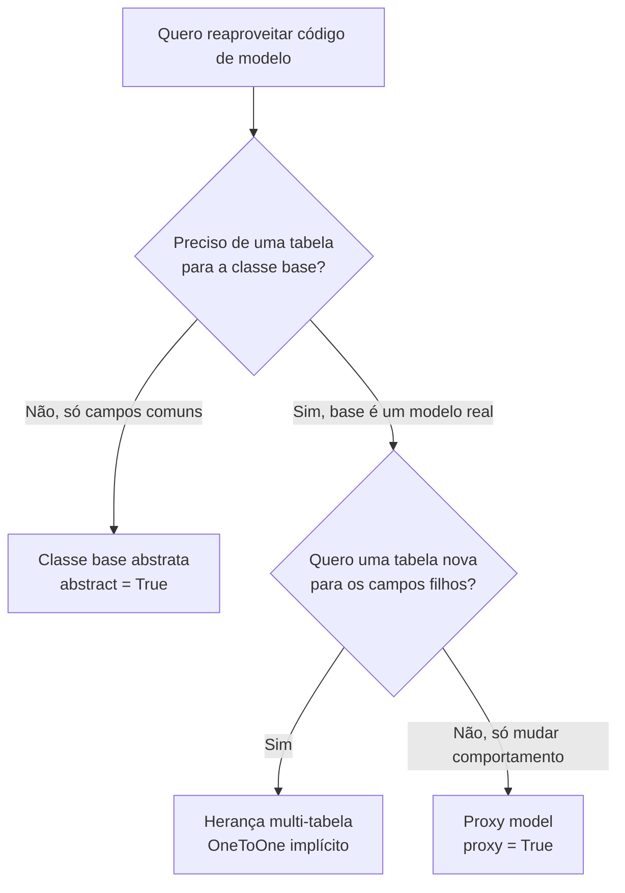

# Herança de modelos e managers

!!! quote "Pensa como criança 🧒"
    Imagine que você tem um carimbo que escreve "criado em" e "atualizado em".
    Em vez de desenhar essas duas linhas à mão em toda folha, você guarda o
    **carimbo** e apenas o aperta em cada folha nova. **Herança de modelos** é
    esse carimbo: você escreve os campos comuns uma vez e "carimba" em vários
    modelos. E o **manager** é o porteiro da caixa de folhas: quem decide quais
    folhas você vê quando pede `Post.objects.all()`.

## Caso de uso

Quase todo modelo precisa de `created_at` e `updated_at`. Escrever isso em
`Post`, `Author`, `Comment`... é repetição pura. Crie uma **classe base
abstrata** e reaproveite:

```python
from django.db import models


class TimeStampedModel(models.Model):
    """Reusable base that stamps creation and update times.

    Any concrete model inheriting from this gains ``created_at`` and
    ``updated_at`` columns without redeclaring them.
    """

    created_at = models.DateTimeField(auto_now_add=True)
    updated_at = models.DateTimeField(auto_now=True)

    class Meta:
        abstract = True


class Post(TimeStampedModel):
    """A blog post with reusable timestamps."""

    title = models.CharField(max_length=200)
    body = models.TextField()

    def __str__(self) -> str:
        """Return the post title."""
        return self.title
```

O `Post` tem quatro colunas na tabela: `title`, `body`, `created_at`,
`updated_at`. A tabela `TimeStampedModel` **não existe** — ela é só um molde.

## Possibilidades

O Django oferece **três** estilos de herança, e cada um resolve um problema
diferente. Antes de tudo, o mapa mental:



| Estilo | Cria tabela nova? | Quando usar |
| --- | --- | --- |
| **Abstrata** (`abstract = True`) | Só a do filho | Reaproveitar campos/métodos, sem tabela para a base |
| **Multi-tabela** (MTI) | Uma por classe | A base é um modelo real e o filho estende com campos próprios |
| **Proxy** (`proxy = True`) | Não (mesma tabela) | Mudar comportamento, ordenação ou manager sem mexer no schema |

### 1. Classe base abstrata — o carimbo

É o caso mais comum e o mais seguro. `abstract = True` diz ao Django: "não crie
tabela para mim, só copie meus campos para quem herdar".

```python
from django.db import models


class TimeStampedModel(models.Model):
    """Reusable timestamp fields for any concrete model."""

    created_at = models.DateTimeField(auto_now_add=True)
    updated_at = models.DateTimeField(auto_now=True)

    class Meta:
        abstract = True
        ordering = ["-created_at"]


class Author(TimeStampedModel):
    """A blog author."""

    name = models.CharField(max_length=120)


class Comment(TimeStampedModel):
    """A comment on a post."""

    body = models.TextField()
```

!!! tip "O `Meta` também é herdado — mas cuidado"
    Se o filho **não** declara um `Meta` próprio, ele herda o `Meta` da base
    (com `ordering`, etc.). Se o filho declara `Meta`, ele **substitui** o da
    base. Para herdar e só ajustar, faça o `Meta` do filho estender o da base:

    ```python
    class Comment(TimeStampedModel):
        """A comment that keeps the base Meta but adds indexes."""

        body = models.TextField()

        class Meta(TimeStampedModel.Meta):
            indexes = [models.Index(fields=["created_at"])]
    ```

    O Django **remove automaticamente** o `abstract = True` no filho, então
    `Comment` vira um modelo concreto normal.

!!! warning "`related_name` fixo quebra em base abstrata"
    Se a base abstrata tem uma `ForeignKey` com `related_name="posts"` fixo, e
    dois filhos herdam, os dois tentam registrar `posts` no modelo relacionado —
    colisão. Use os placeholders `%(class)s` e `%(app_label)s`:

    ```python
    class BaseContent(models.Model):
        """Abstract base whose FK back-references stay unique per subclass."""

        author = models.ForeignKey(
            "blog.Author",
            on_delete=models.CASCADE,
            related_name="%(class)s_set",
            related_query_name="%(class)ss",
        )

        class Meta:
            abstract = True
    ```

### 2. Herança multi-tabela (MTI) — a base é real

Aqui a base **é um modelo concreto** com sua própria tabela. O filho ganha uma
tabela separada e um `OneToOneField` implícito (o "parent link") apontando para
a base. Consultar o filho faz um `JOIN` automático.

```python
from django.db import models


class Place(models.Model):
    """A physical place with a name and address."""

    name = models.CharField(max_length=120)
    address = models.CharField(max_length=200)

    def __str__(self) -> str:
        """Return the place name."""
        return self.name


class Restaurant(Place):
    """A place that also serves food.

    Backed by its own table joined to ``Place`` through an implicit
    one-to-one parent link.
    """

    serves_pizza = models.BooleanField(default=False)
```

Como funciona na prática:

```python
r = Restaurant.objects.create(
    name="Bella Napoli",
    address="Rua das Flores, 10",
    serves_pizza=True,
)

# o Restaurant também aparece como Place
Place.objects.get(name="Bella Napoli")

# de Place para Restaurant, use o atributo em minúsculas
place = Place.objects.get(name="Bella Napoli")
place.restaurant.serves_pizza  # -> True
```

!!! danger "MTI cobra JOINs — pense duas vezes"
    Cada acesso ao filho faz um `JOIN` com a tabela pai. Em modelos muito
    consultados isso pesa. Na maioria dos casos onde você pensou em MTI, uma
    **classe base abstrata** (sem tabela extra) ou um campo `type` resolvem
    melhor. Prefira MTI só quando a base precisa existir sozinha como registro.

Você pode nomear o parent link explicitamente com um `OneToOneField(...,
parent_link=True)` se quiser controlar o nome da coluna:

```python
class Restaurant(Place):
    """A restaurant with an explicitly named parent link."""

    place_ptr = models.OneToOneField(
        Place,
        on_delete=models.CASCADE,
        parent_link=True,
        primary_key=True,
    )
    serves_pizza = models.BooleanField(default=False)
```

### 3. Proxy model — mesma tabela, novo comportamento

`proxy = True` **não cria tabela nova**. O proxy compartilha a tabela do pai,
mas você troca a ordenação, o `__str__`, adiciona métodos ou um manager
diferente. É uma "lente" sobre os mesmos dados.

```python
from django.db import models


class Post(models.Model):
    """A blog post."""

    title = models.CharField(max_length=200)
    published = models.BooleanField(default=False)

    def __str__(self) -> str:
        """Return the post title."""
        return self.title


class OrderedPost(Post):
    """Same data as ``Post``, but ordered alphabetically by title."""

    class Meta:
        proxy = True
        ordering = ["title"]

    def shout(self) -> str:
        """Return the title uppercased."""
        return self.title.upper()
```

`OrderedPost.objects.all()` lê **a mesma tabela** de `Post`, mas ordenada por
título, e cada objeto ganha o método `shout()`.

!!! note "Proxy vs. abstrata vs. MTI, em uma frase"
    - **Abstrata**: sem tabela para a base, campos copiados.
    - **MTI**: uma tabela por classe, ligadas por `OneToOne`.
    - **Proxy**: mesma tabela do pai, só muda comportamento em Python.

### Managers e QuerySets — o porteiro da caixa

Um **manager** é o objeto que você acessa via `Model.objects`. Ele devolve um
**QuerySet** quando você chama `.all()`, `.filter()`, etc. Você pode customizar
os dois.

#### QuerySet customizado + `from_queryset` (o jeito recomendado)

Escreva os métodos **uma vez** no QuerySet (assim eles encadeiam) e gere o
manager a partir dele:

```python
from django.db import models


class PostQuerySet(models.QuerySet["Post"]):
    """Chainable query helpers for posts."""

    def published(self) -> "PostQuerySet":
        """Return only published posts."""
        return self.filter(published=True)

    def by_author(self, name: str) -> "PostQuerySet":
        """Return posts written by the given author name."""
        return self.filter(author__name=name)


class Post(models.Model):
    """A blog post with a queryset-backed manager."""

    title = models.CharField(max_length=200)
    published = models.BooleanField(default=False)
    author = models.ForeignKey(
        "blog.Author", on_delete=models.CASCADE, related_name="posts"
    )

    objects = PostQuerySet.as_manager()
```

Agora os métodos **encadeiam** porque vivem no QuerySet:

```python
Post.objects.published().by_author("Ana")
Post.objects.by_author("Ana").published()  # a ordem não importa
```

!!! tip "`as_manager()` × `Manager.from_queryset()`"
    `PostQuerySet.as_manager()` é o atalho quando o manager só precisa expor os
    métodos do QuerySet. Se você também quer **adicionar métodos ao manager**
    (que não fazem sentido no meio de uma cadeia), use `from_queryset`:

    ```python
    class PostManager(models.Manager.from_queryset(PostQuerySet)):
        """Manager exposing queryset helpers plus creation shortcuts."""

        def create_published(self, title: str) -> "Post":
            """Create and return an already-published post."""
            return self.create(title=title, published=True)
    ```

    Depois: `objects = PostManager()`.

#### `get_queryset` — mudar o conjunto base

Sobrescreva `get_queryset()` para que **todo** acesso pelo manager já venha
filtrado. Útil para um manager "só publicados":

```python
from django.db import models


class PublishedManager(models.Manager):
    """Manager that only ever returns published posts."""

    def get_queryset(self) -> models.QuerySet["Post"]:
        """Return the base queryset filtered to published posts."""
        return super().get_queryset().filter(published=True)


class Post(models.Model):
    """A blog post with two managers."""

    title = models.CharField(max_length=200)
    published = models.BooleanField(default=False)

    objects = models.Manager()
    published_only = PublishedManager()
```

Uso:

```python
Post.objects.all()          # todos
Post.published_only.all()   # só os publicados
```

#### Múltiplos managers e o manager padrão

!!! warning "O primeiro manager declarado é o padrão"
    O **primeiro** manager que aparece na classe vira o `_default_manager` — é
    ele que o Django usa internamente (admin, relações reversas, `latest()`,
    etc.). Se o seu primeiro manager filtra registros (como `PublishedManager`),
    partes do Django podem **não enxergar** os registros escondidos. Regra de
    ouro: **declare `objects = models.Manager()` primeiro** e só depois os
    managers filtrados.

```python
class Post(models.Model):
    """A blog post whose default manager sees everything."""

    title = models.CharField(max_length=200)
    published = models.BooleanField(default=False)

    objects = models.Manager()          # padrão: vê tudo (declarado primeiro)
    published_only = PublishedManager()  # conveniência: só publicados
```

Se você precisa mesmo de um default filtrado, controle-o explicitamente com
`Meta.default_manager_name`:

```python
class Post(models.Model):
    """A blog post that pins its default manager by name."""

    title = models.CharField(max_length=200)

    published_only = PublishedManager()
    objects = models.Manager()

    class Meta:
        default_manager_name = "objects"
```

!!! info "Managers e herança abstrata"
    Managers definidos numa **classe base abstrata** são herdados pelos filhos.
    Isso combina lindamente com o `TimeStampedModel`: coloque o manager comum na
    base e todos os modelos ganham os mesmos helpers de consulta.

### Assíncrono: os managers têm irmãos `a...`

Os managers do Django 6.0 expõem versões assíncronas dos métodos terminais, com
prefixo `a`: `aget`, `acreate`, `acount`, `afirst`, `aget_or_create`, etc. Os
métodos que **retornam** QuerySet (como `filter`) continuam iguais — você só usa
`async for` para iterar:

```python
async def count_published() -> int:
    """Count published posts without blocking the event loop."""
    return await Post.objects.filter(published=True).acount()


async def list_titles() -> list[str]:
    """Collect all post titles asynchronously."""
    return [post.title async for post in Post.objects.all()]
```

!!! quote "📖 Na documentação oficial"
    - [Models (herança)](https://docs.djangoproject.com/en/6.0/topics/db/models/)
    - [Managers](https://docs.djangoproject.com/en/6.0/topics/db/managers/)

## Recap

- **Classe base abstrata** (`abstract = True`): reaproveita campos/métodos sem
  criar tabela para a base — o caso mais comum (ex.: `TimeStampedModel`).
- Em base abstrata, use `related_name="%(class)s_set"` para evitar colisão de
  `related_name` entre os filhos.
- **Herança multi-tabela**: a base é um modelo real; o filho ganha tabela
  própria ligada por um `OneToOne` implícito — cobra `JOINs`, use com parcimônia.
- **Proxy** (`proxy = True`): mesma tabela do pai, só muda ordenação,
  comportamento ou manager.
- Prefira escrever lógica de consulta num **QuerySet** e gerar o manager com
  `as_manager()` ou `Manager.from_queryset()` — assim os métodos encadeiam.
- `get_queryset()` sobrescreve o conjunto base de um manager.
- O **primeiro manager declarado é o padrão**; declare `objects` primeiro, ou
  fixe com `Meta.default_manager_name`.
- Managers têm métodos assíncronos com prefixo `a` (`aget`, `acount`, ...).

Para ajustar `ordering`, `indexes` e `constraints` que aparecem aqui, veja
**[Meta options](models-meta.md)**; para dominar `filter`/`annotate` que os
QuerySets encadeiam, veja a **[API de QuerySets](querysets-api.md)**.
