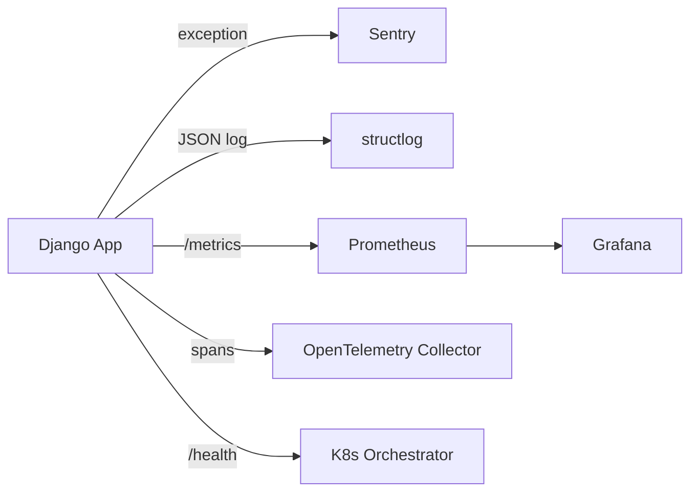

# Observability: errors, structured logs and metrics

!!! quote "Think like a child 🧒"
    Picture the dashboard in dad's car: a red light turns on when the engine breaks
    (**error**), the speedometer shows how fast you're going right now (**metric**),
    and the black box records everything that happened on the trip (**log**). On its
    own, the engine has no idea whether it's healthy. The dashboard is what **tells**
    the driver. **Observability** is putting a dashboard on your server: you glance at
    it and know if it's healthy — without opening the hood.

## Use case

Your blog is live. Sometimes a user hits an error screen, but when you look at the
server everything seems "normal". You need three things so you're not in the dark:

1. When something blows up, someone **tells you right away** (with the stack trace) → Sentry.
2. Logs come out in a format a **machine can read and filter** → structlog (JSON).
3. A dashboard shows "how many requests/second, how many 500 errors, how slow the
   response is" → Prometheus + Grafana.

None of this is "plain" Django — they're packages you plug in. This page shows the
minimum for each.

## Possibilities

### Overview: which tool solves what

| Tool | Pillar | Solves |
| --- | --- | --- |
| **Sentry** | Errors | Captures exceptions with stack trace, context, and alerts you |
| **structlog** | Logs | Turns logs into structured, filterable JSON |
| **django-prometheus** | Metrics | Exposes `/metrics` for Prometheus/Grafana to scrape |
| **OpenTelemetry** | Traces + everything | Auto-instruments Django/DB/Celery/HTTP |
| **django-health-check** | Health | Readiness/liveness endpoints for the orchestrator |
| **django-silk** | Profiling | Records and shows every query/time of each request (dev) |



!!! info "The three pillars of observability"
    The industry talks about **logs** (what happened, line by line), **metrics**
    (numbers aggregated over time), and **traces** (a request's path across several
    services). You rarely use just one — they complement each other.

### Sentry: tells you when something breaks

Python's `logging` (see [logging](logging.md)) writes in the notebook. Sentry goes
further: it **captures the whole exception** — stack trace, local variables, which
user, which request — and sends you an alert. Zero `print()`.

```bash
uv add "sentry-sdk[django]"
```

The Django integration is practically one line at the top of `settings.py`:

```python
# settings.py
import sentry_sdk

sentry_sdk.init(
    dsn="https://example@o0.ingest.sentry.io/0",
    send_default_pii=False,
    traces_sample_rate=0.1,
    profiles_sample_rate=0.1,
    environment="production",
    release="blog@1.2.0",
)
```

That's it. The `DjangoIntegration` is enabled automatically when `sentry-sdk[django]`
is installed — it hooks into views, the ORM, and middleware. Every unhandled exception
becomes an event in Sentry, with the exact line that blew up.

| Parameter | Does |
| --- | --- |
| `dsn` | Your project's address in Sentry (from the dashboard) |
| `send_default_pii` | If `True`, sends user data (IP, email) — mind privacy laws |
| `traces_sample_rate` | Fraction of requests turned into performance traces (0.0–1.0) |
| `profiles_sample_rate` | Fraction of requests with CPU profiling |
| `environment` | Separates `production`/`staging` in the dashboard |
| `release` | Ties the error to a version of your code |

To report something manually or attach context:

```python
import sentry_sdk
from django.http import HttpRequest, HttpResponse


def checkout(request: HttpRequest) -> HttpResponse:
    """Attach user context and capture handled errors to Sentry."""
    sentry_sdk.set_user({"id": str(request.user.pk)})
    sentry_sdk.set_tag("feature", "checkout")
    try:
        return _do_checkout(request)
    except PaymentError as exc:
        sentry_sdk.capture_exception(exc)
        return HttpResponse("Payment failed", status=402)
```

!!! danger "Never put the DSN directly in code"
    The `dsn` is an environment secret. Read it from an environment variable
    (`os.environ["SENTRY_DSN"]`) and keep `settings.py` versionable without leaking
    anything. See [environment config](config-ambientes.md).

!!! warning "`traces_sample_rate` at 1.0 is expensive"
    In high-traffic production, sampling 100% of requests blows your Sentry quota and
    adds overhead. Start low (`0.1`) and tune.

### structlog: logs a machine can read

Text logs (`"user 42 logged in at 10am"`) are great for humans, terrible for
machines. In production you want **JSON**: `{"event": "login", "user_id": 42}`. Then
your aggregator (Loki, Datadog, CloudWatch) filters by `user_id` in one click.

[structlog](https://www.structlog.org/) does exactly that and plugs into Django's
`LOGGING`.

```bash
uv add structlog
```

The idea: structlog processes the log and hands it to Python's standard `logging`,
which in turn uses a structlog formatter to render JSON.

```python
# settings.py
import structlog

LOGGING = {
    "version": 1,
    "disable_existing_loggers": False,
    "formatters": {
        "json": {
            "()": structlog.stdlib.ProcessorFormatter,
            "processor": structlog.processors.JSONRenderer(),
        },
    },
    "handlers": {
        "console": {
            "class": "logging.StreamHandler",
            "formatter": "json",
        },
    },
    "root": {"handlers": ["console"], "level": "INFO"},
}

structlog.configure(
    processors=[
        structlog.contextvars.merge_contextvars,
        structlog.processors.add_log_level,
        structlog.processors.TimeStamper(fmt="iso"),
        structlog.stdlib.ProcessorFormatter.wrap_for_formatter,
    ],
    logger_factory=structlog.stdlib.LoggerFactory(),
    cache_logger_on_first_use=True,
)
```

Now, in any view, you log with key-value pairs:

```python
import structlog
from django.http import HttpRequest, HttpResponse

logger = structlog.get_logger(__name__)


def create_post(request: HttpRequest) -> HttpResponse:
    """Log a structured event when a post is created."""
    logger.info("post_created", user_id=request.user.pk, title_len=42)
    return HttpResponse(status=201)
```

Output (one line per event, ready for the aggregator):

```json
{"event": "post_created", "user_id": 7, "title_len": 42, "level": "info", "timestamp": "2026-07-23T10:00:00Z"}
```

!!! tip "Bind a `request_id` to every log of the request"
    `structlog.contextvars.bind_contextvars(request_id="abc123")` at the start of the
    request (in a middleware) makes **all** logs of that request carry the same
    `request_id`. Tracking a bug becomes filtering by one field.

!!! note "In dev, use the pretty renderer"
    Raw JSON is hard to read in the terminal. Swap the formatter's `processor` for
    `structlog.dev.ConsoleRenderer()` in development (colored and aligned) and keep
    `JSONRenderer()` only in production.

### django-prometheus: metrics for Grafana

While logs count events, **metrics** are numbers over time: "requests per second",
"p95 latency", "how many 500s in the last hour". [django-prometheus](https://github.com/korfuri/django-prometheus)
exposes all of that on a `/metrics` endpoint that the Prometheus server scrapes and
Grafana draws.

```bash
uv add django-prometheus
```

Three steps: app, middlewares (wrapping the others), and URL.

```python
# settings.py
INSTALLED_APPS = [
    "django_prometheus",
    # ... your apps
]

MIDDLEWARE = [
    "django_prometheus.middleware.PrometheusBeforeMiddleware",
    # ... all your middlewares in the middle
    "django_prometheus.middleware.PrometheusAfterMiddleware",
]
```

```python
# urls.py
from django.urls import include, path

urlpatterns = [
    path("", include("django_prometheus.urls")),
]
```

Done: `GET /metrics` returns text in the Prometheus format, with request counters per
view/method/status, latencies, and more. Configure Prometheus to scrape that endpoint
and Grafana to draw it.

!!! tip "Database and cache metrics too"
    Swap the database `ENGINE` for `django_prometheus.db.backends.postgresql` and the
    cache backend for `django_prometheus.cache.backends.redis.RedisCache` to get query
    and hit/miss metrics automatically.

!!! warning "Protect /metrics"
    `/metrics` exposes internal details. Don't leave it public on the internet —
    restrict by network (only Prometheus reaches it) or require auth at the proxy/Nginx.

### OpenTelemetry: automatic instrumentation of everything

Sentry sees errors, Prometheus sees numbers. **Traces** show the full path of a
request: "entered the view → ran 3 queries → called an external API → published a
Celery task". [OpenTelemetry](https://opentelemetry.io/docs/languages/python/)
(OTel) is the open standard for this, and the magic is **auto-instrumentation**: you
don't change your code, it injects spans into Django, the DB, Celery, and HTTP calls.

```bash
uv add opentelemetry-distro opentelemetry-instrumentation-django
uv run opentelemetry-bootstrap -a install
```

`opentelemetry-bootstrap` detects your libraries (Django, psycopg, requests, celery)
and installs the instrumentation for each. Then you just change how the app starts:

```bash
export OTEL_SERVICE_NAME="blog"
export OTEL_EXPORTER_OTLP_ENDPOINT="http://otel-collector:4317"
uv run opentelemetry-instrument python manage.py runserver
```

`opentelemetry-instrument` wraps the process and turns everything on. Traces go to the
Collector (and from there to Jaeger, Tempo, etc.). No view line changed.

!!! info "OTel vs Sentry vs Prometheus — not either/or"
    They don't compete: OTel standardizes collection (traces, and increasingly logs
    and metrics), and you can **export** to Sentry, Grafana, or Datadog. Many people
    use OTel for traces and keep Sentry for the error-alerting flow.

!!! note "Async and OTel"
    Django instrumentation works with both sync and async views. Since Django 6.0
    matured async support a lot, check the instrumentation version to make sure
    `async def` views are covered.

### django-health-check: readiness and liveness

An orchestrator (Kubernetes, ECS) needs to ask your app "are you up?" (**liveness**)
and "are you ready to take traffic?" (**readiness** — is the database, cache, queue
responding?). [django-health-check](https://django-health-check.readthedocs.io/)
gives ready-made endpoints that check each dependency.

```bash
uv add django-health-check
```

```python
# settings.py
INSTALLED_APPS = [
    "health_check",
    "health_check.db",
    "health_check.cache",
    "health_check.storage",
    # ... your apps
]
```

```python
# urls.py
from django.urls import include, path

urlpatterns = [
    path("health/", include("health_check.urls")),
]
```

`GET /health/` returns `200` if everything responds and `500` if a dependency is
down — exactly what a Kubernetes probe expects.

!!! tip "Liveness should be dumb; readiness can be smart"
    The **liveness** probe should check only "the process breathes" (otherwise the
    orchestrator restarts the pod for nothing when the database blinks). Keep the
    database/cache checks in **readiness**, which only pulls the pod out of the load
    balancer temporarily.

### django-silk: profiling in development

When a page is slow and you want to see **every SQL query** and how long each took,
[django-silk](https://github.com/jazzband/django-silk) records each request and shows
it all in a UI. It's a cousin of the Debug Toolbar, but it persists the data and times
things precisely.

```bash
uv add django-silk
```

```python
# settings.py
INSTALLED_APPS = [
    "silk",
    # ... your apps
]

MIDDLEWARE = [
    "silk.middleware.SilkyMiddleware",
    # ... your middlewares
]
```

```python
# urls.py
from django.urls import include, path

urlpatterns = [
    path("silk/", include("silk.urls", namespace="silk")),
]
```

Open `/silk/` and see each request, with the query count (great for hunting the N+1
problem — see [performance](performance.md)) and the time of each one.

!!! danger "Development only"
    Silk records every request in a database — in production that wrecks performance
    and bloats the database. Keep it inside an `if DEBUG:` and never enable it in
    production.

!!! quote "📖 In the official docs"
    - [Sentry — Django integration](https://docs.sentry.io/platforms/python/integrations/django/)
    - [structlog](https://www.structlog.org/)
    - [django-prometheus](https://github.com/korfuri/django-prometheus)
    - [OpenTelemetry Python](https://opentelemetry.io/docs/languages/python/)

## Recap

- **Observability** = seeing the app's health from the outside, via three pillars:
  logs (what happened), metrics (numbers over time), and traces (the request's path).
- **Sentry** (`sentry-sdk[django]`) captures exceptions with stack trace and alerts;
  the `DjangoIntegration` turns on by itself. Always keep the DSN in an env variable.
- **structlog** turns logs into filterable JSON, plugged into `LOGGING`; use
  `bind_contextvars` to carry a `request_id` across all logs.
- **django-prometheus** exposes `/metrics` (protect the endpoint) for Prometheus +
  Grafana; **OpenTelemetry** auto-instruments Django/DB/Celery/HTTP without touching code.
- **django-health-check** gives readiness/liveness for the orchestrator; **django-silk**
  profiles queries — development only.

Continue with [logging](logging.md) and [performance](performance.md), or go back to the
[reference map](index.md).
