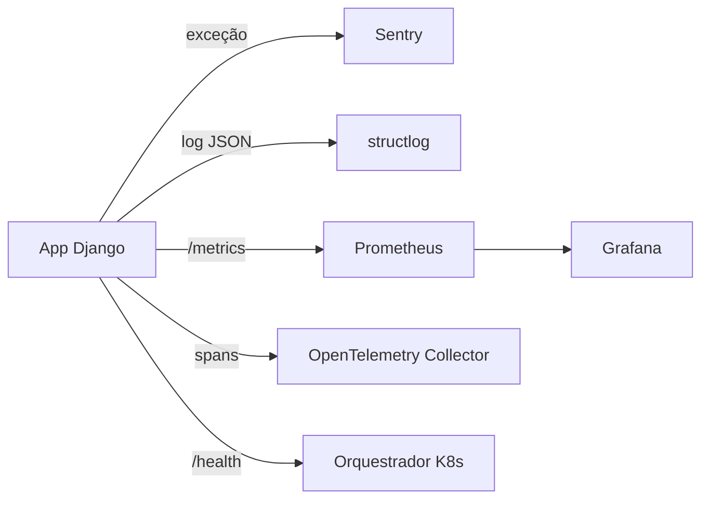

# Observabilidade: erros, logs estruturados e metricas

!!! quote "Pensa como criança 🧒"
    Imagina o painel do carro do papai: uma luzinha vermelha acende quando o motor
    quebra (**erro**), o velocímetro mostra a velocidade agora (**métrica**), e a
    caixa-preta anota tudo o que aconteceu na viagem (**log**). Sozinho, o motor
    não sabe se está bem. O painel é quem **conta** para o motorista. **Observabilidade**
    é botar um painel no seu servidor: você olha e sabe se ele está saudável — sem
    precisar abrir o capô.

## Caso de uso

Seu blog está no ar. Às vezes um usuário vê uma tela de erro, mas quando você olha
o servidor está tudo "normal". Você precisa de três coisas para não ficar no escuro:

1. Quando algo estoura, alguém te **avisa na hora** (com a stack trace) → Sentry.
2. Os logs saem em um formato que uma **máquina consegue ler e filtrar** → structlog (JSON).
3. Um painel mostra "quantas requisições/segundo, quantos erros 500, quão lenta está
   a resposta" → Prometheus + Grafana.

Nada disso é do Django "puro" — são pacotes que você pluga. Esta página mostra o
mínimo de cada um.

## Possibilidades

### Panorama: qual ferramenta resolve o quê

| Ferramenta | Pilar | Resolve |
| --- | --- | --- |
| **Sentry** | Erros | Captura exceções com stack trace, contexto e te alerta |
| **structlog** | Logs | Transforma logs em JSON estruturado e filtrável |
| **django-prometheus** | Métricas | Expõe `/metrics` para o Prometheus/Grafana raspar |
| **OpenTelemetry** | Traces + tudo | Instrumenta Django/DB/Celery/HTTP automaticamente |
| **django-health-check** | Saúde | Endpoints de readiness/liveness para o orquestrador |
| **django-silk** | Profiling | Grava e mostra cada query/tempo de cada request (dev) |



!!! info "Os três pilares da observabilidade"
    A indústria fala em **logs** (o que aconteceu, linha a linha), **métricas**
    (números agregados ao longo do tempo) e **traces** (o caminho de uma requisição
    por vários serviços). Você raramente usa um só — eles se completam.

### Sentry: te avisa quando algo quebra

O `logging` do Python (ver [logging](logging.md)) escreve no caderninho. O Sentry
vai além: ele **captura a exceção inteira** — stack trace, variáveis locais, qual
usuário, qual request — e te manda um alerta. Zero `print()`.

```bash
uv add "sentry-sdk[django]"
```

A integração com Django é praticamente uma linha no topo do `settings.py`:

```python
# settings.py
import sentry_sdk

sentry_sdk.init(
    dsn="https://exemplo@o0.ingest.sentry.io/0",
    send_default_pii=False,
    traces_sample_rate=0.1,
    profiles_sample_rate=0.1,
    environment="production",
    release="blog@1.2.0",
)
```

Só isso. A `DjangoIntegration` é ativada automaticamente quando o `sentry-sdk[django]`
está instalado — ela engancha nas views, no ORM e no middleware. Toda exceção não
tratada vira um evento no Sentry, com a linha exata que estourou.

| Parâmetro | Faz |
| --- | --- |
| `dsn` | Endereço do seu projeto no Sentry (vem do painel) |
| `send_default_pii` | Se `True`, envia dados do usuário (IP, e-mail) — cuidado com LGPD |
| `traces_sample_rate` | Fração de requests que viram traces de performance (0.0–1.0) |
| `profiles_sample_rate` | Fração de requests com profiling de CPU |
| `environment` | Separa `production`/`staging` no painel |
| `release` | Amarra o erro a uma versão do seu código |

Para reportar algo manualmente ou anexar contexto:

```python
import sentry_sdk
from django.http import HttpRequest, HttpResponse


def checkout(request: HttpRequest) -> HttpResponse:
    """Attach user context and capture handled errors to Sentry."""
    sentry_sdk.set_user({"id": str(request.user.pk)})
    sentry_sdk.set_tag("feature", "checkout")
    try:
        return _do_checkout(request)
    except PaymentError as exc:
        sentry_sdk.capture_exception(exc)
        return HttpResponse("Pagamento falhou", status=402)
```

!!! danger "Nunca coloque o DSN direto no código"
    O `dsn` é um segredo de ambiente. Leia de variável de ambiente
    (`os.environ["SENTRY_DSN"]`) e mantenha o `settings.py` versionável sem vazar
    nada. Veja [config de ambientes](config-ambientes.md).

!!! warning "`traces_sample_rate` em 1.0 custa caro"
    Em produção com muito tráfego, amostrar 100% das requisições estoura sua cota
    do Sentry e adiciona overhead. Comece baixo (`0.1`) e ajuste.

### structlog: logs que a máquina lê

Log de texto (`"user 42 fez login às 10h"`) é ótimo para humanos, péssimo para
máquinas. Em produção você quer **JSON**: `{"event": "login", "user_id": 42}`. Aí
o seu agregador (Loki, Datadog, CloudWatch) filtra por `user_id` num clique.

O [structlog](https://www.structlog.org/) faz exatamente isso e se pluga no
`LOGGING` do Django.

```bash
uv add structlog
```

A ideia: o structlog processa o log e entrega para o `logging` padrão do Python,
que por sua vez usa um formatter do structlog para renderizar JSON.

```python
# settings.py
import structlog

LOGGING = {
    "version": 1,
    "disable_existing_loggers": False,
    "formatters": {
        "json": {
            "()": structlog.stdlib.ProcessorFormatter,
            "processor": structlog.processors.JSONRenderer(),
        },
    },
    "handlers": {
        "console": {
            "class": "logging.StreamHandler",
            "formatter": "json",
        },
    },
    "root": {"handlers": ["console"], "level": "INFO"},
}

structlog.configure(
    processors=[
        structlog.contextvars.merge_contextvars,
        structlog.processors.add_log_level,
        structlog.processors.TimeStamper(fmt="iso"),
        structlog.stdlib.ProcessorFormatter.wrap_for_formatter,
    ],
    logger_factory=structlog.stdlib.LoggerFactory(),
    cache_logger_on_first_use=True,
)
```

Agora, em qualquer view, você loga com pares chave-valor:

```python
import structlog
from django.http import HttpRequest, HttpResponse

logger = structlog.get_logger(__name__)


def create_post(request: HttpRequest) -> HttpResponse:
    """Log a structured event when a post is created."""
    logger.info("post_created", user_id=request.user.pk, title_len=42)
    return HttpResponse(status=201)
```

Saída (uma linha por evento, pronta para o agregador):

```json
{"event": "post_created", "user_id": 7, "title_len": 42, "level": "info", "timestamp": "2026-07-23T10:00:00Z"}
```

!!! tip "Amarre um `request_id` em todo log da requisição"
    `structlog.contextvars.bind_contextvars(request_id="abc123")` no início do
    request (num middleware) faz **todos** os logs daquela requisição carregarem o
    mesmo `request_id`. Rastrear um bug vira filtrar por um campo.

!!! note "Em dev, use o renderer bonito"
    JSON puro é ruim de ler no terminal. Troque o `processor` do formatter por
    `structlog.dev.ConsoleRenderer()` em desenvolvimento (colorido e alinhado) e
    deixe o `JSONRenderer()` só em produção.

### django-prometheus: métricas para o Grafana

Enquanto logs contam eventos, **métricas** são números ao longo do tempo:
"requisições por segundo", "latência p95", "quantos 500 na última hora". O
[django-prometheus](https://github.com/korfuri/django-prometheus) expõe tudo isso
num endpoint `/metrics` que o servidor Prometheus raspa e o Grafana desenha.

```bash
uv add django-prometheus
```

São três passos: app, middlewares (envolvendo os outros) e URL.

```python
# settings.py
INSTALLED_APPS = [
    "django_prometheus",
    # ... suas apps
]

MIDDLEWARE = [
    "django_prometheus.middleware.PrometheusBeforeMiddleware",
    # ... todos os seus middlewares no meio
    "django_prometheus.middleware.PrometheusAfterMiddleware",
]
```

```python
# urls.py
from django.urls import include, path

urlpatterns = [
    path("", include("django_prometheus.urls")),
]
```

Pronto: `GET /metrics` devolve texto no formato Prometheus, com contadores de
requests por view/método/status, latências e mais. Configure o Prometheus para
raspar esse endpoint e o Grafana para desenhar.

!!! tip "Métricas do banco e do cache também"
    Troque o `ENGINE` do banco por `django_prometheus.db.backends.postgresql` e o
    backend de cache por `django_prometheus.cache.backends.redis.RedisCache` para
    ganhar métricas de queries e hits/misses automaticamente.

!!! warning "Proteja o /metrics"
    O `/metrics` expõe detalhes internos. Não deixe público na internet — restrinja
    por rede (só o Prometheus alcança) ou exija autenticação no proxy/Nginx.

### OpenTelemetry: instrumentação automática de tudo

Sentry vê erros, Prometheus vê números. **Traces** mostram o caminho completo de
uma requisição: "entrou na view → fez 3 queries → chamou uma API externa → publicou
uma task Celery". O [OpenTelemetry](https://opentelemetry.io/docs/languages/python/)
(OTel) é o padrão aberto para isso, e a mágica é a **auto-instrumentação**: você não
muda seu código, ele injeta spans em Django, no DB, no Celery e nas chamadas HTTP.

```bash
uv add opentelemetry-distro opentelemetry-instrumentation-django
uv run opentelemetry-bootstrap -a install
```

O `opentelemetry-bootstrap` detecta suas bibliotecas (Django, psycopg, requests,
celery) e instala a instrumentação de cada uma. Depois você só troca como o app sobe:

```bash
export OTEL_SERVICE_NAME="blog"
export OTEL_EXPORTER_OTLP_ENDPOINT="http://otel-collector:4317"
uv run opentelemetry-instrument python manage.py runserver
```

O `opentelemetry-instrument` embrulha o processo e ativa tudo. Os traces vão para o
Collector (e dele para Jaeger, Tempo, etc.). Nenhuma linha de view mudou.

!!! info "OTel vs Sentry vs Prometheus — não é ou/ou"
    Eles não competem: OTel padroniza a coleta (traces, e cada vez mais logs e
    métricas), e você pode **exportar** para o Sentry, o Grafana ou o Datadog. Muita
    gente usa OTel para traces e mantém Sentry para o fluxo de alerta de erros.

!!! note "Async e OTel"
    A instrumentação de Django funciona com views síncronas e assíncronas. Como o
    Django 6.0 amadureceu muito o suporte async, confira a versão da instrumentação
    para garantir cobertura das views `async def`.

### django-health-check: readiness e liveness

Um orquestrador (Kubernetes, ECS) precisa perguntar ao seu app "você está de pé?"
(**liveness**) e "está pronto para receber tráfego?" (**readiness** — banco, cache,
fila respondendo?). O [django-health-check](https://django-health-check.readthedocs.io/)
dá endpoints prontos que checam cada dependência.

```bash
uv add django-health-check
```

```python
# settings.py
INSTALLED_APPS = [
    "health_check",
    "health_check.db",
    "health_check.cache",
    "health_check.storage",
    # ... suas apps
]
```

```python
# urls.py
from django.urls import include, path

urlpatterns = [
    path("health/", include("health_check.urls")),
]
```

`GET /health/` retorna `200` se tudo responde e `500` se alguma dependência caiu —
exatamente o que o probe do Kubernetes espera.

!!! tip "Liveness deve ser burro; readiness pode ser esperto"
    O probe de **liveness** deve checar só "o processo respira" (senão o orquestrador
    reinicia o pod à toa quando o banco pisca). Deixe as checagens de banco/cache no
    **readiness**, que só tira o pod do balanceador temporariamente.

### django-silk: profiling em desenvolvimento

Quando uma página está lenta e você quer ver **cada query SQL** e quanto tempo cada
uma levou, o [django-silk](https://github.com/jazzband/django-silk) grava cada
requisição e mostra tudo numa interface. É primo do Debug Toolbar, mas persiste os
dados e mede tempo com precisão.

```bash
uv add django-silk
```

```python
# settings.py
INSTALLED_APPS = [
    "silk",
    # ... suas apps
]

MIDDLEWARE = [
    "silk.middleware.SilkyMiddleware",
    # ... seus middlewares
]
```

```python
# urls.py
from django.urls import include, path

urlpatterns = [
    path("silk/", include("silk.urls", namespace="silk")),
]
```

Acesse `/silk/` e veja cada request, com o número de queries (ótimo para caçar o
problema N+1 — ver [performance](performance.md)) e o tempo de cada uma.

!!! danger "Só em desenvolvimento"
    O Silk grava toda requisição num banco — em produção isso arrasa a performance e
    incha o banco. Deixe-o dentro de um `if DEBUG:` e nunca ative em produção.

!!! quote "📖 Na documentação oficial"
    - [Sentry — integração com Django](https://docs.sentry.io/platforms/python/integrations/django/)
    - [structlog](https://www.structlog.org/)
    - [django-prometheus](https://github.com/korfuri/django-prometheus)
    - [OpenTelemetry Python](https://opentelemetry.io/docs/languages/python/)

## Recap

- **Observabilidade** = enxergar a saúde do app por fora, via três pilares: logs
  (o que houve), métricas (números no tempo) e traces (o caminho da requisição).
- **Sentry** (`sentry-sdk[django]`) captura exceções com stack trace e alerta; a
  `DjangoIntegration` liga sozinha. DSN sempre por variável de ambiente.
- **structlog** transforma logs em JSON filtrável, plugado no `LOGGING`; use
  `bind_contextvars` para carregar um `request_id` em todos os logs.
- **django-prometheus** expõe `/metrics` (proteja o endpoint) para Prometheus +
  Grafana; **OpenTelemetry** auto-instrumenta Django/DB/Celery/HTTP sem tocar no código.
- **django-health-check** dá readiness/liveness para o orquestrador; **django-silk**
  faz profiling de queries — só em desenvolvimento.

Continue pelo [logging](logging.md) e pela [performance](performance.md), ou volte ao
[mapa da referência](index.md).
