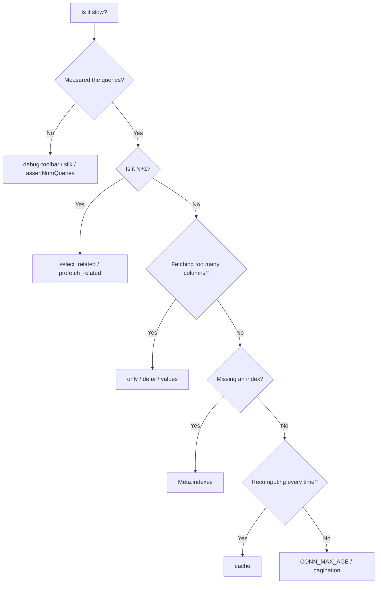

# Performance and optimization

!!! quote "Think like a child 🧒"
    Imagine you have to fetch the snacks for 30 classmates from the cafeteria.
    You can go **30 times** (once per classmate) or take a **box** and bring
    everything back at once. Django, if you're careless, goes 30 times to the
    database. Optimizing is learning to take the box: ask for everything at once,
    ask for only what you need, and keep what you already fetched.

## Use case

You list 30 posts and show each one's author name. Without care, that becomes
**31 queries** (1 for the posts + 1 for each author). It's the famous **N+1**
problem:

```python
from blog.models import Post

# ❌ 1 query for the posts + 1 query PER post when accessing .author
posts = Post.objects.all()
for post in posts:
    print(post.title, post.author.display_name)  # each access = a new query
```

The cure is one word:

```python
from blog.models import Post

# ✅ 2 queries total: one for posts, one for all authors
posts = Post.objects.select_related("author")
for post in posts:
    print(post.title, post.author.display_name)  # came along already, no new query
```

Two queries instead of thirty-one. That's the heart of database optimization in
Django.

## Possibilities

### The N+1 problem and the two cures

Think like a child: `select_related` is going to fetch the **parent** along (one
person per snack); `prefetch_related` is fetching **many children** at once (the
whole box of snacks).

| Tool | For which kind of relation | How it works | # of queries |
| --- | --- | --- | --- |
| `select_related` | `ForeignKey`, `OneToOne` (the "one" side) | Does a SQL `JOIN` | 1 |
| `prefetch_related` | `ManyToMany`, reverse FK (the "many" side) | Does 2 queries and joins in Python | 2 |

```python
from blog.models import Post

# ForeignKey / OneToOne -> select_related (JOIN)
posts = Post.objects.select_related("author")

# ManyToMany / reverse FK -> prefetch_related (separate query)
posts = Post.objects.prefetch_related("tags", "comments")

# you can combine both in the same query
posts = Post.objects.select_related("author").prefetch_related("tags")
```

!!! tip "How to know which one to use?"
    Ask "does this post have **one** author or **many**?". **One** →
    `select_related`. **Many** → `prefetch_related`. If you get it wrong (use
    `select_related` on a ManyToMany), Django raises a clear error telling you to
    switch.

### Nested relations: follow the path with `__`

```python
from blog.models import Comment

# from the comment -> post -> post's author, all in one JOIN
comments = Comment.objects.select_related("post__author")
for c in comments:
    print(c.post.title, c.post.author.display_name)  # zero extra queries
```

### `Prefetch`: controlling the prefetch from the inside

When you want to **filter** or **order** what is preloaded, use the `Prefetch`
object:

```python
from django.db.models import Prefetch
from blog.models import Author, Comment, Post

# load each author with ONLY their published posts
published = Prefetch(
    "posts",
    queryset=Post.objects.filter(status="published"),
)
authors = Author.objects.prefetch_related(published)

# store the prefetch in its own attribute with to_attr
recent_comments = Prefetch(
    "comments",
    queryset=Comment.objects.order_by("-created_at")[:5],
    to_attr="recent_comments",
)
```

!!! note "`to_attr` avoids surprises"
    Without `to_attr`, accessing `author.posts.all()` returns the filtered
    queryset, which can confuse whoever expects *all* posts. With
    `to_attr="published"`, you access `author.published` (a list) and
    `author.posts.all()` still means "all of them".

### `only()` and `defer()`: fetch fewer columns

Think like a child: if you only need the **title**, don't load the whole **body
text** of every post.

```python
from blog.models import Post

# only: bring ONLY these fields (the rest become lazy)
titles = Post.objects.only("title", "slug")

# defer: bring everything EXCEPT these heavy fields
posts = Post.objects.defer("content")
```

| Method | Meaning |
| --- | --- |
| `only("a", "b")` | Loads only `a` and `b`; other fields trigger a new query if accessed |
| `defer("c")` | Loads everything except `c`; `c` triggers a new query if accessed |

!!! warning "Accessing a deferred field costs a query"
    If you do `only("title")` and later read `post.content`, Django hits the
    database again — per object. Only use `only`/`defer` when you're sure you
    won't touch the fields you left out.

### `values()` and `values_list()`: skip the objects

When you only want **data**, not model instances, skip building the objects
entirely — it's much lighter:

```python
from blog.models import Post

# dicts instead of Post objects
Post.objects.values("id", "title")
# -> <QuerySet [{"id": 1, "title": "Hello"}, ...]>

# tuples
Post.objects.values_list("id", "title")
# -> <QuerySet [(1, "Hello"), ...]>

# a single column, flattened into a plain list
Post.objects.values_list("title", flat=True)
# -> <QuerySet ["Hello", "World", ...]>
```

!!! tip "Great for dropdowns and exports"
    Need a list of IDs, a `<select>` of titles, or a CSV? `values`/`values_list`
    avoid building hundreds of objects you'd throw away.

### `count()`, `exists()` and `len()`: ask the right thing

Think like a child: to know "is anyone in the line?" you don't need to **count
everyone** — just check if there's **at least one person**.

```python
from blog.models import Post

# ✅ "how many?" -> COUNT(*) in the database, brings no rows
total = Post.objects.filter(status="published").count()

# ✅ "does any exist?" -> LIMIT 1 in the database, super cheap
if Post.objects.filter(status="published").exists():
    ...

# ❌ brings ALL rows just to count/check
total = len(Post.objects.all())            # loads everything into memory
if Post.objects.all():                     # same thing
    ...
```

| What you want to know | Use | Avoid |
| --- | --- | --- |
| How many records | `.count()` | `len(qs)` |
| Whether any exists | `.exists()` | `if qs:` / `len(qs) > 0` |
| I'll iterate anyway | `len(qs)` (reuses the cache) | `.count()` + iterate (2 queries) |

!!! info "The `len()` exception"
    If you're **going to iterate the queryset anyway**, calling `len()` on it is
    fine: it loads the cache once and reuses it. Doing `.count()` **and**
    iterating fires two queries.

### QuerySets are lazy (and cache results)

Think like a child: building the query is like writing the shopping list —
nothing is bought until you go to the store. Django only hits the database when
you **iterate**, **slice with a step**, call `list()`, `len()`, `bool()`, etc.

```python
from blog.models import Post

qs = Post.objects.filter(status="published")   # nothing happened yet
qs = qs.order_by("-created_at")                 # still nothing
qs = qs.select_related("author")                # still nothing

for post in qs:                                 # NOW it hits the database (1 query)
    print(post.title)

for post in qs:                                 # does NOT go again: uses the cache
    print(post.author.display_name)
```

!!! danger "Rebuilding the query empties the cache"
    The cache lives **on the queryset**. If you recreate the queryset on each
    use, you redo the query:
    ```python
    for p in Post.objects.all(): ...   # query 1
    for p in Post.objects.all(): ...   # query 2 (new object, new cache)
    ```
    Store it in a variable (`qs = Post.objects.all()`) and reuse the variable.

Slicing triggers the query, but slicing **without a step** (`qs[:10]`) becomes a
`LIMIT` in the database — cheap. Slicing **with a step** (`qs[::2]`) evaluates
everything in memory.

### `bulk_create` and `bulk_update`: writing in batches

Think like a child: putting away 100 toys one by one means 100 trips to the box.
Putting them all away at once is a single trip.

```python
from blog.models import Tag, Post

# ✅ one INSERT for many objects
Tag.objects.bulk_create([
    Tag(name="python"),
    Tag(name="django"),
    Tag(name="orm"),
])

# ✅ one UPDATE for many objects (choose the fields to update)
posts = list(Post.objects.filter(status="draft"))
for p in posts:
    p.status = "published"
Post.objects.bulk_update(posts, ["status"])
```

!!! warning "What bulk does NOT do"
    `bulk_create`/`bulk_update` are fast because they **skip** steps: they don't
    call `Model.save()`, don't fire the `pre_save`/`post_save` signals, and (on
    some databases) don't fill in the PK of the created objects. If you rely on
    logic in `save()` or on signals, bulk is not for that case.

To update en masse **without** loading objects, `update()` is even more direct:

```python
from blog.models import Post

# UPDATE ... SET status='archived' WHERE ... — one query, zero objects
Post.objects.filter(status="draft").update(status="archived")
```

### Database indexes with `Meta.indexes`

Think like a child: an index is the **index at the back of the book** — instead
of reading page by page looking for "cat", you go straight there. Columns that
are heavily filtered or ordered deserve an index.

```python
from django.db import models


class Post(models.Model):
    """A blog post."""

    title: models.CharField = models.CharField(max_length=200)
    slug: models.SlugField = models.SlugField(unique=True)
    status: models.CharField = models.CharField(max_length=20)
    created_at: models.DateTimeField = models.DateTimeField(auto_now_add=True)

    class Meta:
        indexes = [
            models.Index(fields=["status"]),
            models.Index(fields=["status", "-created_at"], name="status_recent_idx"),
        ]
```

!!! danger "`index_together` was removed"
    The old `Meta.index_together` **no longer exists** in modern Django. Use
    `Meta.indexes` with `models.Index(fields=[...])` — including for
    multi-column indexes (what `index_together` used to do).

Partial and conditional indexes also come via `condition=`:

```python
from django.db import models
from django.db.models import Q


class Post(models.Model):
    """A blog post with a partial index on published rows."""

    status: models.CharField = models.CharField(max_length=20)
    created_at: models.DateTimeField = models.DateTimeField(auto_now_add=True)

    class Meta:
        indexes = [
            models.Index(
                fields=["-created_at"],
                name="published_recent_idx",
                condition=Q(status="published"),
            ),
        ]
```

### Constraints with `condition=` (not `check=`)

Constraints protect your data **in the database** — and a well-placed constraint
often comes with an index for free.

```python
from django.db import models
from django.db.models import Q, F


class Post(models.Model):
    """A blog post with integrity constraints."""

    title: models.CharField = models.CharField(max_length=200)
    slug: models.SlugField = models.SlugField()
    views: models.PositiveIntegerField = models.PositiveIntegerField(default=0)
    likes: models.PositiveIntegerField = models.PositiveIntegerField(default=0)

    class Meta:
        constraints = [
            models.UniqueConstraint(fields=["slug"], name="unique_slug"),
            models.CheckConstraint(
                condition=Q(likes__lte=F("views")),
                name="likes_lte_views",
            ),
        ]
```

!!! danger "`CheckConstraint` uses `condition=`, not `check=`"
    In modern Django the argument is **`condition=`**. The old `check=` is
    deprecated. Write `models.CheckConstraint(condition=Q(...), name=...)`.

### Pagination: never bring everything

Think like a child: you don't dump the whole LEGO box on the floor — you grab a
handful at a time.

```python
from django.core.paginator import Paginator
from blog.models import Post

posts = Post.objects.filter(status="published").order_by("-created_at")
paginator = Paginator(posts, per_page=20)

page = paginator.get_page(1)         # Page object (handles invalid pages)
for post in page:
    print(post.title)

print(page.has_next(), page.number, paginator.num_pages)
```

!!! tip "Combine it with `.only()`/`select_related()`"
    A listing page almost never needs the full body of each post nor a query per
    author. `Paginator(Post.objects.select_related("author").only("title", "slug", "author"), 20)`
    delivers light pages with no N+1.

### Cache layers

When data is expensive to compute and changes rarely, **store the answer**.
Django has three granularities. (Dedicated page: **[cache](cache.md)**.)

| Layer | Where it applies | Tool |
| --- | --- | --- |
| Per view | A whole view | `@cache_page(60)` / `CacheMiddleware` |
| Per fragment | A piece of the template | `...` |
| Low level | Any value in your code | `cache.get` / `cache.set` |

```python
from django.views.decorators.cache import cache_page
from django.http import HttpRequest, HttpResponse


@cache_page(60 * 5)
def post_list(request: HttpRequest) -> HttpResponse:
    """Render the post list, cached for 5 minutes."""
    ...
```

```django


    {# HTML that is expensive to render, stored for 300s #}

```

```python
from django.core.cache import cache
from blog.models import Post


def published_count() -> int:
    """Return the number of published posts, cached for 60 seconds."""
    total = cache.get("n_published")
    if total is None:
        total = Post.objects.filter(status="published").count()
        cache.set("n_published", total, timeout=60)
    return total
```

### `CONN_MAX_AGE`: reusing connections

Think like a child: opening a database connection on every request is like
turning the light on and off every time you enter the room. `CONN_MAX_AGE` keeps
the connection alive for a while, reusing it across requests.

```python
# settings.py
DATABASES = {
    "default": {
        "ENGINE": "django.db.backends.postgresql",
        "NAME": "blog",
        "CONN_MAX_AGE": 60,          # seconds; 0 = closes on every request
        "CONN_HEALTH_CHECKS": True,   # discards dead connections before using
    }
}
```

!!! warning "Don't use a high `CONN_MAX_AGE` without a pooler"
    Persistent per-process connections can blow past Postgres's connection limit
    if you have many workers. In production, prefer a pooler (PgBouncer) or a
    conservative value. See **[settings](settings.md)**.

### Profiling: measure before you optimize

Think like a child: it's no use fixing the toy **you think** is broken — find out
which one is actually broken. Measure the queries.

```python
from django.test import TestCase
from blog.models import Post


class PostQueryTests(TestCase):
    """Guardrail tests that lock in the query count."""

    def test_list_has_no_n_plus_1(self) -> None:
        """The post list must run in exactly 2 queries, not N+1."""
        with self.assertNumQueries(2):
            posts = list(Post.objects.select_related("author"))
            for post in posts:
                _ = post.author.display_name
```

| Tool | When to use |
| --- | --- |
| `assertNumQueries(n)` | In tests: locks the # of queries and fails if an N+1 sneaks back |
| `django-debug-toolbar` | In the browser (dev): shows each request's queries |
| `django-silk` | Per-request profiling/history, including API endpoints |
| `QuerySet.explain()` | Read the database's execution plan for a specific query |

```python
from blog.models import Post

# ask the database for the execution plan (useful to understand indexes)
print(Post.objects.filter(status="published").explain())
```



!!! quote "📖 In the official docs"
    - [Database access optimization](https://docs.djangoproject.com/en/6.0/topics/db/optimization/)
    - [Performance and optimization](https://docs.djangoproject.com/en/6.0/topics/performance/)

## Recap

- **N+1** is villain #1: cure `ForeignKey`/`OneToOne` with `select_related`
  (JOIN) and `ManyToMany`/reverse FK with `prefetch_related` (separate query).
- Use `Prefetch(..., queryset=..., to_attr=...)` to filter/order what is
  preloaded.
- Bring **less**: `only`/`defer` cut columns; `values`/`values_list` skip the
  objects.
- Ask the right thing: `.count()` for "how many", `.exists()` for "any?" — never
  `len(qs)` just for that.
- QuerySets are **lazy** and **cache**: store them in a variable and reuse; don't
  recreate the query.
- Write in batches with `bulk_create`/`bulk_update` (remember they skip `save()`
  and signals) and update en masse with `.update()`.
- Indexes via `Meta.indexes` (`index_together` was removed); constraints with
  `CheckConstraint(condition=...)` (not `check=`).
- Don't bring everything: **paginate** with `Paginator`.
- Store expensive answers with **cache** (view/fragment/low-level) and reuse
  connections with `CONN_MAX_AGE`.
- **Measure first**: `assertNumQueries`, debug-toolbar, silk, `explain()`.

Want to master every queryset method (the foundation of all this)? See the
**[QuerySet API](querysets-api.md)**.
