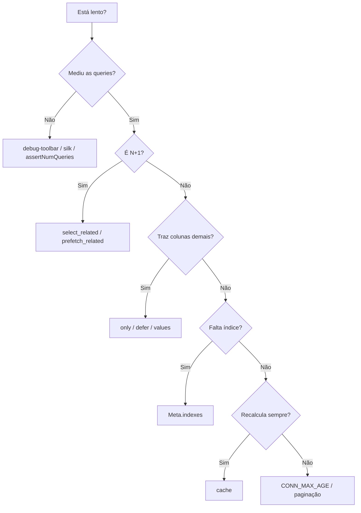

# Performance e otimização

!!! quote "Pensa como criança 🧒"
    Imagine que você precisa buscar o lanche de 30 colegas na cantina. Você pode
    ir **30 vezes** (uma por colega) ou levar uma **caixa** e trazer tudo de uma
    vez. O Django, sem cuidado, vai 30 vezes ao banco. Otimizar é aprender a
    levar a caixa: pedir tudo de uma vez, pedir só o que precisa, e guardar o que
    já buscou.

## Caso de uso

Você lista 30 posts e mostra o nome do autor de cada um. Sem cuidado, isso vira
**31 consultas** ao banco (1 para os posts + 1 para cada autor). É o famoso
problema **N+1**:

```python
from blog.models import Post

# ❌ 1 query para os posts + 1 query POR post ao acessar .author
posts = Post.objects.all()
for post in posts:
    print(post.title, post.author.display_name)  # cada acesso = nova query
```

A cura é uma palavra:

```python
from blog.models import Post

# ✅ 2 queries no total: uma para posts, uma para todos os autores
posts = Post.objects.select_related("author")
for post in posts:
    print(post.title, post.author.display_name)  # já veio junto, sem nova query
```

Duas queries em vez de trinta e uma. Esse é o coração da otimização de banco no
Django.

## Possibilidades

### O problema N+1 e as duas curas

Pensa como criança: `select_related` é ir buscar o **pai** junto (uma pessoa
por lanche); `prefetch_related` é buscar **vários filhos** de uma vez (a caixa
inteira de lanches).

| Ferramenta | Para que tipo de relação | Como funciona | Nº de queries |
| --- | --- | --- | --- |
| `select_related` | `ForeignKey`, `OneToOne` (o "um lado") | Faz um `JOIN` no SQL | 1 |
| `prefetch_related` | `ManyToMany`, reverse FK (o "muitos lado") | Faz 2 queries e junta no Python | 2 |

```python
from blog.models import Post

# ForeignKey / OneToOne -> select_related (JOIN)
posts = Post.objects.select_related("author")

# ManyToMany / reverse FK -> prefetch_related (query separada)
posts = Post.objects.prefetch_related("tags", "comments")

# pode combinar os dois na mesma query
posts = Post.objects.select_related("author").prefetch_related("tags")
```

!!! tip "Como saber qual usar?"
    Pergunte "esse post tem **um** autor ou **vários**?". **Um** → `select_related`.
    **Vários** → `prefetch_related`. Se errar (usar `select_related` num
    ManyToMany), o Django levanta um erro claro dizendo para trocar.

### Relações aninhadas: siga o caminho com `__`

```python
from blog.models import Comment

# do comentário -> post -> autor do post, tudo em um JOIN
comments = Comment.objects.select_related("post__author")
for c in comments:
    print(c.post.title, c.post.author.display_name)  # zero queries extras
```

### `Prefetch`: controlar o prefetch por dentro

Quando você quer **filtrar** ou **ordenar** o que é pré-carregado, use o objeto
`Prefetch`:

```python
from django.db.models import Prefetch
from blog.models import Author, Comment, Post

# carregue cada autor com APENAS os posts publicados dele
published = Prefetch(
    "posts",
    queryset=Post.objects.filter(status="published"),
)
authors = Author.objects.prefetch_related(published)

# guarde o prefetch em um atributo próprio com to_attr
recent_comments = Prefetch(
    "comments",
    queryset=Comment.objects.order_by("-created_at")[:5],
    to_attr="recent_comments",
)
```

!!! note "`to_attr` evita surpresas"
    Sem `to_attr`, acessar `author.posts.all()` devolve o queryset filtrado, o
    que pode confundir quem espera *todos* os posts. Com `to_attr="published"`,
    você acessa `author.published` (uma lista) e `author.posts.all()` continua
    significando "todos".

### `only()` e `defer()`: buscar menos colunas

Pensa como criança: se você só precisa do **título**, não carregue o **texto
inteiro** de cada post.

```python
from blog.models import Post

# only: traga SÓ estes campos (o resto vira lazy)
titles = Post.objects.only("title", "slug")

# defer: traga tudo MENOS estes campos pesados
posts = Post.objects.defer("content")
```

| Método | Significado |
| --- | --- |
| `only("a", "b")` | Carrega só `a` e `b`; outros campos disparam nova query se acessados |
| `defer("c")` | Carrega tudo menos `c`; `c` dispara nova query se acessado |

!!! warning "Acessar um campo adiado custa uma query"
    Se você faz `only("title")` e depois lê `post.content`, o Django vai ao
    banco de novo — por objeto. Só use `only`/`defer` quando tem certeza de que
    não vai tocar nos campos que deixou de fora.

### `values()` e `values_list()`: pular os objetos

Quando você só quer **dados**, não instâncias de modelo, pule a criação dos
objetos por completo — é bem mais leve:

```python
from blog.models import Post

# dicts em vez de objetos Post
Post.objects.values("id", "title")
# -> <QuerySet [{"id": 1, "title": "Olá"}, ...]>

# tuplas
Post.objects.values_list("id", "title")
# -> <QuerySet [(1, "Olá"), ...]>

# uma coluna só, achatada em lista simples
Post.objects.values_list("title", flat=True)
# -> <QuerySet ["Olá", "Mundo", ...]>
```

!!! tip "Ótimo para dropdowns e exports"
    Precisa de uma lista de IDs, um `<select>` de títulos, ou um CSV? `values`/
    `values_list` evitam construir centenas de objetos que você jogaria fora.

### `count()`, `exists()` e `len()`: pergunte a coisa certa

Pensa como criança: para saber "tem alguém na fila?" você não precisa **contar
todo mundo** — basta olhar se tem **pelo menos uma pessoa**.

```python
from blog.models import Post

# ✅ "quantos?" -> COUNT(*) no banco, não traz linhas
total = Post.objects.filter(status="published").count()

# ✅ "existe algum?" -> LIMIT 1 no banco, super barato
if Post.objects.filter(status="published").exists():
    ...

# ❌ traz TODAS as linhas só para contar/checar
total = len(Post.objects.all())            # carrega tudo na memória
if Post.objects.all():                     # idem
    ...
```

| Você quer saber | Use | Evite |
| --- | --- | --- |
| Quantos registros | `.count()` | `len(qs)` |
| Se existe algum | `.exists()` | `if qs:` / `len(qs) > 0` |
| Já vou iterar mesmo assim | `len(qs)` (reaproveita o cache) | `.count()` + iterar (2 queries) |

!!! info "A exceção do `len()`"
    Se você **vai iterar o queryset de qualquer jeito**, chamar `len()` sobre ele
    é ok: ele carrega o cache uma vez e reusa. Fazer `.count()` **e** iterar
    dispara duas queries.

### QuerySets são preguiçosos (e guardam cache)

Pensa como criança: montar a query é como escrever a lista de compras — nada é
comprado até você ir ao mercado. O Django só vai ao banco quando você
**itera**, **fatia com passo**, chama `list()`, `len()`, `bool()`, etc.

```python
from blog.models import Post

qs = Post.objects.filter(status="published")   # nada aconteceu ainda
qs = qs.order_by("-created_at")                 # ainda nada
qs = qs.select_related("author")                # ainda nada

for post in qs:                                 # AGORA vai ao banco (1 query)
    print(post.title)

for post in qs:                                 # NÃO vai de novo: usa o cache
    print(post.author.display_name)
```

!!! danger "Refazer a query esvazia o cache"
    O cache mora **no queryset**. Se você recria o queryset a cada uso, refaz a
    consulta:
    ```python
    for p in Post.objects.all(): ...   # query 1
    for p in Post.objects.all(): ...   # query 2 (novo objeto, novo cache)
    ```
    Guarde em uma variável (`qs = Post.objects.all()`) e reuse a variável.

Fatiar aciona a query, mas fatiar **sem passo** (`qs[:10]`) vira `LIMIT` no
banco — barato. Fatiar **com passo** (`qs[::2]`) avalia tudo em memória.

### `bulk_create` e `bulk_update`: gravar em lote

Pensa como criança: guardar 100 brinquedos um por um dá 100 idas até a caixa.
Guardar todos de uma vez é uma ida só.

```python
from blog.models import Tag, Post

# ✅ um INSERT para muitos objetos
Tag.objects.bulk_create([
    Tag(name="python"),
    Tag(name="django"),
    Tag(name="orm"),
])

# ✅ um UPDATE para muitos objetos (escolha os campos a atualizar)
posts = list(Post.objects.filter(status="draft"))
for p in posts:
    p.status = "published"
Post.objects.bulk_update(posts, ["status"])
```

!!! warning "O que o bulk NÃO faz"
    `bulk_create`/`bulk_update` são rápidos porque **pulam** etapas: não chamam
    `Model.save()`, não disparam os signals `pre_save`/`post_save`, e (em alguns
    bancos) não preenchem a PK dos objetos criados. Se você depende de lógica no
    `save()` ou de signals, o bulk não é para esse caso.

Para atualizar em massa **sem** carregar objetos, `update()` é ainda mais direto:

```python
from blog.models import Post

# UPDATE ... SET status='archived' WHERE ... — uma query, zero objetos
Post.objects.filter(status="draft").update(status="archived")
```

### Índices no banco com `Meta.indexes`

Pensa como criança: um índice é o **índice remissivo** no fim do livro — em vez
de ler página por página procurando "gato", você vai direto. Colunas muito
filtradas ou ordenadas merecem um índice.

```python
from django.db import models


class Post(models.Model):
    """A blog post."""

    title: models.CharField = models.CharField(max_length=200)
    slug: models.SlugField = models.SlugField(unique=True)
    status: models.CharField = models.CharField(max_length=20)
    created_at: models.DateTimeField = models.DateTimeField(auto_now_add=True)

    class Meta:
        indexes = [
            models.Index(fields=["status"]),
            models.Index(fields=["status", "-created_at"], name="status_recent_idx"),
        ]
```

!!! danger "`index_together` foi removido"
    O antigo `Meta.index_together` **não existe mais** no Django moderno. Use
    `Meta.indexes` com `models.Index(fields=[...])` — inclusive para índices de
    múltiplas colunas (o que o `index_together` fazia).

Índices parciais e condicionais também vêm por `condition=`:

```python
from django.db import models
from django.db.models import Q


class Post(models.Model):
    """A blog post with a partial index on published rows."""

    status: models.CharField = models.CharField(max_length=20)
    created_at: models.DateTimeField = models.DateTimeField(auto_now_add=True)

    class Meta:
        indexes = [
            models.Index(
                fields=["-created_at"],
                name="published_recent_idx",
                condition=Q(status="published"),
            ),
        ]
```

### Constraints com `condition=` (não `check=`)

Constraints protegem os dados **no banco** — e uma constraint bem posta muitas
vezes vem com um índice de brinde.

```python
from django.db import models
from django.db.models import Q, F


class Post(models.Model):
    """A blog post with integrity constraints."""

    title: models.CharField = models.CharField(max_length=200)
    slug: models.SlugField = models.SlugField()
    views: models.PositiveIntegerField = models.PositiveIntegerField(default=0)
    likes: models.PositiveIntegerField = models.PositiveIntegerField(default=0)

    class Meta:
        constraints = [
            models.UniqueConstraint(fields=["slug"], name="unique_slug"),
            models.CheckConstraint(
                condition=Q(likes__lte=F("views")),
                name="likes_lte_views",
            ),
        ]
```

!!! danger "`CheckConstraint` usa `condition=`, não `check=`"
    No Django moderno o argumento é **`condition=`**. O antigo `check=` está
    descontinuado. Escreva `models.CheckConstraint(condition=Q(...), name=...)`.

### Paginação: nunca traga tudo

Pensa como criança: você não despeja a caixa inteira de LEGO no chão — pega um
punhado por vez.

```python
from django.core.paginator import Paginator
from blog.models import Post

posts = Post.objects.filter(status="published").order_by("-created_at")
paginator = Paginator(posts, per_page=20)

page = paginator.get_page(1)         # objeto Page (trata páginas inválidas)
for post in page:
    print(post.title)

print(page.has_next(), page.number, paginator.num_pages)
```

!!! tip "Combine com `.only()`/`select_related()`"
    Uma página de listagem quase nunca precisa do corpo inteiro de cada post nem
    de uma query por autor. `Paginator(Post.objects.select_related("author").only("title", "slug", "author"), 20)`
    entrega páginas leves e sem N+1.

### Camadas de cache

Quando o dado é caro de calcular e muda pouco, **guarde a resposta**. O Django
tem três granularidades. (Página dedicada: **[cache](cache.md)**.)

| Camada | Onde se aplica | Ferramenta |
| --- | --- | --- |
| Por view | Uma view inteira | `@cache_page(60)` / `CacheMiddleware` |
| Por fragmento | Um pedaço do template | `...` |
| Baixo nível | Qualquer valor no seu código | `cache.get` / `cache.set` |

```python
from django.views.decorators.cache import cache_page
from django.http import HttpRequest, HttpResponse


@cache_page(60 * 5)
def lista_posts(request: HttpRequest) -> HttpResponse:
    """Render the post list, cached for 5 minutes."""
    ...
```

```django


    {# HTML caro de renderizar, guardado por 300s #}

```

```python
from django.core.cache import cache
from blog.models import Post


def contagem_publicados() -> int:
    """Return the number of published posts, cached for 60 seconds."""
    total = cache.get("n_publicados")
    if total is None:
        total = Post.objects.filter(status="published").count()
        cache.set("n_publicados", total, timeout=60)
    return total
```

### `CONN_MAX_AGE`: reaproveitar conexões

Pensa como criança: abrir uma conexão com o banco a cada request é como acender
e apagar a luz toda vez que entra na sala. `CONN_MAX_AGE` mantém a conexão viva
por um tempo, reaproveitando-a entre requests.

```python
# settings.py
DATABASES = {
    "default": {
        "ENGINE": "django.db.backends.postgresql",
        "NAME": "blog",
        "CONN_MAX_AGE": 60,          # segundos; 0 = fecha a cada request
        "CONN_HEALTH_CHECKS": True,   # descarta conexões mortas antes de usar
    }
}
```

!!! warning "Não use `CONN_MAX_AGE` alto sem um pooler"
    Conexões persistentes por processo podem estourar o limite de conexões do
    Postgres se você tem muitos workers. Em produção, prefira um pooler
    (PgBouncer) ou um valor conservador. Veja **[settings](settings.md)**.

### Profiling: medir antes de otimizar

Pensa como criança: não adianta arrumar o brinquedo que **você acha** que quebrou
— descubra qual está quebrado de verdade. Meça as queries.

```python
from django.test import TestCase
from blog.models import Post


class PostQueryTests(TestCase):
    """Guardrail tests that lock in the query count."""

    def test_listagem_nao_tem_n_mais_1(self) -> None:
        """The post list must run in exactly 2 queries, not N+1."""
        with self.assertNumQueries(2):
            posts = list(Post.objects.select_related("author"))
            for post in posts:
                _ = post.author.display_name
```

| Ferramenta | Quando usar |
| --- | --- |
| `assertNumQueries(n)` | Nos testes: trava o nº de queries e falha se um N+1 voltar |
| `django-debug-toolbar` | No navegador (dev): mostra as queries de cada request |
| `django-silk` | Perfil por request/histórico, inclusive em endpoints de API |
| `QuerySet.explain()` | Ler o plano de execução do banco para uma query específica |

```python
from blog.models import Post

# peça ao banco o plano de execução (útil para entender índices)
print(Post.objects.filter(status="published").explain())
```



!!! quote "📖 Na documentação oficial"
    - [Database access optimization](https://docs.djangoproject.com/en/6.0/topics/db/optimization/)
    - [Performance and optimization](https://docs.djangoproject.com/en/6.0/topics/performance/)

## Recap

- **N+1** é o vilão nº 1: cure `ForeignKey`/`OneToOne` com `select_related`
  (JOIN) e `ManyToMany`/reverse FK com `prefetch_related` (query separada).
- Use `Prefetch(..., queryset=..., to_attr=...)` para filtrar/ordenar o que é
  pré-carregado.
- Traga **menos**: `only`/`defer` cortam colunas; `values`/`values_list` pulam
  os objetos.
- Pergunte a coisa certa: `.count()` para "quantos", `.exists()` para "tem
  algum" — nunca `len(qs)` só para isso.
- QuerySets são **preguiçosos** e **cacheiam**: guarde em variável e reuse; não
  recrie a query.
- Grave em lote com `bulk_create`/`bulk_update` (lembre que pulam `save()` e
  signals) e atualize em massa com `.update()`.
- Índices via `Meta.indexes` (`index_together` foi removido); constraints com
  `CheckConstraint(condition=...)` (não `check=`).
- Não traga tudo: **pagine** com `Paginator`.
- Guarde respostas caras com **cache** (view/fragmento/baixo nível) e reaproveite
  conexões com `CONN_MAX_AGE`.
- **Meça antes**: `assertNumQueries`, debug-toolbar, silk, `explain()`.

Quer dominar cada método de queryset (o alicerce disto tudo)? Veja a
**[API de QuerySets](querysets-api.md)**.
