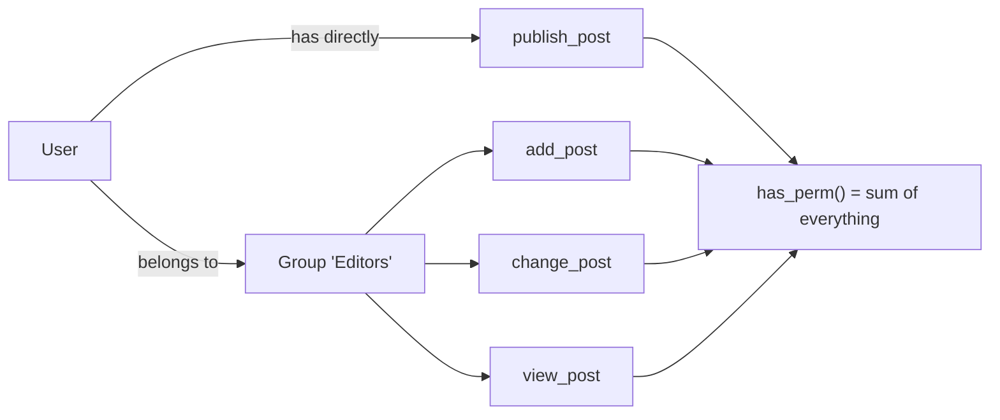
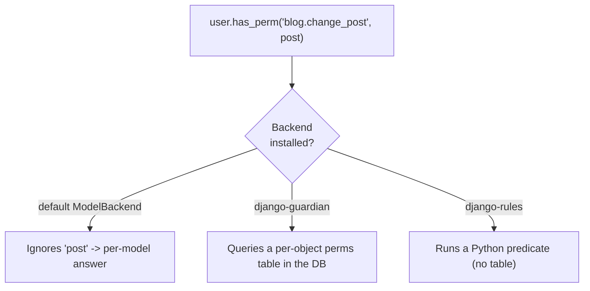

# Permissions in depth (and object-level)

!!! quote "Think like a child 🧒"
    Picture a school with badges. The badge says what you're allowed to do: enter
    the library, use the board, open the locker. A **permission** is exactly that:
    a label saying "this student may do *such-and-such*". And here's a twist:
    sometimes you can open *your* locker but not your classmate's — that's a
    permission **per object** (object-level).

## Use case

In the blog, any logged-in editor may create posts, but only someone holding the
right label may **publish** (a business action that is neither "create" nor
"edit"). You don't invent a boolean field on the user — you use Django's
permission system and guard the view:

```python
from django.contrib.auth.mixins import PermissionRequiredMixin
from django.views.generic import UpdateView

from blog.models import Post


class PostPublishView(PermissionRequiredMixin, UpdateView):
    """Only users holding the custom 'publish_post' permission may publish."""

    model = Post
    fields = ["status"]
    permission_required = "blog.publish_post"
```

Anyone without the `blog.publish_post` permission gets `403 Forbidden`
automatically. You never write the `if user.can_publish` check by hand.

## Possibilities

### The 4 automatic permissions on every model

As soon as you register a model and run `migrate`, Django creates **four**
permissions for it. Always. Without you asking.

| Permission (codename) | Human-readable name | Grants |
| --- | --- | --- |
| `add_<model>` | Can add <model> | Create records |
| `change_<model>` | Can change <model> | Edit records |
| `delete_<model>` | Can delete <model> | Delete records |
| `view_<model>` | Can view <model> | View records (including in the admin) |

The full name you use in code is `"<app_label>.<codename>"`. For the `Post` model
in the `blog` app:

```python
user.has_perm("blog.add_post")
user.has_perm("blog.change_post")
user.has_perm("blog.delete_post")
user.has_perm("blog.view_post")
```

!!! info "Where do these names come from?"
    `blog` is the `app_label` (the app's name). `post` is the lowercased model
    (`Meta.model_name`). The codename is `add_post`, `change_post`, etc. If you
    rename the app or the model, the codenames change along with them.

### Custom permissions in `Meta.permissions`

The 4 automatic ones cover CRUD. **Business** actions ("publish", "archive",
"export") you declare yourself, in the model's `Meta`:

```python
from django.db import models


class Post(models.Model):
    """A blog post with a custom business permission to publish."""

    title = models.CharField(max_length=200)
    body = models.TextField()

    class Meta:
        permissions = [
            ("publish_post", "Can publish post"),
            ("archive_post", "Can archive post"),
        ]
```

Each item is a `(codename, human_readable_name)` tuple. After `makemigrations` +
`migrate`, the `blog.publish_post` permission exists and can be assigned.

!!! tip "Prefer permissions over boolean flags on the user"
    It's tempting to add `User.can_publish = BooleanField()`. Don't. Permissions
    already come with group assignment, uniform checking (`has_perm`), and admin
    plus DRF integration. A boolean flag reinvents all of that, worse.

!!! warning "`Meta.permissions` is NOT for the 4 automatic ones"
    Don't repeat `add_post`/`change_post`/etc. in `Meta.permissions` — Django
    already creates them and you'd get a duplicate error. Put only your business
    actions there.

### Groups: badges in bulk

A **group** is a bundle of permissions. Instead of granting 8 permissions to
every editor, you create the "Editors" group once and drop people into it.

```python
from django.contrib.auth.models import Group, Permission
from django.contrib.contenttypes.models import ContentType

from blog.models import Post


def setup_editor_group() -> Group:
    """Create (or fetch) the 'Editors' group with post permissions."""
    group, _ = Group.objects.get_or_create(name="Editors")
    content_type = ContentType.objects.get_for_model(Post)
    perms = Permission.objects.filter(
        content_type=content_type,
        codename__in=["add_post", "change_post", "view_post", "publish_post"],
    )
    group.permissions.set(perms)
    return group
```

Then just link the user to the group:

```python
group = setup_editor_group()
user.groups.add(group)
```



!!! note "Effective permissions are the UNION"
    `user.has_perm(...)` considers **the user's direct permissions plus those from
    all their groups**. It doesn't matter whether it came directly or via a group
    — the result is the sum.

### Checking in code: `has_perm` and friends

| Call | Returns |
| --- | --- |
| `user.has_perm("blog.publish_post")` | `True`/`False` for one permission |
| `user.has_perms(["blog.add_post", "blog.publish_post"])` | `True` only if it has **all** |
| `user.get_all_permissions()` | `set` with every full codename |
| `user.get_group_permissions()` | Only those coming from groups |

```python
if user.has_perm("blog.publish_post"):
    post.status = "published"
    post.save()
```

!!! danger "Superusers pass everything — and anonymous users pass nothing"
    `user.is_superuser == True` makes `has_perm()` **always** return `True`, even
    for permissions that don't exist. And `AnonymousUser.has_perm(...)` is
    **always** `False`. Don't rely on `has_perm` to "hide" anything from a
    superuser.

An async version also exists in Django 6.0:

```python
allowed = await user.ahas_perm("blog.publish_post")
```

### Permissions in the template

Inside templates you don't call Python — you use the magic variable `perms`, which
the `auth` context processor injects automatically:

```html

  <form method="post" action="">
    
    <button type="submit">Publish</button>
  </form>



  <p>You have some permission in the blog app.</p>

```

- `perms.blog.publish_post` → tests one specific permission.
- `perms.blog` → tests whether the user has **any** permission in the app.

!!! info "You need the right context processor"
    `perms` only exists in the template if
    `django.contrib.auth.context_processors.auth` is in
    `TEMPLATES["OPTIONS"]["context_processors"]` — which is already the default in
    `startproject`.

### Guarding views: mixin and decorator

For **class-based views** (this guide's default), use `PermissionRequiredMixin`:

```python
from django.contrib.auth.mixins import PermissionRequiredMixin
from django.views.generic import ListView

from blog.models import Post


class DraftListView(PermissionRequiredMixin, ListView):
    """List draft posts; requires the change permission."""

    model = Post
    template_name = "blog/draft_list.html"
    permission_required = "blog.change_post"
    raise_exception = True

    def get_queryset(self):  # type: ignore[override]
        """Return only draft posts."""
        return Post.objects.filter(status="draft")
```

- `permission_required` accepts a string **or** a tuple/list (requires all).
- `raise_exception = True` responds `403` directly; without it, it redirects to
  login (handy when the user isn't even logged in).

For **function-based views**, the equivalent decorator:

```python
from django.contrib.auth.decorators import permission_required
from django.http import HttpRequest, HttpResponse
from django.shortcuts import render

from blog.models import Post


@permission_required("blog.publish_post", raise_exception=True)
def publish_dashboard(request: HttpRequest) -> HttpResponse:
    """Render the publishing dashboard for authorized users only."""
    posts = Post.objects.filter(status="draft")
    return render(request, "blog/publish_dashboard.html", {"posts": posts})
```

!!! tip "Mixin vs `UserPassesTestMixin`"
    `PermissionRequiredMixin` is for **static** rules ("does it have permission
    X?"). When the rule depends on the object ("is it the author of *this*
    post?"), you're into per-object logic — see `UserPassesTestMixin` in
    [authentication and permissions](auth.md) and the object-level section below.

### Permissions in Django REST Framework

DRF has **its own** permission system, via the `permission_classes` attribute on
the view. It does not use `PermissionRequiredMixin` (which is plain Django).

```python
from rest_framework import viewsets
from rest_framework.permissions import DjangoModelPermissions, IsAuthenticated

from blog.models import Post
from blog.serializers import PostSerializer


class PostViewSet(viewsets.ModelViewSet):
    """CRUD API for posts, gated by Django model permissions."""

    queryset = Post.objects.all()
    serializer_class = PostSerializer
    permission_classes = [IsAuthenticated, DjangoModelPermissions]
```

| DRF class | What it does |
| --- | --- |
| `AllowAny` | Allows everything |
| `IsAuthenticated` | Logged-in users only |
| `IsAdminUser` | `is_staff` only |
| `IsAuthenticatedOrReadOnly` | Writing requires login; reading is free |
| `DjangoModelPermissions` | Maps HTTP method → model permission (`add/change/delete`) |
| `DjangoObjectPermissions` | Like above, but **per object** (needs an object-level backend) |

!!! note "`DjangoModelPermissions` needs a queryset and ignores GET"
    It derives the permission from `view.queryset` (that's why `queryset` is
    required) and by default does **not** require a permission for `GET`. If you
    want to protect reads, use `DjangoModelPermissionsOrAnonReadOnly` the other
    way around, or write a custom permission.

A custom DRF permission is a class with `has_permission` (whole view) and/or
`has_object_permission` (a specific object):

```python
from rest_framework import permissions
from rest_framework.request import Request
from rest_framework.views import APIView

from blog.models import Post


class IsAuthorOrReadOnly(permissions.BasePermission):
    """Allow read to anyone; allow write only to the object's author."""

    def has_object_permission(
        self, request: Request, view: APIView, obj: Post
    ) -> bool:
        """Grant write access only when the requester owns the object."""
        if request.method in permissions.SAFE_METHODS:
            return True
        return obj.author == request.user
```

### Object-level (per-row permission): the concept

Everything above is **per model**: "may edit posts" is a single answer for all
posts. But the real world asks for "may edit *this* post" — the author edits
theirs, not other people's. That's an **object-level** (or row-level) permission.

Django **understands** the idea: `user.has_perm()` accepts a second argument with
the object.

```python
user.has_perm("blog.change_post", post_instance)
```

!!! danger "The default backend IGNORES the object"
    The `ModelBackend` (Django's default) **does not implement** per-object
    checking: passing the object changes nothing — it answers the same as the
    no-object case. For real object-level checks you need a **backend** that knows
    about it. There are two mature libraries for this.



### `django-guardian`: per-object permissions in the database

**guardian** stores, in its own tables, which users/groups have which permissions
over which specific objects. It's the "explicit access control" model, just like
sharing a file with specific people.

```python
from django.contrib.auth import get_user_model
from guardian.shortcuts import assign_perm, get_objects_for_user

from blog.models import Post

User = get_user_model()


def share_post(post: Post, user: User) -> None:
    """Grant a specific user permission to edit one specific post."""
    assign_perm("blog.change_post", user, post)


def editable_posts(user: User):
    """Return the queryset of posts this user may edit."""
    return get_objects_for_user(user, "blog.change_post")
```

After installing (`uv add django-guardian`), you add the backend:

```python
AUTHENTICATION_BACKENDS = [
    "django.contrib.auth.backends.ModelBackend",
    "guardian.backends.ObjectPermissionBackend",
]
```

!!! tip "Use guardian when permissions are DATA"
    Choose guardian when "who can do what" changes at runtime and is decided by
    people: sharing a document, inviting someone to a project, granting a client
    access. The permissions become rows in the database that you create and
    remove.

!!! warning "Guardian costs database"
    Each per-object permission is a row. Millions of objects with individual
    permissions = huge tables and expensive joins. If the rule is *computable*
    ("is the author", "is on the same team"), guardian is dead weight — use rules.

### `django-rules`: per-object permissions via logic

**rules** stores nothing in the database: an object-level permission becomes a
**predicate** — a function that takes a user and an object and returns
`True`/`False`. It's the "the rule is a formula" model, not a list.

```python
import rules


@rules.predicate
def is_post_author(user, post) -> bool:
    """Return True when the user is the author of the post."""
    return post.author_id == user.id


rules.add_perm("blog.change_post", is_post_author)
rules.add_perm("blog.delete_post", is_post_author)
```

Predicates are **composable** with logical operators — the most elegant part:

```python
import rules


@rules.predicate
def is_editor(user) -> bool:
    """Return True when the user belongs to the Editors group."""
    return user.groups.filter(name="Editors").exists()


rules.add_perm("blog.publish_post", is_post_author | is_editor)
```

rules also offers a backend (`rules.permissions.ObjectPermissionBackend`) and
mixins that plug into Django's CBVs, so `request.user.has_perm(
"blog.change_post", post)` starts running the predicate.

!!! tip "Use rules when the permission is a RULE"
    Choose rules when "who can" is derivable from state ("is the owner", "is on
    the same team", "the order is still open"). Zero tables, zero permission
    migration, and the logic stays versioned in code.

### Guardian vs rules: which to choose

| Question | Guardian | Rules |
| --- | --- | --- |
| Where the permission lives | Rows in the DB | Predicate in Python |
| Changes at runtime by users? | Yes (its strength) | No (changes with deploy) |
| Needs migration/table? | Yes | No |
| "Share this item with someone" | Ideal | Poor |
| "Is the author / on the team" | Costly | Ideal |
| Cost at scale | Grows with number of objects | Constant (CPU only) |

!!! note "You can use both"
    It's not either/or. Many projects use **rules** for the computable rules
    (owner, team) and **guardian** for the explicit shares that users themselves
    create. They're just two backends in the `AUTHENTICATION_BACKENDS` list.

!!! quote "📖 In the official docs"
    - [Authentication: permissions and authorization](https://docs.djangoproject.com/en/6.0/topics/auth/default/)
    - [django-guardian](https://django-guardian.readthedocs.io/)
    - [django-rules](https://github.com/dfunckt/django-rules)

## Recap

- Every model gets **4 automatic permissions**: `add`, `change`, `delete`,
  `view` — used as `"app_label.codename"`.
- Business actions ("publish") go in `Meta.permissions` as
  `(codename, human_readable_name)` tuples.
- **Groups** bundle permissions; a user's effective permissions are the **union**
  of their direct ones + those of their groups.
- Check with `user.has_perm("blog.publish_post")`; in templates use
  `perms.blog...`; guard views with `PermissionRequiredMixin` (CBV) or
  `@permission_required` (FBV). Remember: **superusers pass everything, anonymous
  users pass nothing**.
- In **DRF** the system is separate: `permission_classes` + classes like
  `DjangoModelPermissions` or your own `BasePermission`.
- **Object-level**: `has_perm(perm, obj)` exists, but the default backend ignores
  the object. Use **django-guardian** when the permission is *data* (runtime
  sharing) and **django-rules** when it's a computable *rule* (owner, team).

Before permissions comes the "who are you": see
**[authentication and permissions](auth.md)**.
