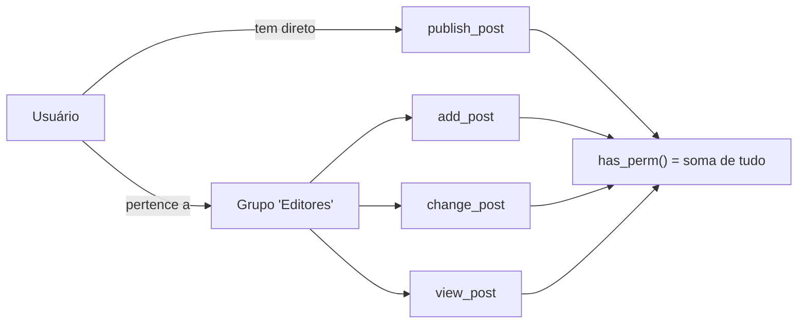
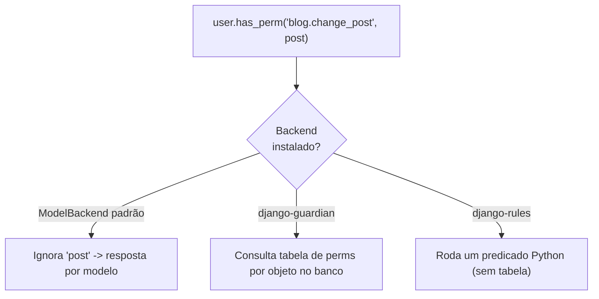

# Permissoes a fundo (e object-level)

!!! quote "Pensa como criança 🧒"
    Imagina uma escola com crachás. O crachá diz o que você pode fazer: entrar na
    biblioteca, mexer no quadro, abrir o armário. **Permissão** é isso: uma
    etiqueta que diz "esse aluno pode fazer *tal coisa*". E tem um detalhe: às
    vezes você pode abrir *o seu* armário, mas não o do coleguinha — isso é
    permissão **por objeto** (object-level).

## Caso de uso

No blog, qualquer editor logado pode criar posts, mas só quem tem a etiqueta
certa pode **publicar** (uma ação de negócio que não é "criar" nem "editar").
Você não inventa um campo booleano no usuário — você usa o sistema de permissões
do Django e protege a view:

```python
from django.contrib.auth.mixins import PermissionRequiredMixin
from django.views.generic import UpdateView

from blog.models import Post


class PostPublishView(PermissionRequiredMixin, UpdateView):
    """Only users holding the custom 'publish_post' permission may publish."""

    model = Post
    fields = ["status"]
    permission_required = "blog.publish_post"
```

Quem não tiver a permissão `blog.publish_post` recebe `403 Forbidden`
automaticamente. Você nunca escreve o `if user.can_publish` na mão.

## Possibilidades

### As 4 permissões automáticas de todo modelo

Assim que você registra um modelo e roda `migrate`, o Django cria **quatro**
permissões para ele. Sempre. Sem você pedir.

| Permissão (codename) | Nome legível | Libera |
| --- | --- | --- |
| `add_<model>` | Can add <model> | Criar registros |
| `change_<model>` | Can change <model> | Editar registros |
| `delete_<model>` | Can delete <model> | Apagar registros |
| `view_<model>` | Can view <model> | Ver registros (inclusive no admin) |

O nome completo que você usa no código é `"<app_label>.<codename>"`. Para o
modelo `Post` no app `blog`:

```python
user.has_perm("blog.add_post")
user.has_perm("blog.change_post")
user.has_perm("blog.delete_post")
user.has_perm("blog.view_post")
```

!!! info "De onde saem esses nomes?"
    `blog` é o `app_label` (o nome do app). `post` é o modelo em minúsculas
    (`Meta.model_name`). O codename é `add_post`, `change_post`, etc. Se você
    renomear o app ou o modelo, os codenames mudam junto.

### Permissões customizadas em `Meta.permissions`

As 4 automáticas cobrem CRUD. Ações de **negócio** ("publicar", "arquivar",
"exportar") você declara você mesmo, na `Meta` do modelo:

```python
from django.db import models


class Post(models.Model):
    """A blog post with a custom business permission to publish."""

    title = models.CharField(max_length=200)
    body = models.TextField()

    class Meta:
        permissions = [
            ("publish_post", "Can publish post"),
            ("archive_post", "Can archive post"),
        ]
```

Cada item é uma tupla `(codename, nome_legível)`. Depois de `makemigrations` +
`migrate`, a permissão `blog.publish_post` existe e pode ser atribuída.

!!! tip "Prefira permissões a flags booleanas no usuário"
    É tentador criar `User.can_publish = BooleanField()`. Não faça. Permissões já
    vêm com atribuição por grupo, checagem uniforme (`has_perm`), integração com
    o admin e com o DRF. Uma flag booleana reinventa tudo isso pior.

!!! warning "`Meta.permissions` NÃO é para as 4 automáticas"
    Não repita `add_post`/`change_post`/etc. em `Meta.permissions` — o Django já
    as cria e você ganharia um erro de duplicidade. Coloque ali só as suas ações
    de negócio.

### Grupos: crachás em lote

Um **grupo** é um pacote de permissões. Em vez de dar 8 permissões para cada
editor, você cria o grupo "Editores" uma vez e joga as pessoas dentro.

```python
from django.contrib.auth.models import Group, Permission
from django.contrib.contenttypes.models import ContentType

from blog.models import Post


def setup_editor_group() -> Group:
    """Create (or fetch) the 'Editors' group with post permissions."""
    group, _ = Group.objects.get_or_create(name="Editors")
    content_type = ContentType.objects.get_for_model(Post)
    perms = Permission.objects.filter(
        content_type=content_type,
        codename__in=["add_post", "change_post", "view_post", "publish_post"],
    )
    group.permissions.set(perms)
    return group
```

Depois é só ligar o usuário ao grupo:

```python
group = setup_editor_group()
user.groups.add(group)
```



!!! note "As permissões efetivas são a UNIÃO"
    `user.has_perm(...)` considera **as permissões diretas do usuário mais as de
    todos os grupos dele**. Não importa se veio direto ou via grupo — o resultado
    é a soma.

### Checando no código: `has_perm` e amigos

| Chamada | Retorna |
| --- | --- |
| `user.has_perm("blog.publish_post")` | `True`/`False` para uma permissão |
| `user.has_perms(["blog.add_post", "blog.publish_post"])` | `True` só se tiver **todas** |
| `user.get_all_permissions()` | `set` com todos os codenames completos |
| `user.get_group_permissions()` | Só as vindas de grupos |

```python
if user.has_perm("blog.publish_post"):
    post.status = "published"
    post.save()
```

!!! danger "Superusuário passa por tudo — e usuário anônimo por nada"
    `user.is_superuser == True` faz `has_perm()` retornar **sempre** `True`, mesmo
    para permissões que não existem. E `AnonymousUser.has_perm(...)` é **sempre**
    `False`. Não confie em `has_perm` para "esconder" algo de um superusuário.

Versão assíncrona também existe no Django 6.0:

```python
allowed = await user.ahas_perm("blog.publish_post")
```

### Permissões no template

Dentro dos templates você não chama Python — usa a variável mágica `perms`, que
o `auth` context processor injeta automaticamente:

```html

  <form method="post" action="">
    
    <button type="submit">Publicar</button>
  </form>



  <p>Você tem alguma permissão no app blog.</p>

```

- `perms.blog.publish_post` → testa uma permissão específica.
- `perms.blog` → testa se o usuário tem **qualquer** permissão no app.

!!! info "Precisa do context processor certo"
    `perms` só existe no template se `django.contrib.auth.context_processors.auth`
    estiver em `TEMPLATES["OPTIONS"]["context_processors"]` — o que já vem por
    padrão no `startproject`.

### Protegendo views: mixin e decorator

Para **class-based views** (o padrão neste guia), use `PermissionRequiredMixin`:

```python
from django.contrib.auth.mixins import PermissionRequiredMixin
from django.views.generic import ListView

from blog.models import Post


class DraftListView(PermissionRequiredMixin, ListView):
    """List draft posts; requires the change permission."""

    model = Post
    template_name = "blog/draft_list.html"
    permission_required = "blog.change_post"
    raise_exception = True

    def get_queryset(self):  # type: ignore[override]
        """Return only draft posts."""
        return Post.objects.filter(status="draft")
```

- `permission_required` aceita uma string **ou** uma tupla/lista (exige todas).
- `raise_exception = True` responde `403` direto; sem ele, redireciona para o
  login (útil quando o usuário nem está logado).

Para **function-based views**, o decorator equivalente:

```python
from django.contrib.auth.decorators import permission_required
from django.http import HttpRequest, HttpResponse
from django.shortcuts import render

from blog.models import Post


@permission_required("blog.publish_post", raise_exception=True)
def publish_dashboard(request: HttpRequest) -> HttpResponse:
    """Render the publishing dashboard for authorized users only."""
    posts = Post.objects.filter(status="draft")
    return render(request, "blog/publish_dashboard.html", {"posts": posts})
```

!!! tip "Mixin vs `UserPassesTestMixin`"
    `PermissionRequiredMixin` é para regras **estáticas** ("tem a permissão X?").
    Quando a regra depende do objeto ("é o autor *deste* post?"), você cai em
    lógica por objeto — veja `UserPassesTestMixin` em
    [autenticação e permissões](auth.md) e a seção object-level abaixo.

### Permissões no Django REST Framework

O DRF tem o **seu próprio** sistema de permissões, via a classe `permission_classes`
na view. Ele não usa `PermissionRequiredMixin` (que é do Django puro).

```python
from rest_framework import viewsets
from rest_framework.permissions import DjangoModelPermissions, IsAuthenticated

from blog.models import Post
from blog.serializers import PostSerializer


class PostViewSet(viewsets.ModelViewSet):
    """CRUD API for posts, gated by Django model permissions."""

    queryset = Post.objects.all()
    serializer_class = PostSerializer
    permission_classes = [IsAuthenticated, DjangoModelPermissions]
```

| Classe do DRF | O que faz |
| --- | --- |
| `AllowAny` | Libera tudo |
| `IsAuthenticated` | Só usuários logados |
| `IsAdminUser` | Só `is_staff` |
| `IsAuthenticatedOrReadOnly` | Escrita exige login; leitura é livre |
| `DjangoModelPermissions` | Mapeia método HTTP → permissão do modelo (`add/change/delete`) |
| `DjangoObjectPermissions` | Como acima, mas **por objeto** (precisa de backend object-level) |

!!! note "`DjangoModelPermissions` exige queryset e ignora GET"
    Ela deriva a permissão a partir de `view.queryset` (por isso o `queryset` é
    obrigatório) e por padrão **não** exige permissão para `GET`. Se quiser
    proteger leitura, use `DjangoModelPermissionsOrAnonReadOnly` ao contrário, ou
    escreva uma permissão customizada.

Permissão customizada no DRF é uma classe com `has_permission` (view inteira) e/ou
`has_object_permission` (objeto específico):

```python
from rest_framework import permissions
from rest_framework.request import Request
from rest_framework.views import APIView

from blog.models import Post


class IsAuthorOrReadOnly(permissions.BasePermission):
    """Allow read to anyone; allow write only to the object's author."""

    def has_object_permission(
        self, request: Request, view: APIView, obj: Post
    ) -> bool:
        """Grant write access only when the requester owns the object."""
        if request.method in permissions.SAFE_METHODS:
            return True
        return obj.author == request.user
```

### Object-level (permissão por linha): o conceito

Tudo acima é **por modelo**: "pode editar posts" é uma resposta única para todos
os posts. Mas o mundo real pede "pode editar *este* post" — o autor edita o seu,
não o dos outros. Isso é **object-level** (ou row-level) permission.

O Django **entende** a ideia: `user.has_perm()` aceita um segundo argumento com o
objeto.

```python
user.has_perm("blog.change_post", post_instance)
```

!!! danger "O backend padrão IGNORA o objeto"
    O `ModelBackend` (padrão do Django) **não implementa** checagem por objeto:
    passar o objeto não muda nada — ele responde igual ao caso sem objeto. Para
    object-level de verdade, você precisa de um **backend** que saiba disso.
    Existem duas bibliotecas maduras para isso.



### `django-guardian`: permissões por objeto no banco

O **guardian** guarda, em tabelas próprias, quais usuários/grupos têm quais
permissões sobre quais objetos específicos. É o modelo "controle de acesso
explícito", igual a compartilhar um arquivo com pessoas específicas.

```python
from django.contrib.auth import get_user_model
from guardian.shortcuts import assign_perm, get_objects_for_user

from blog.models import Post

User = get_user_model()


def share_post(post: Post, user: User) -> None:
    """Grant a specific user permission to edit one specific post."""
    assign_perm("blog.change_post", user, post)


def editable_posts(user: User):
    """Return the queryset of posts this user may edit."""
    return get_objects_for_user(user, "blog.change_post")
```

Depois de instalar (`uv add django-guardian`), você adiciona o backend:

```python
AUTHENTICATION_BACKENDS = [
    "django.contrib.auth.backends.ModelBackend",
    "guardian.backends.ObjectPermissionBackend",
]
```

!!! tip "Use guardian quando as permissões são DADOS"
    Escolha guardian quando "quem pode o quê" muda em runtime e é decidido por
    pessoas: compartilhar um documento, convidar alguém para um projeto, dar
    acesso a um cliente. As permissões viram linhas no banco que você cria e
    remove.

!!! warning "Guardian custa banco"
    Cada permissão por objeto é uma linha. Milhões de objetos com permissões
    individuais = tabelas gigantes e joins caros. Se a regra é *computável*
    ("é o autor", "está no mesmo time"), guardian é peso morto — use rules.

### `django-rules`: permissões por objeto via lógica

O **rules** não guarda nada no banco: object-level permission vira um
**predicado** — uma função que recebe usuário e objeto e devolve `True`/`False`.
É o modelo "a regra é uma fórmula", não uma lista.

```python
import rules


@rules.predicate
def is_post_author(user, post) -> bool:
    """Return True when the user is the author of the post."""
    return post.author_id == user.id


rules.add_perm("blog.change_post", is_post_author)
rules.add_perm("blog.delete_post", is_post_author)
```

Predicados são **combináveis** com operadores lógicos — a parte mais elegante:

```python
import rules


@rules.predicate
def is_editor(user) -> bool:
    """Return True when the user belongs to the Editors group."""
    return user.groups.filter(name="Editors").exists()


rules.add_perm("blog.publish_post", is_post_author | is_editor)
```

O rules ainda oferece um backend (`rules.permissions.ObjectPermissionBackend`) e
mixins que se encaixam nas CBVs do Django, então `request.user.has_perm(
"blog.change_post", post)` passa a rodar o predicado.

!!! tip "Use rules quando a permissão é REGRA"
    Escolha rules quando "quem pode" é derivável do estado ("é o dono", "é do
    mesmo time", "o pedido ainda está aberto"). Zero tabelas, zero migração de
    permissão, e a lógica fica versionada no código.

### Guardian vs rules: qual escolher

| Pergunta | Guardian | Rules |
| --- | --- | --- |
| Onde mora a permissão | Linhas no banco | Predicado em Python |
| Muda em runtime por usuários? | Sim (é o forte dele) | Não (muda com deploy) |
| Precisa de migração/tabela? | Sim | Não |
| "Compartilhar este item com fulano" | Ideal | Ruim |
| "É o autor / é do time" | Custoso | Ideal |
| Custo em escala | Cresce com nº de objetos | Constante (só CPU) |

!!! note "Dá para usar os dois"
    Não é ou/ou. Muitos projetos usam **rules** para as regras computáveis (dono,
    time) e **guardian** para os compartilhamentos explícitos que os próprios
    usuários criam. São só dois backends na lista `AUTHENTICATION_BACKENDS`.

!!! quote "📖 Na documentação oficial"
    - [Autenticação: permissões e autorização](https://docs.djangoproject.com/en/6.0/topics/auth/default/)
    - [django-guardian](https://django-guardian.readthedocs.io/)
    - [django-rules](https://github.com/dfunckt/django-rules)

## Recap

- Todo modelo ganha **4 permissões automáticas**: `add`, `change`, `delete`,
  `view` — usadas como `"app_label.codename"`.
- Ações de negócio ("publicar") vão em `Meta.permissions` como tuplas
  `(codename, nome_legível)`.
- **Grupos** empacotam permissões; as permissões efetivas de um usuário são a
  **união** das diretas + as dos grupos.
- Cheque com `user.has_perm("blog.publish_post")`; no template use `perms.blog...`;
  proteja views com `PermissionRequiredMixin` (CBV) ou `@permission_required`
  (FBV). Lembre: **superusuário passa por tudo, anônimo por nada**.
- No **DRF** o sistema é separado: `permission_classes` + classes como
  `DjangoModelPermissions` ou a sua própria `BasePermission`.
- **Object-level**: o `has_perm(perm, obj)` existe, mas o backend padrão ignora o
  objeto. Use **django-guardian** quando a permissão é *dado* (compartilhamento em
  runtime) e **django-rules** quando é *regra* computável (dono, time).

Antes de permissões vem o "quem é você": veja
**[autenticação e permissões](auth.md)**.
