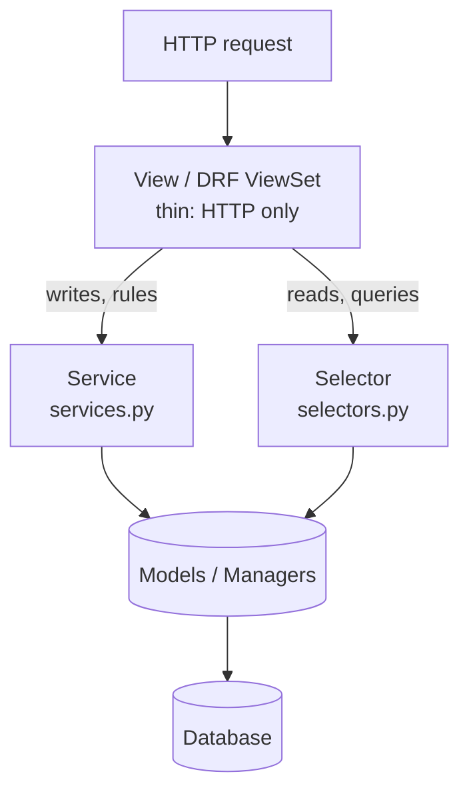
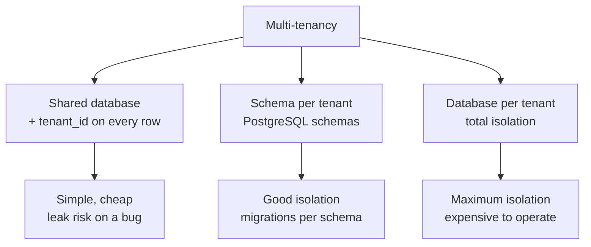

# Real-world patterns

!!! quote "Think like a child 🧒"
    Picture a restaurant kitchen. The **waiter** (the view) only takes the order
    and delivers the plate — they don't cook. The **chef** (the service layer)
    cooks, knowing the recipes and the house rules. And there's a **pantry** (the
    selectors) where someone only knows how to *fetch* ingredients, cooking
    nothing. When each person does one thing, the kitchen doesn't fall apart even
    when 200 orders arrive at once. "Real-world patterns" are that way of
    organizing the kitchen for the day the restaurant gets busy.

Django tutorials teach you to put everything in the view: `Post.objects.create(...)`,
send the email, charge the card, all inside one `def post(self, request)`. It
works for the first month. Then it becomes a tangle. This page gathers the
patterns production projects use to avoid that point — with the **tradeoffs** of
each, because none of them is free.

## Use case

Publishing a post should: validate, save, stamp the publication date, notify the
followers, and record an audit trail. In a "fat" view that becomes a 60-line
monster nobody can test without booting all of Django. The **service layer**
pattern moves that logic into a plain Python function, and the view stays three
lines long:

```python
# blog/services.py
from dataclasses import dataclass

from django.contrib.auth.models import User
from django.db import transaction
from django.utils import timezone

from blog.models import Post


@dataclass
class PublishResult:
    """Outcome of publishing a post.

    Attributes:
        post: The post that was published.
        notified: How many followers were queued for notification.
    """

    post: Post
    notified: int


@transaction.atomic
def publish_post(*, author: User, title: str, body: str) -> PublishResult:
    """Create a post, publish it, and notify the author's followers.

    Args:
        author: The user creating the post.
        title: The post title.
        body: The post body.

    Returns:
        A ``PublishResult`` with the created post and the follower count.

    Raises:
        ValueError: If the title is empty after stripping whitespace.
    """
    clean_title = title.strip()
    if not clean_title:
        raise ValueError("Title cannot be empty.")

    post = Post.objects.create(
        author=author,
        title=clean_title,
        body=body,
        published=True,
        published_at=timezone.now(),
    )
    followers = author.followers.count()
    return PublishResult(post=post, notified=followers)
```

```python
# blog/views.py
from django.contrib.auth.mixins import LoginRequiredMixin
from django.http import HttpRequest, HttpResponse
from django.shortcuts import redirect, render
from django.views import View

from blog.forms import PostForm
from blog.services import publish_post


class PublishPostView(LoginRequiredMixin, View):
    """Thin view that delegates all business logic to the service layer."""

    def post(self, request: HttpRequest) -> HttpResponse:
        """Validate the form and hand off to ``publish_post``."""
        form = PostForm(request.POST)
        if not form.is_valid():
            return render(request, "blog/post_form.html", {"form": form})

        result = publish_post(
            author=request.user,
            title=form.cleaned_data["title"],
            body=form.cleaned_data["body"],
        )
        return redirect("post-detail", pk=result.post.pk)
```

The view **doesn't know** how to publish — it knows how to pull data from the
form and call whoever does. Testing `publish_post` needs no HTTP and no request:
you call the function with arguments and assert on the return value.

## Possibilities

Here are the patterns that show up in almost every serious Django project, from
the most consensual to the most debated.



| Pattern | Solves | Cost / tradeoff |
| --- | --- | --- |
| **Service layer** | Business rules outside the view | More files; risk of an anemic model |
| **Selectors** | Reusable read queries | One more layer to maintain |
| **Soft-delete** | Never truly lose data | Every query must filter; `unique` gets tricky |
| **Audit fields** | Know who/when changed | More columns; you must inject the user |
| **Abstract base** | Don't repeat common fields | Migrations touch many models |
| **Feature flags** | Toggle without a deploy | Extra dependency; flags become junk if not cleaned |
| **Multi-tenancy** | Many clients, one system | Real complexity; the wrong choice is costly to revert |

### 1. Service layer — the chef

The rule is simple: **views (and DRF ViewSets) contain no business rules**. They
translate HTTP into function calls and translate the result back into HTTP. All
the logic that decides *what happens* lives in `services.py`.

Conventions that work well in practice:

- Service functions take **keyword arguments** (`*, author, title`), not a
  `request`. That makes their dependencies explicit and makes them testable.
- One function per use case: `publish_post`, `archive_post`, `transfer_author`.
- Wrap writes with multiple effects in `@transaction.atomic`.
- Raise domain exceptions (`ValueError`, or your own classes); the view decides
  which HTTP status that becomes.

!!! tip "A service is not a 'model manager by another name'"
    If the function only does `Model.objects.filter(...)`, it does **not** need
    to be a service — that's a read, and reads go in a selector or a QuerySet
    method. A service is for logic that **coordinates**: creates/updates several
    objects, calls external APIs, fires email/tasks, applies conditional rules.

!!! warning "Don't pass `request` into the service"
    The moment a service takes `request`, it becomes a hostage of HTTP: you can't
    call it from a management command, a Celery task, or a test without forging a
    request. Extract what you need (`request.user`) in the view and pass
    **values**.

### 2. Selectors — the pantry (fetch only)

While the service does writes and rules, the **selector** encapsulates **reads**:
queries with `select_related`, `prefetch_related`, `annotate`, permission
filters. It keeps the view (and the service) free of scattered SQL.

```python
# blog/selectors.py
from django.contrib.auth.models import User
from django.db.models import Count, QuerySet

from blog.models import Post


def get_published_posts() -> QuerySet[Post]:
    """Return published posts with author and comment count preloaded.

    Returns:
        A queryset of published posts ordered by publication date, with the
        related author joined and a ``comment_count`` annotation.
    """
    return (
        Post.objects.filter(published=True)
        .select_related("author")
        .annotate(comment_count=Count("comments"))
        .order_by("-published_at")
    )


def get_posts_visible_to(user: User) -> QuerySet[Post]:
    """Return posts the given user is allowed to see.

    Args:
        user: The requesting user.

    Returns:
        Published posts for anonymous/regular users; all posts for staff.
    """
    if user.is_staff:
        return Post.objects.all()
    return get_published_posts()
```

!!! note "A selector returns a QuerySet, not a list"
    Return the **QuerySet** (lazy), not `list(...)`. That way the view can still
    paginate, and evaluation happens once, at the right moment. And, following
    the REST convention, a selector that finds nothing returns an **empty
    queryset** — never raise `NotFound` for an empty list.

!!! info "Selector vs. QuerySet method — when to use each"
    A **QuerySet** method (`Post.objects.published()`) is great for a reusable,
    chainable filter. A **selector** is better when the read joins several
    models, applies a permission rule, or builds a complex query that doesn't
    belong on a single manager. See
    **[Model inheritance and managers](model-inheritance.md)** for the custom
    QuerySets.

### 3. Soft-delete + audit fields

In production, "delete" almost never means `DELETE`. You want an undo button, an
audit trail, and historical reports. The **soft-delete** pattern flags
`is_deleted=True` and hides the row by default through a manager.

```python
# blog/models.py
from django.conf import settings
from django.db import models
from django.utils import timezone


class SoftDeleteQuerySet(models.QuerySet):
    """QuerySet that knows how to soft-delete in bulk."""

    def delete(self) -> tuple[int, dict[str, int]]:
        """Soft-delete every row in the queryset.

        Returns:
            A ``(count, {})`` tuple mirroring Django's delete signature.
        """
        count = self.update(is_deleted=True, deleted_at=timezone.now())
        return count, {}

    def alive(self) -> "SoftDeleteQuerySet":
        """Return only rows that are not soft-deleted."""
        return self.filter(is_deleted=False)


class SoftDeleteManager(models.Manager):
    """Manager that hides soft-deleted rows by default."""

    def get_queryset(self) -> SoftDeleteQuerySet:
        """Return the base queryset filtered to non-deleted rows."""
        return SoftDeleteQuerySet(self.model, using=self._db).filter(
            is_deleted=False
        )


class TimeStampedModel(models.Model):
    """Abstract base with creation/update timestamps and audit fields.

    Every concrete model that inherits this gains ``created_at``,
    ``updated_at``, ``created_by`` and ``updated_by`` without redeclaring them.
    """

    created_at = models.DateTimeField(auto_now_add=True)
    updated_at = models.DateTimeField(auto_now=True)
    created_by = models.ForeignKey(
        settings.AUTH_USER_MODEL,
        on_delete=models.SET_NULL,
        null=True,
        blank=True,
        related_name="%(class)s_created",
    )
    updated_by = models.ForeignKey(
        settings.AUTH_USER_MODEL,
        on_delete=models.SET_NULL,
        null=True,
        blank=True,
        related_name="%(class)s_updated",
    )

    class Meta:
        abstract = True


class SoftDeleteModel(TimeStampedModel):
    """Abstract base adding soft-delete behavior on top of audit fields."""

    is_deleted = models.BooleanField(default=False)
    deleted_at = models.DateTimeField(null=True, blank=True)

    objects = SoftDeleteManager()
    all_objects = models.Manager()

    class Meta:
        abstract = True

    def delete(
        self, using: str | None = None, keep_parents: bool = False
    ) -> tuple[int, dict[str, int]]:
        """Soft-delete this row instead of removing it.

        Args:
            using: Optional database alias (kept for signature compatibility).
            keep_parents: Ignored; present for Django API compatibility.

        Returns:
            A ``(count, {})`` tuple mirroring Django's delete signature.
        """
        self.is_deleted = True
        self.deleted_at = timezone.now()
        self.save(update_fields=["is_deleted", "deleted_at"])
        return 1, {}
```

Now a concrete model inherits everything for free:

```python
class Comment(SoftDeleteModel):
    """A comment that is soft-deleted and fully audited."""

    post = models.ForeignKey(
        "blog.Post", on_delete=models.CASCADE, related_name="comments"
    )
    body = models.TextField()
```

Usage stays transparent:

```python
Comment.objects.all()      # only the living ones (is_deleted=False)
Comment.all_objects.all()  # everything, including deleted rows
comment.delete()           # flags is_deleted, doesn't vanish from the DB
```

!!! danger "Soft-delete breaks `unique` and haunts `related`"
    Two classic problems:

    1. **`unique=True` counts deleted rows.** If a user "deleted" the slug
       `my-post` and tries to create the same one again, the database refuses —
       the old row still occupies the value. Fix: a **conditional**
       `UniqueConstraint` that only applies to living rows.
    2. **Reverse `ForeignKey` still sees deleted rows** if you use `related_name`
       directly (`post.comments.all()` goes through the *relational* manager, not
       your filtered one). Always check.

    ```python
    from django.db import models
    from django.db.models import Q


    class Post(SoftDeleteModel):
        """A post whose slug is unique only among non-deleted rows."""

        slug = models.SlugField()

        class Meta:
            constraints = [
                models.UniqueConstraint(
                    fields=["slug"],
                    condition=Q(is_deleted=False),
                    name="unique_slug_when_alive",
                )
            ]
    ```

    Notice the `condition=` (Django 6.0) — the old `check=` on `CheckConstraint`
    was renamed to `condition=`, and `index_together` no longer exists: indexes
    go in `Meta.indexes`.

!!! tip "Who fills in `created_by`/`updated_by`?"
    Audit fields don't fill themselves — the model doesn't know the logged-in
    user. Pass the user **explicitly** in the service layer
    (`post.updated_by = actor`) or use a middleware that stores the current user
    in `contextvars` for a signal to read. The explicit way (via service) is more
    tedious and more honest; the middleware is magic and easier to forget. See
    **[Middleware](middleware.md)** for the `contextvars` approach.

### 4. `TimeStampedModel` abstract base — the stamp

You saw it above: an `abstract = True` carrying the common fields. It's the
cheapest, most universal pattern — practically every project has a
`TimeStampedModel`. The architectural advice:

- One **abstract base** per cross-cutting behavior (`TimeStampedModel`,
  `SoftDeleteModel`), and compose through inheritance.
- Don't overdo it: a `GodBaseModel` with 15 fields that every model inherits
  becomes coupling that's hard to change (every migration touches everything).

The inheritance details, `%(class)s` in `related_name`, and inherited managers
are in **[Model inheritance and managers](model-inheritance.md)**.

### 5. Feature flags — ship without deploying

A **feature flag** is a switch: you merge new code turned off and flip it on
later, for 5% of users, without a new deploy. The de facto library in the Django
ecosystem is **django-waffle**.

```python
# installation
# uv add django-waffle
# settings.py -> INSTALLED_APPS += ["waffle"]
# MIDDLEWARE += ["waffle.middleware.WaffleMiddleware"]

from django.http import HttpRequest, HttpResponse
from django.shortcuts import render

import waffle


def feed(request: HttpRequest) -> HttpResponse:
    """Render the new feed layout only when the flag is active."""
    if waffle.flag_is_active(request, "new-feed-layout"):
        return render(request, "blog/feed_v2.html")
    return render(request, "blog/feed_v1.html")
```

`django-waffle` distinguishes three things:

| Type | For what | Scope |
| --- | --- | --- |
| **Flag** | Toggle per user/group/percent/request | Fine segmentation |
| **Switch** | Global on/off toggle | Master switch |
| **Sample** | On X% of the time, random | Probabilistic rollout |

In a template:

```django


  

  

```

!!! warning "A forgotten flag is technical debt"
    Every flag should have a mental expiry date: as soon as the feature is 100%
    on and stable, **remove the flag and both code paths**. A project with 40
    dead flags has 40 branches nobody knows still matter.

!!! info "Do you need a flag?"
    For a simple, rare toggle, a variable in `settings.py` (read from the
    environment) already does the job — no new dependency. Reach for
    `django-waffle` when you want to **change at runtime** (via admin), segment by
    user, or do a percentage rollout. See other data and infra libraries in
    **[Data libraries](../libs/data-libs.md)**.

### 6. Multi-tenancy — one system, many clients

**Multi-tenancy** is when the same deployment serves several clients (tenants)
and one's data **cannot** leak into another's. There are two families, and the
choice is architectural (costly to revert).



**Approach A — shared database with a `tenant` FK (the most common).** Each row
carries which tenant it belongs to; a middleware resolves the tenant from the
request (by subdomain, header, or user) and you **always** filter by it.

```python
# blog/tenancy.py
import contextvars
from collections.abc import Callable

from django.http import HttpRequest, HttpResponse

current_tenant: contextvars.ContextVar[int | None] = contextvars.ContextVar(
    "current_tenant", default=None
)


class TenantMiddleware:
    """Resolve the tenant for each request from the subdomain.

    Stores the resolved tenant id in a context variable so managers and
    selectors downstream can scope every query without threading it through.
    """

    def __init__(
        self, get_response: Callable[[HttpRequest], HttpResponse]
    ) -> None:
        """Store the next callable in the middleware chain."""
        self.get_response = get_response

    def __call__(self, request: HttpRequest) -> HttpResponse:
        """Resolve the tenant, run the view, then reset the context."""
        host = request.get_host().split(":")[0]
        subdomain = host.split(".")[0]
        tenant_id = _lookup_tenant_id(subdomain)
        token = current_tenant.set(tenant_id)
        try:
            return self.get_response(request)
        finally:
            current_tenant.reset(token)


def _lookup_tenant_id(subdomain: str) -> int | None:
    """Map a subdomain to a tenant id.

    Args:
        subdomain: The leftmost label of the request host.

    Returns:
        The tenant id, or ``None`` when the subdomain is unknown.
    """
    from blog.models import Tenant

    return (
        Tenant.objects.filter(subdomain=subdomain)
        .values_list("id", flat=True)
        .first()
    )
```

```python
# blog/models.py
from django.db import models

from blog.tenancy import current_tenant


class TenantManager(models.Manager):
    """Manager that scopes every query to the current tenant."""

    def get_queryset(self) -> models.QuerySet:
        """Return rows for the active tenant only.

        Returns:
            The base queryset filtered by the tenant stored in the context
            variable; an empty queryset when no tenant is set.
        """
        qs = super().get_queryset()
        tenant_id = current_tenant.get()
        if tenant_id is None:
            return qs.none()
        return qs.filter(tenant_id=tenant_id)


class Article(models.Model):
    """A tenant-scoped article."""

    tenant = models.ForeignKey("blog.Tenant", on_delete=models.CASCADE)
    title = models.CharField(max_length=200)

    objects = TenantManager()
    all_objects = models.Manager()
```

**Approach B — schema per tenant.** Each client gets its own PostgreSQL schema;
the same table exists N times, isolated. The reference library is
**django-tenants**. Much better isolation, but you pay in complexity: migrations
run per schema, connections swap `search_path` on each request, and some features
(shared vs. per-tenant migrations) demand care.

| Criterion | Shared DB + FK | Schema per tenant |
| --- | --- | --- |
| Complexity | Low | Medium/high |
| Data isolation | Depends on code (leak risk on a bug) | Strong (the DB separates it) |
| Cost per tenant | Near zero | Grows with the number of schemas |
| Migrations | Once | Per schema |
| Good for | SaaS with many small tenants | Few large/regulated tenants |

!!! danger "In the shared DB, one forgotten `filter` leaks data"
    The weak point of approach A is human: it takes **one** query that used
    `all_objects` or forgot the `tenant_id` for a client to see another's data.
    Mitigate with a default manager that's always scoped (as above), tests that
    prove isolation, and strict review of any use of `all_objects`.

!!! tip "Start simple"
    For the vast majority of SaaS, **shared database + tenant FK** is the right
    choice: cheap, simple, and it scales well to thousands of tenants. Only go to
    schema/database per tenant when there's a compliance requirement, giant
    tenants, or a need for individual restores. See **[Middleware](middleware.md)**
    for the per-request resolution mechanism.

### 7. Fat model vs. service layer — the debate

You'll run into two camps of opinion, and both are partly right.

**"Fat models, thin views"** (the classic Django school, inherited from Rails):
domain logic lives in **model methods**. `post.publish()`, `post.archive()`. The
model owns its rules.

```python
class Post(models.Model):
    """A post that owns its own publishing behavior."""

    title = models.CharField(max_length=200)
    published = models.BooleanField(default=False)
    published_at = models.DateTimeField(null=True, blank=True)

    def publish(self) -> None:
        """Mark this post as published, stamping the time.

        Raises:
            ValueError: If the post has no title.
        """
        if not self.title.strip():
            raise ValueError("Cannot publish a post without a title.")
        self.published = True
        self.published_at = timezone.now()
        self.save(update_fields=["published", "published_at"])
```

**"Service layer"** (the HackSoftware Styleguide school and large systems): the
logic lives in **service functions**, and the model keeps data and local
validations. Good when the operation **crosses several models** or has external
effects (email, payment, queue).

| Criterion | Fat model | Service layer |
| --- | --- | --- |
| Where the rule lives | Model method | Function in `services.py` |
| Best when | Rule is about **one** object | Rule **coordinates several** objects/effects |
| Testability | Good (but needs the ORM) | Great (pure function, mock the rest) |
| Risk | Model becomes a giant "God object" | "Anemic" model, rules scattered |
| Import cycles | Rare | Careful: services import models |

!!! note "The mature answer is 'both'"
    It's not a religion. Use a **model method** for behavior intrinsic to one
    object (`post.is_editable_by(user)`, `invoice.total()`) and a **service** for
    orchestrating use cases (`publish_post`, `checkout_cart`). A practical signal:
    if the operation touches **one** aggregate and has no external effect, it's a
    model method; if it touches several or calls the outside world, it's a
    service. Avoid both extremes — neither the God model nor the anemic model
    that's just a `dataclass` with a table.

!!! quote "📖 In the official docs"
    - [Model methods](https://docs.djangoproject.com/en/6.0/topics/db/models/#model-methods)
    - [Managers](https://docs.djangoproject.com/en/6.0/topics/db/managers/)
    - [Constraints (UniqueConstraint, condition=)](https://docs.djangoproject.com/en/6.0/ref/models/constraints/)
    - [Middleware](https://docs.djangoproject.com/en/6.0/topics/http/middleware/)
    - [django-waffle](https://waffle.readthedocs.io/)
    - [django-tenants](https://django-tenants.readthedocs.io/)

## Recap

- **Service layer**: business rules live in `services.py`, with keyword arguments
  (never `request`); the view only translates HTTP. Wrap multiple writes in
  `@transaction.atomic`.
- **Selectors**: reusable reads (`select_related`, `annotate`, permissions) in
  `selectors.py`; they return a **QuerySet**, and an empty one when nothing
  matches.
- **Soft-delete**: `is_deleted` + `deleted_at` + a manager that hides deleted
  rows; watch out for `unique` (use `UniqueConstraint(condition=Q(is_deleted=False))`).
- **Audit fields** (`created_by`/`updated_by`): fill them explicitly in the
  service or via a middleware with `contextvars` — the model alone doesn't know
  the author.
- **Abstract base** (`TimeStampedModel`, `SoftDeleteModel`): compose through
  inheritance, without turning it into a God model.
- **Feature flags** (`django-waffle`): flag/switch/sample to ship without a
  deploy; remove the flag as soon as the feature stabilizes.
- **Multi-tenancy**: shared database + tenant FK (simple, watch for leaks) vs.
  schema per tenant with `django-tenants` (isolated, more complex). Start with
  the shared one.
- **Fat model vs. service**: model method for single-object behavior; service for
  orchestration and external effects. Use both with good judgment.

For the mechanisms behind these patterns, see
**[Model inheritance and managers](model-inheritance.md)**,
**[Middleware](middleware.md)**, and the
**[Data libraries](../libs/data-libs.md)**.
