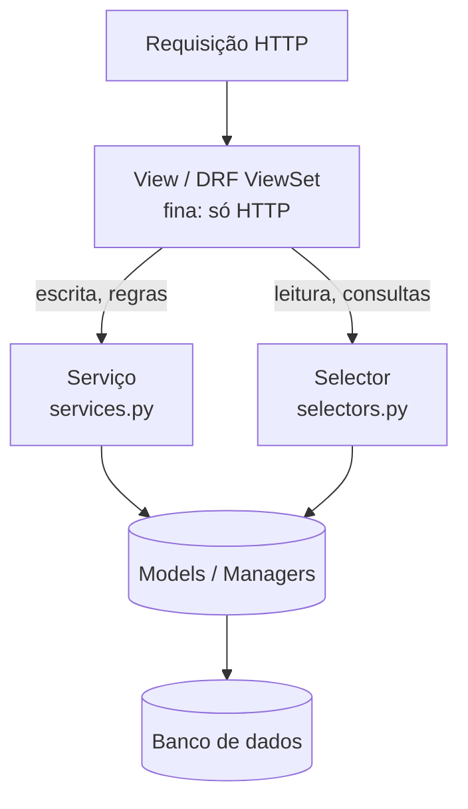
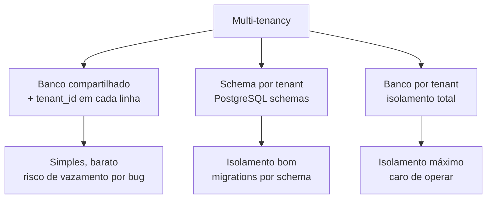

# Padroes do mundo real

!!! quote "Pensa como criança 🧒"
    Imagine uma cozinha de restaurante. O **garçom** (a view) só anota o pedido e
    entrega o prato — ele não cozinha. Quem cozinha é o **chef** (a camada de
    serviço), que conhece as receitas e as regras da casa. E existe um **estoque**
    (os selectors) onde alguém só sabe *buscar* ingredientes, sem cozinhar nada.
    Quando cada pessoa faz uma coisa só, a cozinha não vira bagunça mesmo quando
    chegam 200 pedidos. Os "padrões do mundo real" são esse jeito de organizar a
    cozinha para o dia em que o restaurante fica cheio.

Tutoriais de Django ensinam a botar tudo na view: `Post.objects.create(...)`,
enviar e-mail, cobrar o cartão, tudo no mesmo `def post(self, request)`. Funciona
no primeiro mês. Depois vira um novelo. Esta página reúne os padrões que projetos
de produção usam para não chegar nesse ponto — com os **tradeoffs** de cada um,
porque nenhum é grátis.

## Caso de uso

Publicar um post deveria: validar, salvar, marcar a data de publicação, notificar
os seguidores e registrar auditoria. Numa view "gorda" isso vira um monstro de 60
linhas que ninguém consegue testar sem subir o Django inteiro. O padrão de
**camada de serviço** move essa lógica para uma função pura de Python, e a view
fica com três linhas:

```python
# blog/services.py
from dataclasses import dataclass

from django.contrib.auth.models import User
from django.db import transaction
from django.utils import timezone

from blog.models import Post


@dataclass
class PublishResult:
    """Outcome of publishing a post.

    Attributes:
        post: The post that was published.
        notified: How many followers were queued for notification.
    """

    post: Post
    notified: int


@transaction.atomic
def publish_post(*, author: User, title: str, body: str) -> PublishResult:
    """Create a post, publish it, and notify the author's followers.

    Args:
        author: The user creating the post.
        title: The post title.
        body: The post body.

    Returns:
        A ``PublishResult`` with the created post and the follower count.

    Raises:
        ValueError: If the title is empty after stripping whitespace.
    """
    clean_title = title.strip()
    if not clean_title:
        raise ValueError("Title cannot be empty.")

    post = Post.objects.create(
        author=author,
        title=clean_title,
        body=body,
        published=True,
        published_at=timezone.now(),
    )
    followers = author.followers.count()
    return PublishResult(post=post, notified=followers)
```

```python
# blog/views.py
from django.contrib.auth.mixins import LoginRequiredMixin
from django.http import HttpRequest, HttpResponse
from django.shortcuts import redirect, render
from django.views import View

from blog.forms import PostForm
from blog.services import publish_post


class PublishPostView(LoginRequiredMixin, View):
    """Thin view that delegates all business logic to the service layer."""

    def post(self, request: HttpRequest) -> HttpResponse:
        """Validate the form and hand off to ``publish_post``."""
        form = PostForm(request.POST)
        if not form.is_valid():
            return render(request, "blog/post_form.html", {"form": form})

        result = publish_post(
            author=request.user,
            title=form.cleaned_data["title"],
            body=form.cleaned_data["body"],
        )
        return redirect("post-detail", pk=result.post.pk)
```

A view **não sabe** como publicar — ela sabe pegar dados do formulário e chamar
quem sabe. O teste do `publish_post` não precisa de HTTP nem de request: você
chama a função com argumentos e verifica o retorno.

## Possibilidades

Aqui estão os padrões que aparecem em quase todo projeto Django sério, do mais
consensual ao mais debatido.



| Padrão | Resolve | Custo / tradeoff |
| --- | --- | --- |
| **Camada de serviço** | Regras de negócio fora da view | Mais arquivos; risco de anemia no model |
| **Selectors** | Consultas de leitura reutilizáveis | Mais uma camada para manter |
| **Soft-delete** | Nunca perder dados de verdade | Todo query precisa filtrar; `unique` fica chato |
| **Campos de auditoria** | Saber quem/quando mudou | Mais colunas; precisa injetar o usuário |
| **Base abstrata** | Não repetir campos comuns | Migrations tocam muitos modelos |
| **Feature flags** | Ligar/desligar sem deploy | Dependência extra; flags viram lixo se não limpar |
| **Multi-tenancy** | Vários clientes, um sistema | Complexidade real; escolha errada é cara de reverter |

### 1. Camada de serviço — o chef

A regra é simples: **views (e ViewSets do DRF) não contêm regra de negócio**.
Elas traduzem HTTP em chamadas de função e traduzem o resultado de volta em
HTTP. Toda a lógica que decide *o que acontece* vive em `services.py`.

Convenções que funcionam bem na prática:

- Funções de serviço recebem **argumentos nomeados** (`*, author, title`), não um
  `request`. Isso deixa claro do que elas dependem e as torna testáveis.
- Uma função por caso de uso: `publish_post`, `archive_post`, `transfer_author`.
- Envolva escritas com efeitos múltiplos em `@transaction.atomic`.
- Levante exceções de domínio (`ValueError`, ou classes próprias); a view decide
  qual status HTTP isso vira.

!!! tip "Serviço não é 'model manager com outro nome'"
    Se a função só faz `Model.objects.filter(...)`, ela **não** precisa ser um
    serviço — isso é leitura, e leitura vai em selector ou num método de QuerySet.
    Serviço é para lógica que **coordena**: cria/atualiza vários objetos, chama
    APIs externas, dispara e-mail/tarefas, aplica regras condicionais.

!!! warning "Não passe `request` para dentro do serviço"
    Assim que um serviço recebe `request`, ele vira refém do HTTP: você não
    consegue chamá-lo de um comando de management, de uma tarefa Celery ou de um
    teste sem forjar uma request. Extraia o que precisa (`request.user`) na view
    e passe **valores**.

### 2. Selectors — o estoque (só buscar)

Enquanto o serviço faz escrita e regra, o **selector** encapsula **leitura**:
consultas com `select_related`, `prefetch_related`, `annotate`, filtros de
permissão. Deixa a view (e o serviço) sem SQL espalhado.

```python
# blog/selectors.py
from django.contrib.auth.models import User
from django.db.models import Count, QuerySet

from blog.models import Post


def get_published_posts() -> QuerySet[Post]:
    """Return published posts with author and comment count preloaded.

    Returns:
        A queryset of published posts ordered by publication date, with the
        related author joined and a ``comment_count`` annotation.
    """
    return (
        Post.objects.filter(published=True)
        .select_related("author")
        .annotate(comment_count=Count("comments"))
        .order_by("-published_at")
    )


def get_posts_visible_to(user: User) -> QuerySet[Post]:
    """Return posts the given user is allowed to see.

    Args:
        user: The requesting user.

    Returns:
        Published posts for anonymous/regular users; all posts for staff.
    """
    if user.is_staff:
        return Post.objects.all()
    return get_published_posts()
```

!!! note "Selector devolve QuerySet, não lista"
    Devolva o **QuerySet** (preguiçoso), não `list(...)`. Assim a view ainda pode
    paginar, e a avaliação só acontece uma vez, no momento certo. E, seguindo a
    convenção REST, um selector que não acha nada devolve um **queryset vazio** —
    nunca levante `NotFound` por lista vazia.

!!! info "Selector × método de QuerySet — quando usar cada um"
    Um método de **QuerySet** (`Post.objects.published()`) é ótimo para um filtro
    reutilizável e encadeável. Um **selector** é melhor quando a leitura combina
    vários modelos, aplica regra de permissão, ou monta uma consulta complexa que
    não faz sentido pendurar num único manager. Veja
    **[Herança de modelos e managers](model-inheritance.md)** para os QuerySets
    customizados.

### 3. Soft-delete + campos de auditoria

Em produção, "apagar" quase nunca significa `DELETE`. Você quer um botão de
desfazer, uma trilha de auditoria e relatórios históricos. O padrão **soft-delete**
marca `is_deleted=True` e esconde o registro por padrão através de um manager.

```python
# blog/models.py
from django.conf import settings
from django.db import models
from django.utils import timezone


class SoftDeleteQuerySet(models.QuerySet):
    """QuerySet that knows how to soft-delete in bulk."""

    def delete(self) -> tuple[int, dict[str, int]]:
        """Soft-delete every row in the queryset.

        Returns:
            A ``(count, {})`` tuple mirroring Django's delete signature.
        """
        count = self.update(is_deleted=True, deleted_at=timezone.now())
        return count, {}

    def alive(self) -> "SoftDeleteQuerySet":
        """Return only rows that are not soft-deleted."""
        return self.filter(is_deleted=False)


class SoftDeleteManager(models.Manager):
    """Manager that hides soft-deleted rows by default."""

    def get_queryset(self) -> SoftDeleteQuerySet:
        """Return the base queryset filtered to non-deleted rows."""
        return SoftDeleteQuerySet(self.model, using=self._db).filter(
            is_deleted=False
        )


class TimeStampedModel(models.Model):
    """Abstract base with creation/update timestamps and audit fields.

    Every concrete model that inherits this gains ``created_at``,
    ``updated_at``, ``created_by`` and ``updated_by`` without redeclaring them.
    """

    created_at = models.DateTimeField(auto_now_add=True)
    updated_at = models.DateTimeField(auto_now=True)
    created_by = models.ForeignKey(
        settings.AUTH_USER_MODEL,
        on_delete=models.SET_NULL,
        null=True,
        blank=True,
        related_name="%(class)s_created",
    )
    updated_by = models.ForeignKey(
        settings.AUTH_USER_MODEL,
        on_delete=models.SET_NULL,
        null=True,
        blank=True,
        related_name="%(class)s_updated",
    )

    class Meta:
        abstract = True


class SoftDeleteModel(TimeStampedModel):
    """Abstract base adding soft-delete behavior on top of audit fields."""

    is_deleted = models.BooleanField(default=False)
    deleted_at = models.DateTimeField(null=True, blank=True)

    objects = SoftDeleteManager()
    all_objects = models.Manager()

    class Meta:
        abstract = True

    def delete(
        self, using: str | None = None, keep_parents: bool = False
    ) -> tuple[int, dict[str, int]]:
        """Soft-delete this row instead of removing it.

        Args:
            using: Optional database alias (kept for signature compatibility).
            keep_parents: Ignored; present for Django API compatibility.

        Returns:
            A ``(count, {})`` tuple mirroring Django's delete signature.
        """
        self.is_deleted = True
        self.deleted_at = timezone.now()
        self.save(update_fields=["is_deleted", "deleted_at"])
        return 1, {}
```

Agora um modelo concreto herda tudo de graça:

```python
class Comment(SoftDeleteModel):
    """A comment that is soft-deleted and fully audited."""

    post = models.ForeignKey(
        "blog.Post", on_delete=models.CASCADE, related_name="comments"
    )
    body = models.TextField()
```

O uso fica transparente:

```python
Comment.objects.all()      # só os vivos (is_deleted=False)
Comment.all_objects.all()  # todos, inclusive os apagados
comment.delete()           # marca is_deleted, não some do banco
```

!!! danger "Soft-delete quebra `unique` e assombra `related`"
    Dois problemas clássicos:

    1. **`unique=True` conta os apagados.** Se um usuário "apagou" o slug
       `meu-post` e tenta criar outro igual, o banco recusa — o registro antigo
       ainda ocupa o valor. Solução: uma `UniqueConstraint` **condicional** que
       só vale para os vivos.
    2. **`ForeignKey` reversa ainda enxerga apagados** se você usar
       `related_name` diretamente (`post.comments.all()` passa pelo manager
       *relacional*, não pelo seu manager filtrado). Confira sempre.

    ```python
    from django.db import models
    from django.db.models import Q


    class Post(SoftDeleteModel):
        """A post whose slug is unique only among non-deleted rows."""

        slug = models.SlugField()

        class Meta:
            constraints = [
                models.UniqueConstraint(
                    fields=["slug"],
                    condition=Q(is_deleted=False),
                    name="unique_slug_when_alive",
                )
            ]
    ```

    Repare no `condition=` (Django 6.0) — o antigo `check=` de `CheckConstraint`
    foi renomeado para `condition=`, e `index_together` não existe mais: índices
    vão em `Meta.indexes`.

!!! tip "Quem preenche `created_by`/`updated_by`?"
    Os campos de auditoria não se preenchem sozinhos — o model não conhece o
    usuário logado. Passe o usuário **explicitamente** na camada de serviço
    (`post.updated_by = actor`) ou use um middleware que guarda o usuário atual
    em `contextvars` para um signal ler. O jeito explícito (via serviço) é mais
    chato e mais honesto; o middleware é mágico e mais fácil de esquecer. Veja
    **[Middleware](middleware.md)** para a abordagem com `contextvars`.

### 4. Base abstrata `TimeStampedModel` — o carimbo

Você já viu acima: um `abstract = True` que carrega os campos comuns. É o padrão
mais barato e mais universal — praticamente todo projeto tem um
`TimeStampedModel`. A recomendação de arquitetura:

- Uma **base abstrata** por comportamento transversal (`TimeStampedModel`,
  `SoftDeleteModel`), e componha por herança.
- Não exagere: uma `GodBaseModel` com 15 campos que todo modelo herda vira um
  acoplamento difícil de mudar (cada migration mexe em tudo).

Os detalhes de herança, `%(class)s` em `related_name`, e managers herdados estão
em **[Herança de modelos e managers](model-inheritance.md)**.

### 5. Feature flags — ligar sem deploy

Uma **feature flag** é um interruptor: você mergeia código novo desligado e o
liga depois, para 5% dos usuários, sem novo deploy. A biblioteca de fato no
ecossistema Django é o **django-waffle**.

```python
# instalação
# uv add django-waffle
# settings.py -> INSTALLED_APPS += ["waffle"]
# MIDDLEWARE += ["waffle.middleware.WaffleMiddleware"]

from django.http import HttpRequest, HttpResponse
from django.shortcuts import render

import waffle


def feed(request: HttpRequest) -> HttpResponse:
    """Render the new feed layout only when the flag is active."""
    if waffle.flag_is_active(request, "new-feed-layout"):
        return render(request, "blog/feed_v2.html")
    return render(request, "blog/feed_v1.html")
```

O `django-waffle` distingue três coisas:

| Tipo | Para quê | Escopo |
| --- | --- | --- |
| **Flag** | Liga por usuário/grupo/porcentagem/request | Segmentação fina |
| **Switch** | Liga/desliga global (on/off) | Chave mestra |
| **Sample** | Liga em X% das vezes, aleatório | Rollout probabilístico |

Em template:

```django


  

  

```

!!! warning "Flag esquecida é dívida técnica"
    Toda flag deve ter data de validade mental: assim que a feature está 100%
    ligada e estável, **remova a flag e os dois caminhos de código**. Um projeto
    com 40 flags mortas tem 40 ramificações que ninguém sabe se ainda importam.

!!! info "Precisa de flag?"
    Para um toggle simples e raro, uma variável em `settings.py` (lida do
    ambiente) já resolve — sem dependência nova. Puxe o `django-waffle` quando
    você quer **mudar em runtime** (via admin), segmentar por usuário, ou fazer
    rollout percentual. Veja outras libs de dados e infra em
    **[Bibliotecas de dados](../libs/data-libs.md)**.

### 6. Multi-tenancy — um sistema, vários clientes

**Multi-tenancy** é quando o mesmo deploy serve vários clientes (tenants) e os
dados de um **não** podem vazar para o outro. Existem duas famílias, e a escolha
é arquitetural (cara de reverter).



**Abordagem A — banco compartilhado com `tenant` FK (o mais comum).** Cada linha
carrega para qual tenant pertence; um middleware descobre o tenant da requisição
(pelo subdomínio, header ou usuário) e você **sempre** filtra por ele.

```python
# blog/tenancy.py
import contextvars
from collections.abc import Callable

from django.http import HttpRequest, HttpResponse

current_tenant: contextvars.ContextVar[int | None] = contextvars.ContextVar(
    "current_tenant", default=None
)


class TenantMiddleware:
    """Resolve the tenant for each request from the subdomain.

    Stores the resolved tenant id in a context variable so managers and
    selectors downstream can scope every query without threading it through.
    """

    def __init__(
        self, get_response: Callable[[HttpRequest], HttpResponse]
    ) -> None:
        """Store the next callable in the middleware chain."""
        self.get_response = get_response

    def __call__(self, request: HttpRequest) -> HttpResponse:
        """Resolve the tenant, run the view, then reset the context."""
        host = request.get_host().split(":")[0]
        subdomain = host.split(".")[0]
        tenant_id = _lookup_tenant_id(subdomain)
        token = current_tenant.set(tenant_id)
        try:
            return self.get_response(request)
        finally:
            current_tenant.reset(token)


def _lookup_tenant_id(subdomain: str) -> int | None:
    """Map a subdomain to a tenant id.

    Args:
        subdomain: The leftmost label of the request host.

    Returns:
        The tenant id, or ``None`` when the subdomain is unknown.
    """
    from blog.models import Tenant

    return (
        Tenant.objects.filter(subdomain=subdomain)
        .values_list("id", flat=True)
        .first()
    )
```

```python
# blog/models.py
from django.db import models

from blog.tenancy import current_tenant


class TenantManager(models.Manager):
    """Manager that scopes every query to the current tenant."""

    def get_queryset(self) -> models.QuerySet:
        """Return rows for the active tenant only.

        Returns:
            The base queryset filtered by the tenant stored in the context
            variable; an empty queryset when no tenant is set.
        """
        qs = super().get_queryset()
        tenant_id = current_tenant.get()
        if tenant_id is None:
            return qs.none()
        return qs.filter(tenant_id=tenant_id)


class Article(models.Model):
    """A tenant-scoped article."""

    tenant = models.ForeignKey("blog.Tenant", on_delete=models.CASCADE)
    title = models.CharField(max_length=200)

    objects = TenantManager()
    all_objects = models.Manager()
```

**Abordagem B — schema por tenant.** Cada cliente ganha um schema PostgreSQL
próprio; a mesma tabela existe N vezes, isolada. A biblioteca de referência é o
**django-tenants**. Isolamento muito melhor, mas você paga em complexidade:
migrations rodam por schema, conexões trocam de `search_path` a cada request, e
alguns recursos (migrations compartilhadas vs. por-tenant) exigem cuidado.

| Critério | Banco compartilhado + FK | Schema por tenant |
| --- | --- | --- |
| Complexidade | Baixa | Média/alta |
| Isolamento de dados | Depende do código (risco de bug vazar) | Forte (o banco separa) |
| Custo por tenant | Quase zero | Cresce com nº de schemas |
| Migrations | Uma vez | Por schema |
| Bom para | SaaS com muitos tenants pequenos | Poucos tenants grandes/regulados |

!!! danger "No banco compartilhado, um `filter` esquecido vaza dados"
    O ponto fraco da abordagem A é humano: basta **uma** consulta que usou
    `all_objects` ou esqueceu o `tenant_id` para um cliente ver dados de outro.
    Mitigue com o manager padrão sempre escopado (como acima), testes que provam
    o isolamento, e revisão rígida de qualquer uso de `all_objects`.

!!! tip "Comece simples"
    Para a grande maioria dos SaaS, **banco compartilhado + FK de tenant** é a
    escolha certa: barato, simples e escala bem para milhares de tenants. Só vá
    para schema/banco por tenant quando houver exigência de compliance, tenants
    gigantes, ou necessidade de restore individual. Veja
    **[Middleware](middleware.md)** para o mecanismo de resolução por request.

### 7. Fat model vs. camada de serviço — o debate

Você vai encontrar dois campos de opinião, e os dois estão parcialmente certos.

**"Fat models, thin views"** (a escola clássica do Django, herdada de Rails): a
lógica de domínio mora em **métodos do model**. `post.publish()`, `post.archive()`.
O model é o dono das suas regras.

```python
class Post(models.Model):
    """A post that owns its own publishing behavior."""

    title = models.CharField(max_length=200)
    published = models.BooleanField(default=False)
    published_at = models.DateTimeField(null=True, blank=True)

    def publish(self) -> None:
        """Mark this post as published, stamping the time.

        Raises:
            ValueError: If the post has no title.
        """
        if not self.title.strip():
            raise ValueError("Cannot publish a post without a title.")
        self.published = True
        self.published_at = timezone.now()
        self.save(update_fields=["published", "published_at"])
```

**"Camada de serviço"** (a escola do HackSoftware Styleguide e de sistemas
grandes): a lógica mora em **funções de serviço**, e o model fica com dados e
validações locais. Bom quando a operação **cruza vários modelos** ou tem efeitos
externos (e-mail, pagamento, fila).

| Critério | Fat model | Camada de serviço |
| --- | --- | --- |
| Onde mora a regra | Método do model | Função em `services.py` |
| Melhor quando | Regra é de **um** objeto | Regra **coordena vários** objetos/efeitos |
| Testabilidade | Boa (mas precisa do ORM) | Ótima (função pura, mocka o resto) |
| Risco | Model vira "God object" gigante | Model "anêmico", regra espalhada |
| Import cycles | Raros | Cuidado: serviço importa models |

!!! note "A resposta madura é 'os dois'"
    Não é religião. Use **método de model** para comportamento intrínseco de um
    objeto (`post.is_editable_by(user)`, `invoice.total()`) e **serviço** para
    casos de uso que orquestram (`publish_post`, `checkout_cart`). Um sinal
    prático: se a operação toca **um** agregado e não tem efeito externo, é
    método de model; se toca vários ou chama o mundo externo, é serviço. Evite os
    dois extremos — nem o God model, nem o model anêmico que é só um `dataclass`
    com tabela.

!!! quote "📖 Na documentação oficial"
    - [Model methods](https://docs.djangoproject.com/en/6.0/topics/db/models/#model-methods)
    - [Managers](https://docs.djangoproject.com/en/6.0/topics/db/managers/)
    - [Constraints (UniqueConstraint, condition=)](https://docs.djangoproject.com/en/6.0/ref/models/constraints/)
    - [Middleware](https://docs.djangoproject.com/en/6.0/topics/http/middleware/)
    - [django-waffle](https://waffle.readthedocs.io/)
    - [django-tenants](https://django-tenants.readthedocs.io/)

## Recap

- **Camada de serviço**: regra de negócio vive em `services.py`, com argumentos
  nomeados (nunca `request`); a view só traduz HTTP. Envolva escritas múltiplas
  em `@transaction.atomic`.
- **Selectors**: leitura reutilizável (`select_related`, `annotate`, permissão)
  em `selectors.py`; devolvem **QuerySet**, e vazio quando não acham nada.
- **Soft-delete**: `is_deleted` + `deleted_at` + manager que esconde apagados;
  cuidado com `unique` (use `UniqueConstraint(condition=Q(is_deleted=False))`).
- **Campos de auditoria** (`created_by`/`updated_by`): preencha explicitamente no
  serviço ou via middleware com `contextvars` — o model sozinho não sabe o autor.
- **Base abstrata** (`TimeStampedModel`, `SoftDeleteModel`): componha por herança,
  sem virar um God model.
- **Feature flags** (`django-waffle`): flag/switch/sample para ligar sem deploy;
  remova a flag assim que a feature estabiliza.
- **Multi-tenancy**: banco compartilhado + FK de tenant (simples, cuidado com
  vazamento) vs. schema por tenant com `django-tenants` (isolado, mais complexo).
  Comece pelo compartilhado.
- **Fat model vs. serviço**: método de model para comportamento de um objeto;
  serviço para orquestração e efeitos externos. Use os dois com bom senso.

Para os mecanismos que sustentam esses padrões, veja
**[Herança de modelos e managers](model-inheritance.md)**,
**[Middleware](middleware.md)** e as
**[Bibliotecas de dados](../libs/data-libs.md)**.
