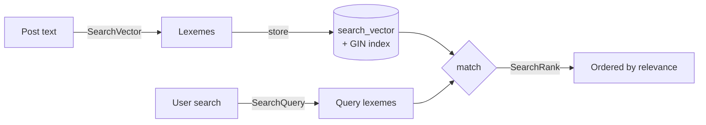

# Full-text search (PostgreSQL)

!!! quote "Think like a child 🧒"
    Two ways to find a toy in the box. First: you look piece by piece until you
    find one whose name has the letters you want — slow and literal. Second:
    someone already **sorted the toys by topic** ("cars", "dolls") and you ask
    "I want the racing ones" and get every car, even if spelled differently.
    Full-text search is the second way: Postgres understands **words and their
    meaning**, not just letters.

## Use case

You have a blog and want real search: the user types `"run marathon"` and you want
posts whose **title or body** talk about it — ignoring case, accents and
variations like "running" / "runs". With `icontains` that's impossible; with
PostgreSQL full-text search it's one line:

```python
from django.contrib.postgres.search import SearchVector
from blog.models import Post

results = Post.objects.annotate(
    document=SearchVector("title", "body"),
).filter(document="run marathon")

for post in results:
    print(post.title)
```

Postgres reduces each text to **lexemes** (word roots) and compares the query's
lexemes to the document's. "running" and "run" become the same root — that's why
it works.

!!! danger "PostgreSQL only"
    Everything on this page comes from `django.contrib.postgres` and uses native
    PostgreSQL features. It **does not work** on SQLite, MySQL or Oracle. If your
    development database is SQLite, these queries will fail — run against Postgres.

## Possibilities

### Enable the `django.contrib.postgres` app

Before anything else, add the app to your settings. It registers the lookups
(`search`, `trigram_similar`, etc.) and the special fields:

```python
INSTALLED_APPS = [
    "django.contrib.postgres",
    "blog",
]
```

### The three pieces: `SearchVector`, `SearchQuery`, `SearchRank`

| Piece | What it is | Analogy |
| --- | --- | --- |
| `SearchVector` | The processed **document** (text turned into lexemes) | The toys already sorted by topic |
| `SearchQuery` | The searched **term**, also turned into lexemes | The request "I want the racing ones" |
| `SearchRank` | Each result's **relevance score** | How well each toy matches the request |

The search is the crossing of a `SearchVector` with a `SearchQuery`:

```python
from django.contrib.postgres.search import SearchQuery, SearchVector
from blog.models import Post

vector = SearchVector("title", "body")
query = SearchQuery("run marathon")

results = Post.objects.annotate(document=vector).filter(document=query)
```

!!! tip "`filter(document=\"text\")` is a shortcut for `SearchQuery`"
    Passing a raw string in the filter creates a `SearchQuery` under the hood. Use
    an explicit `SearchQuery(...)` when you want to control `search_type` or the
    language (see below).

### Ordering by relevance with `SearchRank`

Filtering says **which** posts match; `SearchRank` says **how well** each one
matches, so you can order from most to least relevant:

```python
from django.contrib.postgres.search import SearchQuery, SearchRank, SearchVector
from blog.models import Post

vector = SearchVector("title", "body")
query = SearchQuery("run marathon")

results = (
    Post.objects
    .annotate(rank=SearchRank(vector, query))
    .filter(rank__gt=0)
    .order_by("-rank")
)

for post in results:
    print(post.title, round(post.rank, 3))
```

!!! note "Why `rank__gt=0`?"
    A `rank` of `0` means "no lexemes in common" — no match. Filtering by
    `rank__gt=0` keeps only what actually matched, without needing a separate
    `.filter(document=query)`.

### Weights: title matters more than body

Not every field is equally important. A hit in the **title** should weigh more
than a hit in the **body**. PostgreSQL has four weights, `"A"` (highest) to `"D"`
(lowest), and you combine weighted vectors:

```python
from django.contrib.postgres.search import SearchQuery, SearchRank, SearchVector
from blog.models import Post

vector = (
    SearchVector("title", weight="A")
    + SearchVector("body", weight="B")
)
query = SearchQuery("run marathon")

results = (
    Post.objects
    .annotate(rank=SearchRank(vector, query))
    .filter(rank__gt=0)
    .order_by("-rank")
)
```

| Weight | Default multiplier | Typical use |
| --- | --- | --- |
| `"A"` | 1.0 | Title, name |
| `"B"` | 0.4 | Body, summary |
| `"C"` | 0.2 | Tags, category |
| `"D"` | 0.1 | Metadata, comments |

### Query types: `search_type`

`SearchQuery` accepts `search_type` to interpret the text in different ways:

```python
from django.contrib.postgres.search import SearchQuery

# default: every term must match (AND between lexemes)
SearchQuery("run marathon")

# exact phrase, in order
SearchQuery("run marathon", search_type="phrase")

# user boolean syntax: run & (marathon | race)
SearchQuery("run & (marathon | race)", search_type="raw")

# web-style operators: quotes, OR, - to exclude
SearchQuery('"run marathon" -trail', search_type="websearch")
```

| `search_type` | Interprets the text as |
| --- | --- |
| `"plain"` (default) | Terms combined with AND |
| `"phrase"` | Exact phrase, keeping the order |
| `"raw"` | Raw `tsquery` syntax (`&`, `\|`, `!`, parentheses) |
| `"websearch"` | Google-style: quotes, `OR`, `-term` |

!!! tip "`websearch` is the friendliest for search boxes"
    If the text comes straight from a user input, `search_type="websearch"` is the
    safest: it understands quotes and `-` and never breaks on invalid syntax.

### Language and accents: the `config`

Lexemes depend on the language — "running → run" only happens if Postgres knows
it's English. Pass `config`:

```python
from django.contrib.postgres.search import SearchQuery, SearchVector

vector = SearchVector("title", "body", config="english")
query = SearchQuery("run marathon", config="english")
```

!!! info "Consistent language"
    Use the **same** `config` on the vector and the query. Different languages
    produce incompatible lexemes and the search won't match. `"english"`,
    `"portuguese"`, `"simple"` (no stemming) are common values.

### The performance problem: `SearchVectorField` + GIN index

Computing the `SearchVector` on every query re-reads and re-processes the text of
**every row** — slow on large tables. The fix is to **materialize** the vector in
a column and index it with a **GIN** index.

First, the field on the model:

```python
from django.contrib.postgres.indexes import GinIndex
from django.contrib.postgres.search import SearchVectorField
from django.db import models


class Post(models.Model):
    """Blog post with a persisted full-text search vector."""

    title = models.CharField(max_length=200)
    body = models.TextField()
    search_vector = SearchVectorField(null=True)

    class Meta:
        indexes = [
            GinIndex(fields=["search_vector"]),
        ]
```

Then `makemigrations` + `migrate`. Now the search reads the ready-made column,
without recomputing:

```python
from django.contrib.postgres.search import SearchQuery
from blog.models import Post

results = Post.objects.filter(
    search_vector=SearchQuery("run marathon", config="english"),
)
```

!!! warning "The column doesn't update itself"
    `SearchVectorField` stores the vector, but **something has to fill it** when
    the post changes. Two strategies:

    - **In code**: recompute after saving with an `update()`.
    - **In the database**: a PostgreSQL trigger (via a `RunSQL` migration) that
      updates the column automatically — more robust, immune to saves that bypass
      the ORM.

Updating via the ORM, in bulk:

```python
from django.contrib.postgres.search import SearchVector
from blog.models import Post

Post.objects.update(
    search_vector=SearchVector("title", weight="A", config="english")
    + SearchVector("body", weight="B", config="english"),
)
```



### Similarity search: `TrigramSimilarity`

Full-text is great for **whole words**, but misses **typos** and proper nouns:
"marathon" vs "marathn" don't match by lexeme. That's where **trigram similarity**
comes in — Postgres breaks the text into 3-letter chunks and measures how much two
texts overlap.

It needs the `pg_trgm` extension, enabled by a migration:

```python
from django.contrib.postgres.operations import TrigramExtension
from django.db import migrations


class Migration(migrations.Migration):
    """Enable the pg_trgm PostgreSQL extension."""

    dependencies = [
        ("blog", "0001_initial"),
    ]

    operations = [
        TrigramExtension(),
    ]
```

With the extension active, search by similarity and order by the score (0 to 1):

```python
from django.contrib.postgres.search import TrigramSimilarity
from blog.models import Author

results = (
    Author.objects
    .annotate(similarity=TrigramSimilarity("display_name", "mauricio"))
    .filter(similarity__gt=0.3)
    .order_by("-similarity")
)

for author in results:
    print(author.display_name, round(author.similarity, 3))
```

!!! tip "Full-text and trigrams complement each other"
    Use **full-text** for searching long texts (posts, articles) and **trigrams**
    for short fields with typos (names, cities, emails), or as a _fallback_ when
    full-text returns nothing.

### When to use what

| You need... | Tool | Why |
| --- | --- | --- |
| "contains this literal chunk" | `__icontains` | Simple, works on any database, but doesn't scale and ignores meaning |
| Word/relevance search over text | `SearchVector` + `SearchQuery` + `SearchRank` | Understands lexemes, stemming, weights and language; native to Postgres |
| Typo tolerance | `TrigramSimilarity` | Compares by character similarity, not exact word |
| "Search-engine" search at massive scale, facets, suggestions, geo | Elasticsearch / OpenSearch | Outside the database; use when Postgres can't keep up or you need dedicated search-engine features |

!!! note "Don't skip steps"
    The vast majority of projects **never** need Elasticsearch. Start with
    PostgreSQL full-text search: zero extra infrastructure, transactional, and it
    handles up to millions of rows well with the GIN index. Only move to a
    dedicated engine when you have a real scale or feature pain.

!!! quote "📖 In the official docs"
    - [Full text search](https://docs.djangoproject.com/en/6.0/topics/db/search/)
    - [django.contrib.postgres.search](https://docs.djangoproject.com/en/6.0/ref/contrib/postgres/search/)

## Recap

- Full-text search is PostgreSQL only — enable `django.contrib.postgres` in your
  settings.
- `SearchVector` = document as lexemes; `SearchQuery` = term as lexemes;
  `SearchRank` = relevance score to order by.
- Combine vectors with `weight="A".."D"` to give the title more weight than the
  body.
- Use the same `config` (language) on the vector and the query;
  `search_type="websearch"` is the friendliest for search boxes.
- On large tables, materialize the vector in a `SearchVectorField` with a
  `GinIndex` — and remember to keep it updated (code or trigger).
- `TrigramSimilarity` (the `pg_trgm` extension) handles typos and names.
- Start with Postgres; only move to Elasticsearch with a real scale pain.

To master the `annotate`, `filter` and `order_by` that hold all of this together,
go back to the **[QuerySets API](querysets-api.md)**.
