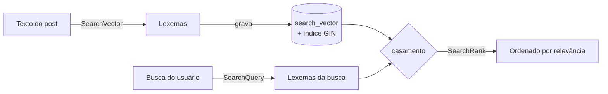

# Busca full-text (PostgreSQL)

!!! quote "Pensa como criança 🧒"
    Procurar um brinquedo na caixa de duas formas. A primeira: você olha peça por
    peça até achar uma que tem a letra que você quer no nome — devagar e literal.
    A segunda: alguém já **separou os brinquedos por assunto** ("carrinhos",
    "bonecas") e você pergunta "quero os de correr" e recebe todos os carrinhos,
    mesmo escritos diferente. A busca full-text é a segunda forma: o Postgres
    entende **palavras e seus significados**, não só letras.

## Caso de uso

Você tem um blog e quer uma busca de verdade: o usuário digita `"correr maratona"`
e você quer posts cujo **título ou corpo** falem disso — ignorando maiúsculas,
acentos e variações como "corrida" / "correndo". Com `icontains` isso é
impossível; com a busca full-text do PostgreSQL é uma linha:

```python
from django.contrib.postgres.search import SearchVector
from blog.models import Post

resultados = Post.objects.annotate(
    documento=SearchVector("title", "body"),
).filter(documento="correr maratona")

for post in resultados:
    print(post.title)
```

O Postgres reduz cada texto a **lexemas** (raízes das palavras) e compara os
lexemas da busca com os do documento. "correndo" e "correr" viram a mesma raiz —
por isso funciona.

!!! danger "Só PostgreSQL"
    Tudo nesta página vem de `django.contrib.postgres` e usa recursos nativos do
    PostgreSQL. **Não funciona** em SQLite, MySQL ou Oracle. Se o seu banco de
    desenvolvimento é SQLite, essas queries vão falhar — rode contra Postgres.

## Possibilidades

### Ligue o app `django.contrib.postgres`

Antes de qualquer coisa, adicione o app às settings. Ele registra os lookups
(`search`, `trigram_similar`, etc.) e os campos especiais:

```python
INSTALLED_APPS = [
    "django.contrib.postgres",
    "blog",
]
```

### As três peças: `SearchVector`, `SearchQuery`, `SearchRank`

| Peça | O que é | Analogia |
| --- | --- | --- |
| `SearchVector` | O **documento** processado (o texto virado lexemas) | Os brinquedos já separados por assunto |
| `SearchQuery` | O **termo** buscado, também virado lexemas | O pedido "quero os de correr" |
| `SearchRank` | A **nota de relevância** de cada resultado | Quão bem cada brinquedo bate com o pedido |

A busca é o cruzamento de um `SearchVector` com um `SearchQuery`:

```python
from django.contrib.postgres.search import SearchQuery, SearchVector
from blog.models import Post

vetor = SearchVector("title", "body")
consulta = SearchQuery("correr maratona")

resultados = Post.objects.annotate(documento=vetor).filter(documento=consulta)
```

!!! tip "`filter(documento=\"texto\")` é atalho para `SearchQuery`"
    Passar uma string crua no filtro cria um `SearchQuery` por baixo dos panos.
    Use `SearchQuery(...)` explícito quando quiser controlar `search_type` ou o
    idioma (veja abaixo).

### Ordenando por relevância com `SearchRank`

Filtrar diz **quais** posts batem; `SearchRank` diz **quão bem** cada um bate,
para você ordenar do mais relevante ao menos:

```python
from django.contrib.postgres.search import SearchQuery, SearchRank, SearchVector
from blog.models import Post

vetor = SearchVector("title", "body")
consulta = SearchQuery("correr maratona")

resultados = (
    Post.objects
    .annotate(rank=SearchRank(vetor, consulta))
    .filter(rank__gt=0)
    .order_by("-rank")
)

for post in resultados:
    print(post.title, round(post.rank, 3))
```

!!! note "Por que `rank__gt=0`?"
    Um `rank` de `0` significa "nenhum lexema em comum" — nenhum casamento. Filtrar
    por `rank__gt=0` mantém só o que realmente bateu, sem precisar de um
    `.filter(documento=consulta)` separado.

### Pesos: título vale mais que corpo

Nem todo campo tem a mesma importância. Um acerto no **título** deveria pesar mais
que um acerto no **corpo**. O PostgreSQL tem quatro pesos, `"A"` (maior) a `"D"`
(menor), e você combina vetores com peso:

```python
from django.contrib.postgres.search import SearchQuery, SearchRank, SearchVector
from blog.models import Post

vetor = (
    SearchVector("title", weight="A")
    + SearchVector("body", weight="B")
)
consulta = SearchQuery("correr maratona")

resultados = (
    Post.objects
    .annotate(rank=SearchRank(vetor, consulta))
    .filter(rank__gt=0)
    .order_by("-rank")
)
```

| Peso | Multiplicador padrão | Uso típico |
| --- | --- | --- |
| `"A"` | 1.0 | Título, nome |
| `"B"` | 0.4 | Corpo, resumo |
| `"C"` | 0.2 | Tags, categoria |
| `"D"` | 0.1 | Metadados, comentários |

### Tipos de consulta: `search_type`

O `SearchQuery` aceita `search_type` para interpretar o texto de formas
diferentes:

```python
from django.contrib.postgres.search import SearchQuery

# padrão: todos os termos precisam bater (AND entre lexemas)
SearchQuery("correr maratona")

# frase exata, na ordem
SearchQuery("correr maratona", search_type="phrase")

# sintaxe booleana do usuario: correr & (maratona | corrida)
SearchQuery("correr & (maratona | corrida)", search_type="raw")

# operadores web-style: aspas, OR, - para excluir
SearchQuery('"correr maratona" -trilha', search_type="websearch")
```

| `search_type` | Interpreta o texto como |
| --- | --- |
| `"plain"` (padrão) | Termos combinados com AND |
| `"phrase"` | Frase exata, mantendo a ordem |
| `"raw"` | Sintaxe `tsquery` crua (`&`, `\|`, `!`, parênteses) |
| `"websearch"` | Estilo Google: aspas, `OR`, `-termo` |

!!! tip "`websearch` é o mais amigável para caixas de busca"
    Se o texto vem direto de um input do usuário, `search_type="websearch"` é o
    mais seguro: entende aspas e `-` sem nunca quebrar com sintaxe inválida.

### Idioma e acentos: a `config`

Os lexemas dependem do idioma — "correndo → correr" só acontece se o Postgres
souber que é português. Passe `config`:

```python
from django.contrib.postgres.search import SearchQuery, SearchVector

vetor = SearchVector("title", "body", config="portuguese")
consulta = SearchQuery("correr maratona", config="portuguese")
```

!!! info "Idioma consistente"
    Use a **mesma** `config` no vetor e na consulta. Idiomas diferentes geram
    lexemas incompatíveis e a busca não bate. `"portuguese"`, `"english"`,
    `"simple"` (sem stemming) são valores comuns.

### O problema da performance: `SearchVectorField` + índice GIN

Calcular o `SearchVector` em toda query relê e reprocessa o texto de **cada
linha** — lento em tabelas grandes. A solução é **materializar** o vetor em uma
coluna e indexá-la com um índice **GIN**.

Primeiro, o campo no modelo:

```python
from django.contrib.postgres.indexes import GinIndex
from django.contrib.postgres.search import SearchVectorField
from django.db import models


class Post(models.Model):
    """Blog post with a persisted full-text search vector."""

    title = models.CharField(max_length=200)
    body = models.TextField()
    search_vector = SearchVectorField(null=True)

    class Meta:
        indexes = [
            GinIndex(fields=["search_vector"]),
        ]
```

Depois, `makemigrations` + `migrate`. Agora a busca lê a coluna pronta, sem
recalcular:

```python
from django.contrib.postgres.search import SearchQuery
from blog.models import Post

resultados = Post.objects.filter(
    search_vector=SearchQuery("correr maratona", config="portuguese"),
)
```

!!! warning "A coluna não se atualiza sozinha"
    `SearchVectorField` guarda o vetor, mas **algo precisa preenchê-lo** quando o
    post muda. Duas estratégias:

    - **No código**: recalcule após salvar com um `update()`.
    - **No banco**: um trigger do PostgreSQL (via migração `RunSQL`) que atualiza
      a coluna automaticamente — mais robusto, imune a saves que fogem do ORM.

Atualizando pelo ORM, em massa:

```python
from django.contrib.postgres.search import SearchVector
from blog.models import Post

Post.objects.update(
    search_vector=SearchVector("title", weight="A", config="portuguese")
    + SearchVector("body", weight="B", config="portuguese"),
)
```



### Busca por semelhança: `TrigramSimilarity`

Full-text é ótimo para **palavras inteiras**, mas erra em **erros de digitação** e
nomes próprios: "maratona" vs "maratoan" não batem por lexema. Aí entra a
**similaridade por trigramas** — o Postgres quebra o texto em pedaços de 3 letras
e mede quanto dois textos se sobrepõem.

Precisa da extensão `pg_trgm`, ativada por uma migração:

```python
from django.contrib.postgres.operations import TrigramExtension
from django.db import migrations


class Migration(migrations.Migration):
    """Enable the pg_trgm PostgreSQL extension."""

    dependencies = [
        ("blog", "0001_initial"),
    ]

    operations = [
        TrigramExtension(),
    ]
```

Com a extensão ativa, busque por semelhança e ordene pela nota (0 a 1):

```python
from django.contrib.postgres.search import TrigramSimilarity
from blog.models import Author

resultados = (
    Author.objects
    .annotate(semelhanca=TrigramSimilarity("display_name", "mauricio"))
    .filter(semelhanca__gt=0.3)
    .order_by("-semelhanca")
)

for autor in resultados:
    print(autor.display_name, round(autor.semelhanca, 3))
```

!!! tip "Full-text e trigramas se completam"
    Use **full-text** para busca em textos longos (posts, artigos) e **trigramas**
    para campos curtos com erros de digitação (nomes, cidades, e-mails), ou como
    _fallback_ quando a full-text não retorna nada.

### Quando usar o quê

| Precisa de... | Ferramenta | Por quê |
| --- | --- | --- |
| "contém esse pedaço literal" | `__icontains` | Simples, funciona em qualquer banco, mas não escala e ignora significado |
| Busca por palavras/relevância em textos | `SearchVector` + `SearchQuery` + `SearchRank` | Entende lexemas, stemming, pesos e idioma; nativo do Postgres |
| Tolerância a erros de digitação | `TrigramSimilarity` | Compara por semelhança de caracteres, não por palavra exata |
| Busca "de motor de busca" em escala massiva, facetas, sugestões, geo | Elasticsearch / OpenSearch | Fora do banco; use quando o Postgres não dá conta ou você precisa de recursos de search engine dedicado |

!!! note "Não pule etapas"
    A grande maioria dos projetos **nunca** precisa de Elasticsearch. Comece com a
    busca full-text do PostgreSQL: zero infraestrutura extra, transacional, e
    resolve bem até milhões de linhas com o índice GIN. Só migre para um motor
    dedicado quando tiver uma dor real de escala ou de recursos.

!!! quote "📖 Na documentação oficial"
    - [Full text search](https://docs.djangoproject.com/en/6.0/topics/db/search/)
    - [django.contrib.postgres.search](https://docs.djangoproject.com/en/6.0/ref/contrib/postgres/search/)

## Recap

- Busca full-text é só PostgreSQL — ligue `django.contrib.postgres` nas settings.
- `SearchVector` = documento em lexemas; `SearchQuery` = termo em lexemas;
  `SearchRank` = nota de relevância para ordenar.
- Combine vetores com `weight="A".."D"` para dar mais peso ao título que ao corpo.
- Use a mesma `config` (idioma) no vetor e na consulta; `search_type="websearch"`
  é o mais amigável para caixas de busca.
- Em tabelas grandes, materialize o vetor em um `SearchVectorField` com
  `GinIndex` — e lembre de mantê-lo atualizado (código ou trigger).
- `TrigramSimilarity` (extensão `pg_trgm`) resolve erros de digitação e nomes.
- Comece com Postgres; só vá para Elasticsearch com dor real de escala.

Para dominar `annotate`, `filter` e `order_by` que sustentam tudo isso, volte à
**[API de QuerySets](querysets-api.md)**.
