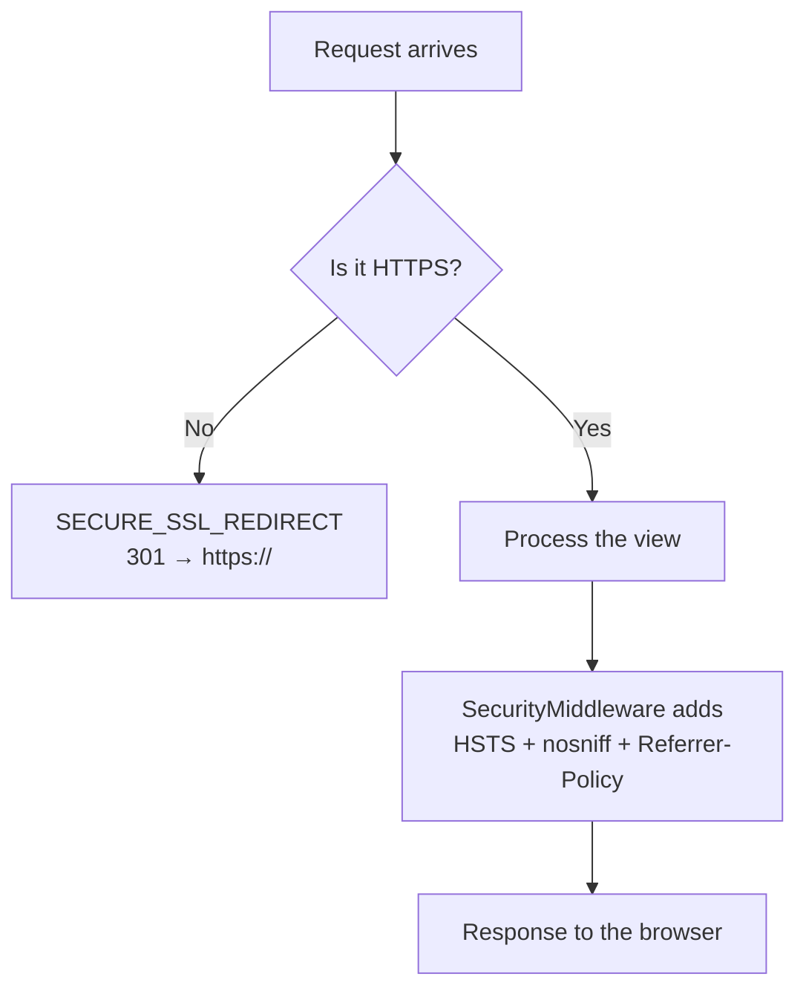
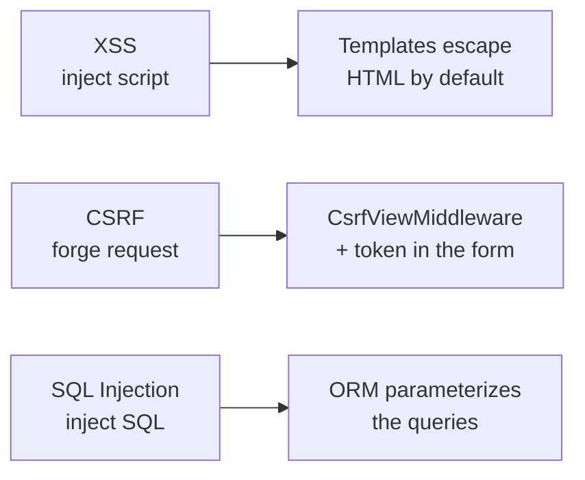

# Security in depth

!!! quote "Think like a child 🧒"
    Your house has several locks: a bolt on the door, a latch on the window, a
    peephole, and a safe for the most valuable things. No single lock does the job
    — it's the combination that lets you sleep easy. Django's security is like
    that: several small layers that, together, close the gaps an attacker would
    slip through.

## Use case

You've finished the blog and you're going live. Before you expose the public URL,
you want:

- every request to go over HTTPS (no passwords traveling in plain text);
- nobody able to place your site inside a malicious `<iframe>`;
- the session and CSRF cookies to travel only over a secure connection;
- passwords stored with a strong algorithm;
- Django to warn you about whatever is still loose.

Almost all of this lives in `settings.py` and in a middleware that ships
pre-installed:

```python
# config/settings.py

MIDDLEWARE = [
    "django.middleware.security.SecurityMiddleware",
    "django.contrib.sessions.middleware.SessionMiddleware",
    "django.middleware.common.CommonMiddleware",
    "django.middleware.csrf.CsrfViewMiddleware",
    "django.contrib.auth.middleware.AuthenticationMiddleware",
    "django.contrib.messages.middleware.MessageMiddleware",
    "django.middleware.clickjacking.XFrameOptionsMiddleware",
]

SECURE_SSL_REDIRECT = True
SECURE_HSTS_SECONDS = 31536000
SECURE_HSTS_INCLUDE_SUBDOMAINS = True
SECURE_HSTS_PRELOAD = True
SESSION_COOKIE_SECURE = True
CSRF_COOKIE_SECURE = True
```

And the command that audits all of it at once:

```bash
python manage.py check --deploy
```

## Possibilities

### `SecurityMiddleware`: the gatekeeper of HTTP locks

`django.middleware.security.SecurityMiddleware` reads a few settings and, based on
them, redirects to HTTPS and adds protection headers to the response. It should sit
**as high as possible** in `MIDDLEWARE`.

| Setting | What it does | Recommended in production |
| --- | --- | --- |
| `SECURE_SSL_REDIRECT` | Redirects `http://` → `https://` (301) | `True` |
| `SECURE_HSTS_SECONDS` | Time (s) the browser remembers "HTTPS only" | `31536000` (1 year) |
| `SECURE_HSTS_INCLUDE_SUBDOMAINS` | Extends HSTS to subdomains | `True` |
| `SECURE_HSTS_PRELOAD` | Allows entering the browsers' preload list | `True` |
| `SECURE_CONTENT_TYPE_NOSNIFF` | Sends `X-Content-Type-Options: nosniff` | `True` (default) |
| `SECURE_REFERRER_POLICY` | Controls the `Referer` header | `"same-origin"` (default) |
| `SECURE_REDIRECT_EXEMPT` | Regex of paths that are not redirected | `[]` |
| `SECURE_SSL_HOST` | Target host of the redirect | `None` |



#### HSTS: mind the silver bullet

**HSTS** (HTTP Strict Transport Security) tells the browser: "for the next N
seconds, reach me only over HTTPS, don't even try HTTP." It's great, but it's a
promise the browser **stores and obeys blindly**.

!!! danger "HSTS is hard to undo"
    If you enable `SECURE_HSTS_SECONDS` with a high value and then your HTTPS
    breaks, browsers that already visited the site will **refuse** to reach it over
    HTTP for the entire configured period — the site becomes unreachable for them.
    Start with a low value (e.g. `3600`), confirm HTTPS is solid, and only then
    raise it to `31536000`. Only turn on `SECURE_HSTS_PRELOAD` once you're sure.

#### Behind a proxy: `SECURE_PROXY_SSL_HEADER`

If Django runs behind a proxy/load balancer (Nginx, the cloud load balancer) that
terminates TLS, Django receives the internal request as `http://` and thinks it's
insecure. The proxy signals the original scheme in a header; you teach Django to
trust it:

```python
# config/settings.py

SECURE_PROXY_SSL_HEADER = ("HTTP_X_FORWARDED_PROTO", "https")
```

!!! warning "Only trust it if the proxy really sets the header"
    `SECURE_PROXY_SSL_HEADER` makes Django treat the request as HTTPS whenever it
    sees `X-Forwarded-Proto: https`. If any client can send that header directly (a
    misconfigured proxy that doesn't overwrite it), it fools Django. Make sure **the
    proxy always rewrites** that header, never passes it through from the client.

### Clickjacking: `X-Frame-Options`

**Clickjacking** is when a malicious site places your site inside an invisible
`<iframe>` and tricks the user into clicking things they can't see. The defense is
the `X-Frame-Options` header, added by `XFrameOptionsMiddleware` (already in
`MIDDLEWARE`).

```python
# config/settings.py

X_FRAME_OPTIONS = "DENY"
```

| Value | Effect |
| --- | --- |
| `"DENY"` | No page can be placed in a frame (recommended) |
| `"SAMEORIGIN"` | Only pages from the same domain may frame it |

For one-off exceptions (a view that *needs* to be framed, or one that never can),
use the decorators:

```python
from django.http import HttpRequest, HttpResponse
from django.views.decorators.clickjacking import (
    xframe_options_deny,
    xframe_options_exempt,
    xframe_options_sameorigin,
)


@xframe_options_deny
def dashboard(request: HttpRequest) -> HttpResponse:
    """Never allow this view to be framed."""
    return HttpResponse("Secret panel")


@xframe_options_sameorigin
def widget(request: HttpRequest) -> HttpResponse:
    """Allow framing only from the same origin."""
    return HttpResponse("Internal widget")


@xframe_options_exempt
def public_embed(request: HttpRequest) -> HttpResponse:
    """Explicitly allow this view to be framed by anyone."""
    return HttpResponse("Open embed")
```

!!! tip "X-Frame-Options is the basics; CSP is the full story"
    `X-Frame-Options` covers clickjacking well, but the modern, richer defense
    against content injection is the **Content Security Policy**. See
    **[Content Security Policy](csp.md)** for the `frame-ancestors` directive and
    much more.

### Secure cookies: `Secure` and `HttpOnly`

The session and CSRF cookies are keys to the house. Two flags protect them:

- **`Secure`**: the cookie is only sent over HTTPS — it never leaks over HTTP.
- **`HttpOnly`**: JavaScript can't read the cookie — it blocks theft via XSS.

| Setting | Default | Production |
| --- | --- | --- |
| `SESSION_COOKIE_SECURE` | `False` | `True` |
| `SESSION_COOKIE_HTTPONLY` | `True` | `True` |
| `CSRF_COOKIE_SECURE` | `False` | `True` |
| `CSRF_COOKIE_HTTPONLY` | `False` | see note below |
| `SESSION_COOKIE_SAMESITE` | `"Lax"` | `"Lax"` or `"Strict"` |
| `CSRF_COOKIE_SAMESITE` | `"Lax"` | `"Lax"` |

```python
# config/settings.py

SESSION_COOKIE_SECURE = True
CSRF_COOKIE_SECURE = True
SESSION_COOKIE_SAMESITE = "Lax"
```

!!! note "`CSRF_COOKIE_HTTPONLY` is usually `False`"
    The CSRF cookie defaults to `HttpOnly = False` on purpose: some JavaScript
    flows (fetch/AJAX) need to read the token from the cookie to send it in the
    `X-CSRFToken` header. If you only use traditional HTML forms (the token comes in
    the `<form>`), you can set `CSRF_COOKIE_HTTPONLY = True` without issue.

### Cryptographic signing: `django.core.signing`

Sometimes you want to hand a piece of data to the client (in a link, a cookie) and
later receive it back with a **guarantee that nobody altered it** — without storing
anything in the database. That's what signing is for: Django "stamps" the data with
the `SECRET_KEY`; if the stamp doesn't match on the way back, it rejects it.

Think like a child: it's like writing a note and smearing glitter glue over it. If
someone erases and rewrites it, the glitter cracks and you notice.

```python
from django.core import signing

signer = signing.Signer()
value = signer.sign("my-data")
print(value)  # "my-data:GENERATED_SIGNATURE"

original = signer.unsign(value)  # "my-data"
```

For objects (dict, list), use `dumps`/`loads`, which serialize and sign:

```python
from django.core import signing

token = signing.dumps({"user_id": 42, "role": "editor"})
data = signing.loads(token)  # {"user_id": 42, "role": "editor"}
```

When the data should **expire** (an email confirmation link, a reset token), use
`TimestampSigner` or pass `max_age` to `loads`:

```python
from django.core import signing
from django.core.signing import TimestampSigner


signer = TimestampSigner()
token = signer.sign_object({"user_id": 42})

try:
    data = signer.unsign_object(token, max_age=3600)
except signing.SignatureExpired:
    data = None  # older than one hour
except signing.BadSignature:
    data = None  # tampered with
```

| Tool | Use |
| --- | --- |
| `Signer()` | Signs/verifies a string |
| `TimestampSigner()` | Same, but records the moment (enables `max_age`) |
| `signing.dumps(obj)` / `signing.loads(s)` | Serialize + sign + compress objects |
| `SignatureExpired` | Raised when `max_age` was exceeded |
| `BadSignature` | Raised when the stamp doesn't match (tampered) |

!!! warning "Signed ≠ secret"
    Signing guarantees **integrity**, not **confidentiality**. The contents are
    still readable by whoever receives the token (it's just base64, not
    encryption). Never put a password or sensitive data inside a signed value.

### Password hashers: `PASSWORD_HASHERS`

Django **never** stores the password in plain text. It stores a *hash* — a one-way
transformation. The first hasher in the `PASSWORD_HASHERS` list is the one used to
create new hashes; the others validate old passwords and migrate them at login.

Django 6.0's default is already strong (PBKDF2 at the top). To use **Argon2** (the
current recommendation for new projects), install the extra and put it at the top:

```bash
python -m pip install "django[argon2]"
```

```python
# config/settings.py

PASSWORD_HASHERS = [
    "django.contrib.auth.hashers.Argon2PasswordHasher",
    "django.contrib.auth.hashers.PBKDF2PasswordHasher",
    "django.contrib.auth.hashers.PBKDF2SHA1PasswordHasher",
    "django.contrib.auth.hashers.BCryptSHA256PasswordHasher",
]
```

| Hasher | Notes |
| --- | --- |
| `Argon2PasswordHasher` | Recommended today; needs `django[argon2]` |
| `PBKDF2PasswordHasher` | Django's default; no external dependencies |
| `BCryptSHA256PasswordHasher` | bcrypt; needs `django[bcrypt]` |

!!! tip "Hash migration is automatic and transparent"
    When you put Argon2 at the top, you do **not** need to migrate the database by
    hand. The next time each user logs in successfully, Django detects the password
    was in an old hash and re-hashes it with the top algorithm. The migration
    happens on its own, login by login.

!!! danger "Never write your own hasher"
    Don't invent a password-hashing scheme, don't use `md5`/`sha1` "with a salt."
    Use Django's hashers. They handle salting, iteration count, and constant-time
    comparison — things that are easy to get wrong and expensive to fix.

### `SECRET_KEY` and `SECRET_KEY_FALLBACKS`

The `SECRET_KEY` is the master key: it signs sessions, CSRF tokens, `signing`
values, and password reset links. If it leaks, all that protection falls apart.

Golden rules:

- **Never** commit the `SECRET_KEY` to Git; read it from an environment variable.
- If it leaks, **rotate** it (swap it for a new one).

```python
# config/settings.py

import os

SECRET_KEY = os.environ["DJANGO_SECRET_KEY"]
```

When rotating, an instant swap would invalidate all active sessions.
`SECRET_KEY_FALLBACKS` solves this: the new key signs; the old ones still
**validate** what was already signed, giving a grace period.

```python
# config/settings.py

SECRET_KEY = os.environ["DJANGO_SECRET_KEY"]
SECRET_KEY_FALLBACKS = [
    os.environ["DJANGO_SECRET_KEY_OLD"],
]
```

!!! note "Generating a new key"
    Django ships a helper for this:
    `django.core.management.utils.get_random_secret_key()`. Run it once, store the
    result securely (a secrets manager), and put it in the environment variable.

### `manage.py check --deploy`

Before going up, run the deploy audit. It runs the *system check framework* with
the set of production-focused checks and lists everything that's loose:

```bash
python manage.py check --deploy
```

It warns, for example, if `DEBUG=True`, if `SECURE_SSL_REDIRECT` is missing, if
HSTS is off, if cookies aren't `Secure`, or if the `SECRET_KEY` is weak. Treat the
warnings as a checklist before you expose the URL.

!!! tip "Put it in CI"
    Running `check --deploy` in the pipeline (with production settings) turns those
    warnings into an automatic gate: an insecure deploy fails the build instead of
    reaching production. See **[Production deploy](deploy.md)** for the full
    walkthrough.

### The classic threats and how Django protects you

Think like a child: there are three famous web "burglars." Django keeps most of the
doors shut by default — but you must not reopen them.



#### XSS (Cross-Site Scripting)

The attacker injects `<script>` into a field (comment, name) hoping it runs in
someone else's browser. **Django's protection:** the template system **escapes**
HTML automatically — `<` becomes `&lt;`, and the script doesn't run.

!!! danger "Don't disable escaping thoughtlessly"
    You reopen the XSS door by using `mark_safe`, the `|safe` filter, or
    `format_html` with unsanitized user input. Only mark as "safe" HTML that you
    generated and control yourself.

#### CSRF (Cross-Site Request Forgery)

A malicious site makes your browser send an authenticated request to your site
without your intent (e.g. a hidden form that changes your password). **Django's
protection:** `CsrfViewMiddleware` requires a secret token on every
`POST`/`PUT`/`DELETE` request; the form injects that token with ``.

```html
<form method="post">
    
    <input type="text" name="title">
    <button type="submit">Save</button>
</form>
```

#### SQL Injection

The attacker injects SQL into a parameter hoping it gets executed
(`"; DROP TABLE ...`). **Django's protection:** the ORM always **parameterizes**
the queries — the value goes separate from the SQL, so it's never interpreted as a
command.

!!! warning "Careful with raw SQL"
    You reopen the SQL injection door by concatenating strings in `raw()` or
    `connection.cursor().execute()`. If you need raw SQL, **always** pass the values
    as parameters (`params=[...]`), never with an f-string or `%`.

!!! quote "📖 In the official docs"
    - [Security in Django](https://docs.djangoproject.com/en/6.0/topics/security/)
    - [Cryptographic signing](https://docs.djangoproject.com/en/6.0/topics/signing/)
    - [Clickjacking protection](https://docs.djangoproject.com/en/6.0/ref/clickjacking/)

## Recap

- **`SecurityMiddleware`** (at the top of `MIDDLEWARE`) enforces HTTPS and adds
  protection headers via `SECURE_SSL_REDIRECT` and `SECURE_HSTS_*`.
- **HSTS** is powerful but hard to undo — start low, raise it only when HTTPS is
  solid.
- Behind a proxy, teach the scheme with `SECURE_PROXY_SSL_HEADER` (and make sure
  the proxy rewrites the header).
- Against **clickjacking**: `X-Frame-Options` via `X_FRAME_OPTIONS` + the
  `xframe_options_*` decorators. For more, use **[CSP](csp.md)**.
- Session and CSRF cookies should be `Secure` (and the session one `HttpOnly`) in
  production.
- **`django.core.signing`** signs data (integrity, not secrecy): `Signer`,
  `TimestampSigner`, `dumps`/`loads`, with `max_age` to expire.
- Store passwords with strong hashers via **`PASSWORD_HASHERS`** (Argon2 at the
  top); hash migration happens at login.
- The **`SECRET_KEY`** comes from an environment variable; rotate it with
  `SECRET_KEY_FALLBACKS` so you don't drop sessions.
- Run **`manage.py check --deploy`** (ideally in CI) before going up.
- **XSS**, **CSRF**, and **SQL injection** already have default defenses (template
  escaping, CSRF token, parameterized ORM) — just don't reopen them with `|safe`,
  token-less views, or concatenated raw SQL.

With the locks in place, the next step is to **[go live safely](deploy.md)**.
