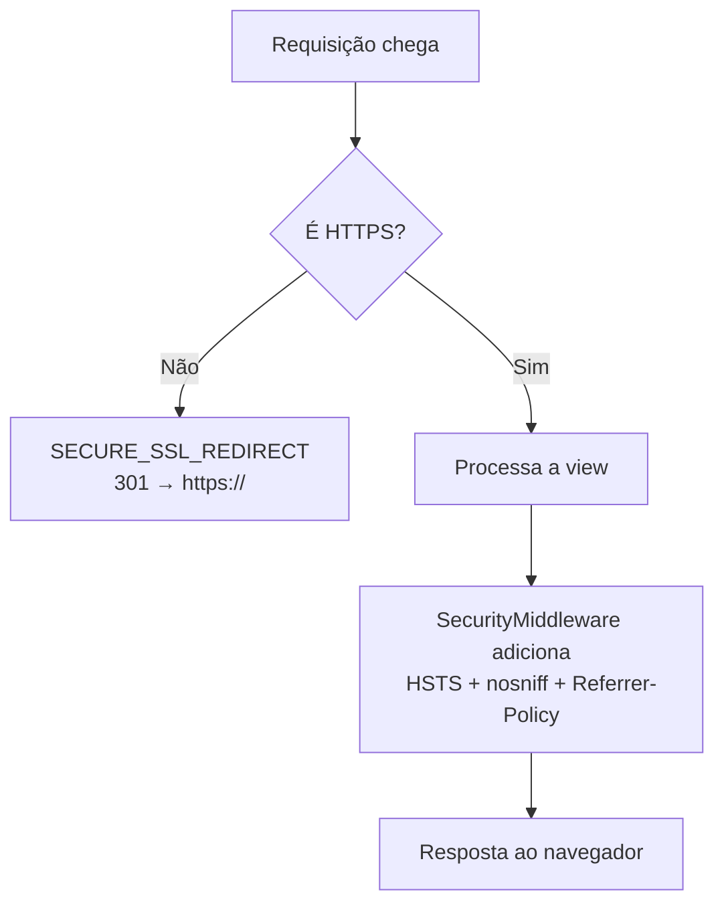
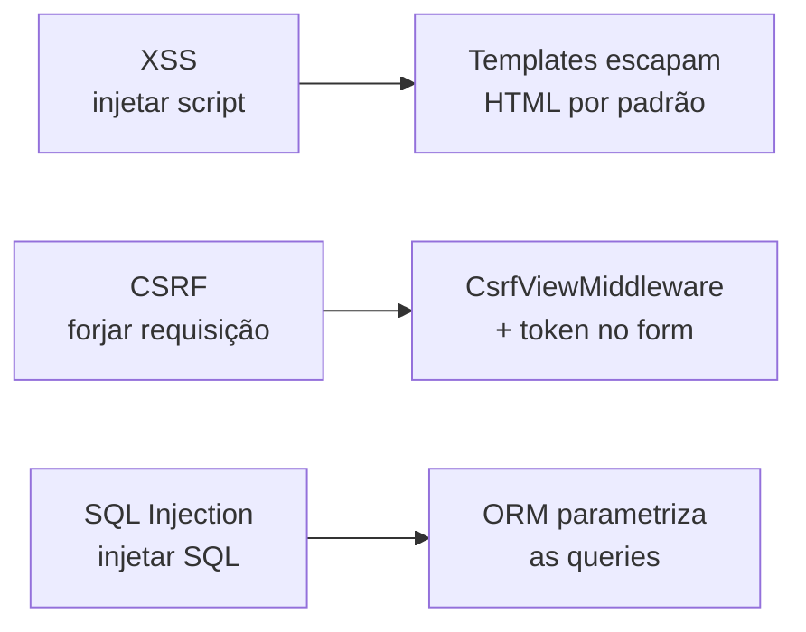

# Segurança a fundo

!!! quote "Pensa como criança 🧒"
    Sua casa tem várias travas: fechadura na porta, tranca na janela, olho mágico
    e um cofre pro que é mais valioso. Nenhuma trava sozinha resolve — é o conjunto
    que te deixa dormir tranquilo. A segurança do Django é assim: várias camadas
    pequenas que, juntas, fecham as brechas por onde um invasor entraria.

## Caso de uso

Você terminou o blog e vai colocar no ar. Antes de expor a URL pública, você quer
que:

- todo acesso vá por HTTPS (nada de senha trafegando em texto puro);
- ninguém consiga colocar seu site dentro de um `<iframe>` malicioso;
- os cookies de sessão e CSRF só viajem por conexão segura;
- as senhas fiquem guardadas com um algoritmo forte;
- o Django te avise o que ainda está frouxo.

Quase tudo isso mora no `settings.py` e num middleware que já vem instalado:

```python
# config/settings.py

MIDDLEWARE = [
    "django.middleware.security.SecurityMiddleware",
    "django.contrib.sessions.middleware.SessionMiddleware",
    "django.middleware.common.CommonMiddleware",
    "django.middleware.csrf.CsrfViewMiddleware",
    "django.contrib.auth.middleware.AuthenticationMiddleware",
    "django.contrib.messages.middleware.MessageMiddleware",
    "django.middleware.clickjacking.XFrameOptionsMiddleware",
]

SECURE_SSL_REDIRECT = True
SECURE_HSTS_SECONDS = 31536000
SECURE_HSTS_INCLUDE_SUBDOMAINS = True
SECURE_HSTS_PRELOAD = True
SESSION_COOKIE_SECURE = True
CSRF_COOKIE_SECURE = True
```

E o comando que audita tudo isso de uma vez:

```bash
python manage.py check --deploy
```

## Possibilidades

### `SecurityMiddleware`: o porteiro das travas HTTP

O `django.middleware.security.SecurityMiddleware` lê algumas settings e, com base
nelas, redireciona para HTTPS e adiciona cabeçalhos de proteção na resposta. Ele
deve ficar **o mais no topo possível** do `MIDDLEWARE`.

| Setting | O que faz | Recomendado em produção |
| --- | --- | --- |
| `SECURE_SSL_REDIRECT` | Redireciona `http://` → `https://` (301) | `True` |
| `SECURE_HSTS_SECONDS` | Tempo (s) que o navegador lembra "só HTTPS" | `31536000` (1 ano) |
| `SECURE_HSTS_INCLUDE_SUBDOMAINS` | Estende o HSTS aos subdomínios | `True` |
| `SECURE_HSTS_PRELOAD` | Permite entrar na lista de preload dos navegadores | `True` |
| `SECURE_CONTENT_TYPE_NOSNIFF` | Envia `X-Content-Type-Options: nosniff` | `True` (padrão) |
| `SECURE_REFERRER_POLICY` | Controla o cabeçalho `Referer` | `"same-origin"` (padrão) |
| `SECURE_REDIRECT_EXEMPT` | Regex de paths que não são redirecionados | `[]` |
| `SECURE_SSL_HOST` | Host de destino do redirecionamento | `None` |



#### HSTS: cuidado com a bala de prata

O **HSTS** (HTTP Strict Transport Security) diz ao navegador: "pelos próximos N
segundos, só me acesse por HTTPS, nem tente HTTP". É ótimo, mas é uma promessa que
o navegador **guarda e obedece cegamente**.

!!! danger "HSTS é difícil de desfazer"
    Se você habilitar `SECURE_HSTS_SECONDS` com um valor alto e depois seu HTTPS
    quebrar, os navegadores que já visitaram o site **recusarão** acessá-lo por
    HTTP durante todo o período configurado — o site fica inacessível para eles.
    Comece com um valor baixo (ex.: `3600`), confirme que o HTTPS está sólido, e só
    então suba para `31536000`. Só ligue `SECURE_HSTS_PRELOAD` quando tiver certeza.

#### Atrás de um proxy: `SECURE_PROXY_SSL_HEADER`

Se o Django roda atrás de um proxy/load balancer (Nginx, o load balancer da nuvem)
que termina o TLS, o Django recebe a requisição interna como `http://` e acha que
não é segura. O proxy sinaliza o esquema original num cabeçalho; você ensina o
Django a confiar nele:

```python
# config/settings.py

SECURE_PROXY_SSL_HEADER = ("HTTP_X_FORWARDED_PROTO", "https")
```

!!! warning "Só confie se o proxy realmente define o cabeçalho"
    O `SECURE_PROXY_SSL_HEADER` faz o Django tratar a requisição como HTTPS sempre
    que ver `X-Forwarded-Proto: https`. Se algum cliente conseguir mandar esse
    cabeçalho direto (proxy mal configurado que não o sobrescreve), ele engana o
    Django. Garanta que **o proxy sempre reescreve** esse cabeçalho, nunca o
    repassa do cliente.

### Clickjacking: `X-Frame-Options`

**Clickjacking** é quando um site malicioso coloca o seu site dentro de um
`<iframe>` invisível e engana o usuário a clicar em coisas que ele não vê. A defesa
é o cabeçalho `X-Frame-Options`, adicionado pelo `XFrameOptionsMiddleware` (já vem
no `MIDDLEWARE`).

```python
# config/settings.py

X_FRAME_OPTIONS = "DENY"
```

| Valor | Efeito |
| --- | --- |
| `"DENY"` | Nenhuma página pode ser colocada em frame (recomendado) |
| `"SAMEORIGIN"` | Só páginas do mesmo domínio podem enquadrar |

Para exceções pontuais (uma view que *precisa* ser enquadrada, ou uma que nunca
pode), use os decorators:

```python
from django.http import HttpRequest, HttpResponse
from django.views.decorators.clickjacking import (
    xframe_options_deny,
    xframe_options_exempt,
    xframe_options_sameorigin,
)


@xframe_options_deny
def dashboard(request: HttpRequest) -> HttpResponse:
    """Never allow this view to be framed."""
    return HttpResponse("Painel secreto")


@xframe_options_sameorigin
def widget(request: HttpRequest) -> HttpResponse:
    """Allow framing only from the same origin."""
    return HttpResponse("Widget interno")


@xframe_options_exempt
def public_embed(request: HttpRequest) -> HttpResponse:
    """Explicitly allow this view to be framed by anyone."""
    return HttpResponse("Embed liberado")
```

!!! tip "X-Frame-Options é o básico; CSP é o completo"
    `X-Frame-Options` cobre bem o clickjacking, mas a defesa moderna e mais rica
    contra injeção de conteúdo é o **Content Security Policy**. Veja
    **[Content Security Policy](csp.md)** para a diretiva `frame-ancestors` e
    muito mais.

### Cookies seguros: `Secure` e `HttpOnly`

Os cookies de sessão e de CSRF são chaves da casa. Duas flags os protegem:

- **`Secure`**: o cookie só é enviado por HTTPS — nunca vaza em conexão HTTP.
- **`HttpOnly`**: o JavaScript não consegue ler o cookie — barra roubo via XSS.

| Setting | Padrão | Produção |
| --- | --- | --- |
| `SESSION_COOKIE_SECURE` | `False` | `True` |
| `SESSION_COOKIE_HTTPONLY` | `True` | `True` |
| `CSRF_COOKIE_SECURE` | `False` | `True` |
| `CSRF_COOKIE_HTTPONLY` | `False` | ver nota abaixo |
| `SESSION_COOKIE_SAMESITE` | `"Lax"` | `"Lax"` ou `"Strict"` |
| `CSRF_COOKIE_SAMESITE` | `"Lax"` | `"Lax"` |

```python
# config/settings.py

SESSION_COOKIE_SECURE = True
CSRF_COOKIE_SECURE = True
SESSION_COOKIE_SAMESITE = "Lax"
```

!!! note "`CSRF_COOKIE_HTTPONLY` costuma ficar `False`"
    O padrão do cookie CSRF é `HttpOnly = False`, de propósito: alguns fluxos com
    JavaScript (fetch/AJAX) precisam ler o token do cookie para mandá-lo no
    cabeçalho `X-CSRFToken`. Se você só usa formulários HTML tradicionais (o token
    vem no `<form>`), pode ligar `CSRF_COOKIE_HTTPONLY = True` sem problema.

### Assinatura criptográfica: `django.core.signing`

Às vezes você quer entregar um dado ao cliente (num link, num cookie) e depois
recebê-lo de volta com **garantia de que ninguém alterou** — sem guardar nada no
banco. É pra isso a assinatura: o Django "carimba" o dado com a `SECRET_KEY`; se o
carimbo não bater na volta, ele recusa.

Pensa como criança: é como escrever um bilhete e passar cola com glitter por cima.
Se alguém apagar e reescrever, o glitter racha e você percebe.

```python
from django.core import signing

signer = signing.Signer()
value = signer.sign("meu-dado")
print(value)  # "meu-dado:GENERATED_SIGNATURE"

original = signer.unsign(value)  # "meu-dado"
```

Para objetos (dict, list), use `dumps`/`loads`, que serializam e assinam:

```python
from django.core import signing

token = signing.dumps({"user_id": 42, "role": "editor"})
data = signing.loads(token)  # {"user_id": 42, "role": "editor"}
```

Quando o dado deve **expirar** (link de confirmação de e-mail, token de reset),
use o `TimestampSigner` ou passe `max_age` no `loads`:

```python
from django.core import signing
from django.core.signing import TimestampSigner


signer = TimestampSigner()
token = signer.sign_object({"user_id": 42})

try:
    data = signer.unsign_object(token, max_age=3600)
except signing.SignatureExpired:
    data = None  # older than one hour
except signing.BadSignature:
    data = None  # tampered with
```

| Ferramenta | Uso |
| --- | --- |
| `Signer()` | Assina/verifica uma string |
| `TimestampSigner()` | Igual, mas registra o momento (permite `max_age`) |
| `signing.dumps(obj)` / `signing.loads(s)` | Serializa + assina + comprime objetos |
| `SignatureExpired` | Levantado quando passou do `max_age` |
| `BadSignature` | Levantado quando o carimbo não bate (adulterado) |

!!! warning "Assinado ≠ secreto"
    A assinatura garante **integridade**, não **confidencialidade**. O conteúdo
    ainda é legível por quem receber o token (é só base64, não criptografia). Nunca
    coloque senha ou dado sensível dentro de um valor assinado.

### Hashers de senha: `PASSWORD_HASHERS`

O Django **nunca** guarda a senha em texto puro. Ele guarda um *hash* — uma
transformação de mão única. O primeiro hasher da lista `PASSWORD_HASHERS` é o usado
para criar novos hashes; os demais servem para validar senhas antigas e migrá-las
no login.

O padrão do Django 6.0 já é forte (PBKDF2 no topo). Para usar **Argon2** (a
recomendação atual para novos projetos), instale o extra e coloque-o no topo:

```bash
python -m pip install "django[argon2]"
```

```python
# config/settings.py

PASSWORD_HASHERS = [
    "django.contrib.auth.hashers.Argon2PasswordHasher",
    "django.contrib.auth.hashers.PBKDF2PasswordHasher",
    "django.contrib.auth.hashers.PBKDF2SHA1PasswordHasher",
    "django.contrib.auth.hashers.BCryptSHA256PasswordHasher",
]
```

| Hasher | Notas |
| --- | --- |
| `Argon2PasswordHasher` | Recomendado hoje; precisa de `django[argon2]` |
| `PBKDF2PasswordHasher` | Padrão do Django; sem dependências externas |
| `BCryptSHA256PasswordHasher` | bcrypt; precisa de `django[bcrypt]` |

!!! tip "Migração de hash é automática e transparente"
    Ao colocar o Argon2 no topo, você **não** precisa migrar o banco na mão. Na
    próxima vez que cada usuário fizer login com sucesso, o Django detecta que a
    senha estava num hash antigo e a re-hasheia com o algoritmo do topo. A migração
    acontece sozinha, login a login.

!!! danger "Nunca escreva seu próprio hasher"
    Não invente esquema de hash de senha, não use `md5`/`sha1` "com sal". Use os
    hashers do Django. Eles cuidam de sal, número de iterações e comparação em
    tempo constante — coisas fáceis de errar e caras de consertar.

### `SECRET_KEY` e `SECRET_KEY_FALLBACKS`

A `SECRET_KEY` é a chave-mestra: ela assina sessões, tokens CSRF, os valores de
`signing` e os links de reset de senha. Se ela vazar, toda essa proteção cai.

Regras de ouro:

- **Nunca** versione a `SECRET_KEY` no Git; leia de variável de ambiente.
- Se ela vazar, **rotacione** (troque por uma nova).

```python
# config/settings.py

import os

SECRET_KEY = os.environ["DJANGO_SECRET_KEY"]
```

Ao rotacionar, uma troca imediata invalidaria todas as sessões ativas. O
`SECRET_KEY_FALLBACKS` resolve isso: a chave nova assina; as antigas ainda
**validam** o que já estava assinado, dando um período de graça.

```python
# config/settings.py

SECRET_KEY = os.environ["DJANGO_SECRET_KEY"]
SECRET_KEY_FALLBACKS = [
    os.environ["DJANGO_SECRET_KEY_OLD"],
]
```

!!! note "Gerando uma chave nova"
    O Django traz um utilitário para isso:
    `django.core.management.utils.get_random_secret_key()`. Rode-o uma vez, guarde
    o resultado com segurança (gerenciador de segredos) e coloque na variável de
    ambiente.

### `manage.py check --deploy`

Antes de subir, rode a auditoria de deploy. Ela roda o *system check framework* com
o conjunto de checagens focadas em produção e lista tudo que está frouxo:

```bash
python manage.py check --deploy
```

Ela avisa, por exemplo, se `DEBUG=True`, se falta `SECURE_SSL_REDIRECT`, se o HSTS
está desligado, se os cookies não são `Secure`, ou se a `SECRET_KEY` é fraca. Trate
os avisos como itens de checklist antes de expor a URL.

!!! tip "Coloque no CI"
    Rodar `check --deploy` no pipeline (com as settings de produção) transforma
    esses avisos em barreira automática: um deploy inseguro falha o build em vez de
    chegar em produção. Veja **[Deploy em produção](deploy.md)** para o passo a
    passo completo.

### As ameaças clássicas e como o Django protege

Pensa como criança: são três "gatunos" famosos da web. O Django já deixa a maior
parte das portas fechadas — mas você precisa não reabri-las.



#### XSS (Cross-Site Scripting)

O atacante injeta `<script>` num campo (comentário, nome) esperando que ele rode no
navegador de outra pessoa. **Proteção do Django:** o sistema de templates
**escapa** o HTML automaticamente — `<` vira `&lt;`, e o script não roda.

!!! danger "Não desligue o escape sem pensar"
    Você reabre a porta do XSS ao usar `mark_safe`, o filtro `|safe`, ou
    `format_html` com entrada do usuário não sanitizada. Só marque como "safe" um
    HTML que você mesmo gerou e controla.

#### CSRF (Cross-Site Request Forgery)

Um site malicioso faz seu navegador enviar uma requisição autenticada para o seu
site sem você querer (ex.: um formulário escondido que troca sua senha).
**Proteção do Django:** o `CsrfViewMiddleware` exige um token secreto em toda
requisição `POST`/`PUT`/`DELETE`; o formulário injeta esse token com
``.

```html
<form method="post">
    
    <input type="text" name="titulo">
    <button type="submit">Salvar</button>
</form>
```

#### SQL Injection

O atacante injeta SQL num parâmetro esperando que ele seja executado
(`"; DROP TABLE ...`). **Proteção do Django:** o ORM sempre **parametriza** as
queries — o valor vai separado do SQL, então nunca é interpretado como comando.

!!! warning "Cuidado com SQL cru"
    Você reabre a porta do SQL injection ao concatenar strings em `raw()` ou
    `connection.cursor().execute()`. Se precisar de SQL cru, **sempre** passe os
    valores como parâmetros (`params=[...]`), nunca com f-string ou `%`.

!!! quote "📖 Na documentação oficial"
    - [Security in Django](https://docs.djangoproject.com/en/6.0/topics/security/)
    - [Cryptographic signing](https://docs.djangoproject.com/en/6.0/topics/signing/)
    - [Clickjacking protection](https://docs.djangoproject.com/en/6.0/ref/clickjacking/)

## Recap

- O **`SecurityMiddleware`** (no topo do `MIDDLEWARE`) aplica HTTPS e cabeçalhos de
  proteção via `SECURE_SSL_REDIRECT` e `SECURE_HSTS_*`.
- **HSTS** é poderoso mas difícil de desfazer — comece baixo, suba só quando o
  HTTPS estiver sólido.
- Atrás de proxy, ensine o esquema com `SECURE_PROXY_SSL_HEADER` (e garanta que o
  proxy reescreve o cabeçalho).
- Contra **clickjacking**: `X-Frame-Options` via `X_FRAME_OPTIONS` + os decorators
  `xframe_options_*`. Para mais, use **[CSP](csp.md)**.
- Cookies de sessão e CSRF devem ser `Secure` (e o de sessão `HttpOnly`) em
  produção.
- **`django.core.signing`** assina dados (integridade, não segredo): `Signer`,
  `TimestampSigner`, `dumps`/`loads`, com `max_age` para expirar.
- Guarde senhas com hashers fortes via **`PASSWORD_HASHERS`** (Argon2 no topo); a
  migração de hash acontece no login.
- A **`SECRET_KEY`** vem de variável de ambiente; rotacione com
  `SECRET_KEY_FALLBACKS` para não derrubar sessões.
- Rode **`manage.py check --deploy`** (de preferência no CI) antes de subir.
- **XSS**, **CSRF** e **SQL injection** já têm defesa padrão (escape de template,
  token CSRF, ORM parametrizado) — só não as reabra com `|safe`, views sem token
  ou SQL cru concatenado.

Com as travas no lugar, o próximo passo é **[colocar no ar com segurança](deploy.md)**.
