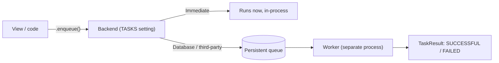

# Tasks framework (built-in background)

!!! quote "Think like a child 🧒"
    You ordered a cake at the bakery. You **don't stand still** at the counter
    until it bakes — the clerk writes your order on a little slip, drops it in the
    kitchen queue, and frees you up. The kitchen bakes the cake **later**, at its
    own pace. Django's **Tasks framework** is that little slip: you "jot down" a
    heavy job and give the user an answer right away; the work runs outside.

Django 6.0 shipped, out of the box (via [DEP 14](https://github.com/django/deps/blob/main/accepted/0014-background-workers.rst)),
a **standard** way to define and enqueue background tasks: the `django.tasks`
module. Before that, every project glued on an external solution (almost always
[Celery](../libs/celery.md)) and each had a different API. Now there is a single
interface — you write the task once and swap only the **backend** underneath.

## Use case

When a comment is posted, you want to send a notification email. Sending email is
slow (network, SMTP) and the user shouldn't wait for it. So you **enqueue** the
send and respond right away:

```python
# blog/tasks.py
from django.core.mail import send_mail
from django.tasks import task


@task
def send_comment_notification(post_title: str, to_email: str) -> None:
    """Send a notification email about a new comment.

    Args:
        post_title: Title of the post that received the comment.
        to_email: Recipient email address.
    """
    send_mail(
        subject=f"New comment on: {post_title}",
        message="Someone commented on your post.",
        from_email="blog@example.com",
        recipient_list=[to_email],
    )
```

```python
# blog/views.py
from django.http import HttpRequest, HttpResponse
from django.shortcuts import get_object_or_404

from blog.models import Post
from blog.tasks import send_comment_notification


def add_comment(request: HttpRequest, post_id: int) -> HttpResponse:
    """Register a comment and enqueue the notification email.

    Args:
        request: The incoming HTTP request.
        post_id: Primary key of the commented post.

    Returns:
        A quick response; the email is sent out of the request cycle.
    """
    post = get_object_or_404(Post, pk=post_id)
    send_comment_notification.enqueue(post.title, post.author.email)
    return HttpResponse("Comment received!")
```

The `.enqueue(...)` does **not** run the function there; it hands the request to
the backend and immediately returns a `TaskResult`. The view responds fast; the
email goes out on the side.

## Possibilities

### Defining a task

The `@task` decorator turns any function (sync **or** `async def`) into an
enqueueable task. You can pass options:

```python
from django.tasks import task


@task(queue_name="emails", priority=5, enqueue_on_commit=True)
def send_report(user_id: int) -> str:
    """Build and send a report for a user.

    Args:
        user_id: Primary key of the target user.

    Returns:
        A short status string stored as the task's return value.
    """
    return f"report sent to {user_id}"
```

| `@task` option | What it does |
| --- | --- |
| `queue_name` | Name of the logical queue the task lands in (default `"default"`). |
| `priority` | Priority hint (integer); backends that support it order by this. |
| `backend` | Which alias from the `TASKS` setting to use. |
| `enqueue_on_commit` | Only enqueue **after** the database transaction commits. |
| `takes_context` | Inject a `TaskContext` as the function's first argument. |

!!! tip "`enqueue_on_commit` avoids the classic bug"
    Without it, you can enqueue the task **inside** a transaction and the worker
    picks up the work **before** the commit — the task looks for a row that
    doesn't exist yet. With `enqueue_on_commit=True`, enqueuing waits for the
    commit. It's the safe default for tasks that read what you just wrote.

### Enqueuing

```python
from blog.tasks import send_report

# synchronous
result = send_report.enqueue(user_id=42)

# inside async code
result = await send_report.aenqueue(user_id=42)
```

Need to change an option just for this call (without redefining the task)? Use
`.using(...)`:

```python
# send this single run to a different queue and priority
send_report.using(queue_name="slow", priority=1).enqueue(user_id=42)
```

### What comes back: `TaskResult`

`enqueue()` returns a `TaskResult` — a "receipt" for the request, not the
function's value (which may not even have run yet).

| Attribute | What it is |
| --- | --- |
| `id` | Unique identifier for the run. |
| `status` | Current state (`READY`, `RUNNING`, `SUCCESSFUL`, `FAILED`). |
| `return_value` | The value returned by the function — only once it finishes successfully. |
| `errors` | List of captured errors, if it failed. |
| `enqueued_at` / `started_at` / `finished_at` | Lifecycle timestamps. |

```python
from django.tasks import TaskResultStatus

result = send_report.enqueue(user_id=42)
if result.status == TaskResultStatus.SUCCESSFUL:
    print(result.return_value)
```

!!! warning "Don't read `return_value` too early"
    On a real (out-of-process) backend, right after `enqueue()` the task is still
    `READY` — `return_value` isn't there. You re-fetch the result later by its
    `id`, or design the UI for "the result arrives later". Only the **Immediate**
    backend (below) hands everything back ready on the spot.

### Backends: where the task actually runs

The backend is chosen in the `TASKS` setting, in the same style as `DATABASES`
and `CACHES` (a dict with aliases):

```python
# settings.py
TASKS = {
    "default": {
        "BACKEND": "django.tasks.backends.immediate.ImmediateBackend",
    },
}
```

Django 6.0 ships with two built-in backends:

| Backend | Path | What it does | Use for |
| --- | --- | --- | --- |
| **Immediate** | `django.tasks.backends.immediate.ImmediateBackend` | Runs the task **right now**, in the same process, synchronously. | Development, simple projects. |
| **Dummy** | `django.tasks.backends.dummy.DummyBackend` | **Stores** enqueued tasks and **runs none**; you inspect them via `.results`. | Tests. |

```python
# in a test: nothing actually runs, you just check it was enqueued
from django.tasks import default_task_backend

send_report.enqueue(user_id=42)
assert len(default_task_backend.results) == 1
```

### ⚠️ The "framework without a worker"

This is the part that confuses people most. Django 6.0 delivers the **interface**
(define, enqueue, query) and two backends — but **none of them runs tasks in the
background for real in production**:

- `ImmediateBackend` runs everything **inside** the request — so it's not
  background at all; it's just the same API, handy to get started.
- `DummyBackend` runs nothing.

There is no backend in the 6.0 core with a **persistent queue + worker process**
ready for production. To get that you install a **third-party backend**. The most
direct one is the `django-tasks` package (the DEP 14 reference implementation),
which offers a database-backed queue and a worker command:

```python
# settings.py — database-backed queue (django-tasks package)
TASKS = {
    "default": {
        "BACKEND": "django_tasks.backends.database.DatabaseBackend",
    },
}
```

```bash
# a separate process that consumes the queue and runs the tasks
python manage.py db_worker
```

!!! danger "Migrating `Immediate` → database changes behavior"
    With Immediate, a task that errors **breaks the request** (the exception rises
    right there). With a queue backend, the same task fails **outside** the
    request: the `TaskResult` goes `FAILED` and nobody notices unless you check.
    When you switch backends, review error handling, retries, and observability.



### Sync × async tasks

The task function can be a plain `def` or an `async def` — the backend takes care
of running each in the right place. To understand **when** async actually helps
(and when it changes nothing), see [sync × async](../advanced/sync-vs-async.md).
Rule of thumb: enqueuing a heavy job takes it out of the request **regardless** of
sync/async; async shines when the work itself is concurrent I/O.

### Django Tasks × Celery

Built-in Tasks covers the common case with **zero dependencies**.
[Celery](../libs/celery.md) comes in **when you outgrow** that — when you need
features the core doesn't have:

| | Django Tasks (core 6.0) | [Celery](../libs/celery.md) |
| --- | --- | --- |
| Installation | Built-in | Separate lib + broker |
| Production broker/queue | None in core (external backend) | Redis / RabbitMQ |
| Scheduling (cron/periodic) | No | Yes (Celery Beat) |
| Retries / backoff | Minimal | Rich and configurable |
| Workflows (chain/group/chord) | No | Yes (canvas) |
| Result backend | Depends on the backend | Redis / DB / etc. |
| Learning curve | Low | Higher |

!!! tip "Start with the built-in one"
    Write your tasks with `@task` and `.enqueue()`. If one day you need periodic
    scheduling, sophisticated retries, or chained workflows, migrate the
    **backend** to Celery — your application code (the `@task` functions) barely
    changes, because the enqueue API is already standardized.

!!! quote "📖 In the official docs"
    - [Tasks (topic guide)](https://docs.djangoproject.com/en/6.0/topics/tasks/)
    - [Tasks (API reference)](https://docs.djangoproject.com/en/6.0/ref/tasks/)

## Recap

- `@task` turns a function (sync or `async def`) into something enqueueable;
  `.enqueue()` (or `.aenqueue()`) hands off the request and returns right away.
- `enqueue()` returns a `TaskResult` (a receipt), **not** the function's value —
  only the Immediate backend hands the result back ready immediately.
- Built-in backends in 6.0: **Immediate** (runs inline, dev) and **Dummy**
  (stores, runs nothing, tests). Configured in the `TASKS` setting.
- It's a "framework **without** a worker": the core ships no persistent queue +
  production process — use a third-party backend (`django-tasks`, `db_worker`).
- Use `enqueue_on_commit=True` for tasks that read freshly-written data.
- [Celery](../libs/celery.md) is the next step when you need scheduling, rich
  retries, or workflows — you swap the backend, not the code.
