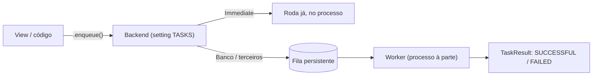

# Tasks framework (background nativo)

!!! quote "Pensa como criança 🧒"
    Você pediu um bolo na padaria. Você **não fica parado** no balcão até o bolo
    assar — o atendente anota seu pedido num papelzinho, coloca na fila da cozinha
    e te libera. A cozinha faz o bolo **depois**, no ritmo dela. O **Tasks
    framework** do Django é esse papelzinho: você "anota" um trabalho pesado e
    devolve a resposta ao usuário na hora; o trabalho roda por fora.

O Django 6.0 trouxe, de fábrica (via [DEP 14](https://github.com/django/deps/blob/main/accepted/0014-background-workers.rst)),
um jeito **padrão** de definir e enfileirar tarefas de segundo plano: o módulo
`django.tasks`. Antes disso, cada projeto colava uma solução externa (quase sempre
[Celery](../libs/celery.md)) e cada uma tinha uma API diferente. Agora existe uma
interface única — você escreve a task uma vez e troca só o **backend** por baixo.

## Caso de uso

Ao publicar um comentário, você quer mandar um e-mail de notificação. Mandar
e-mail é lento (rede, SMTP) e o usuário não deveria esperar por isso. Então você
**enfileira** o envio e responde na hora:

```python
# blog/tasks.py
from django.core.mail import send_mail
from django.tasks import task


@task
def send_comment_notification(post_title: str, to_email: str) -> None:
    """Send a notification email about a new comment.

    Args:
        post_title: Title of the post that received the comment.
        to_email: Recipient email address.
    """
    send_mail(
        subject=f"Novo comentário em: {post_title}",
        message="Alguém comentou no seu post.",
        from_email="blog@example.com",
        recipient_list=[to_email],
    )
```

```python
# blog/views.py
from django.http import HttpRequest, HttpResponse
from django.shortcuts import get_object_or_404

from blog.models import Post
from blog.tasks import send_comment_notification


def add_comment(request: HttpRequest, post_id: int) -> HttpResponse:
    """Register a comment and enqueue the notification email.

    Args:
        request: The incoming HTTP request.
        post_id: Primary key of the commented post.

    Returns:
        A quick response; the email is sent out of the request cycle.
    """
    post = get_object_or_404(Post, pk=post_id)
    send_comment_notification.enqueue(post.title, post.author.email)
    return HttpResponse("Comentário recebido!")
```

O `.enqueue(...)` **não** roda a função ali; ele entrega o pedido ao backend e
retorna imediatamente um `TaskResult`. A view responde rápido; o e-mail sai por
fora.

## Possibilidades

### Definindo uma task

O decorador `@task` transforma qualquer função (síncrona **ou** `async def`) em
uma task enfileirável. Você pode passar opções:

```python
from django.tasks import task


@task(queue_name="emails", priority=5, enqueue_on_commit=True)
def send_report(user_id: int) -> str:
    """Build and send a report for a user.

    Args:
        user_id: Primary key of the target user.

    Returns:
        A short status string stored as the task's return value.
    """
    return f"report sent to {user_id}"
```

| Opção do `@task` | O que faz |
| --- | --- |
| `queue_name` | Nome da fila lógica onde a task cai (default `"default"`). |
| `priority` | Dica de prioridade (inteiro); backends que suportam ordenam por ela. |
| `backend` | Qual alias do setting `TASKS` usar. |
| `enqueue_on_commit` | Só enfileira **depois** que a transação do banco der commit. |
| `takes_context` | Injeta um `TaskContext` como primeiro argumento da função. |

!!! tip "`enqueue_on_commit` evita o bug clássico"
    Sem ele, você pode enfileirar a task **dentro** de uma transação e o worker
    pegar o trabalho **antes** do commit — a task busca uma linha que ainda não
    existe. Com `enqueue_on_commit=True`, o enfileiramento espera o commit. É o
    default seguro para tasks que leem o que você acabou de gravar.

### Enfileirando

```python
from blog.tasks import send_report

# síncrono
result = send_report.enqueue(user_id=42)

# dentro de código async
result = await send_report.aenqueue(user_id=42)
```

Precisa mudar uma opção só nesta chamada (sem redefinir a task)? Use `.using(...)`:

```python
# manda esta única execução para uma fila e prioridade diferentes
send_report.using(queue_name="slow", priority=1).enqueue(user_id=42)
```

### O que volta: `TaskResult`

`enqueue()` devolve um `TaskResult` — um "recibo" do pedido, não o valor da
função (que talvez ainda nem tenha rodado).

| Atributo | O que é |
| --- | --- |
| `id` | Identificador único da execução. |
| `status` | Estado atual (`READY`, `RUNNING`, `SUCCESSFUL`, `FAILED`). |
| `return_value` | O valor retornado pela função — só quando termina com sucesso. |
| `errors` | Lista de erros capturados, se falhou. |
| `enqueued_at` / `started_at` / `finished_at` | Marcas de tempo do ciclo de vida. |

```python
from django.tasks import TaskResultStatus

result = send_report.enqueue(user_id=42)
if result.status == TaskResultStatus.SUCCESSFUL:
    print(result.return_value)
```

!!! warning "Não leia `return_value` cedo demais"
    Num backend real (fora de processo), logo após o `enqueue()` a task ainda
    está `READY` — `return_value` não existe. Você re-consulta o resultado mais
    tarde pelo `id`, ou desenha a UI para "o resultado chega depois". Só o backend
    **Immediate** (abaixo) já entrega tudo pronto na hora.

### Backends: onde a task realmente roda

O backend é escolhido no setting `TASKS`, no mesmo estilo de `DATABASES` e
`CACHES` (dicionário com aliases):

```python
# settings.py
TASKS = {
    "default": {
        "BACKEND": "django.tasks.backends.immediate.ImmediateBackend",
    },
}
```

O Django 6.0 vem com dois backends embutidos:

| Backend | Caminho | O que faz | Use para |
| --- | --- | --- | --- |
| **Immediate** | `django.tasks.backends.immediate.ImmediateBackend` | Roda a task **na hora**, no mesmo processo, de forma síncrona. | Desenvolvimento, projetos simples. |
| **Dummy** | `django.tasks.backends.dummy.DummyBackend` | **Guarda** as tasks enfileiradas e **não roda** nenhuma; você inspeciona via `.results`. | Testes. |

```python
# em um teste: nada roda de verdade, você só verifica que foi enfileirado
from django.tasks import default_task_backend

send_report.enqueue(user_id=42)
assert len(default_task_backend.results) == 1
```

### ⚠️ O "framework sem worker"

Este é o ponto que mais confunde. O Django 6.0 entrega a **interface** (definir,
enfileirar, consultar) e dois backends — mas **nenhum deles roda tasks em
background de verdade em produção**:

- `ImmediateBackend` roda tudo **dentro** da requisição — ou seja, não é
  background nenhum; é só a mesma API, útil para começar.
- `DummyBackend` não roda nada.

Não existe, no core do 6.0, um backend com **fila persistente + processo worker**
pronto para produção. Para ter isso você instala um **backend de terceiros**. O
mais direto é o pacote `django-tasks` (a implementação de referência da DEP 14),
que oferece um backend com fila no banco e um comando de worker:

```python
# settings.py — backend com fila no banco (pacote django-tasks)
TASKS = {
    "default": {
        "BACKEND": "django_tasks.backends.database.DatabaseBackend",
    },
}
```

```bash
# processo separado que consome a fila e executa as tasks
python manage.py db_worker
```

!!! danger "Migrar `Immediate` → banco muda o comportamento"
    Com o Immediate, uma task que dá erro **quebra a requisição** (a exceção sobe
    ali mesmo). Com um backend de fila, a mesma task falha **fora** do request:
    o `TaskResult` fica `FAILED` e ninguém percebe se você não checar. Ao trocar
    de backend, revise tratamento de erro, retries e observabilidade.



### Tasks síncronas × assíncronas

A função da task pode ser `def` comum ou `async def` — o backend cuida de rodar
cada uma no lugar certo. Para entender **quando** async realmente ajuda (e quando
não muda nada), veja [sync × async](../advanced/sync-vs-async.md). Regra prática:
enfileirar um trabalho pesado tira ele do request **independente** de sync/async;
o async brilha quando o próprio trabalho é I/O concorrente.

### Django Tasks × Celery

O Tasks nativo cobre o caso comum com **zero dependências**. O
[Celery](../libs/celery.md) entra **quando você cresce além** disso — precisa de
recursos que o core não tem:

| | Django Tasks (core 6.0) | [Celery](../libs/celery.md) |
| --- | --- | --- |
| Instalação | Embutido | Lib + broker separados |
| Broker/fila de produção | Nenhum no core (backend externo) | Redis / RabbitMQ |
| Agendamento (cron/periódico) | Não | Sim (Celery Beat) |
| Retries / backoff | Mínimo | Rico e configurável |
| Workflows (chain/group/chord) | Não | Sim (canvas) |
| Result backend | Depende do backend | Redis / DB / etc. |
| Curva de aprendizado | Baixa | Maior |

!!! tip "Comece pelo nativo"
    Escreva suas tasks com `@task` e `.enqueue()`. Se um dia precisar de
    agendamento periódico, retries sofisticados ou workflows encadeados, migre o
    **backend** para o Celery — o seu código de aplicação (as funções `@task`)
    muda pouco, porque a API de enfileirar já está padronizada.

!!! quote "📖 Na documentação oficial"
    - [Tasks (topic guide)](https://docs.djangoproject.com/en/6.0/topics/tasks/)
    - [Tasks (API reference)](https://docs.djangoproject.com/en/6.0/ref/tasks/)

## Recap

- `@task` transforma uma função (sync ou `async def`) em algo enfileirável;
  `.enqueue()` (ou `.aenqueue()`) entrega o pedido e volta na hora.
- `enqueue()` devolve um `TaskResult` (recibo), **não** o valor da função — só o
  backend Immediate entrega o resultado pronto imediatamente.
- Backends embutidos no 6.0: **Immediate** (roda inline, dev) e **Dummy** (guarda
  e não roda, testes). Configurados no setting `TASKS`.
- É um "framework **sem** worker": o core não traz fila persistente + processo de
  produção — use um backend de terceiros (`django-tasks`, `db_worker`) para isso.
- Use `enqueue_on_commit=True` para tasks que leem dados recém-gravados.
- [Celery](../libs/celery.md) é o próximo passo quando você precisa de
  agendamento, retries ricos ou workflows — troca-se o backend, não o código.
