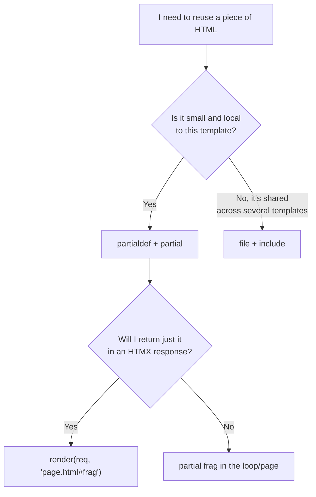

# Template partials

!!! quote "Think like a child 🧒"
    Imagine you draw a little star sticker once, in a corner of the page. After
    that you just stamp that same star anywhere on the drawing — and you can even
    cut out just the sticker and mail it to a friend. A **template partial** is
    exactly that: you define a small piece of HTML **once**, inside the template
    itself, and reuse it (or cut it out and send it) whenever you want.

New in **Django 6.0**: you can now define and reuse template fragments without
creating a separate file for each one. These are **template partials**, with the
`` and `` tags.

## Use case

You have a page that lists posts. Each post shows up as a "card". You want to:

1. Write the card HTML **once**.
2. Reuse that card in the listing loop.
3. And, when the user clicks "like", **render just that card** back (without
   reloading the page) — ideal for HTMX.

Before 6.0 you would create a `_post_card.html` file and use ``. Now
you can keep everything in the same template:

```html
{# blog/templates/blog/post_list.html #}

<article class="card" id="post-{{ post.pk }}">
  <h2>{{ post.title }}</h2>
  <p>{{ post.excerpt }}</p>
  <button
    hx-post=""
    hx-target="#post-{{ post.pk }}"
    hx-swap="outerHTML"
  >
    ❤️ {{ post.likes }}
  </button>
</article>


<h1>Blog</h1>

  

```

Notice two things:

- ` ... ` **defines** the fragment but
  **does not show it** where it's defined.
- `` **renders** the fragment — here, once per post.

## Possibilities

### The two tags

| Tag | What it does |
| --- | --- |
| ` ... ` | Defines a reusable fragment. By default it does **not** appear where it's defined. |
| ` ... ` | Defines **and** renders in place (useful when the fragment is also part of the page). |
| `` | Renders a fragment defined earlier (in the same template). |
| `` or `` | Closes the block. Repeating the name makes long blocks more readable. |

!!! info "`load`? Not needed."
    `partialdef` and `partial` are **builtin** tags in Django 6.0 — no
    `` required. They ship with the `DjangoTemplates` backend.

### `inline`: define and show at the same time

Without `inline`, the `partialdef` stays "hidden" — it only exists to be called
later. With `inline`, it's also rendered right there:

```html
{# Renders NOW and stays available for  later #}

<p>Hello, {{ user.first_name|default:"visitor" }}! 👋</p>

```

!!! tip "Rule of thumb"
    Use `inline` when the fragment is **also** part of the page's normal flow.
    Leave it **without** `inline` when it's a "mold" that will only be called by
    `` or rendered directly by the view.

### Rendering a partial straight from the view

This is the powerful part. Django 6.0's template loader understands the
`path/to/template.html#partial-name` syntax. In other words: you ask for **just
the fragment**, not the whole page.

```python
# blog/views.py
from django.shortcuts import get_object_or_404, render
from django.views.decorators.http import require_POST

from blog.models import Post


@require_POST
def like(request, pk: int):
    """Increment a post's like count and return only its card fragment.

    Args:
        request: The incoming HTTP request.
        pk: Primary key of the post being liked.

    Returns:
        An HttpResponse containing only the ``post-card`` fragment.
    """
    post = get_object_or_404(Post, pk=pk)
    post.likes += 1
    post.save(update_fields=["likes"])
    return render(request, "blog/post_list.html#post-card", {"post": post})
```

Notice the `#post-card` at the end of the template name: Django locates
`blog/post_list.html`, finds the `partialdef post-card` inside it, and renders
**only** that piece. HTMX receives the updated card HTML and swaps it in place.

!!! tip "Pairs beautifully with HTMX"
    The `hx-target` and `hx-swap="outerHTML"` from the example swap exactly the
    `<article id="post-...">` with the returned fragment. One page, one template,
    zero extra files. See more in [HTMX](../frontend/htmx.md).

### Works with CBVs too

In a class-based view, just point `template_name` at the fragment:

```python
# blog/views.py
from django.views.generic import DetailView

from blog.models import Post


class PostCardView(DetailView):
    """Render a single post as its reusable card fragment."""

    model = Post
    context_object_name = "post"
    template_name = "blog/post_list.html#post-card"
```

!!! note "The object's name in the context"
    The fragment uses the `post` variable. That's why we set
    `context_object_name = "post"` — so the card finds what it expects, whether
    it's called by the listing, by the `like` FBV, or by this CBV.

### Partials and template inheritance

A `partialdef` lives in the template where it's written. If you want the fragment
available in **child** templates, define it in an inherited block or in the base
template. Calling `` only works if the `partialdef` for that name
is visible in the template being rendered.

```html
{# blog/templates/blog/base.html #}

<div class="flash flash-{{ level|default:'info' }}">{{ message }}</div>



```

```html
{# blog/templates/blog/post_detail.html #}



  
  <article>{{ post.body }}</article>

```

### `partial` vs `include`

Both reuse HTML, but they solve different problems.

| | `` / `partialdef` | `` |
| --- | --- | --- |
| Where the HTML lives | **In the same file** (inline fragment) | In **another** `.html` file |
| Context | Inherits the current context | Inherits the context (or isolate with `only`) |
| Passing variables | Uses whatever is in scope | `` |
| Render straight from the view | **Yes**, via `template.html#name` | No (you render the whole file) |
| Best for | Small, local fragments, HTMX | Larger components, shared across apps |



!!! warning "Not a universal replacement for `include`"
    If the same fragment is used by **many** templates across different apps, a
    file with `` is still tidier. Partials shine when the fragment
    belongs to **that** page — especially for partial swaps with HTMX.

!!! danger "The name must exist in the rendered template"
    `render(request, "blog/post_list.html#post-card", ...)` only works if there is
    a `` inside `blog/post_list.html`. A wrong name or a
    fragment defined in another file raises `TemplateDoesNotExist`.

!!! quote "📖 In the official docs"
    - [Built-in template tags — `partialdef` / `partial`](https://docs.djangoproject.com/en/6.0/ref/templates/builtins/)
    - [Django 6.0 release notes](https://docs.djangoproject.com/en/6.0/releases/6.0/)

## Recap

- **New in Django 6.0**: ` ... ` defines a
  reusable fragment inside the template itself.
- `` renders that fragment; no `load` needed — they're builtin
  tags.
- By default the `partialdef` **does not appear** where it's defined; use `inline`
  to define **and** show it in place.
- From the view you render **just the fragment** with the
  `"path/template.html#name"` syntax — in `render()`, `get_object_or_404`, or a
  CBV's `template_name`.
- It pairs perfectly with **HTMX**: a page swaps only the piece that changed.
- Use `partial` for local fragments and HTMX; use [`include`](templates.md) for
  larger components shared across apps.

Want to take this to real partial swaps in the browser? Head over to
**[HTMX](../frontend/htmx.md)**.
