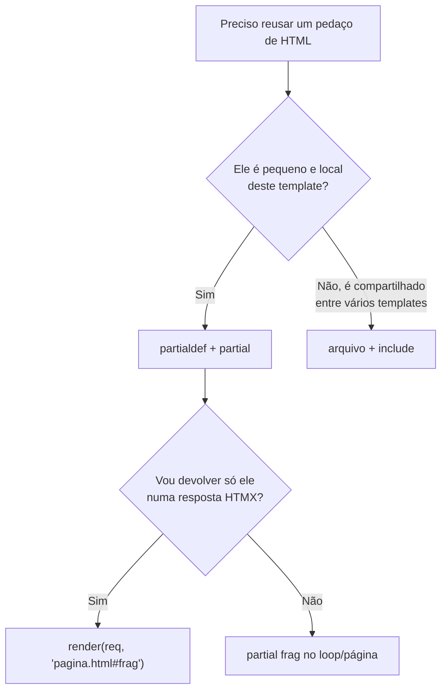

# Template partials

!!! quote "Pensa como criança 🧒"
    Imagina que você desenha um adesivo de estrelinha uma vez, num cantinho da
    folha. Depois é só carimbar essa mesma estrelinha em qualquer lugar do
    desenho — e você ainda pode recortar só o adesivo e mandar pro seu amigo.
    Um **template partial** é isso: você define um pedacinho de HTML **uma vez**,
    dentro do próprio template, e reusa (ou recorta e envia) quando quiser.

Novidade do **Django 6.0**: agora dá para definir e reusar fragmentos de template
sem criar um arquivo separado para cada um. São as **template partials**, com as
tags `` e ``.

## Caso de uso

Você tem uma página que lista posts. Cada post aparece como um "card". Você quer:

1. Escrever o HTML do card **uma vez**.
2. Reusar esse card no loop da listagem.
3. E, quando o usuário clicar em "curtir", **renderizar só aquele card** de volta
   (sem recarregar a página) — ideal para HTMX.

Antes do 6.0 você criaria um arquivo `_post_card.html` e usaria ``.
Agora dá para deixar tudo no mesmo template:

```html
{# blog/templates/blog/post_list.html #}

<article class="card" id="post-{{ post.pk }}">
  <h2>{{ post.title }}</h2>
  <p>{{ post.excerpt }}</p>
  <button
    hx-post=""
    hx-target="#post-{{ post.pk }}"
    hx-swap="outerHTML"
  >
    ❤️ {{ post.likes }}
  </button>
</article>


<h1>Blog</h1>

  

```

Repare em duas coisas:

- ` ... ` **define** o fragmento, mas
  **não o mostra** onde foi definido.
- `` **renderiza** o fragmento — aqui, uma vez por post.

## Possibilidades

### As duas tags

| Tag | O que faz |
| --- | --- |
| ` ... ` | Define um fragmento reutilizável. Por padrão **não** aparece onde é definido. |
| ` ... ` | Define **e** renderiza no lugar (útil quando o fragmento também faz parte da página). |
| `` | Renderiza um fragmento definido antes (no mesmo template). |
| `` ou `` | Fecha o bloco. Repetir o nome deixa mais legível em blocos longos. |

!!! info "`load`? Não precisa."
    `partialdef` e `partial` são tags **builtin** no Django 6.0 — não é preciso
    `` nada. Elas já vêm com o `DjangoTemplates` backend.

### `inline`: definir e mostrar ao mesmo tempo

Sem `inline`, o `partialdef` fica "escondido" — ele só existe para ser chamado
depois. Com `inline`, ele também é renderizado ali mesmo:

```html
{# Renderiza AGORA e continua disponível para  depois #}

<p>Olá, {{ user.first_name|default:"visitante" }}! 👋</p>

```

!!! tip "Regra prática"
    Use `inline` quando o fragmento **também** faz parte do fluxo normal da
    página. Deixe **sem** `inline` quando ele é um "molde" que só será chamado por
    `` ou renderizado direto pela view.

### Renderizar um partial direto da view

Esta é a parte poderosa. O loader de templates do Django 6.0 entende a sintaxe
`caminho/do/template.html#nome-do-partial`. Ou seja: você pede **só o fragmento**,
não a página inteira.

```python
# blog/views.py
from django.shortcuts import get_object_or_404, render
from django.views.decorators.http import require_POST

from blog.models import Post


@require_POST
def like(request, pk: int):
    """Increment a post's like count and return only its card fragment.

    Args:
        request: The incoming HTTP request.
        pk: Primary key of the post being liked.

    Returns:
        An HttpResponse containing only the ``post-card`` fragment.
    """
    post = get_object_or_404(Post, pk=pk)
    post.likes += 1
    post.save(update_fields=["likes"])
    return render(request, "blog/post_list.html#post-card", {"post": post})
```

Repare no `#post-card` no fim do nome do template: o Django localiza
`blog/post_list.html`, encontra o `partialdef post-card` lá dentro e renderiza
**apenas** aquele pedaço. O HTMX recebe o HTML do card atualizado e troca no lugar.

!!! tip "Combina demais com HTMX"
    O `hx-target` e o `hx-swap="outerHTML"` do exemplo trocam exatamente o
    `<article id="post-...">` pelo fragmento devolvido. Uma página, um template,
    zero arquivos extras. Veja mais em [HTMX](../frontend/htmx.md).

### Funciona com CBVs também

Em uma class-based view, basta apontar o `template_name` para o fragmento:

```python
# blog/views.py
from django.views.generic import DetailView

from blog.models import Post


class PostCardView(DetailView):
    """Render a single post as its reusable card fragment."""

    model = Post
    context_object_name = "post"
    template_name = "blog/post_list.html#post-card"
```

!!! note "Nome do objeto no contexto"
    O fragmento usa a variável `post`. Por isso definimos
    `context_object_name = "post"` — assim o card encontra o que espera, seja
    chamado pela listagem, pela FBV `like` ou por esta CBV.

### Partials e herança de template

Um `partialdef` vive no template onde foi escrito. Se você quer o fragmento
disponível em templates **filhos**, defina-o num bloco herdado ou no template base.
Chamar `` só funciona se o `partialdef` daquele nome estiver
visível no template sendo renderizado.

```html
{# blog/templates/blog/base.html #}

<div class="flash flash-{{ level|default:'info' }}">{{ message }}</div>



```

```html
{# blog/templates/blog/post_detail.html #}



  
  <article>{{ post.body }}</article>

```

### `partial` vs `include`

As duas reutilizam HTML, mas resolvem problemas diferentes.

| | `` / `partialdef` | `` |
| --- | --- | --- |
| Onde mora o HTML | **No mesmo arquivo** (fragmento inline) | Em **outro arquivo** `.html` |
| Contexto | Herda o contexto atual | Herda o contexto (ou isole com `only`) |
| Passar variáveis | Usa o que estiver no escopo | `` |
| Renderizar direto da view | **Sim**, via `template.html#nome` | Não (você renderiza o arquivo inteiro) |
| Melhor para | Fragmentos pequenos e locais, HTMX | Componentes maiores, compartilhados entre apps |



!!! warning "Não é substituto universal do `include`"
    Se o mesmo fragmento é usado por **vários** templates de apps diferentes, um
    arquivo com `` continua sendo mais organizado. Partials brilham
    quando o fragmento pertence **àquela** página — especialmente para trocas
    parciais com HTMX.

!!! danger "O nome precisa existir no template renderizado"
    `render(request, "blog/post_list.html#post-card", ...)` só funciona se existir
    um `` dentro de `blog/post_list.html`. Nome errado
    ou fragmento definido em outro arquivo levanta `TemplateDoesNotExist`.

!!! quote "📖 Na documentação oficial"
    - [Built-in template tags — `partialdef` / `partial`](https://docs.djangoproject.com/en/6.0/ref/templates/builtins/)
    - [Django 6.0 release notes](https://docs.djangoproject.com/en/6.0/releases/6.0/)

## Recap

- **Novidade do Django 6.0**: ` ... `
  define um fragmento reutilizável dentro do próprio template.
- `` renderiza esse fragmento; sem `load` nenhum, são tags
  builtin.
- Por padrão o `partialdef` **não aparece** onde é definido; use `inline` para
  definir **e** mostrar no lugar.
- Da view você renderiza **só o fragmento** com a sintaxe
  `"caminho/template.html#nome"` — em `render()`, `get_object_or_404` ou no
  `template_name` de uma CBV.
- Casa perfeitamente com **HTMX**: uma página troca só o pedaço que mudou.
- Use `partial` para fragmentos locais e HTMX; use [`include`](templates.md) para
  componentes maiores compartilhados entre apps.

Quer levar isso para trocas parciais de verdade no navegador? Siga para
**[HTMX](../frontend/htmx.md)**.
