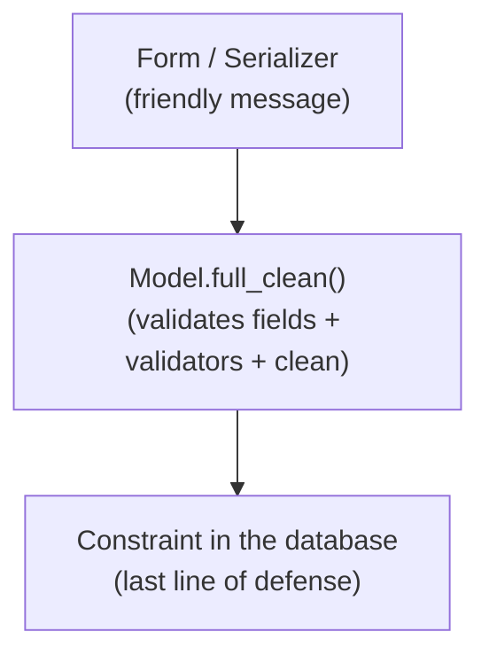

# Reference: validators and validation

!!! quote "Think like a child 🧒"
    Before putting a toy back in the box, someone checks: "does this fit here? is
    it in one piece?". A **validator** is that checker. It looks at a value and
    says "ok" or "no, and here's why". That way bad data never gets into the
    database.

## Use case

You want a comment's rating to stay between 0 and 5, and a nickname not to
contain spaces. Instead of checking that in several places, you attach
**validators** to the field:

```python
from django.core.validators import MaxValueValidator, MinValueValidator, RegexValidator
from django.db import models


class Review(models.Model):
    rating = models.IntegerField(
        validators=[MinValueValidator(0), MaxValueValidator(5)],
    )
    nickname = models.CharField(
        max_length=30,
        validators=[RegexValidator(r"^\S+$", "Cannot contain spaces.")],
    )
```

## What's possible

### Built-in validators

| Validator | Guarantees |
| --- | --- |
| `MinValueValidator(n)` / `MaxValueValidator(n)` | Value ≥ / ≤ n |
| `MinLengthValidator(n)` / `MaxLengthValidator(n)` | Minimum/maximum length |
| `RegexValidator(regex, msg)` | Matches the regular expression |
| `EmailValidator()` | Is a valid email |
| `URLValidator()` | Is a valid URL |
| `validate_slug` | Only letters, numbers, hyphen, underscore |
| `validate_integer` | Is an integer |
| `FileExtensionValidator([...])` | Allowed file extension |

```python
from django.core.validators import FileExtensionValidator

class Document(models.Model):
    file = models.FileField(
        validators=[FileExtensionValidator(["pdf", "docx"])],
    )
```

### Custom validator: a function

Think like a child: a checker is just a function that, if it doesn't like
something, yells (`ValidationError`).

```python
from django.core.exceptions import ValidationError


def validate_even(value: int) -> None:
    """Reject odd numbers."""
    if value % 2 != 0:
        raise ValidationError("%(value)s is not even.", params={"value": value})


class Batch(models.Model):
    size = models.IntegerField(validators=[validate_even])
```

- Returns `None` if everything is fine.
- Raises `ValidationError` (with a message) if it's not.

### Custom validator: a class (parameterizable)

When the validator needs configuration, make a class with `__call__`:

```python
from django.utils.deconstruct import deconstructible


@deconstructible                              # (1)!
class MaxWords:
    """Reject text with more than ``limit`` words."""

    def __init__(self, limit: int) -> None:
        self.limit = limit

    def __call__(self, value: str) -> None:
        if len(value.split()) > self.limit:
            raise ValidationError(f"At most {self.limit} words.")


class Tweet(models.Model):
    body = models.TextField(validators=[MaxWords(50)])
```

1. `@deconstructible` lets the validator be **serialized into migrations** (Django
    needs to know how to recreate it). Always use it on class-based validators.

### The three layers of validation

Think like a child: three checkers in a line, from the one closest to the user to
the one closest to the database.



| Layer | Where | Role |
| --- | --- | --- |
| Form / Serializer | User input | Clear message, early |
| Model validators + `clean()` | `full_clean()` | Object's domain rule |
| `constraints` in `Meta` | Database | Guaranteed integrity |

!!! danger "`save()` does NOT run the validators automatically"
    This is gotcha #1: calling `model.save()` does **not** run the validators or
    `clean()`. What runs them is the **form/serializer** (in `is_valid()`) or you
    calling `model.full_clean()` on purpose:
    ```python
    obj = Review(rating=99)
    obj.full_clean()    # <- raises ValidationError; save() alone wouldn't check
    obj.save()
    ```

### `clean()` on the model: rules across fields

```python
class Event(models.Model):
    start = models.DateField()
    end = models.DateField()

    def clean(self) -> None:
        """Ensure the event ends after it starts."""
        if self.end < self.start:
            raise ValidationError("The end date cannot be before the start date.")
```

- `clean()` runs inside `full_clean()` (and in forms). It's the place for rules
  that **cross** fields.
- To guarantee it in the database too, add a `CheckConstraint` to `Meta`.

!!! quote "📖 In the official docs"
    - [Validators](https://docs.djangoproject.com/en/stable/ref/validators/)

## Recap

- Validators check values; attach them via `validators=[...]` on the field.
- Built-in (`MinValueValidator`, `RegexValidator`, `FileExtensionValidator`...) or
  your own (a function that raises `ValidationError`, or a `@deconstructible`
  class).
- Three layers: form/serializer (friendly) → `full_clean()`/`clean()` (domain) →
  `constraints` (database).
- **`save()` doesn't validate on its own** — use a form/serializer or
  `full_clean()`.
- Rules across fields go in the model's `clean()` (+ a `CheckConstraint` for the
  database).

And when the built-in fields aren't enough? You create your own:
**[custom fields](custom-fields.md)**.
