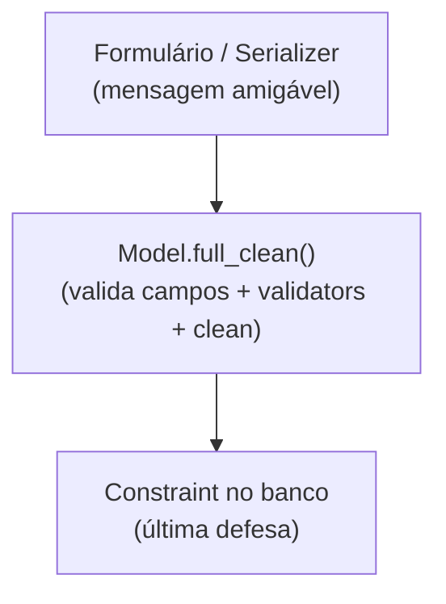

# Referência: validators e validação

!!! quote "Pensa como criança 🧒"
    Antes de guardar um brinquedo na caixa, alguém confere: "esse cabe aqui? tá
    inteiro?". Um **validator** é esse conferente. Ele olha um valor e diz "ok" ou
    "não pode, por isso aqui". Assim dados errados nunca entram no banco.

## Caso de uso

Você quer que a nota de um comentário fique entre 0 e 5, e que um apelido não
contenha espaços. Em vez de checar isso em vários lugares, você anexa
**validators** ao campo:

```python
from django.core.validators import MaxValueValidator, MinValueValidator, RegexValidator
from django.db import models


class Review(models.Model):
    rating = models.IntegerField(
        validators=[MinValueValidator(0), MaxValueValidator(5)],
    )
    nickname = models.CharField(
        max_length=30,
        validators=[RegexValidator(r"^\S+$", "Não pode conter espaços.")],
    )
```

## Possibilidades

### Validators embutidos

| Validator | Garante |
| --- | --- |
| `MinValueValidator(n)` / `MaxValueValidator(n)` | Valor ≥ / ≤ n |
| `MinLengthValidator(n)` / `MaxLengthValidator(n)` | Tamanho mínimo/máximo |
| `RegexValidator(regex, msg)` | Casa com a expressão regular |
| `EmailValidator()` | É um e-mail válido |
| `URLValidator()` | É uma URL válida |
| `validate_slug` | Só letras, números, hífen, underscore |
| `validate_integer` | É um inteiro |
| `FileExtensionValidator([...])` | Extensão de arquivo permitida |

```python
from django.core.validators import FileExtensionValidator

class Document(models.Model):
    file = models.FileField(
        validators=[FileExtensionValidator(["pdf", "docx"])],
    )
```

### Validator customizado: uma função

Pensa como criança: um conferente é só uma função que, se não gostar, grita
(`ValidationError`).

```python
from django.core.exceptions import ValidationError


def validate_even(value: int) -> None:
    """Reject odd numbers."""
    if value % 2 != 0:
        raise ValidationError("%(value)s não é par.", params={"value": value})


class Batch(models.Model):
    size = models.IntegerField(validators=[validate_even])
```

- Retorna `None` se está tudo bem.
- Levanta `ValidationError` (com mensagem) se não está.

### Validator customizado: uma classe (parametrizável)

Quando o validator precisa de configuração, faça uma classe com `__call__`:

```python
from django.utils.deconstruct import deconstructible


@deconstructible                              # (1)!
class MaxWords:
    """Reject text with more than ``limit`` words."""

    def __init__(self, limit: int) -> None:
        self.limit = limit

    def __call__(self, value: str) -> None:
        if len(value.split()) > self.limit:
            raise ValidationError(f"No máximo {self.limit} palavras.")


class Tweet(models.Model):
    body = models.TextField(validators=[MaxWords(50)])
```

1. `@deconstructible` deixa o validator ser **serializado nas migrações** (o
    Django precisa saber como recriá-lo). Sempre use em validators de classe.

### As três camadas de validação

Pensa como criança: três conferentes em fila, do mais perto do usuário ao mais
perto do banco.



| Camada | Onde | Papel |
| --- | --- | --- |
| Form / Serializer | Entrada do usuário | Mensagem clara, cedo |
| Model validators + `clean()` | `full_clean()` | Regra de domínio do objeto |
| `constraints` na `Meta` | Banco | Integridade garantida |

!!! danger "`save()` NÃO roda os validators automaticamente"
    Este é o pega-ratão nº 1: chamar `model.save()` **não** executa os validators
    nem o `clean()`. Quem roda é o **formulário/serializer** (no `is_valid()`) ou
    você chamando `model.full_clean()` de propósito:
    ```python
    obj = Review(rating=99)
    obj.full_clean()    # <- levanta ValidationError; save() sozinho não checaria
    obj.save()
    ```

### `clean()` no modelo: regras entre campos

```python
class Event(models.Model):
    start = models.DateField()
    end = models.DateField()

    def clean(self) -> None:
        """Ensure the event ends after it starts."""
        if self.end < self.start:
            raise ValidationError("A data final não pode ser antes da inicial.")
```

- `clean()` roda dentro de `full_clean()` (e nos forms). É o lugar de regras que
  **cruzam** campos.
- Para garantir no banco também, adicione um `CheckConstraint` na `Meta`.

## Recap

- Validators conferem valores; anexe-os via `validators=[...]` no field.
- Embutidos (`MinValueValidator`, `RegexValidator`, `FileExtensionValidator`...)
  ou seus (função que levanta `ValidationError`, ou classe `@deconstructible`).
- Três camadas: form/serializer (amigável) → `full_clean()`/`clean()` (domínio)
  → `constraints` (banco).
- **`save()` não valida sozinho** — use um form/serializer ou `full_clean()`.
- Regras entre campos vão no `clean()` do modelo (+ `CheckConstraint` para o
  banco).

E quando os campos embutidos não bastam? Você cria os seus:
**[campos customizados](custom-fields.md)**.
