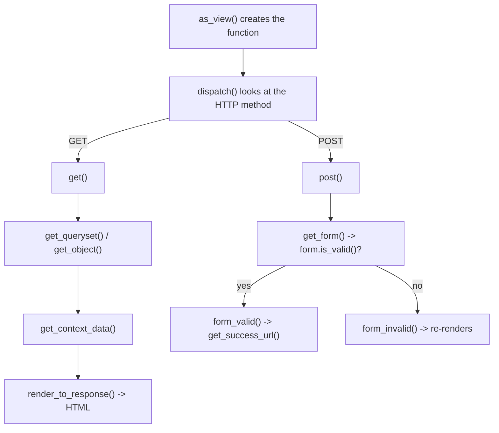

# Reference: class-based views (CBV)

!!! quote "Think like a child 🧒"
    A **view** is a waiter. You (the browser) place an order; the waiter goes to
    the kitchen (the database), plates the dish (the page), and brings it back. A
    **class-based view** is a trained waiter who **already knows** how to serve
    the common dishes — list the menu, show a dish, take a new order. You just
    say *which* dish and *what changes*; the rest he already does on his own.

## Use case

You want a page that lists published posts, paginated 10 at a time, filtered by
tag. Instead of writing the `GET`, the pagination, and the context by hand, you
inherit from `ListView` and adjust only what changes:

```python
# apps/blog/views.py
from typing import Any

from django.db.models import QuerySet
from django.views.generic import ListView

from apps.blog.models import Post


class PostListView(ListView):
    """Paginated list of published posts."""

    model = Post
    template_name = "blog/post_list.html"
    context_object_name = "posts"
    paginate_by = 10

    def get_queryset(self) -> QuerySet[Post]:
        """Return only published posts, newest first."""
        return Post.objects.published().select_related("author")
```

You wrote 1 method. You got: handling of the `GET`, the database lookup,
pagination, template rendering, and the context (`posts`, `page_obj`,
`paginator`). Let's break down **everything** you can adjust.

## Possibilities

### The map of generic views

| View | Good for | Dishes it already knows |
| --- | --- | --- |
| `TemplateView` | Static page with context | rendering a template |
| `ListView` | Listing objects | lookup + pagination |
| `DetailView` | Showing **one** object | lookup by `pk`/`slug` |
| `CreateView` | Creating via form | GET (empty form) + POST (saves) |
| `UpdateView` | Editing via form | GET (prefilled form) + POST (saves) |
| `DeleteView` | Deleting with confirmation | GET (confirms) + POST (deletes) |
| `FormView` | Form without a model | validation + `form_valid` |
| `RedirectView` | Redirecting | sends to another URL |

### Attributes you define (the "knobs")

They apply to most generic views that deal with models:

| Attribute | What it does |
| --- | --- |
| `model` | The view's model |
| `queryset` | Alternative to `model`: pre-filters the base |
| `template_name` | Which template to render |
| `context_object_name` | Name of the object/list in the template |
| `pk_url_kwarg` | Name of the URL parameter for the PK (default `"pk"`) |
| `slug_url_kwarg` | Name of the URL parameter for the slug (default `"slug"`) |
| `slug_field` | Model field used as the slug (default `"slug"`) |
| `paginate_by` | Items per page (`ListView` only) |
| `ordering` | Ordering (`ListView` only) |
| `form_class` | Form to use (`Create`/`Update`/`FormView`) |
| `fields` | Form fields (shortcut instead of `form_class`) |
| `success_url` | Where to go after saving/deleting |
| `context_object_name` | Name in the template |

### Methods you override (the "hooks")

This is where the power lives. Each method is an entry point to change **one
step**:

| Method | When it runs | Override it to... |
| --- | --- | --- |
| `get_queryset()` | When fetching the objects | Filter/optimize the base |
| `get_object()` | When getting **one** object (Detail/Update/Delete) | Access rules |
| `get_context_data(**kwargs)` | When building the template context | Add extra variables |
| `get_form_class()` | When deciding which form | Choose the form dynamically |
| `get_form_kwargs()` | When instantiating the form | Pass extra data to the form |
| `form_valid(form)` | When the form passed validation | Act before saving/redirecting |
| `form_invalid(form)` | When the form failed | Custom error response |
| `get_success_url()` | After success | Compute the destination dynamically |

!!! danger "Always call `super()` — and before you touch anything"
    When overriding `get_context_data`, start with
    `context = super().get_context_data(**kwargs)`. If you don't call it, you
    lose everything the base class prepared (`object`, `page_obj`, etc.).
    ```python
    def get_context_data(self, **kwargs: Any) -> dict[str, Any]:
        context = super().get_context_data(**kwargs)   # <- this first
        context["tags"] = Tag.objects.all()             # <- then yours
        return context
    ```

### The execution order (the secret the docs hide)

Think like a child: it's an **assembly line**. The request comes in at one end
and the HTML comes out the other. Each method is a station:



- **`as_view()`** — what you put in `urls.py`. Turns the class into a function.
- **`dispatch()`** — the "doorkeeper": checks whether it's GET or POST and calls
  the right method.
- From there on, each station calls the next one.

### `CreateView` / `UpdateView` in practice

```python
from django.contrib.auth.mixins import LoginRequiredMixin
from django.http import HttpResponse
from django.views.generic import CreateView

from apps.blog.forms import PostForm
from apps.blog.models import Post


class PostCreateView(LoginRequiredMixin, CreateView):
    """Create a post, setting the author from the logged-in user."""

    model = Post
    form_class = PostForm
    template_name = "blog/post_form.html"

    def form_valid(self, form: PostForm) -> HttpResponse:
        """Attach the current user as author before saving."""
        form.instance.author = self.request.user.author_profile
        return super().form_valid(form)

    def get_success_url(self) -> str:
        """Redirect to the new post's page."""
        return self.object.get_absolute_url()
```

Useful data inside the methods:

| Inside the view you access | What it is |
| --- | --- |
| `self.request` | The request (`self.request.user`, `.GET`, `.POST`) |
| `self.kwargs` | Parameters captured from the URL (`self.kwargs["slug"]`) |
| `self.args` | Positional parameters from the URL |
| `self.object` | The current object (after `get_object`/save) |

### Mixins: superpowers by composition

Think like a child: a **mixin** is a sticker you slap on the view to give it an
extra power, without redesigning the view.

| Mixin | Power it adds |
| --- | --- |
| `LoginRequiredMixin` | Requires a logged-in user |
| `PermissionRequiredMixin` | Requires a permission (`permission_required = "blog.add_post"`) |
| `UserPassesTestMixin` | Requires passing a test (`test_func()`) |
| `SuccessMessageMixin` | Shows a success message after saving |

```python
from django.contrib.auth.mixins import UserPassesTestMixin


class PostUpdateView(UserPassesTestMixin, UpdateView):
    model = Post
    fields = ["title", "body"]

    def test_func(self) -> bool:
        """Only the post's author may edit it."""
        return self.get_object().author.user == self.request.user
```

!!! danger "The order of the mixins matters (MRO)"
    In `class V(LoginRequiredMixin, UpdateView)`, Python builds the inheritance
    chain **from left to right**. The mixin needs to come **before** the generic
    view to intercept the request in time. Flipped it? The gate doesn't work.
    Think like a child: the guard stands at the **door** (first), not inside.

!!! quote "📖 In the official docs"
    - [Class-based views](https://docs.djangoproject.com/en/stable/topics/class-based-views/)

## Recap

- Generic views are waiters that already know how to serve the common dishes;
  you adjust what changes.
- **Attributes** = knobs (`model`, `template_name`, `paginate_by`,
  `form_class`, `success_url`).
- **Methods** = hooks (`get_queryset`, `get_context_data`, `form_valid`,
  `get_success_url`) — always call `super()`.
- Execution is an assembly line: `as_view` → `dispatch` → `get`/`post` → ...
- **Mixins** add powers by composition; the **order** (left→right) decides who
  intercepts first.

Views cover the output. And the input of data? The **[forms](forms.md)**.
