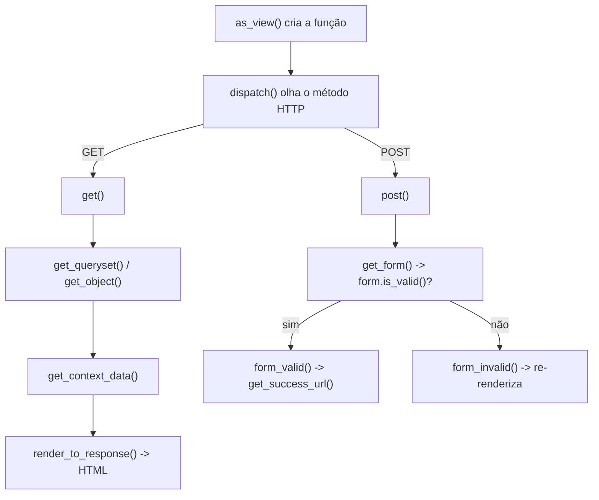

# Referência: views baseadas em classe (CBV)

!!! quote "Pensa como criança 🧒"
    Uma **view** é um garçom. Você (o navegador) faz um pedido; o garçom vai na
    cozinha (o banco), monta o prato (a página) e traz de volta. Uma **view de
    classe** é um garçom treinado que **já sabe** servir os pratos comuns —
    listar o cardápio, mostrar um prato, anotar um pedido novo. Você só diz
    *qual* prato e *o que muda*; o resto ele já faz sozinho.

## Caso de uso

Você quer uma página que lista posts publicados, paginada de 10 em 10, e que
filtra por tag. Em vez de escrever o `GET`, a paginação e o contexto na mão, você
herda de `ListView` e ajusta só o que muda:

```python
# apps/blog/views.py
from typing import Any

from django.db.models import QuerySet
from django.views.generic import ListView

from apps.blog.models import Post


class PostListView(ListView):
    """Paginated list of published posts."""

    model = Post
    template_name = "blog/post_list.html"
    context_object_name = "posts"
    paginate_by = 10

    def get_queryset(self) -> QuerySet[Post]:
        """Return only published posts, newest first."""
        return Post.objects.published().select_related("author")
```

Você escreveu 1 método. Ganhou: tratamento do `GET`, busca no banco, paginação,
renderização do template e o contexto (`posts`, `page_obj`, `paginator`). Vamos
destrinchar **tudo** que dá para ajustar.

## Possibilidades

### O mapa das generic views

| View | Serve para | Pratos que já sabe |
| --- | --- | --- |
| `TemplateView` | Página estática com contexto | renderizar um template |
| `ListView` | Listar objetos | busca + paginação |
| `DetailView` | Mostrar **um** objeto | busca por `pk`/`slug` |
| `CreateView` | Criar via formulário | GET (form vazio) + POST (salva) |
| `UpdateView` | Editar via formulário | GET (form preenchido) + POST (salva) |
| `DeleteView` | Apagar com confirmação | GET (confirma) + POST (apaga) |
| `FormView` | Formulário sem modelo | validação + `form_valid` |
| `RedirectView` | Redirecionar | manda para outra URL |

### Atributos que você define (os "botões")

Valem para a maioria das generic views que mexem com modelos:

| Atributo | O que faz |
| --- | --- |
| `model` | O modelo da view |
| `queryset` | Alternativa a `model`: já filtra a base |
| `template_name` | Qual template renderizar |
| `context_object_name` | Nome do objeto/lista no template |
| `pk_url_kwarg` | Nome do parâmetro de URL para a PK (padrão `"pk"`) |
| `slug_url_kwarg` | Nome do parâmetro de URL para o slug (padrão `"slug"`) |
| `slug_field` | Campo do modelo usado como slug (padrão `"slug"`) |
| `paginate_by` | Itens por página (só `ListView`) |
| `ordering` | Ordenação (só `ListView`) |
| `form_class` | Formulário a usar (`Create`/`Update`/`FormView`) |
| `fields` | Campos do form (atalho ao `form_class`) |
| `success_url` | Para onde ir após salvar/apagar |

### Métodos que você sobrescreve (os "ganchos")

Aqui mora o poder. Cada método é um ponto de entrada para mudar **uma etapa**:

| Método | Quando roda | Sobrescreva para... |
| --- | --- | --- |
| `get_queryset()` | Ao buscar os objetos | Filtrar/otimizar a base |
| `get_object()` | Ao pegar **um** objeto (Detail/Update/Delete) | Regras de acesso |
| `get_context_data(**kwargs)` | Ao montar o contexto do template | Adicionar variáveis extras |
| `get_form_class()` | Ao decidir qual form | Escolher form dinamicamente |
| `get_form_kwargs()` | Ao instanciar o form | Passar dados extras ao form |
| `form_valid(form)` | Quando o form passou na validação | Agir antes de salvar/redirecionar |
| `form_invalid(form)` | Quando o form falhou | Resposta customizada de erro |
| `get_success_url()` | Após sucesso | Calcular o destino dinamicamente |

!!! danger "Sempre chame o `super()` — e antes de mexer"
    Ao sobrescrever `get_context_data`, comece com
    `context = super().get_context_data(**kwargs)`. Se você não chamar, perde
    tudo que a classe base preparou (`object`, `page_obj`, etc.).
    ```python
    def get_context_data(self, **kwargs: Any) -> dict[str, Any]:
        context = super().get_context_data(**kwargs)   # <- primeiro isto
        context["tags"] = Tag.objects.all()             # <- depois o seu
        return context
    ```

### A ordem de execução (o segredo que a doc esconde)

Pensa como criança: é uma **linha de montagem**. A requisição entra numa ponta e
o HTML sai na outra. Cada método é uma estação:



- **`as_view()`** — o que você põe no `urls.py`. Transforma a classe numa função.
- **`dispatch()`** — o "porteiro": olha se é GET ou POST e chama o método certo.
- Daí em diante, cada estação chama a próxima.

### `CreateView` / `UpdateView` na prática

```python
from django.contrib.auth.mixins import LoginRequiredMixin
from django.http import HttpResponse
from django.views.generic import CreateView

from apps.blog.forms import PostForm
from apps.blog.models import Post


class PostCreateView(LoginRequiredMixin, CreateView):
    """Create a post, setting the author from the logged-in user."""

    model = Post
    form_class = PostForm
    template_name = "blog/post_form.html"

    def form_valid(self, form: PostForm) -> HttpResponse:
        """Attach the current user as author before saving."""
        form.instance.author = self.request.user.author_profile
        return super().form_valid(form)

    def get_success_url(self) -> str:
        """Redirect to the new post's page."""
        return self.object.get_absolute_url()
```

Dados úteis dentro dos métodos:

| Dentro da view você acessa | O que é |
| --- | --- |
| `self.request` | A requisição (`self.request.user`, `.GET`, `.POST`) |
| `self.kwargs` | Parâmetros capturados da URL (`self.kwargs["slug"]`) |
| `self.args` | Parâmetros posicionais da URL |
| `self.object` | O objeto atual (após `get_object`/salvar) |

### Mixins: superpoderes por composição

Pensa como criança: um **mixin** é um adesivo que você cola na view para dar um
poder extra, sem redesenhar a view.

| Mixin | Poder que adiciona |
| --- | --- |
| `LoginRequiredMixin` | Exige usuário logado |
| `PermissionRequiredMixin` | Exige uma permissão (`permission_required = "blog.add_post"`) |
| `UserPassesTestMixin` | Exige passar num teste (`test_func()`) |
| `SuccessMessageMixin` | Mostra uma mensagem de sucesso após salvar |

```python
from django.contrib.auth.mixins import UserPassesTestMixin


class PostUpdateView(UserPassesTestMixin, UpdateView):
    model = Post
    fields = ["title", "body"]

    def test_func(self) -> bool:
        """Only the post's author may edit it."""
        return self.get_object().author.user == self.request.user
```

!!! danger "A ordem dos mixins importa (MRO)"
    Em `class V(LoginRequiredMixin, UpdateView)`, o Python monta a cadeia de
    herança **da esquerda para a direita**. O mixin precisa vir **antes** da
    generic view para interceptar a requisição a tempo. Inverteu? O gate não
    funciona. Pensa como criança: o segurança fica na **porta** (primeiro), não
    lá dentro.

!!! quote "📖 Na documentação oficial"
    - [Class-based views](https://docs.djangoproject.com/en/stable/topics/class-based-views/)

## Recap

- Generic views são garçons que já sabem servir os pratos comuns; você ajusta
  o que muda.
- **Atributos** = botões (`model`, `template_name`, `paginate_by`,
  `form_class`, `success_url`).
- **Métodos** = ganchos (`get_queryset`, `get_context_data`, `form_valid`,
  `get_success_url`) — sempre chame `super()`.
- A execução é uma linha de montagem: `as_view` → `dispatch` → `get`/`post` → ...
- **Mixins** adicionam poderes por composição; a **ordem** (esquerda→direita)
  decide quem intercepta primeiro.

Views cobrem a saída. E a entrada de dados? Os **[formulários](forms.md)**.
