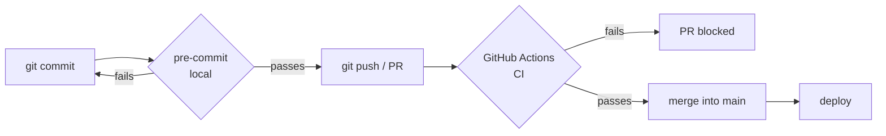
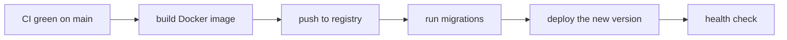

# CI/CD and pre-commit

Writing good code is half the job. The other half is **making sure** it stays
good on every commit and reaches production without drama. Instead of remembering
to run the linter, the type checker and the tests by hand — and hoping your
teammate remembers too — you teach the machine to do it for you. This page shows
how.

!!! quote "Think like a child 🧒"
    Picture a **turnstile** at the playground entrance: only kids with tied
    shoelaces get through. Nobody has to inspect each foot — the turnstile (CI)
    checks everyone the same way. And **pre-commit** is the big sibling who ties
    your shoes *before* you reach the turnstile, so you never get turned away.

## Use case

You open a PR fixing a bug in the blog. Before asking for review, you want to be
sure that:

1. the code is formatted and lint-clean (**Ruff**);
2. the types check out (**mypy**);
3. the suite passes (**pytest**);
4. migrations are up to date.

Doing this by hand, every time, is tiring and error-prone. The solution has two
layers that reinforce each other:



- **pre-commit** runs on *your* machine, at commit time — feedback in seconds,
  before the code even leaves your computer.
- **CI** runs on the server, on the PR — the safety net that applies to everyone,
  including Python and Django versions you didn't test locally.

## Possibilities

### 1. pre-commit: the local gate

[pre-commit](https://pre-commit.com/) installs *git hooks* that run tools
automatically before each commit. If something fails, the commit is aborted.

```bash
uv add --group dev pre-commit
uv run pre-commit install
```

`install` writes a hook to `.git/hooks/pre-commit`. The configuration lives in
`.pre-commit-config.yaml` at the repository root:

```yaml
# .pre-commit-config.yaml
repos:
  - repo: https://github.com/astral-sh/ruff-pre-commit
    rev: v0.14.0
    hooks:
      - id: ruff-check
        args: [--fix]
      - id: ruff-format

  - repo: https://github.com/pre-commit/mirrors-mypy
    rev: v1.18.2
    hooks:
      - id: mypy
        additional_dependencies:
          - django-stubs
          - djangorestframework-stubs

  - repo: https://github.com/pre-commit/pre-commit-hooks
    rev: v6.0.0
    hooks:
      - id: trailing-whitespace
      - id: end-of-file-fixer
      - id: check-yaml
      - id: check-added-large-files
```

Now every `git commit` runs Ruff (with autofix), mypy and a basic cleanup. If
Ruff **fixed** a file, the commit fails and you just redo `git add` +
`git commit` — the files are already tidy.

| Command | Does |
| --- | --- |
| `pre-commit install` | Enables the hook in the repository (once per clone) |
| `pre-commit run` | Runs on *staged* files (what the commit would do) |
| `pre-commit run --all-files` | Runs on the **whole** project (good the 1st time / in CI) |
| `pre-commit autoupdate` | Bumps the hooks' `rev:` to the new versions |
| `git commit --no-verify` | **Skips** the hooks (use very sparingly) |

!!! tip "`rev:` is a pinned version, not `latest`"
    Each hook points at a specific *tag* (`rev: v0.14.0`). That makes the result
    **reproducible**: your commit and the CI run the exact same version of Ruff.
    To bump a version, run `pre-commit autoupdate` and commit the change — that
    way the bump is reviewable in the diff.

!!! warning "pre-commit does not replace CI"
    The local hook is great, but it can be skipped (`--no-verify`) and it only
    runs on *your* Python. CI is the final authority: it **always** runs, for
    everyone, across the version matrix you define. Use both — they cover each
    other.

### 2. GitHub Actions: the CI

[GitHub Actions](https://docs.github.com/actions) runs your gates on every push
and PR. This repository already ships a lean `ci.yml`. Let's start from it and
grow.

What this project uses today (`.github/workflows/ci.yml`):

```yaml
# .github/workflows/ci.yml
name: CI

on:
  push:
    branches: [main]
  pull_request:

jobs:
  test:
    runs-on: ubuntu-latest
    steps:
      - uses: actions/checkout@v4

      - name: Install uv
        uses: astral-sh/setup-uv@v5

      - name: Set up Python
        run: uv python install 3.13

      - name: Install dependencies
        run: uv sync --group dev

      - name: Run migrations check
        working-directory: example
        run: uv run python manage.py makemigrations --check --dry-run

      - name: Run tests
        run: uv run pytest -q
```

!!! info "What each step does"
    - `checkout` brings in the PR's code.
    - `setup-uv` installs [uv](https://docs.astral.sh/uv/) and **already caches**
      the dependencies (`astral-sh/setup-uv@v5` keeps the uv cache between runs).
    - `uv sync --group dev` installs the development group.
    - `makemigrations --check --dry-run` **fails** if there's a model change
      without a migration — it catches the classic slip.
    - `pytest -q` runs the suite.

#### Adding lint, types and the matrix

A complete CI checks **everything** pre-commit checks (not everyone has the hook)
and tests more than one combination of versions. A *matrix* runs the same job for
each Python × Django pair:

```yaml
# .github/workflows/ci.yml
name: CI

on:
  push:
    branches: [main]
  pull_request:

jobs:
  quality:
    runs-on: ubuntu-latest
    steps:
      - uses: actions/checkout@v4
      - uses: astral-sh/setup-uv@v5
      - run: uv python install 3.13
      - run: uv sync --group dev
      - name: Ruff (lint + format)
        run: |
          uv run ruff check .
          uv run ruff format --check .
      - name: mypy
        run: uv run mypy example

  test:
    runs-on: ubuntu-latest
    strategy:
      fail-fast: false
      matrix:
        python-version: ["3.13", "3.14"]
        django-version: ["6.0"]
    steps:
      - uses: actions/checkout@v4
      - uses: astral-sh/setup-uv@v5
      - name: Set up Python ${{ matrix.python-version }}
        run: uv python install ${{ matrix.python-version }}
      - name: Install with Django ${{ matrix.django-version }}
        run: |
          uv sync --group dev
          uv pip install "django~=${{ matrix.django-version }}.0"
      - name: Migrations check
        working-directory: example
        run: uv run python manage.py makemigrations --check --dry-run
      - name: Tests
        run: uv run pytest -q
```

!!! tip "`fail-fast: false` shows the whole picture"
    By default, if one matrix cell fails, GitHub cancels the others.
    `fail-fast: false` lets **all** of them run — so you see at once whether the
    problem is only on Python 3.14 or across the whole matrix.

!!! note "The uv cache is nearly free"
    `astral-sh/setup-uv` caches the uv directory automatically. If you want
    explicit control, it accepts `enable-cache: true` and a key. In practice the
    default already makes subsequent runs much faster.

#### This repository's docs.yml

The guide also has a workflow that **builds and publishes** the documentation.
It's already in the repo (`.github/workflows/docs.yml`) and is a good example of
a simple deploy to GitHub Pages:

```yaml
# .github/workflows/docs.yml (excerpt)
on:
  push:
    branches: [main]
    paths:
      - "docs/**"
      - "mkdocs.yml"
      - ".github/workflows/docs.yml"
  workflow_dispatch:

permissions:
  contents: read
  pages: write
  id-token: write
```

!!! info "Two golden details in this workflow"
    - The `paths:` filter makes the docs deploy run **only** when `docs/` or
      `mkdocs.yml` change — it doesn't waste minutes on every code commit.
    - `permissions:` grants the job **exactly** what it needs (write to Pages via
      OIDC). Less permission = less attack surface.

### 3. Dependency updates: Dependabot or Renovate

Stale dependencies pile up bugs and security holes. Two tools open update PRs on
their own — and your CI validates each one before merge.

**Dependabot** (built into GitHub) — just one file:

```yaml
# .github/dependabot.yml
version: 2
updates:
  - package-ecosystem: "pip"
    directory: "/"
    schedule:
      interval: "weekly"
    groups:
      dev-dependencies:
        patterns: ["*"]

  - package-ecosystem: "github-actions"
    directory: "/"
    schedule:
      interval: "weekly"
```

The second block is the one many people forget: **the Actions themselves**
(`@v4`, `@v5`...) also need updating, and Dependabot handles them.

| Tool | Config | Strengths |
| --- | --- | --- |
| **Dependabot** | `.github/dependabot.yml` | Native, zero setup, groups via `groups` |
| **Renovate** | `renovate.json` | Much richer rules, patch *auto-merge*, PR dashboard |

!!! tip "Group the updates"
    Without `groups`, you get one PR per package — a flood. Grouping (for example,
    all dev-dependencies into a single PR) keeps the PR inbox sane and lets CI
    validate the set at once.

### 4. Deploy: build, migrate, publish

Once CI is green on `main`, the delivery stage runs in sequence. The order
matters a lot:



A separate deploy workflow, triggered only on `main`:

```yaml
# .github/workflows/deploy.yml
name: Deploy

on:
  push:
    branches: [main]

jobs:
  deploy:
    runs-on: ubuntu-latest
    environment: production
    steps:
      - uses: actions/checkout@v4

      - name: Build image
        run: docker build -t myapp:${{ github.sha }} .

      - name: Log in to registry
        run: echo "${{ secrets.REGISTRY_TOKEN }}" | docker login ghcr.io -u "${{ github.actor }}" --password-stdin

      - name: Push image
        run: docker push myapp:${{ github.sha }}

      - name: Run migrations
        env:
          DATABASE_URL: ${{ secrets.DATABASE_URL }}
        run: uv run python example/manage.py migrate --noinput

      - name: Deploy
        env:
          DEPLOY_TOKEN: ${{ secrets.DEPLOY_TOKEN }}
        run: ./scripts/deploy.sh myapp:${{ github.sha }}
```

!!! danger "Migrate BEFORE switching the version — and think about compatibility"
    Run `migrate` **before** the new code takes over. And prefer
    *backward-compatible* (additive) migrations: add the new column before using
    it, never drop/rename in the same deploy that changes the code. During the
    deploy, the old and new versions coexist for a few seconds — if the migration
    removes something the old version still uses, it breaks. Do it in two steps:
    one deploy adds, the next removes.

!!! note "`--noinput` is mandatory in CI"
    Commands like `migrate` and `collectstatic` sometimes ask questions. On a
    server there's nobody to answer — `--noinput` takes the defaults and keeps
    the job from hanging on an Enter that never comes.

### 5. Secrets: never in the code, never in the log

Database password, registry token, deploy key — none of that can live in the
repository. On GitHub, store them under **Settings → Secrets and variables →
Actions** and read them via `${{ secrets.NAME }}`.

```yaml
      - name: Deploy
        env:
          DATABASE_URL: ${{ secrets.DATABASE_URL }}
          SECRET_KEY: ${{ secrets.SECRET_KEY }}
        run: ./scripts/deploy.sh
```

| Where | For what |
| --- | --- |
| **Repository secrets** | Secrets for a single repo |
| **Environment secrets** | Per-environment secrets (`production`, `staging`) — with *required reviewers* |
| **Organization secrets** | Shared across the org's repos |

!!! danger "GitHub masks secrets in the log — but don't trust that blindly"
    Values read from `secrets.*` appear as `***` in the log. Even so: never
    `echo` a secret, don't pass a secret as a command-line argument (it lands in
    `ps`), and prefer `--password-stdin` as in the `docker login` example above.
    And never commit a `.env` — put it in `.gitignore`.

!!! warning "Pull requests from forks can't see your secrets"
    For safety, GitHub does **not** expose secrets to workflows triggered by PRs
    coming from forks. That's why the *deploy* job is bound to `push` on `main`,
    and the PR CI only runs lint/types/tests (which need no secret).

## Recap

- **pre-commit** runs Ruff/mypy on your commit (fast, local); **CI** runs
  everything on the PR (final authority). Use both — they cover each other.
- `.pre-commit-config.yaml` pins each hook by `rev:`; `pre-commit autoupdate`
  bumps the versions in a reviewable way.
- In **GitHub Actions**, a *matrix* tests Python × Django, `setup-uv` caches the
  dependencies, and the quality job runs `ruff check` + `ruff format --check` +
  `mypy`. This repo already ships `ci.yml` and `docs.yml`.
- **Dependabot/Renovate** open update PRs (including for the Actions); group them
  with `groups` so you don't drown in PRs.
- **Deploy**: build the image → push → `migrate --noinput` (additive migrations,
  before switching the version) → deploy → health check.
- **Secrets** live under Settings → Secrets, read via `${{ secrets.* }}`; fork
  PRs can't see them; never `echo` a secret nor commit `.env`.

!!! quote "📖 In the official docs"
    - [pre-commit](https://pre-commit.com/)
    - [GitHub Actions](https://docs.github.com/actions)

Before this, see **[Lint and best practices](lint.md)** (what CI runs) and
**[Contributing](contribuindo.md)** (the full PR flow).
