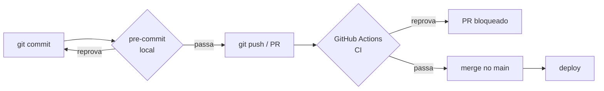
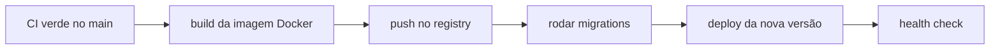

# CI/CD e pre-commit

Escrever código bom é metade do trabalho. A outra metade é **garantir** que ele
continua bom a cada commit e chega ao ar sem susto. Em vez de lembrar de rodar o
linter, os tipos e os testes na mão — e torcer para o colega também lembrar —
você ensina a máquina a fazer isso sozinha. Esta página mostra como.

!!! quote "Pensa como criança 🧒"
    Imagina uma **catraca** na entrada do parquinho: só passa quem está de tênis
    amarrado. Ninguém precisa ficar olhando pé por pé — a catraca (o CI) checa
    todo mundo do mesmo jeito. E o **pre-commit** é o irmão mais velho que amarra
    seu tênis *antes* de você chegar na catraca, pra você nunca ser barrado.

## Caso de uso

Você abre um PR corrigindo um bug no blog. Antes de pedir revisão, quer ter
certeza de que:

1. o código está formatado e sem erros de lint (**Ruff**);
2. os tipos batem (**mypy**);
3. a suíte passa (**pytest**);
4. as migrações estão em dia.

Fazer isso na mão, toda vez, cansa e falha. A solução tem duas camadas que se
reforçam:



- **pre-commit** roda no *seu* computador, no instante do commit — feedback em
  segundos, antes do código sair da sua máquina.
- **CI** roda no servidor, no PR — a rede de segurança que vale para todo mundo,
  inclusive em Python e Django que você não testou local.

## Possibilidades

### 1. pre-commit: o portão local

O [pre-commit](https://pre-commit.com/) instala *git hooks* que rodam ferramentas
automaticamente antes de cada commit. Se algo reprova, o commit é abortado.

```bash
uv add --group dev pre-commit
uv run pre-commit install
```

O `install` grava um hook em `.git/hooks/pre-commit`. A configuração fica em
`.pre-commit-config.yaml` na raiz do repositório:

```yaml
# .pre-commit-config.yaml
repos:
  - repo: https://github.com/astral-sh/ruff-pre-commit
    rev: v0.14.0
    hooks:
      - id: ruff-check
        args: [--fix]
      - id: ruff-format

  - repo: https://github.com/pre-commit/mirrors-mypy
    rev: v1.18.2
    hooks:
      - id: mypy
        additional_dependencies:
          - django-stubs
          - djangorestframework-stubs

  - repo: https://github.com/pre-commit/pre-commit-hooks
    rev: v6.0.0
    hooks:
      - id: trailing-whitespace
      - id: end-of-file-fixer
      - id: check-yaml
      - id: check-added-large-files
```

Agora todo `git commit` roda Ruff (com autofix), mypy e uma faxina básica. Se o
Ruff **consertou** um arquivo, o commit falha e você só precisa refazer `git add`
+ `git commit` — os arquivos já estão arrumados.

| Comando | Faz |
| --- | --- |
| `pre-commit install` | Ativa o hook no repositório (uma vez por clone) |
| `pre-commit run` | Roda nos arquivos em *stage* (o que o commit faria) |
| `pre-commit run --all-files` | Roda em **todo** o projeto (bom na 1ª vez / no CI) |
| `pre-commit autoupdate` | Atualiza os `rev:` dos hooks para as versões novas |
| `git commit --no-verify` | **Pula** os hooks (use com muita parcimônia) |

!!! tip "`rev:` é uma versão fixada, não `latest`"
    Cada hook aponta para uma *tag* específica (`rev: v0.14.0`). Isso deixa o
    resultado **reproduzível**: seu commit e o CI rodam exatamente a mesma versão
    do Ruff. Para subir de versão, rode `pre-commit autoupdate` e commite a
    mudança — assim o bump fica revisável no diff.

!!! warning "pre-commit não substitui o CI"
    O hook local é ótimo, mas dá para pulá-lo (`--no-verify`) e ele roda só no
    *seu* Python. O CI é a autoridade final: ele **sempre** roda, para todo
    mundo, na matriz de versões que você definir. Use os dois — eles se cobrem.

### 2. GitHub Actions: o CI

O [GitHub Actions](https://docs.github.com/actions) roda seus portões a cada push
e PR. Este repositório já tem um `ci.yml` enxuto. Vamos partir dele e evoluir.

O que este projeto usa hoje (`.github/workflows/ci.yml`):

```yaml
# .github/workflows/ci.yml
name: CI

on:
  push:
    branches: [main]
  pull_request:

jobs:
  test:
    runs-on: ubuntu-latest
    steps:
      - uses: actions/checkout@v4

      - name: Install uv
        uses: astral-sh/setup-uv@v5

      - name: Set up Python
        run: uv python install 3.13

      - name: Install dependencies
        run: uv sync --group dev

      - name: Run migrations check
        working-directory: example
        run: uv run python manage.py makemigrations --check --dry-run

      - name: Run tests
        run: uv run pytest -q
```

!!! info "O que cada passo faz"
    - `checkout` traz o código do PR.
    - `setup-uv` instala o [uv](https://docs.astral.sh/uv/) e **já cacheia** as
      dependências (a `astral-sh/setup-uv@v5` guarda o cache do uv entre runs).
    - `uv sync --group dev` instala o grupo de desenvolvimento.
    - `makemigrations --check --dry-run` **falha** se existe mudança de model sem
      migração criada — pega o esquecimento clássico.
    - `pytest -q` roda a suíte.

#### Adicionando lint, tipos e a matriz

Um CI completo checa **tudo** que o pre-commit checa (nem todo mundo tem o hook)
e testa em mais de uma combinação de versões. Uma *matrix* roda o mesmo job para
cada par Python × Django:

```yaml
# .github/workflows/ci.yml
name: CI

on:
  push:
    branches: [main]
  pull_request:

jobs:
  quality:
    runs-on: ubuntu-latest
    steps:
      - uses: actions/checkout@v4
      - uses: astral-sh/setup-uv@v5
      - run: uv python install 3.13
      - run: uv sync --group dev
      - name: Ruff (lint + format)
        run: |
          uv run ruff check .
          uv run ruff format --check .
      - name: mypy
        run: uv run mypy example

  test:
    runs-on: ubuntu-latest
    strategy:
      fail-fast: false
      matrix:
        python-version: ["3.13", "3.14"]
        django-version: ["6.0"]
    steps:
      - uses: actions/checkout@v4
      - uses: astral-sh/setup-uv@v5
      - name: Set up Python ${{ matrix.python-version }}
        run: uv python install ${{ matrix.python-version }}
      - name: Install with Django ${{ matrix.django-version }}
        run: |
          uv sync --group dev
          uv pip install "django~=${{ matrix.django-version }}.0"
      - name: Migrations check
        working-directory: example
        run: uv run python manage.py makemigrations --check --dry-run
      - name: Tests
        run: uv run pytest -q
```

!!! tip "`fail-fast: false` mostra o quadro todo"
    Por padrão, se uma célula da matriz falha, o GitHub cancela as outras.
    `fail-fast: false` deixa **todas** rodarem — assim você vê de uma vez se o
    problema é só no Python 3.14 ou em toda a matriz.

!!! note "O cache do uv é quase de graça"
    A `astral-sh/setup-uv` cacheia o diretório do uv automaticamente. Se quiser
    controle explícito, ela aceita `enable-cache: true` e uma chave. Na prática,
    o padrão já deixa os runs seguintes bem mais rápidos.

#### O docs.yml deste repositório

O guia também tem um workflow que **constrói e publica** a documentação. Ele já
está no repo (`.github/workflows/docs.yml`) e é um bom exemplo de deploy simples
para o GitHub Pages:

```yaml
# .github/workflows/docs.yml (trecho)
on:
  push:
    branches: [main]
    paths:
      - "docs/**"
      - "mkdocs.yml"
      - ".github/workflows/docs.yml"
  workflow_dispatch:

permissions:
  contents: read
  pages: write
  id-token: write
```

!!! info "Dois detalhes de ouro nesse workflow"
    - O filtro `paths:` faz o deploy das docs rodar **só** quando `docs/` ou
      `mkdocs.yml` mudam — não desperdiça minutos a cada commit de código.
    - `permissions:` concede ao job **exatamente** o que ele precisa (escrever no
      Pages via OIDC). Menos permissão = menos superfície de ataque.

### 3. Atualização de dependências: Dependabot ou Renovate

Dependência velha acumula bug e falha de segurança. Duas ferramentas abrem PRs de
atualização sozinhas — e o seu CI valida cada uma antes do merge.

**Dependabot** (nativo do GitHub) — basta um arquivo:

```yaml
# .github/dependabot.yml
version: 2
updates:
  - package-ecosystem: "pip"
    directory: "/"
    schedule:
      interval: "weekly"
    groups:
      dev-dependencies:
        patterns: ["*"]

  - package-ecosystem: "github-actions"
    directory: "/"
    schedule:
      interval: "weekly"
```

O segundo bloco é o que muita gente esquece: **as próprias Actions** (`@v4`,
`@v5`...) também precisam de atualização, e o Dependabot cuida delas.

| Ferramenta | Config | Pontos fortes |
| --- | --- | --- |
| **Dependabot** | `.github/dependabot.yml` | Nativo, zero setup, agrupa por `groups` |
| **Renovate** | `renovate.json` | Regras muito mais ricas, *auto-merge* de patch, dashboard de PRs |

!!! tip "Agrupe as atualizações"
    Sem `groups`, você recebe um PR por pacote — um dilúvio. Agrupar (por exemplo,
    todas as dev-dependencies num PR só) mantém a caixa de PRs sã e o CI valida o
    conjunto de uma vez.

### 4. Deploy: build, migrar, publicar

Depois que o CI fica verde no `main`, a etapa de entrega roda em sequência.
A ordem importa muito:



Um workflow de deploy separado, disparado só no `main`:

```yaml
# .github/workflows/deploy.yml
name: Deploy

on:
  push:
    branches: [main]

jobs:
  deploy:
    runs-on: ubuntu-latest
    environment: production
    steps:
      - uses: actions/checkout@v4

      - name: Build image
        run: docker build -t myapp:${{ github.sha }} .

      - name: Log in to registry
        run: echo "${{ secrets.REGISTRY_TOKEN }}" | docker login ghcr.io -u "${{ github.actor }}" --password-stdin

      - name: Push image
        run: docker push myapp:${{ github.sha }}

      - name: Run migrations
        env:
          DATABASE_URL: ${{ secrets.DATABASE_URL }}
        run: uv run python example/manage.py migrate --noinput

      - name: Deploy
        env:
          DEPLOY_TOKEN: ${{ secrets.DEPLOY_TOKEN }}
        run: ./scripts/deploy.sh myapp:${{ github.sha }}
```

!!! danger "Migre ANTES de trocar a versão — e pense na compatibilidade"
    Rode `migrate` **antes** de o código novo assumir. E prefira migrações
    *backward-compatible* (aditivas): adicionar coluna nova antes de usá-la, nunca
    apagar/renomear no mesmo deploy que muda o código. Durante o deploy, versão
    antiga e nova convivem por alguns segundos — se a migração remove algo que a
    versão antiga ainda usa, ela quebra. Faça em dois passos: um deploy adiciona,
    o próximo remove.

!!! note "`--noinput` é obrigatório no CI"
    Comandos como `migrate` e `collectstatic` às vezes fazem perguntas. Num
    servidor não há ninguém para responder — `--noinput` assume os padrões e
    evita que o job trave esperando um enter que nunca vem.

### 5. Segredos: nunca no código, nunca no log

Senha de banco, token de registry, chave de deploy — nada disso pode viver no
repositório. No GitHub, guarde em **Settings → Secrets and variables → Actions**
e leia via `${{ secrets.NOME }}`.

```yaml
      - name: Deploy
        env:
          DATABASE_URL: ${{ secrets.DATABASE_URL }}
          SECRET_KEY: ${{ secrets.SECRET_KEY }}
        run: ./scripts/deploy.sh
```

| Onde | Para quê |
| --- | --- |
| **Repository secrets** | Segredos de um repo só |
| **Environment secrets** | Segredos por ambiente (`production`, `staging`) — com *required reviewers* |
| **Organization secrets** | Compartilhados entre repos da org |

!!! danger "O GitHub mascara segredos no log — mas não confie cegamente"
    Valores lidos de `secrets.*` aparecem como `***` no log. Mesmo assim: nunca
    dê `echo` num segredo, não passe segredo por argumento de linha de comando
    (fica no `ps`), e prefira `--password-stdin` como no exemplo do `docker login`
    acima. E jamais commite um `.env` — coloque no `.gitignore`.

!!! warning "Pull request de fork não enxerga seus segredos"
    Por segurança, o GitHub **não** expõe secrets para workflows disparados por
    PRs vindos de forks. É por isso que o job de *deploy* fica preso ao `push` no
    `main`, e o CI de PR só faz lint/tipos/testes (que não precisam de segredo).

## Recap

- **pre-commit** roda Ruff/mypy no seu commit (rápido, local); **CI** roda tudo no
  PR (autoridade final). Use os dois — eles se cobrem.
- `.pre-commit-config.yaml` fixa cada hook por `rev:`; `pre-commit autoupdate`
  sobe as versões de forma revisável.
- No **GitHub Actions**, uma *matrix* testa Python × Django, `setup-uv` cacheia as
  dependências, e o job de qualidade roda `ruff check` + `ruff format --check` +
  `mypy`. Este repo já traz `ci.yml` e `docs.yml`.
- **Dependabot/Renovate** abrem PRs de atualização (inclusive das Actions);
  agrupe com `groups` para não afogar em PRs.
- **Deploy**: build da imagem → push → `migrate --noinput` (migrações aditivas,
  antes de trocar a versão) → deploy → health check.
- **Segredos** vivem em Settings → Secrets, lidos por `${{ secrets.* }}`; PRs de
  fork não os enxergam; nunca `echo` num segredo nem commite `.env`.

!!! quote "📖 Na documentação oficial"
    - [pre-commit](https://pre-commit.com/)
    - [GitHub Actions](https://docs.github.com/actions)

Antes disso, veja **[Lint e boas práticas](lint.md)** (o que o CI roda) e
**[Contribuindo](contribuindo.md)** (o fluxo completo de PR).
