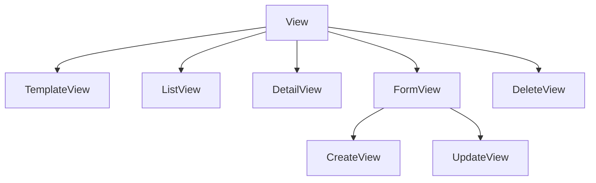

# Class-based views

A **view** takes a request and returns a response. Django lets you
write them as functions or as **classes**. In this guide we use **classes** — the
*Class-Based Views* (CBVs) — because they turn repetitive patterns into
**methods you override**, and let you compose behavior with **mixins**.

!!! quote "Function vs class"
    A function view turns into an `if request.method == "GET" ... elif "POST"`.
    A CBV already separates that into methods (`get`, `post`) and, even better, the
    **generic views** already implement the common cases (list, detail, create,
    edit, delete). You only adjust what changes.

## The generic views hierarchy



Each one solves a classic case. Let's use them in the blog.

## `ListView`: list objects

```python
from django.db.models import QuerySet
from django.views.generic import ListView

from apps.blog.models import Post, Tag


class PostListView(ListView):
    """Paginated list of published posts, optionally filtered by tag."""

    template_name = "blog/post_list.html"
    context_object_name = "posts"
    paginate_by = 5

    def get_queryset(self) -> QuerySet[Post]:
        """Return published posts, narrowed by the optional ``tag`` query."""
        tag_slug = self.request.GET.get("tag")
        if tag_slug:
            return Post.objects.by_tag(tag_slug).select_related("author")
        return Post.objects.published().select_related("author")

    def get_context_data(self, **kwargs: Any) -> dict[str, Any]:
        """Add the tag list and the active tag to the template context."""
        context = super().get_context_data(**kwargs)
        context["tags"] = Tag.objects.all()
        context["active_tag"] = self.request.GET.get("tag", "")
        return context
```

What we get for free:

- **Pagination** — just set `paginate_by`. The view exposes `page_obj` in the template.
- **`get_queryset()`** — the method that says *which* objects to list. We override it
  to filter by tag and already resolve the N+1 with `select_related`.
- **`get_context_data()`** — adds extra variables to the template. Note the
  `super().get_context_data(**kwargs)`: **always** call `super()` first,
  otherwise you lose what the base class already prepared (like `posts` and `page_obj`).
- **`context_object_name`** — the name of the list in the template (`posts` instead of the
  generic `object_list`).

!!! tip "Where each method fits in"
    Think of the CBV as an assembly line: `get_queryset` decides the data,
    `get_context_data` assembles the context, and the base takes care of rendering the template.
    You override only the step you need to change.

## `DetailView`: a single object

```python
from django.views.generic import DetailView

from apps.blog.forms import CommentForm


class PostDetailView(DetailView):
    """Detail page for a single published post, plus its comment form."""

    template_name = "blog/post_detail.html"
    context_object_name = "post"

    def get_queryset(self) -> QuerySet[Post]:
        return Post.objects.published().select_related("author")

    def get_context_data(self, **kwargs: Any) -> dict[str, Any]:
        context = super().get_context_data(**kwargs)
        context["comments"] = self.object.approved_comments()
        context["form"] = CommentForm()
        return context
```

- The `DetailView` picks the object from the URL (by default, by `slug` or `pk`).
- Restricting `get_queryset()` to `published()` means drafts return a **404**
  to the public — security for free.
- `self.object` is the post found; we use it to bring in the approved comments.

## `CreateView` and `UpdateView`: forms

Here the power of **composition with mixins** shows up. Creating and editing share
almost everything, so we extract the common part into a mixin:

```python
from django.contrib.auth.mixins import LoginRequiredMixin
from django.views.generic import CreateView, UpdateView

from apps.blog.forms import PostForm


class AuthorPostMixin(LoginRequiredMixin):
    """Shared configuration for views that create or edit posts."""

    model = Post
    form_class = PostForm
    template_name = "blog/post_form.html"

    def get_success_url(self) -> str:
        """Return the URL to redirect to after a successful save."""
        return self.object.get_absolute_url()


class PostCreateView(AuthorPostMixin, CreateView):
    """Create a new post authored by the current user."""

    def form_valid(self, form: PostForm) -> HttpResponse:
        """Set the post's author to the logged-in user before saving."""
        form.instance.author = self.request.user.author_profile
        return super().form_valid(form)


class PostUpdateView(AuthorPostMixin, UpdateView):
    """Edit an existing post."""

    slug_url_kwarg = "slug"
```

- **`LoginRequiredMixin`** — placed first in the inheritance, it gates the view: anyone not
  logged in is sent to the login. Behavior added by **composition**,
  without touching the main logic.
- **`form_valid()`** — called when the form is valid. We inject the author
  from the logged-in user (never trusting who the client claims to be) and call
  `super().form_valid(form)`, which saves and redirects.
- **`get_success_url()`** — where to go after saving. We use the post's own
  `get_absolute_url()`.

!!! warning "Mixin order matters"
    In Python's multiple inheritance, order is **left to right**.
    `class PostCreateView(AuthorPostMixin, CreateView)` makes the mixin be
    consulted before the generic view — which is what we want so the
    `LoginRequiredMixin` intercepts the request early.

## `DeleteView`: confirmation and deletion

```python
from django.urls import reverse_lazy
from django.views.generic import DeleteView


class PostDeleteView(LoginRequiredMixin, DeleteView):
    """Delete a post after a confirmation step."""

    model = Post
    slug_url_kwarg = "slug"
    template_name = "blog/post_confirm_delete.html"
    success_url = reverse_lazy("blog:post-list")
```

!!! note "`reverse_lazy` vs `reverse`"
    We use `reverse_lazy` in class attributes because they're evaluated **at
    module import**, when the URLs may not yet be loaded. The
    `_lazy` defers resolution until the moment of use. Inside methods, plain `reverse`
    already works.

## Views that only handle POST

The `CommentCreateView` only exists to receive the POST from the comment form and
redirect back:

```python
class CommentCreateView(CreateView):
    """Handle the POST that creates a comment for a given post."""

    form_class = CommentForm
    http_method_names = ["post"]

    def form_valid(self, form: CommentForm) -> HttpResponse:
        """Attach the new comment to its post before saving."""
        post = get_object_or_404(Post.objects.published(), slug=self.kwargs["slug"])
        form.instance.post = post
        form.save()
        return HttpResponseRedirect(post.get_absolute_url())
```

`http_method_names = ["post"]` makes it explicit: this view only accepts POST.

## Recap

- CBVs turn the request into **overridable methods**; the **generic views**
  already deliver list/detail/create/update/delete.
- `get_queryset` decides the data; `get_context_data` assembles the context (always with
  `super()`).
- **Mixins** add behavior through composition — `LoginRequiredMixin` is the
  classic example. Inheritance order matters.
- `form_valid` is the hook to act on a valid form.

The views exist, but no one can reach them yet. They still need to be connected to
addresses — the **[URLs and routing](urls.md)**.
