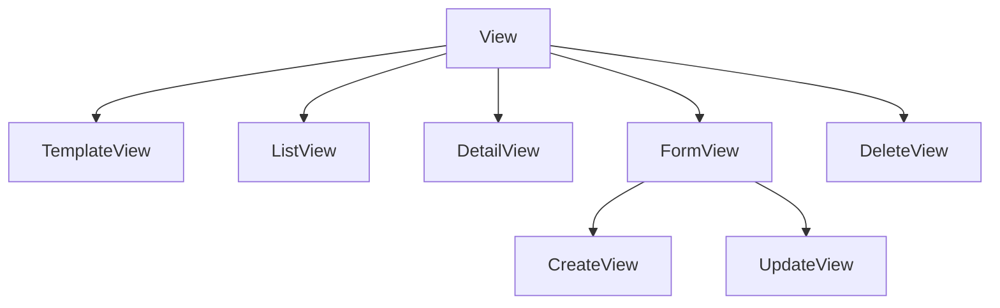

# Views baseadas em classe

Uma **view** recebe uma requisição e devolve uma resposta. O Django permite
escrevê-las como funções ou como **classes**. Neste guia usamos **classes** — as
*Class-Based Views* (CBVs) — porque elas transformam padrões repetitivos em
**métodos que você sobrescreve**, e permitem compor comportamento com **mixins**.

!!! quote "Função vs classe"
    Uma view de função vira um `if request.method == "GET" ... elif "POST"`.
    Uma CBV já separa isso em métodos (`get`, `post`) e, melhor ainda, as
    **generic views** já implementam os casos comuns (listar, detalhar, criar,
    editar, apagar). Você só ajusta o que muda.

## A hierarquia das generic views



Cada uma resolve um caso clássico. Vamos usá-las no blog.

## `ListView`: listar objetos

```python
from typing import Any

from django.db.models import QuerySet
from django.views.generic import ListView

from apps.blog.models import Post, Tag


class PostListView(ListView):
    """Paginated list of published posts, optionally filtered by tag."""

    template_name = "blog/post_list.html"
    context_object_name = "posts"
    paginate_by = 5

    def get_queryset(self) -> QuerySet[Post]:
        """Return published posts, narrowed by the optional ``tag`` query."""
        tag_slug = self.request.GET.get("tag")
        if tag_slug:
            return Post.objects.by_tag(tag_slug).select_related("author")
        return Post.objects.published().select_related("author")

    def get_context_data(self, **kwargs: Any) -> dict[str, Any]:
        """Add the tag list and the active tag to the template context."""
        context = super().get_context_data(**kwargs)
        context["tags"] = Tag.objects.all()
        context["active_tag"] = self.request.GET.get("tag", "")
        return context
```

O que ganhamos de graça:

- **Paginação** — só definir `paginate_by`. A view expõe `page_obj` no template.
- **`get_queryset()`** — o método que dizer *quais* objetos listar. Sobrescrevemos
  para filtrar por tag e já resolver o N+1 com `select_related`.
- **`get_context_data()`** — adiciona variáveis extras ao template. Note o
  `super().get_context_data(**kwargs)`: **sempre** chame o `super()` primeiro,
  senão você perde o que a classe base já preparou (como `posts` e `page_obj`).
- **`context_object_name`** — o nome da lista no template (`posts` em vez do
  genérico `object_list`).

!!! tip "Onde cada método entra"
    Pense na CBV como uma linha de montagem: `get_queryset` decide os dados,
    `get_context_data` monta o contexto, e a base cuida de renderizar o template.
    Você sobrescreve só a etapa que precisa mudar.

## `DetailView`: um objeto

```python
from django.views.generic import DetailView

from apps.blog.forms import CommentForm


class PostDetailView(DetailView):
    """Detail page for a single published post, plus its comment form."""

    template_name = "blog/post_detail.html"
    context_object_name = "post"

    def get_queryset(self) -> QuerySet[Post]:
        return Post.objects.published().select_related("author")

    def get_context_data(self, **kwargs: Any) -> dict[str, Any]:
        context = super().get_context_data(**kwargs)
        context["comments"] = self.object.approved_comments()
        context["form"] = CommentForm()
        return context
```

- A `DetailView` pega o objeto pela URL (por padrão, pelo `slug` ou `pk`).
- Restringir `get_queryset()` a `published()` significa que rascunhos dão **404**
  para o público — segurança de graça.
- `self.object` é o post encontrado; usamos para trazer os comentários aprovados.

## `CreateView` e `UpdateView`: formulários

Aqui aparece a força da **composição com mixins**. Criar e editar compartilham
quase tudo, então extraímos o comum num mixin:

```python
from django.contrib.auth.mixins import LoginRequiredMixin
from django.views.generic import CreateView, UpdateView

from apps.blog.forms import PostForm


class AuthorPostMixin(LoginRequiredMixin):
    """Shared configuration for views that create or edit posts."""

    model = Post
    form_class = PostForm
    template_name = "blog/post_form.html"

    def get_success_url(self) -> str:
        """Return the URL to redirect to after a successful save."""
        return self.object.get_absolute_url()


class PostCreateView(AuthorPostMixin, CreateView):
    """Create a new post authored by the current user."""

    def form_valid(self, form: PostForm) -> HttpResponse:
        """Set the post's author to the logged-in user before saving."""
        form.instance.author = self.request.user.author_profile
        return super().form_valid(form)


class PostUpdateView(AuthorPostMixin, UpdateView):
    """Edit an existing post."""

    slug_url_kwarg = "slug"
```

- **`LoginRequiredMixin`** — colocado primeiro na herança, gate a view: quem não
  está logado é mandado para o login. Comportamento adicionado por **composição**,
  sem tocar na lógica principal.
- **`form_valid()`** — chamado quando o formulário é válido. Injetamos o autor a
  partir do usuário logado (nunca confiando em quem o cliente diz ser) e chamamos
  `super().form_valid(form)`, que salva e redireciona.
- **`get_success_url()`** — para onde ir após salvar. Usamos `get_absolute_url()`
  do próprio post.

!!! warning "Ordem dos mixins importa"
    Na herança múltipla do Python, a ordem é da **esquerda para a direita**.
    `class PostCreateView(AuthorPostMixin, CreateView)` faz o mixin ser
    consultado antes da generic view — que é o que queremos para o
    `LoginRequiredMixin` interceptar a requisição cedo.

## `DeleteView`: confirmação e exclusão

```python
from django.urls import reverse_lazy
from django.views.generic import DeleteView


class PostDeleteView(LoginRequiredMixin, DeleteView):
    """Delete a post after a confirmation step."""

    model = Post
    slug_url_kwarg = "slug"
    template_name = "blog/post_confirm_delete.html"
    success_url = reverse_lazy("blog:post-list")
```

!!! note "`reverse_lazy` vs `reverse`"
    Usamos `reverse_lazy` em atributos de classe porque eles são avaliados **na
    importação do módulo**, quando as URLs ainda podem não estar carregadas. O
    `_lazy` adia a resolução até o momento do uso. Dentro de métodos, `reverse`
    normal já serve.

## Views que só tratam POST

A `CommentCreateView` só existe para receber o POST do formulário de comentário e
redirecionar de volta:

```python
class CommentCreateView(CreateView):
    """Handle the POST that creates a comment for a given post."""

    form_class = CommentForm
    http_method_names = ["post"]

    def form_valid(self, form: CommentForm) -> HttpResponse:
        """Attach the new comment to its post before saving."""
        post = get_object_or_404(Post.objects.published(), slug=self.kwargs["slug"])
        form.instance.post = post
        form.save()
        return HttpResponseRedirect(post.get_absolute_url())
```

`http_method_names = ["post"]` deixa explícito: essa view só aceita POST.

!!! quote "📖 Na documentação oficial"
    - [Class-based views](https://docs.djangoproject.com/en/stable/topics/class-based-views/)

## Recapitulando

- CBVs transformam o request em **métodos sobrescrevíveis**; as **generic views**
  já entregam list/detail/create/update/delete.
- `get_queryset` decide os dados; `get_context_data` monta o contexto (sempre com
  `super()`).
- **Mixins** adicionam comportamento por composição — `LoginRequiredMixin` é o
  exemplo clássico. Ordem de herança importa.
- `form_valid` é o gancho para agir sobre um formulário válido.

As views existem, mas ninguém consegue acessá-las ainda. Falta conectá-las a
endereços — as **[URLs e rotas](urls.md)**.
