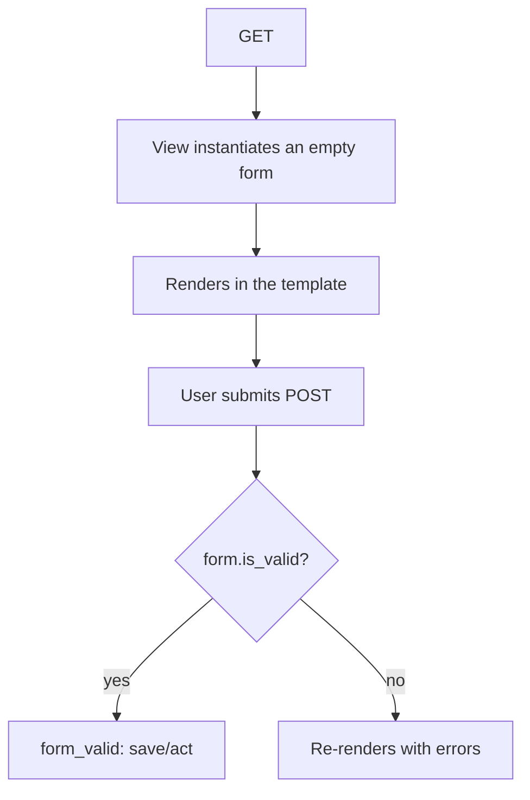

# Forms

A **form** in Django does three things: it renders HTML fields, **validates** the
received data, and converts it into Python types. It's the safe boundary between the
external (untrusted) world and your models.

!!! quote "Golden rule"
    **Never** trust data coming from the client. The form is what validates.
    The view only decides what to do with an *already validated* form.

## `ModelForm`: a form from a model

Since our forms mirror models, we use `ModelForm` — it derives the
fields from the model automatically, just like `ModelSerializer` does for the API:

```python
from django import forms

from apps.blog.models import Comment, Post


class PostForm(forms.ModelForm):
    """Create/update form for Post."""

    class Meta:
        model = Post
        fields = ["title", "body", "tags", "status"]  # (1)!
        widgets = {
            "body": forms.Textarea(attrs={"rows": 12}),
        }


class CommentForm(forms.ModelForm):
    """Public form used by readers to submit a comment on a post."""

    class Meta:
        model = Comment
        fields = ["author_name", "email", "body"]
        widgets = {
            "body": forms.Textarea(attrs={"rows": 4}),
        }
```

1. We expose **only** the fields the user should edit.

!!! danger "Never expose derived or sensitive fields"
    Notice that `PostForm` does **not** include `author`, `slug`, or `published_at`.
    These are computed on the server (`Post.save`) or set by the view from
    the logged-in user. If you put them in `fields`, a user
    could forge a post's author. **List only what's safe to edit.**

## The lifecycle of a form



With the **generic views** (`CreateView`/`UpdateView`), this cycle is already done.
You only override `form_valid()` for what's specific:

```python
class PostCreateView(AuthorPostMixin, CreateView):
    def form_valid(self, form: PostForm) -> HttpResponse:
        """Set the post's author to the logged-in user before saving."""
        form.instance.author = self.request.user.author_profile
        return super().form_valid(form)
```

- `form.instance` is the not-yet-saved `Post` object. We fill in the `author` from
  the **logged-in user** — the trusted source.
- `super().form_valid(form)` saves and redirects to `get_success_url()`.

## Rendering in the template

```django hl_lines="2 3"
<form method="post" action="">
  
  {{ form.as_p }}
  <button type="submit">Submit</button>
</form>
```

- **``** — required in every `<form method="post">`. We'll come back
  to it shortly.
- **`{{ form.as_p }}`** — renders each field inside a `<p>`, with label,
  widget, and error messages. There's also `as_ul`, `as_table`, or field-by-field
  rendering (`{{ form.body }}`) for full control.

## CSRF: the protection you can't forget

Django blocks POSTs without a valid **CSRF token** — a defense against
*Cross-Site Request Forgery* (a malicious site sending requests on your behalf).

!!! warning "Forgot the ``?"
    The symptom is a **403 Forbidden** error when submitting the form. If it appeared,
    it's almost always the `` missing inside the `<form>`. It must be in
    **every** POST form.

## Custom validation

Need a rule of your own? Add a `clean_<field>` or `clean` method:

```python
class CommentForm(forms.ModelForm):
    def clean_body(self) -> str:
        """Reject comments that are too short."""
        body: str = self.cleaned_data["body"]
        if len(body.strip()) < 5:
            raise forms.ValidationError("O comentário é curto demais.")
        return body
```

- `cleaned_data` holds the values already converted and validated by Django.
- Raising `ValidationError` makes `is_valid()` return `False` and the message
  appear next to the field.

## Recap

- Forms validate and convert the input — the application's safe boundary.
- `ModelForm` derives fields from a model; list in `fields` **only what's safe**.
- The generic views handle the cycle; override `form_valid` for the specific part.
- `` in **every** POST, otherwise 403.
- Your own rules go in `clean_<field>` / `clean`, raising `ValidationError`.

We've mentioned "logged-in user" a few times. It's time to understand
**[Authentication](authentication.md)**.
