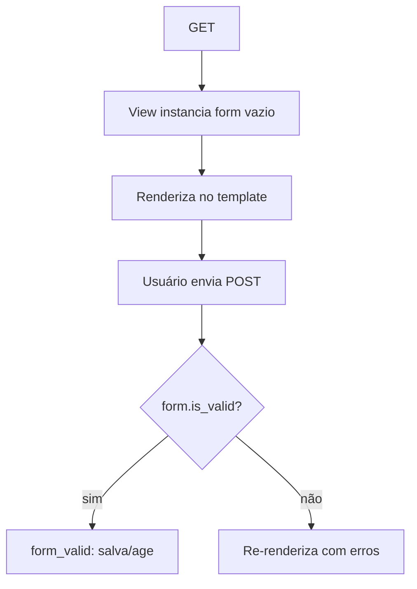

# Formulários

Um **formulário** no Django faz três coisas: renderiza campos HTML, **valida** os
dados recebidos e os converte em tipos Python. É a fronteira segura entre o mundo
externo (não confiável) e os seus modelos.

!!! quote "Regra de ouro"
    **Nunca** confie em dados que chegam do cliente. O formulário é quem valida.
    A view só decide o que fazer com um formulário *já validado*.

## `ModelForm`: um formulário a partir de um modelo

Como nossos formulários espelham modelos, usamos `ModelForm` — ele deriva os
campos do modelo automaticamente, igual o `ModelSerializer` faz para a API:

```python
from django import forms

from apps.blog.models import Comment, Post


class PostForm(forms.ModelForm):
    """Create/update form for Post."""

    class Meta:
        model = Post
        fields = ["title", "body", "tags", "status"]  # (1)!
        widgets = {
            "body": forms.Textarea(attrs={"rows": 12}),
        }


class CommentForm(forms.ModelForm):
    """Public form used by readers to submit a comment on a post."""

    class Meta:
        model = Comment
        fields = ["author_name", "email", "body"]
        widgets = {
            "body": forms.Textarea(attrs={"rows": 4}),
        }
```

1. Expomos **apenas** os campos que o usuário deve editar.

!!! danger "Nunca exponha campos derivados ou sensíveis"
    Repare que `PostForm` **não** inclui `author`, `slug` nem `published_at`.
    Esses são calculados no servidor (`Post.save`) ou definidos pela view a
    partir do usuário logado. Se você os colocasse em `fields`, um usuário
    poderia forjar o autor de um post. **Liste só o que é seguro editar.**

## O ciclo de vida de um formulário



Com as **generic views** (`CreateView`/`UpdateView`), esse ciclo já está pronto.
Você só sobrescreve `form_valid()` para o que é específico:

```python
class PostCreateView(AuthorPostMixin, CreateView):
    def form_valid(self, form: PostForm) -> HttpResponse:
        """Set the post's author to the logged-in user before saving."""
        form.instance.author = self.request.user.author_profile
        return super().form_valid(form)
```

- `form.instance` é o objeto `Post` ainda não salvo. Preenchemos o `author` a
  partir do **usuário logado** — a fonte confiável.
- `super().form_valid(form)` salva e redireciona para `get_success_url()`.

## Renderizando no template

```django hl_lines="2 3"
<form method="post" action="">
  
  {{ form.as_p }}
  <button type="submit">Submit</button>
</form>
```

- **``** — obrigatório em todo `<form method="post">`. Voltaremos
  a ele já já.
- **`{{ form.as_p }}`** — renderiza cada campo dentro de um `<p>`, com label,
  widget e mensagens de erro. Existem `as_ul`, `as_table`, ou renderização
  campo a campo (`{{ form.body }}`) para controle total.

## CSRF: a proteção que você não pode esquecer

O Django bloqueia POSTs sem um **token CSRF** válido — defesa contra
*Cross-Site Request Forgery* (um site malicioso enviando requisições em seu nome).

!!! warning "Esqueceu o ``?"
    O sintoma é um erro **403 Forbidden** ao enviar o formulário. Se apareceu,
    quase sempre falta o `` dentro do `<form>`. Ele deve estar em
    **todo** formulário POST.

## Validação customizada

Precisa de uma regra própria? Adicione um método `clean_<campo>` ou `clean`:

```python
class CommentForm(forms.ModelForm):
    def clean_body(self) -> str:
        """Reject comments that are too short."""
        body: str = self.cleaned_data["body"]
        if len(body.strip()) < 5:
            raise forms.ValidationError("O comentário é curto demais.")
        return body
```

- `cleaned_data` traz os valores já convertidos e validados pelo Django.
- Levantar `ValidationError` faz `is_valid()` retornar `False` e a mensagem
  aparecer ao lado do campo.

!!! quote "📖 Na documentação oficial"
    - [Working with forms](https://docs.djangoproject.com/en/stable/topics/forms/)

## Recapitulando

- Formulários validam e convertem a entrada — a fronteira segura da aplicação.
- `ModelForm` deriva campos de um modelo; liste em `fields` **só o que é seguro**.
- As generic views cuidam do ciclo; sobrescreva `form_valid` para o específico.
- `` em **todo** POST, senão 403.
- Regras próprias vão em `clean_<campo>` / `clean`, levantando `ValidationError`.

Já mencionamos "usuário logado" algumas vezes. Está na hora de entender
**[Autenticação](authentication.md)**.
