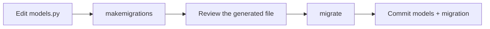

# Migrations

You described the tables as classes. But the database is still empty. **Migrations**
are the bridge: Python files that describe *changes* to the database schema,
generated from your models.

!!! quote "The mental model"
    Models = **what the tables should look like**.
    Migrations = **the step-by-step to get there**, versioned in Git.

    You edit models → Django generates the migration → you apply the migration.

## The two commands

```bash
# 1. Gera os arquivos de migração a partir das mudanças nos modelos
uv run python manage.py makemigrations

# 2. Aplica as migrações pendentes ao banco
uv run python manage.py migrate
```

When you ran `makemigrations` for the first time on the blog, Django replied:

```text
Migrations for 'blog':
  apps/blog/migrations/0001_initial.py
    + Create model Tag
    + Create model Author
    + Create model Post
    + Create model Comment
    + Create index blog_post_publish_... on field(s) -published_at of model post
```

And `migrate` actually created the tables (including those of Django's internal apps,
such as `auth` and `sessions`).

!!! info "Why two steps?"
    Separating "generate" from "apply" gives you control: you **review** the generated
    migration (it's just readable Python) before touching the database, and the same migration runs
    identically in dev, CI, and production.

## What a migration looks like inside

There's no magic — it's a class with a list of operations:

```python
from django.db import migrations, models


class Migration(migrations.Migration):
    initial = True
    dependencies = []

    operations = [
        migrations.CreateModel(
            name="Tag",
            fields=[
                ("id", models.BigAutoField(primary_key=True)),
                ("name", models.CharField(max_length=40, unique=True)),
                ("slug", models.SlugField(blank=True, max_length=50, unique=True)),
            ],
        ),
        # ...
    ]
```

!!! tip "Migrations are versioned"
    **Always** commit the `migrations/` files along with the model change.
    They're part of the project's history — whoever clones it runs `migrate` and reaches
    exactly the same schema.

## Day-to-day workflow

Whenever you change a model (new field, new model, alteration):



## Useful commands

| Command | What for |
| --- | --- |
| `makemigrations` | Generates migrations from model changes |
| `migrate` | Applies pending migrations |
| `showmigrations` | Lists migrations and which have already been applied |
| `sqlmigrate blog 0001` | Shows the SQL a migration will execute |
| `migrate blog 0001` | Rolls the `blog` app back to the state of migration 0001 |

!!! warning "Edited the model and nothing changed?"
    If `migrate` says "No migrations to apply" but you changed a model, you probably
    forgot `makemigrations`. That's what *detects* the change and creates the file;
    `migrate` only applies what already exists.

## Recap

- Migrations translate model changes into database changes, in a
  versioned way.
- `makemigrations` **generates**; `migrate` **applies**. Always in that order.
- Each migration is readable Python — review before applying.
- Commit the migrations along with the model code.

With the tables created, the quickest way to see the data is Django's ready-made
panel: the **[Admin](admin.md)**.
