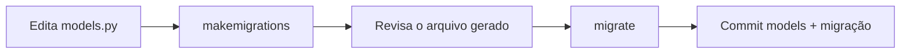

# Migrações

Você descreveu as tabelas como classes. Mas o banco ainda está vazio. As
**migrações** são a ponte: arquivos Python que descrevem *mudanças* no esquema
do banco, geradas a partir dos seus modelos.

!!! quote "O modelo mental"
    Modelos = **como as tabelas devem ser**.
    Migrações = **o passo a passo para chegar lá**, versionado no Git.

    Você edita modelos → o Django gera a migração → você aplica a migração.

## Os dois comandos

```bash
# 1. Gera os arquivos de migração a partir das mudanças nos modelos
uv run python manage.py makemigrations

# 2. Aplica as migrações pendentes ao banco
uv run python manage.py migrate
```

Ao rodar `makemigrations` pela primeira vez no blog, o Django respondeu:

```text
Migrations for 'blog':
  apps/blog/migrations/0001_initial.py
    + Create model Tag
    + Create model Author
    + Create model Post
    + Create model Comment
    + Create index blog_post_publish_... on field(s) -published_at of model post
```

E `migrate` criou as tabelas de fato (incluindo as dos apps internos do Django,
como `auth` e `sessions`).

!!! info "Por que dois passos?"
    Separar "gerar" de "aplicar" te dá controle: você **revisa** a migração
    gerada (é só Python legível) antes de mexer no banco, e a mesma migração roda
    igual em dev, CI e produção.

## Como é uma migração por dentro

Não tem mágica — é uma classe com uma lista de operações:

```python
from django.db import migrations, models


class Migration(migrations.Migration):
    initial = True
    dependencies = []

    operations = [
        migrations.CreateModel(
            name="Tag",
            fields=[
                ("id", models.BigAutoField(primary_key=True)),
                ("name", models.CharField(max_length=40, unique=True)),
                ("slug", models.SlugField(blank=True, max_length=50, unique=True)),
            ],
        ),
        # ...
    ]
```

!!! tip "Migrações são versionadas"
    Commit **sempre** os arquivos de `migrations/` junto com a mudança no modelo.
    Eles fazem parte do histórico do projeto — quem clonar roda `migrate` e chega
    exatamente no mesmo esquema.

## Fluxo do dia a dia

Sempre que mudar um modelo (novo campo, novo modelo, alteração):



## Comandos úteis

| Comando | Para quê |
| --- | --- |
| `makemigrations` | Gera migrações a partir das mudanças nos modelos |
| `migrate` | Aplica migrações pendentes |
| `showmigrations` | Lista migrações e quais já foram aplicadas |
| `sqlmigrate blog 0001` | Mostra o SQL que uma migração vai executar |
| `migrate blog 0001` | Volta o app `blog` ao estado da migração 0001 |

!!! warning "Editou o modelo e nada mudou?"
    Se `migrate` diz "No migrations to apply" mas você mudou um modelo, provavelmente
    esqueceu do `makemigrations`. Ele é quem *detecta* a mudança e cria o arquivo;
    `migrate` só aplica o que já existe.

!!! quote "📖 Na documentação oficial"
    - [Migrations](https://docs.djangoproject.com/en/stable/topics/migrations/)

## Recapitulando

- Migrações traduzem mudanças de modelo em mudanças de banco, de forma
  versionada.
- `makemigrations` **gera**; `migrate` **aplica**. Sempre nessa ordem.
- Cada migração é Python legível — revise antes de aplicar.
- Commit as migrações junto com o código do modelo.

Com as tabelas criadas, o jeito mais rápido de ver os dados é o painel pronto do
Django: o **[Admin](admin.md)**.
