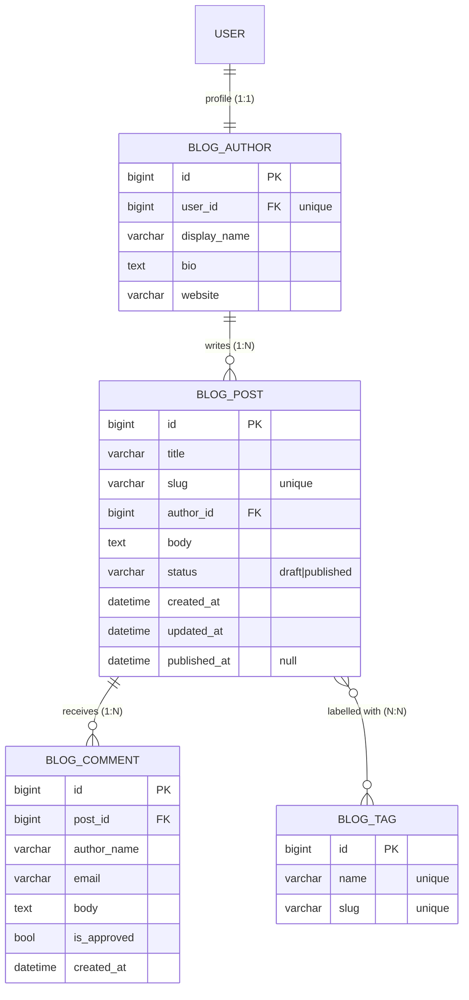

# Models and the ORM

A **model** is a Python class that represents a database table. Each
attribute is a column. The **ORM** (Object-Relational Mapper) translates operations on
Python objects into SQL — you work with objects, Django writes the SQL.

!!! quote "The core idea"
    You describe the data **once**, as a class. Django generates the
    tables, validates the data, and gives you an API to query it — without you writing
    SQL by hand.

## Before anything: design the database

Resist the urge to start typing classes. The database schema is the **most
expensive part of the project to change**: a view you rewrite in an afternoon, a
template you swap on your own, but a column with production data inside it needs
a planned migration, a deploy window and a rollback plan.

!!! quote "Think like a child 🧒"
    Nobody builds a house by laying bricks and then deciding where the bathroom
    goes. You draw the floor plan first. A model is a floor plan: **draw it, then
    build.**

Five minutes on a diagram save an afternoon of migrations. For our blog, the plan
is this:



Before the first line of code, the diagram already answers:

| Question | In our blog |
| --- | --- |
| Which **entities** exist? | author, tag, post, comment |
| What will each **table** be called? | `blog_author`, `blog_tag`, `blog_post`, `blog_comment` |
| Which fields, of which **type**? | see the boxes above |
| What is **required** and what is **unique**? | `slug` unique; `bio` may stay empty |
| What is the **cardinality** of each relation? | 1:1, 1:N, N:N — the arrows |
| What gets deleted in **cascade**? | delete the post, its comments go |
| What will be **queried often**? | listing by `published_at` → index |

Without that drawing, what happens in practice is migration after migration —
`0004_add_field`, `0005_remove_field`, `0006_alter_field` — each one fixing a
decision that was never made, only discovered. An unreadable history and, in
production, real risk.

!!! danger "A migration is not a draft"
    In development you drop the database and start over. In production you
    **don't**: every migration runs over real people's data. `ALTER TABLE` on a
    large table blocks writes; dropping a column throws data away; changing a type
    can fail halfway. Treat a migration as what it is: **a structural change with
    data inside**.

Diagram done? Now, to the code.

## Before writing: a single file

Everything on this page goes into **one file**, the one `startapp` already
created for you:

```text
my-project/
├── manage.py
├── config/
└── apps/
    └── blog/
        ├── models.py     # ← only this file, start to finish of this page
        ├── views.py
        └── admin.py
```

Open `apps/blog/models.py`. It arrives nearly empty (just a `from django.db
import models`). We'll fill it **top to bottom**, in four steps, and each step
**appends to the end of the file** — nothing gets replaced:

| Order | Class | What it's for | Why in this position |
| --- | --- | --- | --- |
| 1 | `Tag` | reusable label (`django`, `orm`) | depends on nobody |
| 2 | `Author` | public profile of whoever writes | depends on nobody |
| 3 | `Post` | the blog text | **references** `Author` and `Tag` |
| 4 | `Comment` | reader comment | **references** `Post` |

!!! warning "The order matters (and Python is the one enforcing it)"
    `Post` names `Author` and `Tag` **by class name**, so they must already exist
    at that point in the file. Flip them and you get `NameError: name 'Author' is
    not defined`. Simple rule: **whatever is referenced comes first**.

    There is a way to reference by *string* (`ForeignKey("Author", ...)`) that
    ignores order — handy for circular dependencies, but here the natural order
    solves it.

## Step 1 — `Tag`: the simplest model

Start with the imports (top of the file) and the first class:

```python
# apps/blog/models.py
from typing import Any

from django.db import models
from django.utils.text import slugify


class Tag(models.Model):
    """A free-form label used to group related posts.

    Attributes:
        name (str): The label as a human types it, unique across tags.
        slug (str): URL-safe version of ``name``, derived on save when left
            blank, so a tag reaches its page as ``/tags/django/``.
        posts (QuerySet[Post]): Reverse accessor for the tagged posts, created
            by ``Post.tags``'s ``related_name``.
    """

    name = models.CharField(max_length=40, unique=True)
    slug = models.SlugField(max_length=50, unique=True, blank=True)

    class Meta:
        db_table = "blog_tag"
        ordering = ["name"]
        verbose_name = "Tag"
        verbose_name_plural = "Tags"

    def __str__(self) -> str:
        """Return the tag name."""
        return self.name

    def save(self, *args: Any, **kwargs: Any) -> None:
        """Populate ``slug`` from ``name`` on first save when left blank.

        Args:
            *args: Positional arguments forwarded to ``Model.save``.
            **kwargs: Keyword arguments forwarded to ``Model.save``.
        """
        if not self.slug:
            self.slug = slugify(self.name)
        super().save(*args, **kwargs)
```

Piece by piece:

- **`models.Model`** — every model class inherits from it. That's what gives you
  the ORM (`.objects`, `.save()`, etc.).
- **`CharField` / `SlugField`** — column types. `max_length` is mandatory for
  short text; `unique=True` creates a uniqueness constraint in the database.
- **`blank=True`** — allows the field to be empty *in forms* (validation).
- **`class Meta`** — model metadata: `ordering` sets the default query order, and
  `verbose_name`/`verbose_name_plural` are the names the admin displays. Without
  them Django guesses from the class name and only gets simple English right:
  `Category` would come out as "Categorys". Declaring them is cheap.
- **`__str__`** — how the object shows up in the admin and the shell. Always
  define it.
- **overridden `save()`** — we derive the `slug` from `name` the first time. We
  call `super().save(...)` so Django does the actual work.

### What `class Meta` controls

`Meta` is not a field and never becomes a column: it configures the **whole
table**.

!!! quote "Think like a child 🧒"
    If the model is a **toy box** and the fields are its drawers, `Meta` is the
    **label on the lid**: it holds no toy at all, it just says what the box is
    called, in what order things come out, and which rules it obeys.

The four we declare on every model in this guide:

| Option | What it does | If you don't declare it |
| --- | --- | --- |
| `db_table` | **The real table name in the database** | Django invents one: `<app label>_<model>` |
| `ordering` | Default order of **every** query on the model | rows come back in whatever order the database likes |
| `verbose_name` | Singular name shown in the admin | Django derives it from the class name |
| `verbose_name_plural` | Plural name shown in the admin | Django just appends `s` |

!!! danger "Always declare `db_table` — on every model"
    Without it, your table's name is a **side effect**: it comes from gluing the
    app's `label` to the lowercased class name. Renamed the class? The table
    changes. Changed `label` in `apps.py`? Every table changes. The name of the
    thing holding the company's data ends up depending on a code detail.

    With `db_table = "blog_tag"` the name is a **decision**, written next to the
    model, matching what you drew on the diagram. Rename the class all you want —
    the table stays put.

    It costs one line per model. It's the difference between "I know what my
    database is called" and "I let the framework pick".

That's how the blog's four models ended up — the same names that were on the
diagram:

```python
    class Meta:
        db_table = "blog_tag"      # (1)!
        ordering = ["name"]
        verbose_name = "Tag"
        verbose_name_plural = "Tags"
```

1. We kept the `blog_` prefix on purpose: with dozens of tables from different
   apps in one database, the prefix says whose table it is. The point isn't
   *which* name you pick — it's **picking one**.

!!! info "Spelling out the name that was already the default is a no-op migration"
    When you declare `db_table` with the same name Django was already using,
    `makemigrations` produces an `AlterModelTable`, but the SQL comes out empty:

    ```bash
    uv run python manage.py sqlmigrate blog 0003
    ```

    ```text
    -- Rename table for tag to blog_tag
    --
    -- (no-op)
    ```

    So you get the explicit name without touching a single row. Changing
    `db_table` to a **different** name with the table in production, on the other
    hand, is a real rename — and that deserves the usual care.

!!! warning "`ordering` joins every query"
    `ordering` becomes an `ORDER BY` on **every** query for the model. Order by an
    indexed field (that's why `Post` has `indexes` on `published_at`), or you pay
    for sorting on every listing.

!!! info "Every `Meta` change asks for a migration"
    `ordering` and `verbose_name` touch no column, but Django keeps that metadata
    in the history — so they generate an `AlterModelOptions`. It's fast and never
    touches data, but it **must** be generated, or CI's `makemigrations --check`
    will call you out.

`Meta` does far more than this: `constraints` (database-level rules, like "no two
posts with the same title per author"), `indexes`, `abstract` (a base model with
no table), `managed` (a legacy table Django doesn't control), `permissions`. It's
all there, with examples, in
**[Reference: the `Meta` class](../referencia/models-meta.md)**.

!!! tip "The `Attributes:` docstring isn't decoration"
    A model field hides two things the code doesn't tell you: **which Python
    type** it hands back when you read the object, and **why it exists**.
    `slug = models.SlugField(...)` says neither that `tag.slug` is a `str` nor
    that it's there to build the URL.

    So we document every attribute as `name (type): purpose` — including the
    **reverse accessors** (`posts`), which appear nowhere in the class yet exist.
    Whoever reads the model understands the data without opening the database.
    It's the pattern throughout this guide.

!!! warning "`blank` vs `null`"
    - **`blank`** is about **form validation** (the field may be left empty).
    - **`null`** is about the **database** (the column accepts `NULL`).

    For text fields, prefer `blank=True` and do **not** use `null=True` — that
    way "empty" is always `""`, never `None`, avoiding two ways of saying
    "nothing".

## Step 2 — `Author`: a one-to-one profile

**Append to the end of the same file.** This step needs one new import, which
goes with the others at the top:

```python
# apps/blog/models.py
from django.conf import settings  # (1)!


class Author(models.Model):
    """A public author profile attached one-to-one to an auth user.

    Attributes:
        user (User): The auth user this profile belongs to. Reachable back as
            ``user.author_profile``; deleting the user deletes the profile.
        display_name (str): The name shown to readers, e.g. in a post byline.
        bio (str): Free-form presentation text. Empty string when unset.
        website (str): Optional personal URL, validated as a URL.
        posts (QuerySet[Post]): Reverse accessor for the author's posts, created
            by ``Post.author``'s ``related_name``.
    """

    user = models.OneToOneField(
        settings.AUTH_USER_MODEL,
        on_delete=models.CASCADE,
        related_name="author_profile",
    )
    display_name = models.CharField(max_length=80)
    bio = models.TextField(blank=True)
    website = models.URLField(blank=True)

    class Meta:
        db_table = "blog_author"
        ordering = ["display_name"]
        verbose_name = "Author"
        verbose_name_plural = "Authors"

    def __str__(self) -> str:
        """Return the author's public display name."""
        return self.display_name
```

1. Add this line to the import block at the top — don't start a second import
   block halfway down the file.

Why a model separate from `User`? Because authentication and public profile are
different responsibilities: password and email stay on Django's `User`; `bio` and
`website` live here. `OneToOneField` ties the two: **one** user has **one**
profile, and `related_name="author_profile"` creates the way back —
`user.author_profile`.

!!! note "`settings.AUTH_USER_MODEL`, never `User` directly"
    Always point at the *setting*, not the class. If the project ever swaps in a
    custom user, nothing here changes.

## Step 3 — `Post`: the central model

**Append to the end of the file.** This is where the relationships show up, and
that's why `Tag` and `Author` had to come first. Two more imports at the top:

```python
# apps/blog/models.py
from django.urls import reverse
from django.utils import timezone


class Post(models.Model):
    """A blog post authored by an Author and labelled with tags.

    Attributes:
        title (str): The headline, shown in listings and as the page title.
        slug (str): URL-safe version of ``title``, derived on save when blank.
            Unique, because it identifies the post in its URL.
        author (Author): The profile that wrote the post. Deleting the author
            deletes their posts.
        body (str): The post content, unbounded text.
        tags (QuerySet[Tag]): Labels attached to the post; may be empty.
        status (Status): Publication state — ``DRAFT`` or ``PUBLISHED``.
        created_at (datetime): Stamped once, at creation.
        updated_at (datetime): Refreshed on every save.
        published_at (datetime | None): Stamped the first time the post becomes
            published; ``None`` while it is a draft.
        comments (QuerySet[Comment]): Reverse accessor for reader comments,
            created by ``Comment.post``'s ``related_name``.
    """

    class Status(models.TextChoices):
        """Publication state of a post."""

        DRAFT = "draft", "Draft"
        PUBLISHED = "published", "Published"

    title = models.CharField(max_length=200)
    slug = models.SlugField(max_length=220, unique=True, blank=True)
    author = models.ForeignKey(
        Author,
        on_delete=models.CASCADE,
        related_name="posts",
    )
    body = models.TextField()
    tags = models.ManyToManyField(Tag, related_name="posts", blank=True)
    status = models.CharField(
        max_length=10,
        choices=Status.choices,
        default=Status.DRAFT,
    )
    created_at = models.DateTimeField(auto_now_add=True)
    updated_at = models.DateTimeField(auto_now=True)
    published_at = models.DateTimeField(null=True, blank=True)

    class Meta:
        db_table = "blog_post"
        ordering = ["-published_at", "-created_at"]
        indexes = [models.Index(fields=["-published_at"])]
        verbose_name = "Post"
        verbose_name_plural = "Posts"

    def __str__(self) -> str:
        """Return the post title."""
        return self.title

    def get_absolute_url(self) -> str:
        """Return the canonical URL of the post detail page.

        Returns:
            The path to this post's detail view, resolved from its slug.
        """
        return reverse("blog:post-detail", kwargs={"slug": self.slug})

    def save(self, *args: Any, **kwargs: Any) -> None:
        """Derive the slug and stamp ``published_at`` when appropriate.

        The slug is generated from the title on first save. ``published_at`` is
        set the moment the post transitions into the published state and it is
        still empty.

        Args:
            *args: Positional arguments forwarded to ``Model.save``.
            **kwargs: Keyword arguments forwarded to ``Model.save``.
        """
        if not self.slug:
            self.slug = slugify(self.title)
        if self.status == self.Status.PUBLISHED and self.published_at is None:
            self.published_at = timezone.now()
        super().save(*args, **kwargs)

    @property
    def is_published(self) -> bool:
        """Return whether the post is currently published."""
        return self.status == self.Status.PUBLISHED
```

Highlights:

- **`TextChoices`** — the modern, typed way to define options. `Status.DRAFT`
  holds `"draft"` and displays `"Draft"`. No loose constants, no magic strings.
- **`auto_now_add`** vs **`auto_now`** — the first stamps the date only at
  creation; the second refreshes on every save.
- **`get_absolute_url`** — returns the object's URL. The admin and the templates
  use it; we never write the URL "by hand".
- **`indexes`** — a database index so ordering by `published_at` is fast.
- **`@property is_published`** — domain logic next to the model, typed.

### The three relationships, side by side

The excerpts below are **already** in the code you pasted — the three
relationship lines, isolated for comparison. This is not new code to add.

=== "One-to-one (`Author` ↔ `User`)"

    ```python
    user = models.OneToOneField(
        settings.AUTH_USER_MODEL,
        on_delete=models.CASCADE,
        related_name="author_profile",
    )
    ```

    It's in `Author` (step 2). A user has **one** profile, and a profile belongs
    to **one** user. Forward: `author.user`. Back: `user.author_profile`.

=== "Many-to-one (`Post` → `Author`)"

    ```python
    author = models.ForeignKey(
        Author,
        on_delete=models.CASCADE,
        related_name="posts",
    )
    ```

    It's in `Post`. Each post has **one** author; an author has **many** posts.
    Forward: `post.author`. Back: `author.posts.all()`.

=== "Many-to-many (`Post` ↔ `Tag`)"

    ```python
    tags = models.ManyToManyField(Tag, related_name="posts", blank=True)
    ```

    It's in `Post`. A post has several tags; a tag marks several posts. Django
    creates the join table on its own. Forward: `post.tags.all()`. Back:
    `tag.posts.all()`.

!!! danger "Always set `on_delete`"
    On `ForeignKey` and `OneToOneField`, `on_delete` is **mandatory**. It says
    what to do when the referenced object is deleted:

    - `CASCADE` — delete the dependents too (delete the author, the posts go).
    - `PROTECT` — block the deletion while dependents exist.
    - `SET_NULL` — clear the reference (requires `null=True`).

## Step 4 — `Comment`: closing the loop

Last block, **also at the end of the file**. No new imports:

```python
# apps/blog/models.py
class Comment(models.Model):
    """A reader comment attached to a single Post.

    Attributes:
        post (Post): The commented post. Deleting the post deletes its comments.
        author_name (str): Name the reader typed; comments need no login.
        email (str): Reader's email, validated but never shown publicly.
        body (str): The comment text.
        is_approved (bool): Moderation flag — ``False`` until a moderator
            approves, and only approved comments are rendered.
        created_at (datetime): Stamped once, at creation.
    """

    post = models.ForeignKey(
        Post,
        on_delete=models.CASCADE,
        related_name="comments",
    )
    author_name = models.CharField(max_length=80)
    email = models.EmailField()
    body = models.TextField()
    is_approved = models.BooleanField(default=False)
    created_at = models.DateTimeField(auto_now_add=True)

    class Meta:
        db_table = "blog_comment"
        ordering = ["-created_at"]
        verbose_name = "Comment"
        verbose_name_plural = "Comments"

    def __str__(self) -> str:
        """Return a short label identifying the comment and its post."""
        return f"{self.author_name} on {self.post}"
```

That `is_approved=False` default is a product decision turned into a **column
default**: a comment is born invisible and only shows up after moderation.

## Checking the result

As it stands, the file looks like this — four classes, in this order:

```text
apps/blog/models.py
├── imports                (typing, django.conf, django.db, django.urls, ...)
├── class Tag              step 1
├── class Author           step 2
├── class Post             step 3
└── class Comment          step 4
```

And Django agrees with you:

```bash
uv run python manage.py check
```

It should answer `System check identified no issues`. A wrong class name, a
forgotten `on_delete` or a misconfigured field shows up right here.

!!! note "The repository version has one extra class"
    The `models.py` of the
    [example project](https://github.com/mauriciobenjamin700/django-survival-guide/blob/main/example/apps/blog/models.py)
    also carries a `PostQuerySet` plus the line `objects = PostQuerySet.as_manager()`
    inside `Post` — reusable queries, the subject of
    **[QuerySets and queries](querysets.md)**. Nothing on this page depends on
    them; you can add them later, when you get there.

!!! tip "Fat model, thin view"
    Rules that depend only on the object's own data (like `is_published`) live on
    the **model**. That keeps the logic next to the data and reusable across
    views, templates and tests.

!!! quote "📖 In the official docs"
    - [Models](https://docs.djangoproject.com/en/stable/topics/db/models/) — the models guide
    - [Model Meta options](https://docs.djangoproject.com/en/stable/ref/models/options/) — **every** `class Meta` option
    - [Model field reference](https://docs.djangoproject.com/en/stable/ref/models/fields/) — every field type and its arguments
    - [Model instance reference](https://docs.djangoproject.com/en/stable/ref/models/instances/) — `save()`, `full_clean()`, `get_absolute_url()`

## Recap

- Everything on this page lives in **one file**: `apps/blog/models.py`, written
  top to bottom — `Tag` → `Author` → `Post` → `Comment`. **Whatever is
  referenced comes first.**
- A **model** is a class that becomes a table; attributes become columns.
- Document every model with an `Attributes:` docstring in the
  `name (type): purpose` format, reverse accessors included.
- **Design the database before coding.** The diagram settles entities, types,
  uniqueness, cardinality and every table's name — and spares you the
  `0004_add`, `0005_remove`, `0006_alter` sequence fixing decisions never made.
- `class Meta` configures the **table**, not a field. **Declare `db_table` on
  every model**: without it the table name is a side effect of the app `label`
  plus the class name. Every `Meta` change generates a migration.
- Relationships: `OneToOneField`, `ForeignKey`, `ManyToManyField` — always with
  `on_delete` on the FKs.
- `related_name` creates the reverse accessor (`author.posts`).
- `TextChoices` gives typed enums; `__str__` and `get_absolute_url` are
  essential.
- Put the object's own rules on the model (`@property`, methods).

We defined the tables in code. Now we need to actually create them in the
database — that's the job of **[Migrations](migrations.md)**.
