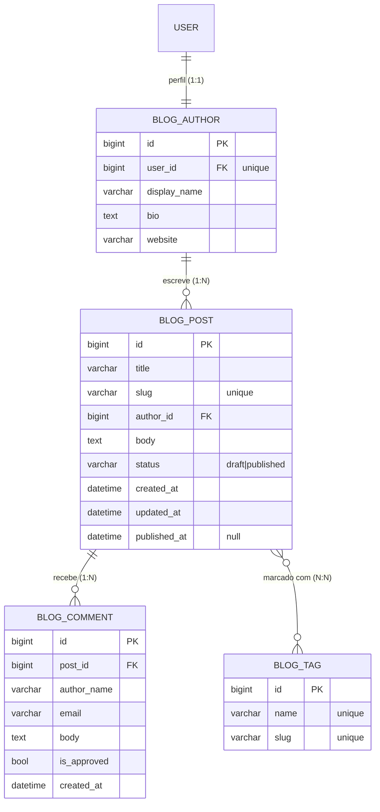

# Modelos e o ORM

Um **modelo** é uma classe Python que representa uma tabela do banco. Cada
atributo é uma coluna. O **ORM** (Object-Relational Mapper) traduz operações em
objetos Python para SQL — você trabalha com objetos, o Django escreve o SQL.

!!! quote "A ideia central"
    Você descreve os dados **uma vez**, como uma classe. O Django gera as
    tabelas, valida os dados e te dá uma API para consultar — sem você escrever
    SQL na mão.

## Antes de tudo: desenhe o banco

Resista à vontade de sair digitando classes. O esquema do banco é a parte **mais
cara de mudar** do projeto: view você reescreve numa tarde, template você troca
sozinho, mas coluna com dado de produção dentro exige migração planejada, janela
de deploy e plano de rollback.

!!! quote "Pensa como criança 🧒"
    Ninguém constrói casa colocando tijolo e depois decidindo onde fica o
    banheiro. Você desenha a planta primeiro. Modelo é planta: **desenhe, depois
    construa.**

Cinco minutos num diagrama economizam uma tarde de migração. Para o nosso blog, a
planta é esta:



Antes da primeira linha de código, o diagrama já responde:

| Pergunta | No nosso blog |
| --- | --- |
| Quais **entidades** existem? | autor, tag, post, comentário |
| Como cada **tabela** vai se chamar? | `blog_author`, `blog_tag`, `blog_post`, `blog_comment` |
| Quais campos, de que **tipo**? | veja as caixas acima |
| O que é **obrigatório** e o que é **único**? | `slug` único; `bio` pode ficar vazia |
| Qual a **cardinalidade** de cada relação? | 1:1, 1:N, N:N — as setas |
| O que apagar em **cascata**? | apagou o post, somem os comentários |
| O que vai ser **consultado com frequência**? | listagem por `published_at` → índice |

Sem esse desenho, o que acontece na prática é migração atrás de migração —
`0004_add_field`, `0005_remove_field`, `0006_alter_field` — cada uma corrigindo
uma decisão que nunca foi tomada, só descoberta. Histórico ilegível e, em
produção, risco real.

!!! danger "Migração não é rascunho"
    Em desenvolvimento você apaga o banco e recomeça. Em produção, **não**:
    cada migração roda sobre dados de gente de verdade. `ALTER TABLE` em tabela
    grande trava escrita; remover coluna joga dado fora; mudar tipo pode falhar no
    meio. Trate migração como o que ela é: **alteração de estrutura com dado
    dentro**.

Diagramou? Agora sim, ao código.

## Antes de escrever: um arquivo só

Tudo nesta página vai em **um único arquivo**, o que o `startapp` já criou para
você:

```text
meu-projeto/
├── manage.py
├── config/
└── apps/
    └── blog/
        ├── models.py     # ← só este arquivo, do início ao fim da página
        ├── views.py
        └── admin.py
```

Abra o `apps/blog/models.py`. Ele vem quase vazio (só um `from django.db import
models`). Vamos preenchê-lo **de cima para baixo**, em quatro passos, e cada
passo **acrescenta ao final do arquivo** — nada é substituído:

| Ordem | Classe | Para que serve | Por que nesta posição |
| --- | --- | --- | --- |
| 1 | `Tag` | rótulo reutilizável (`django`, `orm`) | não depende de ninguém |
| 2 | `Author` | perfil público de quem escreve | não depende de ninguém |
| 3 | `Post` | o texto do blog | **referencia** `Author` e `Tag` |
| 4 | `Comment` | comentário de leitor | **referencia** `Post` |

!!! warning "A ordem importa (e o Python é quem manda)"
    `Post` cita `Author` e `Tag` **pelo nome da classe**, então elas precisam já
    existir naquele ponto do arquivo. Se inverter, você toma
    `NameError: name 'Author' is not defined`. A regra é simples: **quem é
    referenciado vem antes**.

    Existe um jeito de referenciar por *string* (`ForeignKey("Author", ...)`),
    que ignora a ordem — útil para dependências circulares, mas aqui a ordem
    natural resolve.

## Passo 1 — `Tag`: o modelo mais simples

Comece pelos imports (topo do arquivo) e a primeira classe:

```python
# apps/blog/models.py
from typing import Any

from django.db import models
from django.utils.text import slugify


class Tag(models.Model):
    """A free-form label used to group related posts.

    Attributes:
        name (str): The label as a human types it, unique across tags.
        slug (str): URL-safe version of ``name``, derived on save when left
            blank, so a tag reaches its page as ``/tags/django/``.
        posts (QuerySet[Post]): Reverse accessor for the tagged posts, created
            by ``Post.tags``'s ``related_name``.
    """

    name = models.CharField(max_length=40, unique=True)
    slug = models.SlugField(max_length=50, unique=True, blank=True)

    class Meta:
        db_table = "blog_tag"
        ordering = ["name"]
        verbose_name = "Tag"
        verbose_name_plural = "Tags"

    def __str__(self) -> str:
        """Return the tag name."""
        return self.name

    def save(self, *args: Any, **kwargs: Any) -> None:
        """Populate ``slug`` from ``name`` on first save when left blank.

        Args:
            *args: Positional arguments forwarded to ``Model.save``.
            **kwargs: Keyword arguments forwarded to ``Model.save``.
        """
        if not self.slug:
            self.slug = slugify(self.name)
        super().save(*args, **kwargs)
```

Vamos por partes:

- **`models.Model`** — toda classe de modelo herda dela. É o que dá acesso ao
  ORM (`.objects`, `.save()`, etc.).
- **`CharField` / `SlugField`** — tipos de coluna. `max_length` é obrigatório em
  texto curto; `unique=True` cria uma restrição de unicidade no banco.
- **`blank=True`** — permite o campo vazio *nos formulários* (validação).
- **`class Meta`** — metadados do modelo: `ordering` define a ordem padrão das
  consultas, e `verbose_name`/`verbose_name_plural` são os nomes exibidos no
  admin. Sem eles o Django chuta a partir do nome da classe e só acerta em
  inglês simples: `Category` viraria "Categorys". Declarar é barato.
- **`__str__`** — como o objeto aparece no admin e no shell. Sempre defina.
- **`save()` sobrescrito** — geramos o `slug` a partir do `name` na primeira vez.
  Chamamos `super().save(...)` para o Django fazer o trabalho de fato.

### O que a `class Meta` controla

A `Meta` não é um campo nem vira coluna: ela configura a **tabela inteira**.

!!! quote "Pensa como criança 🧒"
    Se o modelo é uma **caixa de brinquedos** e os campos são as gavetas, a `Meta`
    é a **etiqueta na tampa**: não guarda brinquedo nenhum, só diz como a caixa se
    chama, em que ordem as coisas aparecem e que regras ela obedece.

As quatro que declaramos em todo modelo deste guia:

| Opção | O que faz | Se você não declarar |
| --- | --- | --- |
| `db_table` | **Nome real da tabela no banco** | Django inventa: `<label do app>_<modelo>` |
| `ordering` | Ordem padrão de **toda** consulta ao modelo | vem na ordem que o banco quiser |
| `verbose_name` | Nome singular exibido no admin | Django deriva do nome da classe |
| `verbose_name_plural` | Nome plural exibido no admin | Django só acrescenta `s` |

!!! danger "Declare `db_table` sempre — em todo modelo"
    Sem ele, o nome da sua tabela é um **efeito colateral**: sai de juntar o
    `label` do app com o nome da classe em minúsculas. Renomeou a classe? A tabela
    muda. Mudou o `label` no `apps.py`? Todas as tabelas mudam. O nome do que
    guarda os dados da empresa passa a depender de um detalhe de código.

    Com `db_table = "blog_tag"` o nome é uma **decisão**, escrita ao lado do
    modelo, igual ao que você desenhou no diagrama. Renomeie a classe à vontade —
    a tabela fica onde está.

    Custa uma linha por modelo. É a diferença entre "sei como minha base se
    chama" e "deixei o framework escolher".

Foi assim que os quatro modelos do blog ficaram — o mesmo nome que estava no
diagrama:

```python
    class Meta:
        db_table = "blog_tag"      # (1)!
        ordering = ["name"]
        verbose_name = "Tag"
        verbose_name_plural = "Tags"
```

1. Mantivemos o prefixo `blog_` de propósito: com dezenas de tabelas de apps
   diferentes no mesmo banco, o prefixo diz de quem é a tabela. O ponto não é
   *qual* nome você escolhe — é **escolher**.

!!! info "Explicitar o nome que já era o padrão é migração no-op"
    Quando você declara `db_table` com o mesmo nome que o Django já usava, o
    `makemigrations` gera um `AlterModelTable`, mas o SQL sai vazio:

    ```bash
    uv run python manage.py sqlmigrate blog 0003
    ```

    ```text
    -- Rename table for tag to blog_tag
    --
    -- (no-op)
    ```

    Ou seja: você ganha o nome explícito sem tocar em uma linha de dado. Já mudar
    `db_table` para um nome **diferente** com a tabela em produção é rename de
    verdade — e aí vale o cuidado de sempre.

!!! warning "`ordering` entra em toda consulta"
    `ordering` vira um `ORDER BY` em **toda** consulta do modelo. Ordene por campo
    indexado (é por isso que o `Post` tem `indexes` no `published_at`), ou você
    paga ordenação em cada listagem.

!!! info "Toda mudança na `Meta` pede migração"
    `ordering` e `verbose_name` não mexem em coluna nenhuma, mas o Django guarda
    esses metadados no histórico — então geram um `AlterModelOptions`. É rápido e
    não toca nos dados, mas **precisa** ser gerado, senão o
    `makemigrations --check` do CI acusa.

A `Meta` faz bem mais do que isso: `constraints` (regras no banco, tipo "sem dois
posts com o mesmo título por autor"), `indexes`, `abstract` (modelo base sem
tabela), `managed` (tabela legada que o Django não controla), `permissions`. Está
tudo, com exemplo, em **[Referência: a classe `Meta`](../referencia/models-meta.md)**.

!!! tip "A docstring com `Attributes:` não é enfeite"
    Um campo de modelo esconde duas informações que o código não conta: **que
    tipo Python** ele devolve quando você lê o objeto, e **para que ele existe**.
    `slug = models.SlugField(...)` não diz que `tag.slug` é uma `str` nem que ela
    serve para montar a URL.

    Por isso documentamos cada atributo como `nome (tipo): propósito` — incluindo
    os **acessos reversos** (`posts`), que não aparecem em lugar nenhum na classe,
    mas existem. Quem lê o modelo entende o dado sem abrir o banco. É o padrão em
    todo o guia.

!!! warning "`blank` vs `null`"
    - **`blank`** é sobre **validação de formulário** (o campo pode ficar vazio).
    - **`null`** é sobre o **banco** (a coluna aceita `NULL`).

    Para campos de texto, prefira `blank=True` e **não** use `null=True` — assim
    "vazio" é sempre `""`, nunca `None`, evitando dois jeitos de dizer "nada".

## Passo 2 — `Author`: um perfil um-para-um

**Acrescente ao final do mesmo arquivo.** Este passo precisa de um import novo,
que vai junto dos outros, no topo:

```python
# apps/blog/models.py
from django.conf import settings  # (1)!


class Author(models.Model):
    """A public author profile attached one-to-one to an auth user.

    Attributes:
        user (User): The auth user this profile belongs to. Reachable back as
            ``user.author_profile``; deleting the user deletes the profile.
        display_name (str): The name shown to readers, e.g. in a post byline.
        bio (str): Free-form presentation text. Empty string when unset.
        website (str): Optional personal URL, validated as a URL.
        posts (QuerySet[Post]): Reverse accessor for the author's posts, created
            by ``Post.author``'s ``related_name``.
    """

    user = models.OneToOneField(
        settings.AUTH_USER_MODEL,
        on_delete=models.CASCADE,
        related_name="author_profile",
    )
    display_name = models.CharField(max_length=80)
    bio = models.TextField(blank=True)
    website = models.URLField(blank=True)

    class Meta:
        db_table = "blog_author"
        ordering = ["display_name"]
        verbose_name = "Author"
        verbose_name_plural = "Authors"

    def __str__(self) -> str:
        """Return the author's public display name."""
        return self.display_name
```

1. Junte esta linha ao bloco de imports do topo — não repita um segundo bloco de
   imports no meio do arquivo.

Por que um modelo separado do `User`? Porque autenticação e perfil público são
responsabilidades diferentes: senha e email ficam no `User` do Django; `bio` e
`website` ficam aqui. `OneToOneField` amarra os dois: **um** usuário tem **um**
perfil, e `related_name="author_profile"` cria o caminho de volta —
`user.author_profile`.

!!! note "`settings.AUTH_USER_MODEL`, nunca `User` direto"
    Aponte sempre para a *configuração*, não para a classe. Se um dia o projeto
    trocar por um usuário customizado, nada aqui muda.

## Passo 3 — `Post`: o modelo central

**Acrescente ao final do arquivo.** É aqui que as relações aparecem, e por isso
`Tag` e `Author` tinham que vir antes. Mais dois imports no topo:

```python
# apps/blog/models.py
from django.urls import reverse
from django.utils import timezone


class Post(models.Model):
    """A blog post authored by an Author and labelled with tags.

    Attributes:
        title (str): The headline, shown in listings and as the page title.
        slug (str): URL-safe version of ``title``, derived on save when blank.
            Unique, because it identifies the post in its URL.
        author (Author): The profile that wrote the post. Deleting the author
            deletes their posts.
        body (str): The post content, unbounded text.
        tags (QuerySet[Tag]): Labels attached to the post; may be empty.
        status (Status): Publication state — ``DRAFT`` or ``PUBLISHED``.
        created_at (datetime): Stamped once, at creation.
        updated_at (datetime): Refreshed on every save.
        published_at (datetime | None): Stamped the first time the post becomes
            published; ``None`` while it is a draft.
        comments (QuerySet[Comment]): Reverse accessor for reader comments,
            created by ``Comment.post``'s ``related_name``.
    """

    class Status(models.TextChoices):
        """Publication state of a post."""

        DRAFT = "draft", "Draft"
        PUBLISHED = "published", "Published"

    title = models.CharField(max_length=200)
    slug = models.SlugField(max_length=220, unique=True, blank=True)
    author = models.ForeignKey(
        Author,
        on_delete=models.CASCADE,
        related_name="posts",
    )
    body = models.TextField()
    tags = models.ManyToManyField(Tag, related_name="posts", blank=True)
    status = models.CharField(
        max_length=10,
        choices=Status.choices,
        default=Status.DRAFT,
    )
    created_at = models.DateTimeField(auto_now_add=True)
    updated_at = models.DateTimeField(auto_now=True)
    published_at = models.DateTimeField(null=True, blank=True)

    class Meta:
        db_table = "blog_post"
        ordering = ["-published_at", "-created_at"]
        indexes = [models.Index(fields=["-published_at"])]
        verbose_name = "Post"
        verbose_name_plural = "Posts"

    def __str__(self) -> str:
        """Return the post title."""
        return self.title

    def get_absolute_url(self) -> str:
        """Return the canonical URL of the post detail page.

        Returns:
            The path to this post's detail view, resolved from its slug.
        """
        return reverse("blog:post-detail", kwargs={"slug": self.slug})

    def save(self, *args: Any, **kwargs: Any) -> None:
        """Derive the slug and stamp ``published_at`` when appropriate.

        The slug is generated from the title on first save. ``published_at`` is
        set the moment the post transitions into the published state and it is
        still empty.

        Args:
            *args: Positional arguments forwarded to ``Model.save``.
            **kwargs: Keyword arguments forwarded to ``Model.save``.
        """
        if not self.slug:
            self.slug = slugify(self.title)
        if self.status == self.Status.PUBLISHED and self.published_at is None:
            self.published_at = timezone.now()
        super().save(*args, **kwargs)

    @property
    def is_published(self) -> bool:
        """Return whether the post is currently published."""
        return self.status == self.Status.PUBLISHED
```

Destaques:

- **`TextChoices`** — a forma moderna e tipada de definir opções. `Status.DRAFT`
  vale `"draft"` e exibe `"Draft"`. Sem constantes soltas nem strings mágicas.
- **`auto_now_add`** vs **`auto_now`** — o primeiro grava a data só na criação; o
  segundo atualiza a cada save.
- **`get_absolute_url`** — retorna a URL do objeto. O admin e os templates usam
  isso; nunca escrevemos a URL "na mão".
- **`indexes`** — um índice no banco para ordenar por `published_at` rápido.
- **`@property is_published`** — lógica de domínio junto do modelo, tipada.

### As três relações, lado a lado

Os recortes abaixo **já estão** no código que você colou — são as três linhas de
relação, isoladas para comparar. Não é código novo para adicionar.

=== "Um-para-um (`Author` ↔ `User`)"

    ```python
    user = models.OneToOneField(
        settings.AUTH_USER_MODEL,
        on_delete=models.CASCADE,
        related_name="author_profile",
    )
    ```

    Está no `Author` (passo 2). Um usuário tem **um** perfil, e um perfil
    pertence a **um** usuário. Ida: `author.user`. Volta:
    `user.author_profile`.

=== "Muitos-para-um (`Post` → `Author`)"

    ```python
    author = models.ForeignKey(
        Author,
        on_delete=models.CASCADE,
        related_name="posts",
    )
    ```

    Está no `Post`. Cada post tem **um** autor; um autor tem **vários** posts.
    Ida: `post.author`. Volta: `author.posts.all()`.

=== "Muitos-para-muitos (`Post` ↔ `Tag`)"

    ```python
    tags = models.ManyToManyField(Tag, related_name="posts", blank=True)
    ```

    Está no `Post`. Um post tem várias tags; uma tag marca vários posts. O
    Django cria a tabela intermediária sozinho. Ida: `post.tags.all()`. Volta:
    `tag.posts.all()`.

!!! danger "Sempre defina `on_delete`"
    Em `ForeignKey` e `OneToOneField`, `on_delete` é **obrigatório**. Ele diz o
    que fazer quando o objeto referenciado é apagado:

    - `CASCADE` — apaga também os que dependem dele (apagou o autor, somem os posts).
    - `PROTECT` — impede o apagamento enquanto houver dependentes.
    - `SET_NULL` — zera a referência (exige `null=True`).

## Passo 4 — `Comment`: fechando o ciclo

Último bloco, **também no final do arquivo**. Nenhum import novo:

```python
# apps/blog/models.py
class Comment(models.Model):
    """A reader comment attached to a single Post.

    Attributes:
        post (Post): The commented post. Deleting the post deletes its comments.
        author_name (str): Name the reader typed; comments need no login.
        email (str): Reader's email, validated but never shown publicly.
        body (str): The comment text.
        is_approved (bool): Moderation flag — ``False`` until a moderator
            approves, and only approved comments are rendered.
        created_at (datetime): Stamped once, at creation.
    """

    post = models.ForeignKey(
        Post,
        on_delete=models.CASCADE,
        related_name="comments",
    )
    author_name = models.CharField(max_length=80)
    email = models.EmailField()
    body = models.TextField()
    is_approved = models.BooleanField(default=False)
    created_at = models.DateTimeField(auto_now_add=True)

    class Meta:
        db_table = "blog_comment"
        ordering = ["-created_at"]
        verbose_name = "Comment"
        verbose_name_plural = "Comments"

    def __str__(self) -> str:
        """Return a short label identifying the comment and its post."""
        return f"{self.author_name} on {self.post}"
```

O `is_approved=False` por padrão é uma decisão de produto virando **default de
coluna**: comentário nasce invisível e só aparece depois da moderação.

## Conferindo o resultado

Do jeito que ficou, o arquivo tem esta cara — quatro classes, nesta ordem:

```text
apps/blog/models.py
├── imports                (typing, django.conf, django.db, django.urls, ...)
├── class Tag              passo 1
├── class Author           passo 2
├── class Post             passo 3
└── class Comment          passo 4
```

E o Django concorda com você:

```bash
uv run python manage.py check
```

Deve responder `System check identified no issues`. Erro de nome de classe,
`on_delete` esquecido ou campo mal configurado aparece aqui.

!!! note "A versão do repositório tem uma classe a mais"
    O `models.py` do
    [projeto de exemplo](https://github.com/mauriciobenjamin700/django-survival-guide/blob/main/example/apps/blog/models.py)
    também traz uma `PostQuerySet` e a linha `objects = PostQuerySet.as_manager()`
    dentro do `Post` — consultas reaproveitáveis, assunto de
    **[QuerySets e consultas](querysets.md)**. Nada nesta página depende delas;
    você pode adicioná-las depois, quando chegar lá.

!!! tip "Modelo gordo, view magra"
    Regras que dependem só dos dados do próprio objeto (como `is_published`)
    moram no **modelo**. Assim a lógica fica perto dos dados e é reaproveitável
    em views, templates e testes.

!!! quote "📖 Na documentação oficial"
    - [Models](https://docs.djangoproject.com/en/stable/topics/db/models/) — o guia de modelos
    - [Model Meta options](https://docs.djangoproject.com/en/stable/ref/models/options/) — **todas** as opções da `class Meta`
    - [Model field reference](https://docs.djangoproject.com/en/stable/ref/models/fields/) — todos os tipos de campo e seus argumentos
    - [Model instance reference](https://docs.djangoproject.com/en/stable/ref/models/instances/) — `save()`, `full_clean()`, `get_absolute_url()`

## Recapitulando

- Tudo desta página vive em **um arquivo**: `apps/blog/models.py`, escrito de
  cima para baixo — `Tag` → `Author` → `Post` → `Comment`. **Quem é referenciado
  vem antes.**
- Um **modelo** é uma classe que vira tabela; atributos viram colunas.
- Documente cada modelo com uma docstring `Attributes:` no formato
  `nome (tipo): propósito`, incluindo os acessos reversos.
- **Desenhe o banco antes de codar.** O diagrama define entidades, tipos,
  unicidade, cardinalidade e o nome de cada tabela — e evita a sequência
  `0004_add`, `0005_remove`, `0006_alter` corrigindo decisão não tomada.
- A `class Meta` configura a **tabela**, não um campo. **Declare `db_table` em
  todo modelo**: sem ele o nome da tabela é efeito colateral do `label` do app
  com o nome da classe. Toda mudança na `Meta` gera migração.
- Relacionamentos: `OneToOneField`, `ForeignKey`, `ManyToManyField` — sempre com
  `on_delete` nas FKs.
- `related_name` cria o acesso reverso (`author.posts`).
- `TextChoices` dá enums tipados; `__str__` e `get_absolute_url` são essenciais.
- Coloque regras do próprio objeto no modelo (`@property`, métodos).

Definimos as tabelas em código. Agora precisamos criá-las de verdade no banco —
isso é papel das **[Migrações](migrations.md)**.
