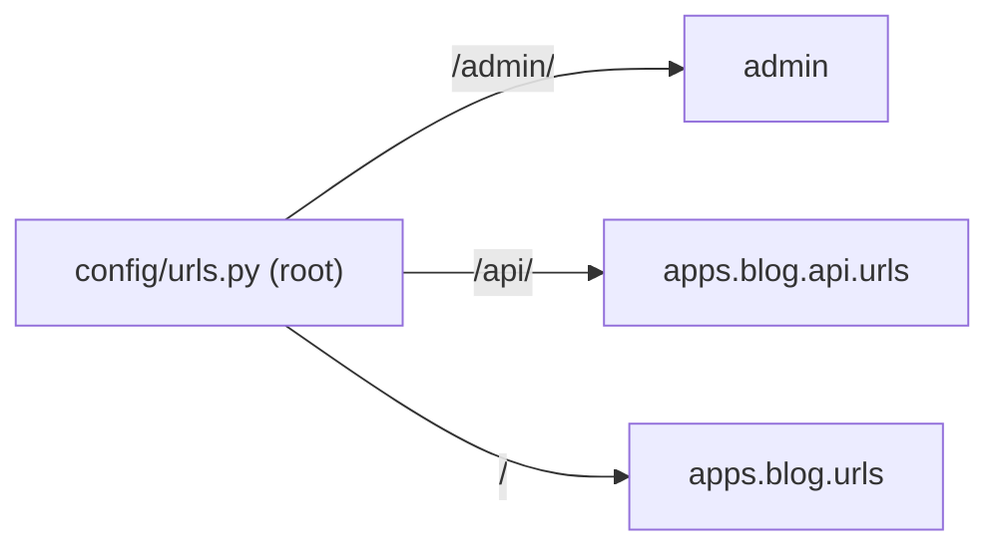

# URLs and routing

The views exist, but Django needs to know **which URL calls which view**. That's
the *routing*, defined in `urls.py` files. Django resolves the URL from top to
bottom, stopping at the first that matches.

## Two-layer routing

The project has a **root** `urls.py` that delegates to each app's `urls.py`:



### The root `urls.py`

```python
from django.contrib import admin
from django.contrib.auth import views as auth_views
from django.urls import URLPattern, URLResolver, include, path

urlpatterns: list[URLPattern | URLResolver] = [
    path("admin/", admin.site.urls),
    path("login/", auth_views.LoginView.as_view(), name="login"),
    path("logout/", auth_views.LogoutView.as_view(), name="logout"),
    path("api/", include("apps.blog.api.urls", namespace="blog-api")),
    path("", include("apps.blog.urls", namespace="blog")),
]
```

- **`path(route, target)`** — maps a route to a view or to another `urls.py`.
- **`include(...)`** — delegates everything under a prefix to an app's `urls.py`.
  Keeps each app the owner of its routes.
- **`namespace=...`** — avoids name collisions between apps (we'll see below).

### The app's `urls.py`

```python
from django.urls import URLPattern, path

from apps.blog import views

app_name = "blog"

urlpatterns: list[URLPattern] = [
    path("", views.PostListView.as_view(), name="post-list"),
    path("posts/new/", views.PostCreateView.as_view(), name="post-create"),
    path("posts/<slug:slug>/", views.PostDetailView.as_view(), name="post-detail"),
    path("posts/<slug:slug>/edit/", views.PostUpdateView.as_view(), name="post-update"),
    path("posts/<slug:slug>/delete/", views.PostDeleteView.as_view(), name="post-delete"),
    path("posts/<slug:slug>/comment/", views.CommentCreateView.as_view(), name="comment-create"),
]
```

!!! info "`.as_view()`"
    CBVs are not functions; `path` expects a function. `.as_view()` is the class
    method that **creates** that function from the class. It's the glue between the router
    and the class-based view.

## URL parameters: the *path converters*

`<slug:slug>` captures a segment of the URL and passes it as an argument to the view:

```python
path("posts/<slug:slug>/", views.PostDetailView.as_view(), name="post-detail")
#            └──┬──┘└─┬─┘
#          conversor  nome do argumento (self.kwargs["slug"])
```

Common converters:

| Converter | Matches | Example |
| --- | --- | --- |
| `str` | text without `/` | `<str:username>` |
| `int` | integers | `<int:year>` |
| `slug` | letters, numbers, hyphen | `<slug:slug>` |
| `uuid` | UUIDs | `<uuid:id>` |

!!! warning "The order of routes matters"
    `posts/new/` comes **before** `posts/<slug:slug>/`. If we swapped them, the URL
    `/posts/new/` would be captured as a post with the slug `"new"`. Django stops at the
    first that matches — put the specific routes before the generic ones.

## URL names: never write a URL by hand

Each route has a `name`. Combined with `app_name`, we form `blog:post-detail`.
That way we reference URLs by **name**, not by the literal string:

=== "In Python"

    ```python
    from django.urls import reverse

    reverse("blog:post-detail", kwargs={"slug": "ola-mundo"})
    # -> "/posts/ola-mundo/"
    ```

=== "In the template"

    ```django
    <a href="">{{ post.title }}</a>
    ```

=== "In the model"

    ```python
    def get_absolute_url(self) -> str:
        return reverse("blog:post-detail", kwargs={"slug": self.slug})
    ```

!!! tip "Why this is essential"
    If one day you change `posts/<slug>/` to `blog/<slug>/`, **nothing** breaks:
    all the links use the name `blog:post-detail`, and resolution adjusts
    on its own. Writing literal URLs scattered across the code is guaranteed
    technical debt.

## Recap

- URLs live in `urls.py`, resolved top to bottom (first match wins).
- The root `urls.py` uses `include()` to delegate to each app.
- `.as_view()` connects a CBV to the router.
- Converters like `<slug:slug>` capture parameters; **order matters**.
- Always reference URLs by **name** (`blog:post-detail`) with `reverse`/``.

The views return HTML, but the ones who write that HTML are the **[Templates](templates.md)**.
