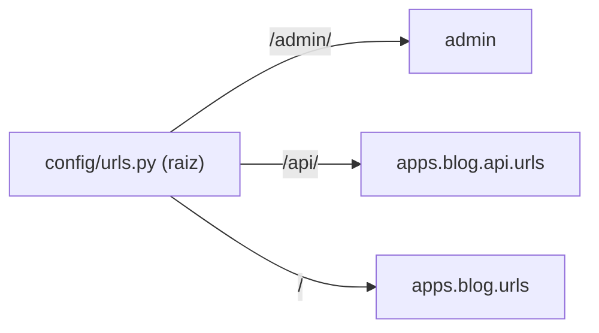

# URLs e rotas

As views existem, mas o Django precisa saber **qual URL chama qual view**. Isso é
o *roteamento*, definido em arquivos `urls.py`. Django resolve a URL de cima para
baixo, parando na primeira que casa.

## Roteamento em duas camadas

O projeto tem um `urls.py` **raiz** que delega para os `urls.py` de cada app:



### O `urls.py` raiz

```python
from django.contrib import admin
from django.contrib.auth import views as auth_views
from django.urls import URLPattern, URLResolver, include, path

urlpatterns: list[URLPattern | URLResolver] = [
    path("admin/", admin.site.urls),
    path("login/", auth_views.LoginView.as_view(), name="login"),
    path("logout/", auth_views.LogoutView.as_view(), name="logout"),
    path("api/", include("apps.blog.api.urls", namespace="blog-api")),
    path("", include("apps.blog.urls", namespace="blog")),
]
```

- **`path(rota, destino)`** — mapeia uma rota a uma view ou a outro `urls.py`.
- **`include(...)`** — delega tudo sob um prefixo para o `urls.py` de um app.
  Mantém cada app dono das suas rotas.
- **`namespace=...`** — evita colisão de nomes entre apps (veremos abaixo).

### O `urls.py` do app

```python
from django.urls import URLPattern, path

from apps.blog import views

app_name = "blog"

urlpatterns: list[URLPattern] = [
    path("", views.PostListView.as_view(), name="post-list"),
    path("posts/new/", views.PostCreateView.as_view(), name="post-create"),
    path("posts/<slug:slug>/", views.PostDetailView.as_view(), name="post-detail"),
    path("posts/<slug:slug>/edit/", views.PostUpdateView.as_view(), name="post-update"),
    path("posts/<slug:slug>/delete/", views.PostDeleteView.as_view(), name="post-delete"),
    path("posts/<slug:slug>/comment/", views.CommentCreateView.as_view(), name="comment-create"),
]
```

!!! info "`.as_view()`"
    CBVs não são funções; o `path` espera uma função. `.as_view()` é o método de
    classe que **cria** essa função a partir da classe. É a cola entre o roteador
    e a view baseada em classe.

## Parâmetros na URL: os *path converters*

`<slug:slug>` captura um trecho da URL e passa como argumento para a view:

```python
path("posts/<slug:slug>/", views.PostDetailView.as_view(), name="post-detail")
#            └──┬──┘└─┬─┘
#          conversor  nome do argumento (self.kwargs["slug"])
```

Conversores comuns:

| Conversor | Casa com | Exemplo |
| --- | --- | --- |
| `str` | texto sem `/` | `<str:username>` |
| `int` | inteiros | `<int:year>` |
| `slug` | letras, números, hífen | `<slug:slug>` |
| `uuid` | UUIDs | `<uuid:id>` |

!!! warning "A ordem das rotas importa"
    `posts/new/` vem **antes** de `posts/<slug:slug>/`. Se invertêssemos, a URL
    `/posts/new/` seria capturada como um post de slug `"new"`. O Django para na
    primeira que casa — coloque as rotas específicas antes das genéricas.

## Nomes de URL: nunca escreva URL na mão

Cada rota tem um `name`. Combinado com o `app_name`, formamos `blog:post-detail`.
Assim referenciamos URLs pelo **nome**, não pela string literal:

=== "No Python"

    ```python
    from django.urls import reverse

    reverse("blog:post-detail", kwargs={"slug": "ola-mundo"})
    # -> "/posts/ola-mundo/"
    ```

=== "No template"

    ```django
    <a href="">{{ post.title }}</a>
    ```

=== "No modelo"

    ```python
    def get_absolute_url(self) -> str:
        return reverse("blog:post-detail", kwargs={"slug": self.slug})
    ```

!!! tip "Por que isso é essencial"
    Se um dia você mudar `posts/<slug>/` para `blog/<slug>/`, **nada** quebra:
    todos os links usam o nome `blog:post-detail`, e a resolução se ajusta
    sozinha. Escrever URLs literais espalhadas pelo código é dívida técnica
    garantida.

!!! quote "📖 Na documentação oficial"
    - [URL dispatcher](https://docs.djangoproject.com/en/stable/topics/http/urls/)

## Recapitulando

- URLs vivem em `urls.py`, resolvidas de cima para baixo (primeira que casa).
- O `urls.py` raiz usa `include()` para delegar a cada app.
- `.as_view()` conecta uma CBV ao roteador.
- Conversores como `<slug:slug>` capturam parâmetros; **ordem importa**.
- Sempre referencie URLs pelo **nome** (`blog:post-detail`) com `reverse`/``.

As views devolvem HTML, mas quem escreve esse HTML são os **[Templates](templates.md)**.
